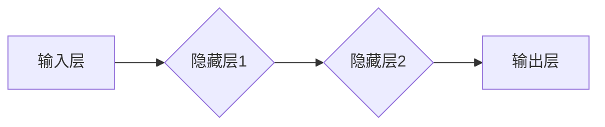

> 神经网络,深度学习,机器学习,人工智能,卷积神经网络,循环神经网络,梯度下降

## 1. 背景介绍

人工智能（AI）作为科技发展的重要方向，近年来取得了令人瞩目的进展。其中，神经网络作为机器学习的核心算法之一，在图像识别、自然语言处理、语音识别等领域展现出强大的应用潜力。

从本质上讲，神经网络是一种模仿人脑神经元结构和功能的计算模型。它由相互连接的节点（神经元）组成，每个节点接收来自其他节点的输入信号，并根据一定的权重进行处理，最终输出信号。通过层层叠加的神经元网络，可以实现对复杂数据的学习和处理。

## 2. 核心概念与联系

### 2.1 神经网络结构

神经网络通常由输入层、隐藏层和输出层组成。

* **输入层:**接收原始数据，每个节点代表一个数据特征。
* **隐藏层:**负责对数据进行特征提取和转换，可以有多个隐藏层，层数越多，网络的表达能力越强。
* **输出层:**输出最终结果，每个节点代表一个类别或预测值。



### 2.2 激活函数

激活函数是神经网络中一个重要的组成部分，它决定了神经元的输出是否被激活。常见的激活函数包括 sigmoid 函数、ReLU 函数、tanh 函数等。

### 2.3 权重和偏置

权重和偏置是神经网络的参数，它们决定了神经元之间的连接强度和激活阈值。通过训练过程，神经网络会不断调整权重和偏置，以最小化预测误差。

### 2.4 前向传播和反向传播

* **前向传播:**将输入数据通过神经网络传递，最终得到输出结果。
* **反向传播:**根据输出结果与真实值的误差，反向计算梯度，并更新权重和偏置，以减小误差。

## 3. 核心算法原理 & 具体操作步骤

### 3.1 算法原理概述

深度学习的核心算法是反向传播算法，它通过梯度下降法不断调整神经网络的参数，以最小化预测误差。

### 3.2 算法步骤详解

1. **初始化参数:**随机初始化神经网络的权重和偏置。
2. **前向传播:**将输入数据通过神经网络传递，计算输出结果。
3. **计算损失函数:**比较输出结果与真实值之间的差异，使用损失函数衡量误差。
4. **反向传播:**根据损失函数的梯度，反向计算每个参数的梯度。
5. **更新参数:**使用梯度下降法更新权重和偏置，以减小损失函数的值。
6. **重复步骤2-5:**重复上述步骤，直到损失函数收敛或达到预设的迭代次数。

### 3.3 算法优缺点

**优点:**

* 表现能力强: 可以学习到复杂的数据模式。
* 自动特征提取: 不需要人工特征工程。
* 泛化能力强: 可以应用于不同的数据集。

**缺点:**

* 计算量大: 训练深度神经网络需要大量的计算资源。
* 训练时间长: 训练深度神经网络需要很长时间。
* 参数量大: 深度神经网络的参数量很大，容易过拟合。

### 3.4 算法应用领域

* **图像识别:** 人脸识别、物体检测、图像分类。
* **自然语言处理:** 文本分类、机器翻译、情感分析。
* **语音识别:** 语音转文本、语音助手。
* **推荐系统:** 商品推荐、内容推荐。
* **医疗诊断:** 病情预测、疾病诊断。

## 4. 数学模型和公式 & 详细讲解 & 举例说明

### 4.1 数学模型构建

神经网络的数学模型可以表示为一个多层感知机（MLP）。

* **输入层:** $x = [x_1, x_2, ..., x_n]$
* **隐藏层:** $h = f(W_1x + b_1)$
* **输出层:** $y = f(W_2h + b_2)$

其中:

* $x$ 是输入向量。
* $h$ 是隐藏层的激活输出。
* $y$ 是输出向量。
* $W_1$ 和 $W_2$ 是权重矩阵。
* $b_1$ 和 $b_2$ 是偏置向量。
* $f$ 是激活函数。

### 4.2 公式推导过程

损失函数通常使用均方误差（MSE）来衡量预测误差。

$$MSE = \frac{1}{N} \sum_{i=1}^{N} (y_i - \hat{y}_i)^2$$

其中:

* $y_i$ 是真实值。
* $\hat{y}_i$ 是预测值。
* $N$ 是样本数量。

使用梯度下降法更新权重和偏置:

$$W = W - \alpha \frac{\partial MSE}{\partial W}$$

$$b = b - \alpha \frac{\partial MSE}{\partial b}$$

其中:

* $\alpha$ 是学习率。

### 4.3 案例分析与讲解

假设我们有一个简单的线性回归问题，目标是预测房价。

* 输入特征: 房屋面积。
* 输出目标: 房价。

我们可以使用一个单层神经网络来解决这个问题。

* 输入层: 一个节点，接收房屋面积。
* 隐藏层: 一个节点，使用ReLU激活函数。
* 输出层: 一个节点，输出房价预测值。

通过训练数据，神经网络会学习到房屋面积与房价之间的关系，并能够预测新的房屋价格。

## 5. 项目实践：代码实例和详细解释说明

### 5.1 开发环境搭建

* Python 3.x
* TensorFlow 或 PyTorch

### 5.2 源代码详细实现

```python
import tensorflow as tf

# 定义模型
model = tf.keras.models.Sequential([
    tf.keras.layers.Dense(128, activation='relu', input_shape=(1,)),
    tf.keras.layers.Dense(1)
])

# 编译模型
model.compile(optimizer='adam', loss='mse')

# 训练模型
model.fit(x_train, y_train, epochs=100)

# 预测
predictions = model.predict(x_test)
```

### 5.3 代码解读与分析

* `tf.keras.models.Sequential`: 创建一个顺序模型，层级结构清晰。
* `tf.keras.layers.Dense`: 定义全连接层，每个节点连接到上一层的所有节点。
* `activation='relu'`: 使用ReLU激活函数，可以提高模型的表达能力。
* `input_shape=(1,)`: 指定输入数据的形状，只有一个特征。
* `optimizer='adam'`: 使用Adam优化器，可以加速训练过程。
* `loss='mse'`: 使用均方误差作为损失函数，衡量预测误差。
* `model.fit`: 训练模型，使用训练数据进行迭代训练。
* `model.predict`: 使用训练好的模型进行预测。

### 5.4 运行结果展示

训练完成后，可以评估模型的性能，例如使用测试集计算均方误差。

## 6. 实际应用场景

### 6.1 图像识别

* **人脸识别:** 用于解锁手机、身份验证、人脸搜索等。
* **物体检测:** 用于自动驾驶、安防监控、工业缺陷检测等。
* **图像分类:** 用于图片标签、图片检索、医学图像诊断等。

### 6.2 自然语言处理

* **机器翻译:** 将文本从一种语言翻译成另一种语言。
* **文本分类:** 将文本归类到不同的类别，例如情感分析、主题分类等。
* **聊天机器人:** 使用自然语言与用户进行对话。

### 6.3 语音识别

* **语音转文本:** 将语音转换为文本，用于语音助手、听写软件等。
* **语音识别:** 将语音识别为特定的命令或指令，用于智能家居、语音控制等。

### 6.4 未来应用展望

* **个性化推荐:** 基于用户的行为和偏好，提供个性化的商品、内容推荐。
* **医疗诊断辅助:** 辅助医生进行疾病诊断，提高诊断准确率。
* **自动驾驶:** 帮助车辆感知周围环境，实现自动驾驶功能。

## 7. 工具和资源推荐

### 7.1 学习资源推荐

* **书籍:**
    * 深度学习
    * 
* **在线课程:**
    * Coursera: 深度学习
    * Udacity: 深度学习工程师
* **博客:**
    * 
* **论坛:**
    * 

### 7.2 开发工具推荐

* **TensorFlow:** 开源深度学习框架，支持多种硬件平台。
* **PyTorch:** 开源深度学习框架，以其灵活性和研究友好性而闻名。
* **Keras:** 高级深度学习API，可以运行在TensorFlow、Theano或CNTK后端。

### 7.3 相关论文推荐

* **AlexNet:** ImageNet Classification with Deep Convolutional Neural Networks
* **VGGNet:** Very Deep Convolutional Networks for Large-Scale Image Recognition
* **ResNet:** Deep Residual Learning for Image Recognition

## 8. 总结：未来发展趋势与挑战

### 8.1 研究成果总结

近年来，深度学习取得了令人瞩目的进展，在图像识别、自然语言处理、语音识别等领域取得了突破性成果。

### 8.2 未来发展趋势

* **模型更深更广:** 探索更深层次和更广阔结构的神经网络，提高模型的表达能力和泛化能力。
* **数据更丰富更有效:** 利用更多数据和更有效的训练方法，提高模型的训练效率和准确性。
* **硬件加速:** 开发更强大的硬件平台，加速深度学习模型的训练和推理。
* **解释性更强:** 研究更可解释的深度学习模型，提高模型的透明度和可信度。

### 8.3 面临的挑战

* **数据获取和标注:** 深度学习模型需要大量的训练数据，数据获取和标注成本高昂。
* **计算资源:** 训练深度学习模型需要大量的计算资源，成本高昂。
* **模型可解释性:** 深度学习模型的决策过程难以解释，缺乏透明度和可信度。
* **伦理问题:** 深度学习模型可能存在偏见和歧视，需要关注其伦理问题。

### 8.4 研究展望

未来，深度学习将继续朝着更深、更广、更强、更解释的方向发展，在更多领域发挥重要作用。


## 9. 附录：常见问题与解答

### 9.1 什么是激活函数？

激活函数是神经网络中一个重要的组成部分，它决定了神经元的输出是否被激活。常见的激活函数包括 sigmoid 函数、ReLU 函数、tanh 函数等。

### 9.2 什么是梯度下降法？

梯度下降法是一种优化算法，用于更新神经网络的参数，以最小化损失函数的值。

### 9.3 什么是过拟合？

过拟合是指神经网络模型在训练数据上表现很好，但在测试数据上表现较差。

### 9.4 如何防止过拟合？

常用的防止过拟合的方法包括：

* 使用更小的模型。
* 使用正则化技术，例如 L1 正则化和 L2 正则化。
* 使用 dropout 技术，随机丢弃一些神经元。
* 使用交叉验证技术，评估模型在不同数据集上的性能。


作者：禅与计算机程序设计艺术 / Zen and the Art of Computer Programming 
<end_of_turn>