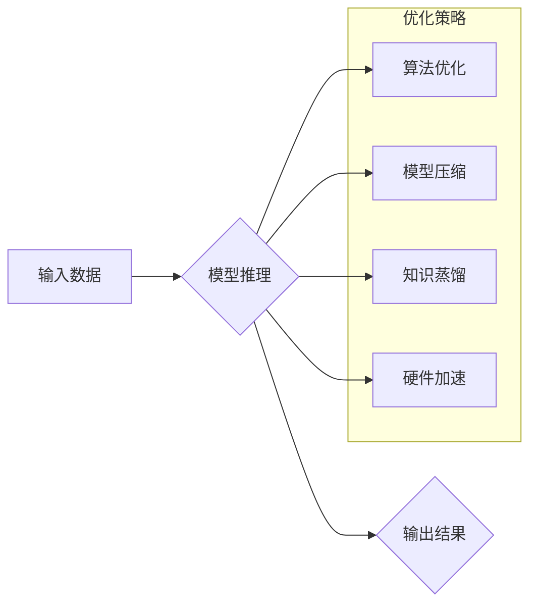

> LLMs, 推理速度, 优化算法, 并行计算, 硬件加速, 模型压缩, 知识蒸馏, 效率提升, 实际应用

## 1. 背景介绍

大型语言模型 (LLMs) 近年来取得了令人瞩目的成就，在自然语言处理 (NLP) 领域展现出强大的能力，例如文本生成、翻译、问答等。然而，LLMs 的推理速度仍然是一个瓶颈，限制了其在实际应用中的广泛部署。

传统的LLMs推理过程通常需要耗费大量的时间和计算资源，这使得它们难以应用于实时场景，例如聊天机器人、语音助手等。因此，提高LLMs的推理速度成为一个重要的研究方向。

## 2. 核心概念与联系

**2.1 核心概念**

* **LLMs (Large Language Models):** 指的是参数量巨大、训练数据庞大的深度学习模型，能够理解和生成人类语言。
* **推理速度:** 指的是模型在接受输入后，输出结果所需的时间。
* **效率:** 指的是模型在给定资源条件下，完成任务所需的计算量和时间。

**2.2 核心联系**

LLMs 的推理速度与模型规模、架构、算法、硬件等因素密切相关。

* **模型规模:** 模型参数量越大，推理速度越慢。
* **模型架构:** 不同的模型架构具有不同的计算复杂度，影响推理速度。
* **算法优化:** 使用高效的推理算法可以显著提高推理速度。
* **硬件加速:** 利用GPU、TPU等加速器可以大幅提升推理速度。

**2.3 Mermaid 流程图**



## 3. 核心算法原理 & 具体操作步骤

**3.1 算法原理概述**

提高LLMs推理速度的核心算法主要包括：

* **量化:** 将模型参数的精度降低，减少存储空间和计算量。
* **剪枝:** 删除模型中不重要的参数或连接，简化模型结构。
* **知识蒸馏:** 将大型模型的知识迁移到小型模型中，保留关键信息，降低模型复杂度。
* **并行计算:** 将模型的计算任务分解成多个子任务，并行执行，加速推理速度。

**3.2 算法步骤详解**

**3.2.1 量化**

1. 确定量化精度：选择合适的量化精度，例如8位整数、4位整数等。
2. 量化模型参数：将模型参数转换为指定精度的数据类型。
3. 调整模型权重：根据量化精度，调整模型权重以保持模型性能。

**3.2.2 剪枝**

1. 识别冗余连接：使用一些算法，例如梯度下降法，识别模型中不重要的连接。
2. 删除冗余连接：删除识别出的冗余连接，简化模型结构。
3. 重新训练模型：对剪枝后的模型进行重新训练，以恢复模型性能。

**3.2.3 知识蒸馏**

1. 选择教师模型和学生模型：选择一个大型模型作为教师模型，一个小型模型作为学生模型。
2. 训练学生模型：使用教师模型的输出作为监督信号，训练学生模型。
3. 评估学生模型性能：评估学生模型的性能，并根据需要进行调整。

**3.2.4 并行计算**

1. 分解模型计算任务：将模型的计算任务分解成多个子任务。
2. 分配子任务：将子任务分配到不同的计算单元，例如CPU、GPU等。
3. 并行执行子任务：在不同的计算单元上并行执行子任务。
4. 合并结果：将各个计算单元的计算结果合并，得到最终的输出结果。

**3.3 算法优缺点**

| 算法 | 优点 | 缺点 |
|---|---|---|
| 量化 | 降低模型存储空间和计算量 | 可能导致模型精度下降 |
| 剪枝 | 简化模型结构，降低计算复杂度 | 可能导致模型性能下降 |
| 知识蒸馏 | 提高小型模型的性能 | 需要训练大型教师模型 |
| 并行计算 | 显著提高推理速度 | 需要强大的硬件支持 |

**3.4 算法应用领域**

* **移动设备:** 由于移动设备的资源有限，量化、剪枝等算法可以有效提高LLMs在移动设备上的推理速度。
* **嵌入式系统:** 嵌入式系统通常具有资源受限的特点，LLMs的推理速度需要得到优化。
* **实时应用:** 聊天机器人、语音助手等实时应用需要快速响应用户请求，因此LLMs的推理速度至关重要。

## 4. 数学模型和公式 & 详细讲解 & 举例说明

**4.1 数学模型构建**

LLMs的推理过程可以抽象为一个数学模型，其中输入数据经过一系列的计算操作，最终输出结果。

**4.1.1 激活函数**

激活函数是神经网络中一个重要的组成部分，它决定了神经元的输出值。常用的激活函数包括ReLU、Sigmoid、Tanh等。

**4.1.2 损失函数**

损失函数用于衡量模型预测结果与真实值的差异。常用的损失函数包括交叉熵损失、均方误差等。

**4.1.3 反向传播算法**

反向传播算法用于更新模型参数，使其能够更好地拟合训练数据。

**4.2 公式推导过程**

* **激活函数的导数:** 

$$
\frac{d}{dx} f(x)
$$

* **损失函数的梯度:**

$$
\frac{\partial L}{\partial w}
$$

* **参数更新公式:**

$$
w = w - \alpha \frac{\partial L}{\partial w}
$$

其中，$w$ 是模型参数，$\alpha$ 是学习率。

**4.3 案例分析与讲解**

假设我们有一个简单的线性回归模型，其损失函数为均方误差。

$$
L = \frac{1}{n} \sum_{i=1}^{n} (y_i - \hat{y}_i)^2
$$

其中，$y_i$ 是真实值，$\hat{y}_i$ 是模型预测值，$n$ 是样本数量。

我们可以使用反向传播算法计算损失函数的梯度，并更新模型参数。

## 5. 项目实践：代码实例和详细解释说明

**5.1 开发环境搭建**

* Python 3.7+
* PyTorch 1.7+
* CUDA 10.2+

**5.2 源代码详细实现**

```python
import torch
import torch.nn as nn

class LinearRegression(nn.Module):
    def __init__(self, input_size, output_size):
        super(LinearRegression, self).__init__()
        self.linear = nn.Linear(input_size, output_size)

    def forward(self, x):
        return self.linear(x)

# 实例化模型
model = LinearRegression(input_size=1, output_size=1)

# 定义损失函数和优化器
criterion = nn.MSELoss()
optimizer = torch.optim.SGD(model.parameters(), lr=0.01)

# 训练数据
x_train = torch.randn(100, 1)
y_train = 2 * x_train + 1 + torch.randn(100, 1)

# 训练模型
for epoch in range(100):
    # 前向传播
    outputs = model(x_train)
    loss = criterion(outputs, y_train)

    # 反向传播
    optimizer.zero_grad()
    loss.backward()

    # 更新参数
    optimizer.step()

    # 打印损失
    print(f'Epoch [{epoch+1}/{100}], Loss: {loss.item():.4f}')

# 推理
x_test = torch.randn(10, 1)
y_pred = model(x_test)

print(f'预测结果: {y_pred}')
```

**5.3 代码解读与分析**

* 代码首先定义了一个简单的线性回归模型，包含一个线性层。
* 然后定义了损失函数和优化器，用于训练模型。
* 训练数据是随机生成的，包含输入特征和对应的标签。
* 训练过程使用反向传播算法，更新模型参数，降低损失函数的值。
* 最后，使用训练好的模型对测试数据进行推理，输出预测结果。

**5.4 运行结果展示**

运行代码后，会输出训练过程中的损失值，以及模型对测试数据的预测结果。

## 6. 实际应用场景

**6.1 聊天机器人**

LLMs可以用于构建更智能、更自然的聊天机器人，能够理解用户的意图，并提供更准确、更相关的回复。

**6.2 语音助手**

LLMs可以用于构建语音助手，能够理解用户的语音指令，并执行相应的操作。

**6.3 文本生成**

LLMs可以用于生成各种类型的文本，例如文章、故事、诗歌等。

**6.4 机器翻译**

LLMs可以用于机器翻译，将一种语言翻译成另一种语言。

**6.5 代码生成**

LLMs可以用于代码生成，根据用户的需求生成代码。

**6.4 未来应用展望**

随着LLMs推理速度的不断提升，其应用场景将会更加广泛，例如：

* **个性化教育:** 根据学生的学习情况，提供个性化的学习内容和辅导。
* **医疗诊断:** 辅助医生进行疾病诊断，提高诊断准确率。
* **科学研究:** 加速科学研究的进程，帮助科学家发现新的知识。

## 7. 工具和资源推荐

**7.1 学习资源推荐**

* **书籍:**
    * 《深度学习》
    * 《自然语言处理》
* **在线课程:**
    * Coursera: 深度学习
    * Udacity: 自然语言处理
* **博客:**
    * The Gradient
    * Towards Data Science

**7.2 开发工具推荐**

* **PyTorch:** 深度学习框架
* **TensorFlow:** 深度学习框架
* **Hugging Face Transformers:** 预训练模型库

**7.3 相关论文推荐**

* **BERT: Pre-training of Deep Bidirectional Transformers for Language Understanding**
* **GPT-3: Language Models are Few-Shot Learners**
* **T5: Text-to-Text Transfer Transformer**

## 8. 总结：未来发展趋势与挑战

**8.1 研究成果总结**

近年来，在LLMs推理速度的提升方面取得了显著的进展，例如量化、剪枝、知识蒸馏、并行计算等算法的应用，有效提高了LLMs的推理效率。

**8.2 未来发展趋势**

* **模型架构优化:** 研究更有效的模型架构，例如轻量级模型、高效神经网络等。
* **算法创新:** 开发更先进的推理算法，例如动态量化、神经架构搜索等。
* **硬件加速:** 利用更强大的硬件加速器，例如GPU、TPU等，加速LLMs的推理速度。

**8.3 面临的挑战**

* **模型规模与效率的平衡:** 提高模型性能的同时，也要控制模型规模，避免过大的计算成本。
* **数据标注成本:** 训练高质量的LLMs需要大量的标注数据，数据标注成本较高。
* **伦理问题:** LLMs的应用可能带来一些伦理问题，例如偏见、虚假信息等，需要引起重视。

**8.4 研究展望**

未来，LLMs推理速度的提升将继续是一个重要的研究方向，需要多学科交叉融合，才能推动LLMs的更广泛应用。

## 9. 附录：常见问题与解答

**9.1 如何选择合适的量化精度？**

量化精度需要根据模型的复杂度和性能要求进行选择。一般