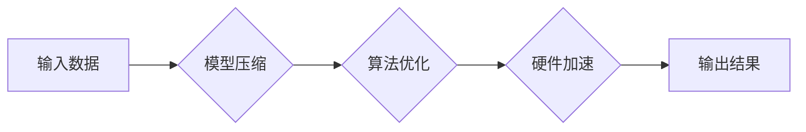

> LLMs, 极速推理, 延迟优化, 效率提升, 算力需求, 模型压缩, 硬件加速, 应用场景

## 1. 背景介绍

近年来，大型语言模型（LLMs）在自然语言处理领域取得了令人瞩目的成就，从文本生成、翻译到对话系统，LLMs展现出强大的能力。然而，LLMs的推理速度往往成为其应用的瓶颈。传统的推理方法通常需要耗费大量时间和计算资源，限制了LLMs在实时应用场景中的部署。

为了解决这一问题，"极速推理"成为LLMs发展的新方向。极速推理旨在通过优化模型结构、算法和硬件平台，大幅提升LLMs的推理速度，使其能够满足实时交互和低延迟应用的需求。

## 2. 核心概念与联系

**2.1 极速推理的定义**

极速推理是指通过各种技术手段，显著缩短LLMs的推理时间，使其能够在毫秒级甚至微秒级内完成推理任务。

**2.2 极速推理的关键技术**

* **模型压缩:** 通过量化、剪枝、知识蒸馏等方法，减少模型参数量和计算复杂度，从而加速推理速度。
* **算法优化:** 优化LLMs的推理算法，例如使用更快的搜索算法、并行化推理等，提高推理效率。
* **硬件加速:** 利用GPU、TPU等专用硬件加速LLMs的推理过程，大幅提升计算性能。

**2.3 极速推理的架构**



## 3. 核心算法原理 & 具体操作步骤

**3.1 算法原理概述**

极速推理算法的核心是通过减少模型复杂度和优化推理过程，从而提高推理速度。常见的算法包括：

* **量化:** 将模型参数从高精度浮点数转换为低精度整数，减少存储空间和计算量。
* **剪枝:** 移除模型中不重要的参数或连接，简化模型结构。
* **知识蒸馏:** 将大型模型的知识迁移到小型模型中，构建更轻量级的模型。

**3.2 算法步骤详解**

以量化为例，其具体步骤如下：

1. **选择量化方法:** 常用的量化方法包括均匀量化、非均匀量化等。
2. **量化模型参数:** 将模型参数转换为指定精度的数据类型。
3. **调整模型权重:** 为了补偿量化带来的精度损失，需要对模型权重进行调整。
4. **评估模型性能:** 评估量化后的模型性能，并根据需要进行调整。

**3.3 算法优缺点**

* **优点:** 能够显著降低模型大小和计算量，提高推理速度。
* **缺点:** 量化可能会导致精度损失，需要通过权重调整等方法进行补偿。

**3.4 算法应用领域**

极速推理算法广泛应用于各种场景，例如：

* **移动设备:** 在资源有限的移动设备上部署LLMs，实现实时语音识别、机器翻译等功能。
* **物联网:** 在物联网设备上部署LLMs，实现智能感知、决策等功能。
* **边缘计算:** 在边缘服务器上部署LLMs，实现低延迟的实时推理任务。

## 4. 数学模型和公式 & 详细讲解 & 举例说明

**4.1 数学模型构建**

假设我们有一个LLM模型，其输出为一个概率分布，表示输入文本的下一个词的预测概率。我们可以用一个神经网络模型来表示这个LLM，其输出层是一个softmax函数，将神经网络的输出转换为概率分布。

**4.2 公式推导过程**

* **softmax函数:**

$$
\text{softmax}(x_i) = \frac{e^{x_i}}{\sum_{j=1}^{N} e^{x_j}}
$$

其中，$x_i$是神经网络输出层的第i个神经元的激活值，$N$是输出层的总神经元数。

* **交叉熵损失函数:**

$$
\text{CrossEntropy}(y, \hat{y}) = - \sum_{i=1}^{N} y_i \log(\hat{y}_i)
$$

其中，$y$是真实标签，$\hat{y}$是模型预测的概率分布。

**4.3 案例分析与讲解**

假设我们有一个LLM模型用于预测下一个词，输入文本为"今天天气", 预测结果为"晴朗"的概率为0.8，"阴天"的概率为0.2。如果真实标签为"晴朗"，则交叉熵损失函数的值为：

$$
\text{CrossEntropy}([1, 0], [0.8, 0.2]) = -1 \log(0.8) - 0 \log(0.2) \approx 0.22
$$

## 5. 项目实践：代码实例和详细解释说明

**5.1 开发环境搭建**

* 操作系统: Ubuntu 20.04
* Python 版本: 3.8
* 深度学习框架: PyTorch 1.10

**5.2 源代码详细实现**

```python
import torch
import torch.nn as nn

class LLM(nn.Module):
    def __init__(self, vocab_size, embedding_dim, hidden_dim):
        super(LLM, self).__init__()
        self.embedding = nn.Embedding(vocab_size, embedding_dim)
        self.lstm = nn.LSTM(embedding_dim, hidden_dim)
        self.fc = nn.Linear(hidden_dim, vocab_size)

    def forward(self, x):
        embedded = self.embedding(x)
        output, (hidden, cell) = self.lstm(embedded)
        output = self.fc(output[:, -1, :])
        return output

# 实例化模型
model = LLM(vocab_size=10000, embedding_dim=128, hidden_dim=256)

# 定义优化器和损失函数
optimizer = torch.optim.Adam(model.parameters())
loss_fn = nn.CrossEntropyLoss()

# 训练模型
for epoch in range(10):
    # ... 训练过程 ...
    loss = loss_fn(output, target)
    optimizer.zero_grad()
    loss.backward()
    optimizer.step()

```

**5.3 代码解读与分析**

* 该代码实现了一个简单的LLM模型，包含嵌入层、LSTM层和全连接层。
* 嵌入层将单词转换为向量表示。
* LSTM层用于捕捉文本序列中的上下文信息。
* 全连接层将LSTM输出转换为下一个词的预测概率分布。
* 训练过程使用交叉熵损失函数和Adam优化器。

**5.4 运行结果展示**

训练完成后，可以将模型应用于文本生成、机器翻译等任务，并评估其性能。

## 6. 实际应用场景

**6.1 文本生成**

极速推理可以用于构建实时文本生成系统，例如聊天机器人、自动写作工具等。

**6.2 机器翻译**

极速推理可以加速机器翻译过程，提高翻译速度和效率。

**6.3 语音识别**

极速推理可以用于构建实时语音识别系统，例如语音助手、语音控制等。

**6.4 图像理解**

极速推理可以用于加速图像理解任务，例如物体识别、场景理解等。

**6.5 未来应用展望**

随着极速推理技术的不断发展，其应用场景将更加广泛，例如：

* **智能家居:** 实现更智能、更便捷的智能家居控制。
* **自动驾驶:** 提高自动驾驶系统的实时决策能力。
* **医疗诊断:** 辅助医生进行更快速、更准确的诊断。

## 7. 工具和资源推荐

**7.1 学习资源推荐**

* **书籍:**
    * 《深度学习》
    * 《自然语言处理》
* **在线课程:**
    * Coursera: 深度学习
    * Udacity: 自然语言处理

**7.2 开发工具推荐**

* **深度学习框架:** PyTorch, TensorFlow
* **模型压缩工具:** TensorFlow Lite, PyTorch Mobile

**7.3 相关论文推荐**

* **模型压缩:**
    * 《Quantization-aware Training: A Methodology for Quantized Neural Network Design》
    * 《Pruning Filters for Efficient ConvNets》
* **极速推理:**
    * 《Efficient Inference with Sparse Transformers》
    * 《Fast and Accurate Inference with Low-Rank Adaptation》

## 8. 总结：未来发展趋势与挑战

**8.1 研究成果总结**

极速推理技术取得了显著进展，能够有效提升LLMs的推理速度，使其能够应用于更多实时场景。

**8.2 未来发展趋势**

* **更有效的模型压缩方法:** 探索新的模型压缩方法，进一步降低模型大小和计算量。
* **更快速的推理算法:** 开发更快的推理算法，例如基于并行计算、近似计算等方法。
* **更强大的硬件加速:** 推动硬件平台的不断发展，提供更强大的计算能力。

**8.3 面临的挑战**

* **精度损失:** 模型压缩可能会导致精度损失，需要找到平衡精度和效率的方法。
* **硬件成本:** 高性能硬件成本较高，限制了极速推理技术的普及。
* **算法复杂度:** 一些极速推理算法的复杂度较高，需要进一步优化。

**8.4 研究展望**

未来，极速推理技术将继续发展，推动LLMs在更多领域得到应用。研究者将继续探索新的模型压缩方法、推理算法和硬件加速技术，以实现更快速、更精确、更低成本的LLMs推理。

## 9. 附录：常见问题与解答

**9.1 如何选择合适的模型压缩方法？**

选择合适的模型压缩方法需要根据具体应用场景和模型结构进行评估。

**9.2 如何评估极速推理算法的性能？**

可以根据推理速度、精度损失和模型大小等指标评估极速推理算法的性能。

**9.3 如何部署极速推理模型？**

可以将极速推理模型部署到移动设备、边缘服务器或云端服务器上。


作者：禅与计算机程序设计艺术 / Zen and the Art of Computer Programming 
<end_of_turn>