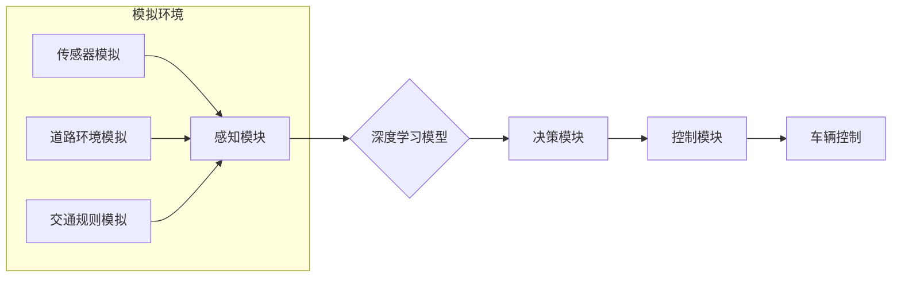

> 自动驾驶, 开环训练, 开环测试, 深度学习, 仿真环境, 模型评估

## 1. 背景介绍

自动驾驶技术作为未来交通运输的重要发展方向，近年来取得了显著进展。其中，端到端自动驾驶方法凭借其简洁高效的架构，在自动驾驶领域获得了广泛关注。端到端自动驾驶方法将感知、决策和控制等多个模块融合在一起，通过深度学习模型直接将传感器数据映射到控制指令，简化了系统设计和开发流程。

然而，端到端自动驾驶方法的训练和测试面临着诸多挑战。传统的自动驾驶系统通常采用闭环训练方法，即在真实道路环境中进行数据采集和模型训练。然而，真实道路环境复杂多变，存在着安全风险和成本高昂等问题。因此，开环训练和开环测试成为端到端自动驾驶系统开发的重要手段。

## 2. 核心概念与联系

**2.1 开环训练与闭环训练**

* **闭环训练:**  在真实环境中进行数据采集和模型训练，模型训练过程会受到真实环境的反馈，例如车辆速度、转向角度等。
* **开环训练:**  在模拟环境中进行数据采集和模型训练，模型训练过程不受到真实环境的反馈，而是根据预设的场景和规则进行训练。

**2.2 开环训练与开环测试**

* **开环训练:**  在模拟环境中训练模型，模型参数通过优化算法进行调整，以达到预期的性能目标。
* **开环测试:**  在模拟环境中测试模型的性能，评估模型在不同场景下的表现，并进行必要的调整和优化。

**2.3 开环训练与测试的优势**

* **安全性:**  在模拟环境中进行训练和测试，可以避免真实环境中的安全风险。
* **成本效益:**  模拟环境的搭建和维护成本远低于真实道路环境。
* **可控性:**  模拟环境可以根据需要进行调整和修改，方便进行特定场景的测试。

**2.4 开环训练与测试的局限性**

* **真实性:**  模拟环境无法完全模拟真实道路环境的复杂性和随机性。
* **数据质量:**  模拟环境的数据质量直接影响模型的训练效果，需要保证数据的真实性和可靠性。

**2.5 核心概念架构图**



## 3. 核心算法原理 & 具体操作步骤

### 3.1 算法原理概述

端到端自动驾驶方法的核心是利用深度学习模型将传感器数据直接映射到控制指令。常用的深度学习模型包括卷积神经网络（CNN）、循环神经网络（RNN）和Transformer等。

CNN擅长处理图像数据，可以提取图像中的特征信息，例如道路边界、行人、车辆等。RNN擅长处理序列数据，可以学习时间序列中的依赖关系，例如车辆的速度变化、方向变化等。Transformer可以处理长序列数据，并具有强大的并行计算能力，在处理复杂场景下的自动驾驶任务中表现出色。

### 3.2 算法步骤详解

1. **数据采集:**  在模拟环境中收集传感器数据，例如摄像头图像、雷达数据、激光雷达数据等。
2. **数据预处理:**  对采集到的数据进行预处理，例如图像增强、数据归一化等。
3. **模型训练:**  利用深度学习模型对预处理后的数据进行训练，优化模型参数，使其能够准确地预测控制指令。
4. **模型评估:**  在模拟环境中测试模型的性能，评估模型在不同场景下的表现，例如准确率、召回率、平均速度等。
5. **模型优化:**  根据模型评估结果，对模型进行调整和优化，例如增加模型层数、调整学习率等。

### 3.3 算法优缺点

**优点:**

* 简洁高效的架构，减少了系统设计和开发的复杂度。
* 能够学习复杂的驾驶策略，适应不同的驾驶场景。
* 训练和测试成本相对较低。

**缺点:**

* 模型训练需要大量的训练数据，数据质量直接影响模型性能。
* 模型难以解释，难以理解模型的决策过程。
* 模拟环境无法完全模拟真实道路环境的复杂性和随机性。

### 3.4 算法应用领域

端到端自动驾驶方法广泛应用于自动驾驶汽车、无人机、机器人等领域。

## 4. 数学模型和公式 & 详细讲解 & 举例说明

### 4.1 数学模型构建

端到端自动驾驶方法的核心是深度学习模型，其数学模型通常基于神经网络结构。神经网络由多个层组成，每层包含多个神经元。神经元之间通过权重连接，权重决定了神经元之间的传递强度。

**4.1.1 神经网络结构**

常见的深度学习模型结构包括卷积神经网络（CNN）、循环神经网络（RNN）和Transformer等。

* **CNN:**  擅长处理图像数据，通过卷积操作提取图像特征。
* **RNN:**  擅长处理序列数据，通过循环连接学习时间序列依赖关系。
* **Transformer:**  可以处理长序列数据，并具有强大的并行计算能力。

**4.1.2 激活函数**

激活函数用于引入非线性，使神经网络能够学习复杂的映射关系。常见的激活函数包括ReLU、Sigmoid和Tanh等。

**4.1.3 损失函数**

损失函数用于衡量模型预测结果与真实值的差异。常见的损失函数包括均方误差（MSE）、交叉熵损失（Cross-Entropy Loss）等。

### 4.2 公式推导过程

深度学习模型的训练过程基于梯度下降算法。梯度下降算法通过计算损失函数对模型参数的梯度，不断调整模型参数，使损失函数最小化。

**4.2.1 梯度下降算法**

$$
\theta = \theta - \alpha \nabla L(\theta)
$$

其中：

* $\theta$：模型参数
* $\alpha$：学习率
* $\nabla L(\theta)$：损失函数对模型参数的梯度

**4.2.2 反向传播算法**

反向传播算法用于计算梯度。它通过计算损失函数对每个神经元的贡献，并将其反向传播到模型的输入层，最终得到模型参数的梯度。

### 4.3 案例分析与讲解

**4.3.1 预测车辆行驶轨迹**

假设我们使用CNN模型预测车辆行驶轨迹。模型的输入是摄像头图像，输出是车辆行驶轨迹的预测值。

**4.3.2 控制车辆转向角度**

假设我们使用RNN模型控制车辆转向角度。模型的输入是车辆速度、方向、周围车辆信息等序列数据，输出是车辆转向角度的预测值。

## 5. 项目实践：代码实例和详细解释说明

### 5.1 开发环境搭建

* 操作系统：Ubuntu 20.04
* Python 版本：3.8
* 深度学习框架：TensorFlow 2.x

### 5.2 源代码详细实现

```python
import tensorflow as tf

# 定义模型结构
model = tf.keras.models.Sequential([
    tf.keras.layers.Conv2D(32, (3, 3), activation='relu', input_shape=(64, 64, 3)),
    tf.keras.layers.MaxPooling2D((2, 2)),
    tf.keras.layers.Conv2D(64, (3, 3), activation='relu'),
    tf.keras.layers.MaxPooling2D((2, 2)),
    tf.keras.layers.Flatten(),
    tf.keras.layers.Dense(10, activation='softmax')
])

# 编译模型
model.compile(optimizer='adam',
              loss='sparse_categorical_crossentropy',
              metrics=['accuracy'])

# 训练模型
model.fit(x_train, y_train, epochs=10)

# 测试模型
loss, accuracy = model.evaluate(x_test, y_test)
print('Test loss:', loss)
print('Test accuracy:', accuracy)
```

### 5.3 代码解读与分析

* **模型结构:**  代码定义了一个简单的卷积神经网络模型，包含两个卷积层、两个最大池化层、一个全连接层和一个输出层。
* **模型编译:**  代码使用Adam优化器、稀疏类别交叉熵损失函数和准确率作为评估指标编译模型。
* **模型训练:**  代码使用训练数据训练模型，训练epochs设置为10。
* **模型测试:**  代码使用测试数据评估模型的性能，并打印测试损失和准确率。

### 5.4 运行结果展示

运行代码后，会输出模型的训练和测试结果，包括训练损失、训练准确率、测试损失和测试准确率。

## 6. 实际应用场景

端到端自动驾驶方法在自动驾驶汽车、无人机、机器人等领域具有广泛的应用场景。

### 6.1 自动驾驶汽车

端到端自动驾驶方法可以实现车辆的自动驾驶功能，例如自动加速、自动制动、自动转向等。

### 6.2 无人机

端到端自动驾驶方法可以实现无人机的自主飞行，例如自动起降、自动避障、自动路径规划等。

### 6.3 机器人

端到端自动驾驶方法可以实现机器人的自主导航，例如自动避障、自动路径规划、自动目标跟踪等。

### 6.4 未来应用展望

随着深度学习技术的不断发展，端到端自动驾驶方法的性能将不断提升，应用场景也将更加广泛。未来，端到端自动驾驶方法有望应用于更多领域，例如物流运输、农业生产、医疗服务等。

## 7. 工具和资源推荐

### 7.1 学习资源推荐

* **书籍:**
    * Deep Learning by Ian Goodfellow, Yoshua Bengio, and Aaron Courville
    * Hands-On Machine Learning with Scikit-Learn, Keras & TensorFlow by Aurélien Géron
* **在线课程:**
    * TensorFlow Tutorials: https://www.tensorflow.org/tutorials
    * Deep Learning Specialization by Andrew Ng: https://www.deeplearning.ai/

### 7.2 开发工具推荐

* **深度学习框架:**
    * TensorFlow: https://www.tensorflow.org/
    * PyTorch: https://pytorch.org/
* **仿真环境:**
    * CARLA: https://carla.readthedocs.io/en/latest/
    * Gazebo: https://gazebosim.org/

### 7.3 相关论文推荐

* **端到端自动驾驶论文:**
    * End to End Learning for Self-Driving Cars by Bojarski et al. (2016)
    * Learning to Drive in a Day by Chen et al. (2017)

## 8. 总结：未来发展趋势与挑战

### 8.1 研究成果总结

端到端自动驾驶方法取得了显著进展，能够实现车辆的自动驾驶功能，并应用于多个领域。

### 8.2 未来发展趋势

* **模型性能提升:**  随着深度学习技术的不断发展，端到端自动驾驶模型的性能将不断提升，能够应对更加复杂和多变的驾驶场景。
* **数据增强:**  利用数据增强技术，可以生成更多的数据，提高模型的泛化能力。
* **安全性和可靠性:**  提高端到端自动驾驶系统的安全性和可靠性是未来研究的重要方向。

### 8.3 面临的挑战

* **数据获取:**  高质量的自动驾驶数据非常昂贵且难以获取。
* **模型解释性:**  深度学习模型难以解释，难以理解模型的决策过程。
* **安全性和可靠性:**  端到端自动驾驶系统需要能够应对各种突发情况，确保安全可靠。

### 8.4 研究展望

未来，端到端自动驾驶技术将继续