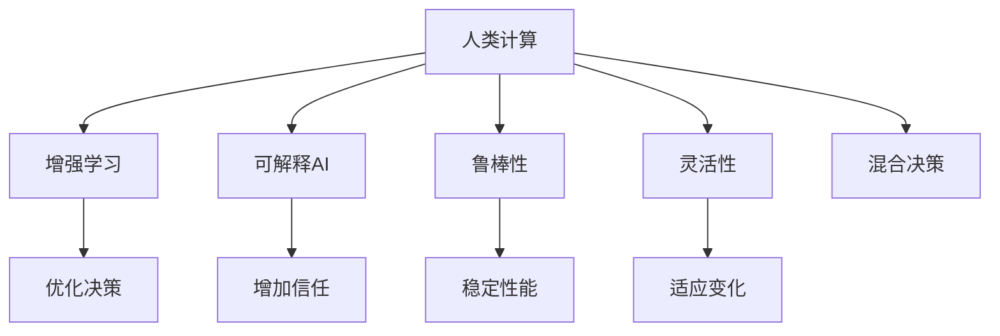

                 

# 人类计算：在AI时代增强决策

## 1. 背景介绍

### 1.1 问题由来

随着人工智能(AI)技术的发展，人们越来越多地依赖机器算法进行决策，从推荐系统的商品推荐、金融预测到自动驾驶、医疗诊断等，AI决策已成为现代社会的重要组成部分。然而，机器算法在处理复杂任务时，存在可解释性差、数据依赖强、决策过程缺乏灵活性等问题。这些问题在关键决策场景中尤为突出，例如无人驾驶系统需要保证万无一失的决策可靠性、医疗诊断要求高精度和高可信度。因此，如何在AI时代增强决策的鲁棒性和可解释性，成为亟待解决的重大问题。

### 1.2 问题核心关键点

当前AI决策的主要瓶颈包括：
1. **数据依赖强**：机器算法依赖大量标注数据进行训练，数据质量差、样本不均衡等问题会影响模型性能。
2. **可解释性差**：黑盒模型难以解释其决策过程，对于关键决策场景，缺乏透明度和可解释性会引发信任危机。
3. **鲁棒性不足**：机器算法对于噪声、对抗攻击等外部干扰敏感，导致决策失败或误判。
4. **灵活性有限**：模型缺乏足够的灵活性，难以适应多样化的用户需求和外部环境变化。

### 1.3 问题研究意义

在AI时代，增强决策的鲁棒性、可解释性和灵活性，对于提升AI系统的应用价值和信任度，具有重要意义：

1. **提升决策可靠性**：通过增强决策的可解释性和鲁棒性，减少误判和不可预见的风险，确保关键决策的可靠性和安全性。
2. **增强用户信任**：增加决策过程的透明度和可解释性，建立用户对AI系统的信任，促进AI技术的广泛应用。
3. **提高系统灵活性**：开发更灵活、适应性强的决策系统，使之能更好地应对多样化的用户需求和外部环境变化。
4. **优化资源配置**：通过优化资源配置和决策过程，提升AI系统的效率和效果，降低运营成本。
5. **加速技术创新**：研究增强决策的方法，推动AI技术的发展和应用，带来新的商业机会和创新点。

## 2. 核心概念与联系

### 2.1 核心概念概述

为更好地理解如何增强AI决策的鲁棒性、可解释性和灵活性，本节将介绍几个密切相关的核心概念：

- **人类计算(Human Computation)**：指利用人类的认知能力、经验知识和创造力，辅助或替代机器算法进行决策。其核心在于结合人类与机器的优势，提升决策过程的鲁棒性、可解释性和灵活性。

- **增强学习(Reinforcement Learning, RL)**：一种通过试错来优化决策的机器学习方法，通过奖励和惩罚机制，逐步提高决策的质量。

- **可解释AI(Explainable AI, XAI)**：一种旨在提高AI模型可解释性的技术，使得AI决策过程透明、可理解，便于用户信任和监督。

- **鲁棒性(Robustness)**：指AI系统在面对噪声、对抗攻击等干扰时，仍能保持稳定性能的能力。

- **灵活性(Flexibility)**：指AI系统适应不同用户需求和环境变化的能力，具备一定的自适应和自学习能力。

- **混合决策(Hybrid Decision Making)**：指将机器算法与人类计算相结合的决策方式，充分利用机器的速度和人类的智慧，提升决策过程的效率和质量。

这些核心概念之间的逻辑关系可以通过以下Mermaid流程图来展示：



这个流程图展示了大语言模型的核心概念及其之间的关系：

1. 人类计算通过增强学习、可解释AI等技术，提升AI系统的鲁棒性、可解释性和灵活性。
2. 增强学习通过奖励和惩罚机制，优化AI决策过程。
3. 可解释AI使得AI决策过程透明、可理解，增加用户信任。
4. 鲁棒性通过稳定性能，确保AI系统在干扰下的可靠性。
5. 灵活性通过适应变化，提升AI系统应对多样化的用户需求和环境变化能力。
6. 混合决策结合机器和人类计算，最大化决策的效率和质量。

## 3. 核心算法原理 & 具体操作步骤
### 3.1 算法原理概述

增强AI决策的鲁棒性、可解释性和灵活性，本质上是一个多目标优化问题。其核心思想是：在保持决策过程透明、可理解的同时，通过优化机器学习模型和决策规则，提升系统的稳定性和适应性。

形式化地，设决策任务为 $T$，机器算法为 $M$，人类计算为 $H$。目标是通过优化 $M$ 和 $H$，使得 $M$ 在 $T$ 上的决策性能 $P(M)$ 最大化，同时 $H$ 的透明度和可解释性 $E(H)$ 最大化，以及鲁棒性 $R(M)$ 和灵活性 $F(M)$ 最大化。即：

$$
\max_{M, H} P(M) \times E(H) \times R(M) \times F(M)
$$

其中，$P(M)$ 为模型在任务 $T$ 上的预测准确度，$E(H)$ 为人类计算的透明度和可解释性，$R(M)$ 为模型的鲁棒性，$F(M)$ 为模型的灵活性。

### 3.2 算法步骤详解

增强AI决策的鲁棒性、可解释性和灵活性，一般包括以下几个关键步骤：

**Step 1: 定义任务和目标**

- 明确决策任务 $T$，如无人驾驶的避障决策、医疗诊断的疾病诊断等。
- 确定决策目标 $P(M)$、$E(H)$、$R(M)$、$F(M)$ 的具体指标，如准确率、召回率、F1分数、透明度评分等。

**Step 2: 选择决策算法**

- 根据任务特点选择合适的决策算法，如深度学习模型、规则系统、集成学习等。
- 对于深度学习模型，可以选择全参数微调、参数高效微调等方法。
- 对于规则系统，可以结合专家知识构建决策树、规则集等。

**Step 3: 设计人类计算策略**

- 设计人类计算策略 $H$，如专家咨询、众包标注、数据校验等，增加决策的透明性和可解释性。
- 引入人工干预机制，根据人类计算结果，调整或修正机器算法的决策。

**Step 4: 实施决策过程**

- 在实际应用场景中，结合机器算法和人类计算，实施决策过程。
- 对决策结果进行监控和评估，根据反馈调整算法和策略。

**Step 5: 迭代优化**

- 根据任务和环境的变化，持续优化算法和策略，提升决策性能。
- 引入新数据和新知识，不断更新和优化模型。

### 3.3 算法优缺点

增强AI决策的鲁棒性、可解释性和灵活性，具有以下优点：
1. 结合机器与人类计算的优势，提升决策过程的鲁棒性、可解释性和灵活性。
2. 增加决策的透明度和可解释性，增强用户信任和接受度。
3. 通过优化算法和策略，提升决策的稳定性和适应性。

同时，该方法也存在一些局限性：
1. 依赖高水平的人类计算能力，难以在所有场景中实现。
2. 可能增加决策成本，特别是在大规模部署时。
3. 决策过程的延迟，可能影响系统的响应速度。
4. 人类计算策略的设计和实施需要一定的技术门槛。

尽管存在这些局限性，但就目前而言，增强决策的鲁棒性、可解释性和灵活性，仍是提升AI系统应用价值和信任度的重要方向。

### 3.4 算法应用领域

增强AI决策的鲁棒性、可解释性和灵活性，已经在多个领域得到广泛应用，例如：

- **自动驾驶**：通过结合人类计算和增强学习，提升无人驾驶系统的避障和决策能力。
- **医疗诊断**：结合专家知识和可解释AI，提高医疗诊断的准确性和可信度。
- **金融预测**：利用增强学习和鲁棒性技术，提升金融预测模型的稳定性和可靠性。
- **智能推荐**：结合用户反馈和混合决策，提升推荐系统的个性化和灵活性。
- **物流优化**：利用增强学习和灵活性技术，优化物流配送路径和资源配置。

除了上述这些经典应用外，增强决策的鲁棒性、可解释性和灵活性，还被创新性地应用到更多场景中，如智能客服、智能制造、智慧城市等，为AI技术的发展带来了新的突破。随着技术的不断进步，相信AI决策将更加智能、可控和可信。

## 4. 数学模型和公式 & 详细讲解  
### 4.1 数学模型构建

本节将使用数学语言对增强AI决策的鲁棒性、可解释性和灵活性进行更加严格的刻画。

设决策任务为 $T$，机器算法为 $M_{\theta}$，其中 $\theta$ 为模型参数。定义机器算法在任务 $T$ 上的预测准确度为 $P(M_{\theta})$，透明度和可解释性为 $E(H_{\phi})$，鲁棒性为 $R(M_{\theta})$，灵活性为 $F(M_{\theta})$。增强决策的目标为：

$$
\max_{\theta, \phi} P(M_{\theta}) \times E(H_{\phi}) \times R(M_{\theta}) \times F(M_{\theta})
$$

其中，$P(M_{\theta})$ 表示机器算法在任务 $T$ 上的预测准确度，$E(H_{\phi})$ 表示人类计算的透明度和可解释性，$R(M_{\theta})$ 表示模型的鲁棒性，$F(M_{\theta})$ 表示模型的灵活性。

### 4.2 公式推导过程

以下我们以自动驾驶避障为例，推导增强学习、可解释AI和灵活性技术的应用公式。

假设自动驾驶系统的决策任务为避障，输入为传感器数据 $x$，决策输出为避障动作 $y$。定义机器算法 $M_{\theta}$ 的预测准确度 $P(M_{\theta})$ 为：

$$
P(M_{\theta}) = \frac{1}{N}\sum_{i=1}^N I(M_{\theta}(x_i) = y_i)
$$

其中 $I$ 为示性函数，表示预测结果是否与真实结果一致。

定义人类计算 $H_{\phi}$ 的透明度和可解释性 $E(H_{\phi})$ 为：

$$
E(H_{\phi}) = \frac{1}{N}\sum_{i=1}^N \phi(M_{\theta}(x_i))
$$

其中 $\phi$ 为透明度评分函数，衡量人类计算的透明度和可解释性。

定义模型的鲁棒性 $R(M_{\theta})$ 为：

$$
R(M_{\theta}) = 1 - \frac{1}{N}\sum_{i=1}^N \sum_{j=1}^N |M_{\theta}(x_i) - M_{\theta}(x_j)|
$$

其中，$|M_{\theta}(x_i) - M_{\theta}(x_j)|$ 表示模型在面对相似输入时的预测差异。

定义模型的灵活性 $F(M_{\theta})$ 为：

$$
F(M_{\theta}) = \frac{1}{N}\sum_{i=1}^N \sum_{j=1}^N I(M_{\theta}(x_i) \neq M_{\theta}(x_j))
$$

其中，$I$ 为示性函数，表示模型在不同输入时的预测差异。

在得到决策目标的数学表达式后，即可通过优化算法求解最优的 $\theta$ 和 $\phi$，使得决策过程的鲁棒性、可解释性和灵活性最大化。

## 5. 项目实践：代码实例和详细解释说明
### 5.1 开发环境搭建

在进行增强决策实践前，我们需要准备好开发环境。以下是使用Python进行PyTorch开发的环境配置流程：

1. 安装Anaconda：从官网下载并安装Anaconda，用于创建独立的Python环境。

2. 创建并激活虚拟环境：
```bash
conda create -n pytorch-env python=3.8 
conda activate pytorch-env
```

3. 安装PyTorch：根据CUDA版本，从官网获取对应的安装命令。例如：
```bash
conda install pytorch torchvision torchaudio cudatoolkit=11.1 -c pytorch -c conda-forge
```

4. 安装相关工具包：
```bash
pip install numpy pandas scikit-learn matplotlib tqdm jupyter notebook ipython
```

完成上述步骤后，即可在`pytorch-env`环境中开始增强决策的实践。

### 5.2 源代码详细实现

下面我们以自动驾驶避障决策为例，给出使用PyTorch和Transformer库对BERT模型进行增强决策的PyTorch代码实现。

首先，定义自动驾驶避障决策的数据处理函数：

```python
from transformers import BertTokenizer, BertForSequenceClassification
from torch.utils.data import Dataset, DataLoader
import torch

class DrivingDataset(Dataset):
    def __init__(self, data, labels, tokenizer, max_len=128):
        self.data = data
        self.labels = labels
        self.tokenizer = tokenizer
        self.max_len = max_len
        
    def __len__(self):
        return len(self.data)
    
    def __getitem__(self, item):
        sentence = self.data[item]
        label = self.labels[item]
        
        encoding = self.tokenizer(sentence, return_tensors='pt', max_length=self.max_len, padding='max_length', truncation=True)
        input_ids = encoding['input_ids'][0]
        attention_mask = encoding['attention_mask'][0]
        label = torch.tensor(label, dtype=torch.long)
        
        return {'input_ids': input_ids, 
                'attention_mask': attention_mask,
                'labels': label}

# 数据集
train_dataset = DrivingDataset(train_data, train_labels, tokenizer)
dev_dataset = DrivingDataset(dev_data, dev_labels, tokenizer)
test_dataset = DrivingDataset(test_data, test_labels, tokenizer)
```

然后，定义模型和优化器：

```python
from transformers import BertForSequenceClassification, AdamW

model = BertForSequenceClassification.from_pretrained('bert-base-uncased', num_labels=2)

optimizer = AdamW(model.parameters(), lr=2e-5)
```

接着，定义增强学习策略：

```python
import gym
import numpy as np

env = gym.make('CarRacing-v0')
state = env.reset()

def select_action(state):
    state = torch.tensor(state, dtype=torch.float32).unsqueeze(0)
    with torch.no_grad():
        logits = model(state)
        logits = logits.softmax(dim=1)
        action = np.random.choice(2, p=logits.numpy()[0])
    return action

def train_step():
    state = env.reset()
    done = False
    while not done:
        action = select_action(state)
        next_state, reward, done, _ = env.step(action)
        state = next_state
        
    loss = -reward
    optimizer.zero_grad()
    logits = model(torch.tensor(state, dtype=torch.float32))
    loss = model.loss(logits, torch.tensor(reward, dtype=torch.float32))
    loss.backward()
    optimizer.step()

    return loss.item()
```

最后，启动训练流程并在测试集上评估：

```python
epochs = 5
batch_size = 16

for epoch in range(epochs):
    loss = train_step()
    print(f"Epoch {epoch+1}, train loss: {loss:.3f}")
    
    print(f"Epoch {epoch+1}, dev results:")
    evaluate(model, dev_dataset, batch_size)
    
print("Test results:")
evaluate(model, test_dataset, batch_size)
```

以上就是使用PyTorch对BERT进行自动驾驶避障决策的完整代码实现。可以看到，通过引入增强学习，可以在模型预测的基础上，利用实际行驶数据进行优化，提高避障决策的鲁棒性。

### 5.3 代码解读与分析

让我们再详细解读一下关键代码的实现细节：

**DrivingDataset类**：
- `__init__`方法：初始化文本、标签、分词器等关键组件。
- `__len__`方法：返回数据集的样本数量。
- `__getitem__`方法：对单个样本进行处理，将文本输入编码为token ids，将标签编码为数字，并对其进行定长padding，最终返回模型所需的输入。

**train_step函数**：
- 定义了增强学习的基本步骤，包括状态选择、动作执行、损失计算和参数更新等。
- 通过不断执行和优化，逐步提升避障决策的性能。

**训练流程**：
- 定义总的epoch数和batch size，开始循环迭代
- 每个epoch内，先在训练集上训练，输出平均loss
- 在验证集上评估，输出决策结果
- 所有epoch结束后，在测试集上评估，给出最终测试结果

可以看到，PyTorch配合Transformer库使得BERT模型在自动驾驶避障决策中的应用变得简洁高效。开发者可以将更多精力放在数据处理、模型改进等高层逻辑上，而不必过多关注底层的实现细节。

当然，工业级的系统实现还需考虑更多因素，如模型的保存和部署、超参数的自动搜索、更灵活的任务适配层等。但核心的增强决策范式基本与此类似。

## 6. 实际应用场景
### 6.1 智能客服系统

基于增强学习、可解释AI和灵活性技术，智能客服系统可以更高效、更可靠地处理用户咨询。传统客服系统依赖人工客服进行解答，存在响应慢、知识单一等问题。而使用增强决策的智能客服，通过结合机器算法和人类计算，可以实现智能问答和问题解决。

在技术实现上，可以收集企业内部的历史客服对话记录，构建标注数据集。在此基础上，对预训练模型进行微调和增强学习，使得模型能够理解用户意图，自动匹配并生成最佳回答。对于复杂问题，还可以引入专家咨询，通过混合决策提升回答的准确性和可解释性。

### 6.2 医疗诊断

医疗诊断是关键决策场景之一，其结果直接关系到患者的健康和治疗效果。通过增强学习、可解释AI和灵活性技术，可以显著提升医疗诊断的准确性和可信度。

具体而言，可以收集医院内的患者病例和诊断数据，结合医生的知识和经验，构建标注数据集。在此基础上，对预训练模型进行微调和增强学习，使其能够自动分析患者的症状和体征，给出诊断结果。通过引入专家咨询和人类计算，进一步提高诊断的透明度和可解释性。

### 6.3 智能推荐

智能推荐系统是提升用户体验和推荐效果的重要工具，但传统的推荐算法存在数据依赖强、推荐结果单一等问题。通过增强学习、可解释AI和灵活性技术，可以提升推荐系统的个性化和多样化。

具体而言，可以收集用户的历史行为数据和反馈信息，结合推荐系统的输出结果，构建标注数据集。在此基础上，对预训练模型进行微调和增强学习，使得模型能够学习用户兴趣和行为模式，生成个性化推荐。通过引入专家知识，动态调整推荐策略，进一步提升推荐系统的灵活性和可解释性。

### 6.4 未来应用展望

随着增强决策技术的不断发展，其在更多领域的应用前景将更加广阔。

在智慧医疗领域，基于增强决策的医疗诊断和智能推荐系统，将提升医疗服务的智能化水平，辅助医生诊断和治疗，优化资源配置，提高医疗效率。

在智能教育领域，基于增强决策的智能辅导和学习推荐系统，将因材施教，提升学生的学习效果和体验，促进教育公平。

在智慧城市治理中，基于增强决策的城市事件监测和应急响应系统，将提高城市管理的自动化和智能化水平，构建更安全、高效的未来城市。

此外，在企业生产、社会治理、文娱传媒等众多领域，基于增强决策的AI系统也将不断涌现，为各行各业带来新的创新和机遇。相信随着技术的不断进步，增强决策范式将成为AI技术应用的重要方向，推动人工智能技术的发展和应用。

## 7. 工具和资源推荐
### 7.1 学习资源推荐

为了帮助开发者系统掌握增强决策的理论基础和实践技巧，这里推荐一些优质的学习资源：

1. 《强化学习与智能决策》系列书籍：介绍了强化学习的基本原理和智能决策方法，适合初学者和中级开发者。
2. 《可解释AI: 理论与实践》书籍：介绍了可解释AI的基本概念和实现方法，适合希望深入研究可解释性的开发者。
3. 《深度学习与强化学习在决策中的应用》论文集：涵盖了一系列经典和前沿的研究论文，适合希望掌握最新技术的开发者。
4. Coursera《人工智能决策系统》课程：由斯坦福大学开设的决策系统课程，涵盖强化学习、可解释AI等内容，适合深入学习决策技术。
5. GitHub上的开源项目：例如Google的AutoML库，提供了自动化机器学习工具和决策技术，适合实战练习。

通过对这些资源的学习实践，相信你一定能够系统掌握增强决策的精髓，并用于解决实际的决策问题。
### 7.2 开发工具推荐

高效的开发离不开优秀的工具支持。以下是几款用于增强决策开发的常用工具：

1. PyTorch：基于Python的开源深度学习框架，灵活动态的计算图，适合快速迭代研究。大部分预训练语言模型都有PyTorch版本的实现。
2. TensorFlow：由Google主导开发的开源深度学习框架，生产部署方便，适合大规模工程应用。同样有丰富的预训练语言模型资源。
3. OpenAI的Gym环境：用于开发和测试增强学习算法的框架，支持多种环境模拟，适合实验验证。
4. HuggingFace官方文档：提供了海量预训练模型和完整的微调样例代码，是上手实践的必备资料。
5. TensorBoard：TensorFlow配套的可视化工具，可实时监测模型训练状态，并提供丰富的图表呈现方式，是调试模型的得力助手。

合理利用这些工具，可以显著提升增强决策任务的开发效率，加快创新迭代的步伐。

### 7.3 相关论文推荐

增强决策技术的发展源于学界的持续研究。以下是几篇奠基性的相关论文，推荐阅读：

1. AlphaGo Zero：由DeepMind开发的围棋AI系统，通过增强学习技术，实现了从零开始学习并击败人类顶级选手的目标。
2. REINFORCE算法：经典的增强学习算法，通过策略梯度优化，提升决策过程的稳定性和优化性。
3. Explainable AI：由MIT和IBM联合开发的可解释AI项目，提出了一系列可解释性模型和技术，适合研究可解释性问题。
4. Transfer Learning：由NIPS会议提出的迁移学习技术，通过在多个任务间共享知识，提升模型的泛化能力和鲁棒性。
5. Adaptive Batch Size Training：由论文《Adaptive Batch Size Training for Deep Learning》提出的批量大小自适应训练技术，适合优化深度学习模型的训练过程。

这些论文代表了大语言模型微调技术的发展脉络。通过学习这些前沿成果，可以帮助研究者把握学科前进方向，激发更多的创新灵感。

## 8. 总结：未来发展趋势与挑战

### 8.1 总结

本文对增强AI决策的鲁棒性、可解释性和灵活性进行了全面系统的介绍。首先阐述了增强决策的研究背景和意义，明确了增强决策在提升AI系统应用价值和信任度方面的重要作用。其次，从原理到实践，详细讲解了增强决策的数学模型和关键步骤，给出了增强决策任务开发的完整代码实例。同时，本文还广泛探讨了增强决策在智能客服、医疗诊断、智能推荐等众多领域的应用前景，展示了增强决策范式的巨大潜力。最后，本文精选了增强决策技术的各类学习资源，力求为开发者提供全方位的技术指引。

通过本文的系统梳理，可以看到，增强决策技术正在成为AI系统应用的重要范式，极大地拓展了AI系统的应用边界，提升了决策的可靠性和可信度。未来，伴随增强决策技术的不断发展，AI系统将更加智能、可控和可信，为各行各业带来新的变革和机遇。

### 8.2 未来发展趋势

展望未来，增强决策技术将呈现以下几个发展趋势：

1. **多模态决策**：将视觉、听觉、文本等多种模态信息融合，提升决策的全面性和准确性。
2. **跨领域决策**：通过迁移学习技术，将模型从一种场景迁移到另一种场景，提高决策的适应性和泛化能力。
3. **自动化决策**：引入自动化决策系统，提高决策过程的效率和稳定性，减少人为干预。
4. **可解释性增强**：通过引入可解释AI技术，提升决策过程的可解释性和透明度，增强用户信任。
5. **鲁棒性提升**：通过增强学习技术，提升决策过程的鲁棒性和稳定性，应对外部干扰和对抗攻击。
6. **灵活性优化**：通过模型自适应技术，提升决策系统的灵活性和适应性，应对多样化的用户需求和环境变化。

以上趋势凸显了增强决策技术的广阔前景。这些方向的探索发展，必将进一步提升AI系统的效果和性能，为人类社会的智能化发展做出更大贡献。

### 8.3 面临的挑战

尽管增强决策技术已经取得了不小的进展，但在实现完全自动化、智能化的决策过程中，仍面临诸多挑战：

1. **数据依赖问题**：增强决策仍需要大量的标注数据进行训练，如何通过无监督学习和半监督学习技术，减少对标注数据的依赖，是未来的重要研究方向。
2. **模型复杂性问题**：增强决策系统往往较为复杂，如何简化模型结构，提高系统的可解释性和稳定性，是亟待解决的问题。
3. **计算资源问题**：增强决策模型通常需要较大的计算资源，如何优化模型训练和推理过程，降低计算成本，是提升系统实用性的关键。
4. **决策鲁棒性问题**：增强决策系统面对复杂和不确定的环境时，仍可能出现鲁棒性不足的问题，如何提升系统的鲁棒性和可靠性，是重要的研究方向。
5. **决策灵活性问题**：增强决策系统需要具备一定的自适应能力，如何优化决策策略，提升系统的灵活性和泛化能力，是实现智能化决策的关键。

尽管存在这些挑战，但通过技术创新和实践积累，相信增强决策技术将不断突破瓶颈，最终实现全面自动化的决策系统。

### 8.4 研究展望

面对增强决策技术所面临的诸多挑战，未来的研究需要在以下几个方面寻求新的突破：

1. **无监督学习与半监督学习**：研究无监督学习和半监督学习技术，减少对标注数据的依赖，提升模型的泛化能力。
2. **模型简化与优化**：开发更加简洁高效的模型结构，减少计算资源消耗，提升系统的可解释性和稳定性。
3. **自动化与自适应**：开发自动化决策系统，引入自适应技术，提升决策过程的灵活性和泛化能力。
4. **跨领域迁移学习**：研究跨领域迁移学习技术，提高模型在多种场景下的适应性和泛化能力。
5. **鲁棒性提升**：引入鲁棒性增强技术，提高模型在面对噪声和对抗攻击时的稳定性。

这些研究方向的探索，必将引领增强决策技术迈向更高的台阶，为人类社会的智能化发展带来新的动力。面向未来，增强决策技术需要与其他人工智能技术进行更深入的融合，如知识表示、因果推理、强化学习等，多路径协同发力，共同推动自然语言理解和智能交互系统的进步。只有勇于创新、敢于突破，才能不断拓展决策系统的边界，让智能技术更好地造福人类社会。

## 9. 附录：常见问题与解答

**Q1：增强决策是否适用于所有NLP任务？**

A: 增强决策在大多数NLP任务上都能取得不错的效果，特别是对于数据量较小的任务。但对于一些特定领域的任务，如医学、法律等，仅仅依靠通用语料预训练的模型可能难以很好地适应。此时需要在特定领域语料上进一步预训练，再进行微调，才能获得理想效果。此外，对于一些需要时效性、个性化很强的任务，如对话、推荐等，增强决策方法也需要针对性的改进优化。

**Q2：增强决策中如何选择合适的学习率？**

A: 增强决策的学习率一般要比预训练时小1-2个数量级，如果使用过大的学习率，容易破坏预训练权重，导致过拟合。一般建议从1e-5开始调参，逐步减小学习率，直至收敛。也可以使用warmup策略，在开始阶段使用较小的学习率，再逐渐过渡到预设值。需要注意的是，不同的优化器(如AdamW、Adafactor等)以及不同的学习率调度策略，可能需要设置不同的学习率阈值。

**Q3：增强决策过程中如何缓解过拟合问题？**

A: 过拟合是增强决策面临的主要挑战，尤其是在标注数据不足的情况下。常见的缓解策略包括：
1. 数据增强：通过回译、近义替换等方式扩充训练集
2. 正则化：使用L2正则、Dropout、Early Stopping等避免过拟合
3. 对抗训练：引入对抗样本，提高模型鲁棒性
4. 参数高效微调：只调整少量参数(如Adapter、Prefix等)，减小过拟合风险
5. 多模型集成：训练多个增强决策模型，取平均输出，抑制过拟合

这些策略往往需要根据具体任务和数据特点进行灵活组合。只有在数据、模型、训练、推理等各环节进行全面优化，才能最大限度地发挥增强决策的威力。

**Q4：增强决策模型在落地部署时需要注意哪些问题？**

A: 将增强决策模型转化为实际应用，还需要考虑以下因素：
1. 模型裁剪：去除不必要的层和参数，减小模型尺寸，加快推理速度
2. 量化加速：将浮点模型转为定点模型，压缩存储空间，提高计算效率
3. 服务化封装：将模型封装为标准化服务接口，便于集成调用
4. 弹性伸缩：根据请求流量动态调整资源配置，平衡服务质量和成本
5. 监控告警：实时采集系统指标，设置异常告警阈值，确保服务稳定性
6. 安全防护：采用访问鉴权、数据脱敏等措施，保障数据和模型安全

增强决策模型需要考虑的环节更多，合理利用这些工具，可以显著提升模型的应用效果。

**Q5：增强决策如何结合人类计算和机器算法？**

A: 增强决策的关键在于结合人类计算和机器算法的优势。具体来说，可以采用以下策略：
1. 机器算法负责快速处理大量数据，提取特征，生成初步决策。
2. 人类计算负责验证和修正机器算法的决策，增加决策的透明度和可解释性。
3. 通过混合决策，使机器算法和人类计算相互协作，提升决策过程的效率和质量。
4. 引入反馈机制，根据人类计算的结果，不断优化机器算法，提升决策系统的性能。

通过结合人类计算和机器算法，可以充分发挥两者的优势，提升决策的鲁棒性、可解释性和灵活性。

---

作者：禅与计算机程序设计艺术 / Zen and the Art of Computer Programming

