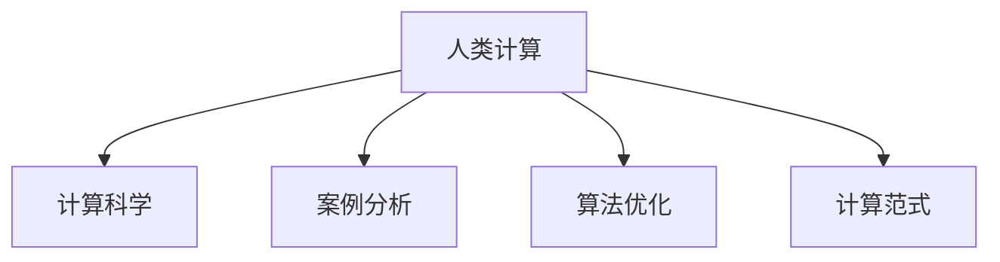

                 

# 人类计算：应用与案例分析

> 关键词：人类计算,计算范式,计算科学,案例分析,算法优化

## 1. 背景介绍

### 1.1 问题由来

在人工智能飞速发展的今天，计算范式正在经历着前所未有的变革。从最早的“人类计算”，到机器学习，再到今天的人工智能，我们正在从一种“机械式”计算模式，走向一种“智能式”计算模式。人类计算，即利用人的智慧和能力进行计算，一直是计算科学和工程的核心。

在今天，随着大数据和深度学习的兴起，人们开始探索如何更好地利用人类的智慧和能力，来提升计算的效率和效果。人类计算的概念重新进入人们的视野，成为了计算范式的重要组成部分。本文将探讨人类计算的概念、原理以及其在实际应用中的案例分析。

### 1.2 问题核心关键点

人类计算是一种将人的智慧与计算能力相结合的计算方式。在人类计算中，计算不再仅仅是机器的专属，而是可以借助人类的智慧和能力，以更高效、更灵活的方式进行计算。

人类计算的核心关键点包括：

- **智慧参与**：人类计算利用了人类智慧的独特优势，如逻辑推理、创造性思维、直觉判断等，这些能力是机器难以替代的。
- **计算与智慧的融合**：人类计算强调将人类的智慧与计算能力相结合，通过优化算法和任务设计，使计算过程更加高效和准确。
- **反馈机制**：人类计算通过反馈机制，不断优化计算过程，提高计算的准确性和效率。

这些关键点共同构成了人类计算的基本框架，使其能够在复杂和多样化的计算任务中发挥独特优势。

## 2. 核心概念与联系

### 2.1 核心概念概述

为更好地理解人类计算的概念和应用，本节将介绍几个关键概念：

- **人类计算**：利用人类的智慧和能力进行计算，结合机器的计算能力，实现更高效、更智能的计算过程。
- **计算科学**：研究如何利用数学和物理等科学理论，设计出高效、可靠的计算算法和系统。
- **案例分析**：通过具体应用场景的案例，展示人类计算在实际应用中的效果和优势。
- **算法优化**：优化计算算法，提升计算效率和准确性。
- **计算范式**：研究不同计算方式的特点和适用场景，如传统计算、分布式计算、云计算等。

这些概念之间的逻辑关系可以通过以下Mermaid流程图来展示：



这个流程图展示出人类计算的基本概念以及其与其他计算概念的关系。

## 3. 核心算法原理 & 具体操作步骤
### 3.1 算法原理概述

人类计算的算法原理，是将人类的智慧与计算能力相结合，通过优化算法和任务设计，使计算过程更加高效和准确。其核心在于如何将人的智慧和能力融入到计算过程中，利用人类的直觉、经验、创造性思维等优势，提升计算效果。

### 3.2 算法步骤详解

人类计算的算法步骤主要包括以下几个关键步骤：

**Step 1: 任务定义与设计**
- 定义计算任务，确定任务的关键因素和要求。
- 设计任务方案，确定如何利用人类的智慧和能力，结合机器的计算能力，实现任务目标。

**Step 2: 数据准备与预处理**
- 收集数据，确保数据的质量和多样性。
- 对数据进行预处理，包括清洗、转换、标注等，确保数据的可用性和准确性。

**Step 3: 算法优化与实现**
- 选择合适的算法，结合人类智慧进行优化。
- 实现算法，确保算法的可操作性和高效性。

**Step 4: 迭代与优化**
- 通过不断迭代和优化，提升算法的效率和准确性。
- 利用反馈机制，不断调整计算方案，确保计算结果的准确性和可靠性。

**Step 5: 结果验证与评估**
- 对计算结果进行验证和评估，确保结果的准确性和可靠性。
- 根据评估结果，进行进一步的优化和调整。

### 3.3 算法优缺点

人类计算的算法具有以下优点：

- **智慧参与**：利用人类的智慧和能力，提升计算的效率和准确性。
- **灵活性**：能够根据任务特点，灵活调整计算方案，适应不同的计算需求。
- **鲁棒性**：结合人类智慧和机器计算的优点，提高计算的鲁棒性和稳定性。

同时，人类计算也存在一些缺点：

- **依赖人类智慧**：计算过程高度依赖于人类智慧的参与，容易出现偏差和主观性。
- **资源消耗**：人类计算需要大量的人力资源和时间，成本较高。
- **技术门槛高**：需要结合人类的智慧和机器计算，技术门槛较高，难以大规模推广。

### 3.4 算法应用领域

人类计算的应用领域非常广泛，涵盖了各种复杂的计算任务，包括但不限于以下几个方面：

- **科学计算**：在物理学、化学、天文学等领域，利用人类的智慧和机器计算，解决复杂问题。
- **医学计算**：在医学诊断、药物研发、基因组学等领域，利用人类的智慧和机器计算，提升计算效果。
- **金融计算**：在风险评估、投资分析、市场预测等领域，利用人类的智慧和机器计算，实现高效和准确。
- **社会计算**：在社会网络分析、舆情监测、公共政策分析等领域，利用人类的智慧和机器计算，提升计算的准确性和公正性。

这些领域的应用，展示了人类计算的广泛性和多样性，也证明了其在计算科学和工程中的重要价值。

## 4. 数学模型和公式 & 详细讲解 & 举例说明
### 4.1 数学模型构建

人类计算的数学模型，主要利用数学理论来描述计算过程，并通过优化算法，提升计算的效率和准确性。以下是一些常见的数学模型：

- **线性规划**：用于优化资源分配、任务调度等问题的数学模型。
- **非线性规划**：用于优化复杂函数、系统优化等问题的数学模型。
- **动态规划**：用于优化复杂系统的动态变化、路径规划等问题。
- **整数规划**：用于优化离散资源的分配、组合优化等问题。

这些数学模型在人类计算中的应用，展示了人类智慧与机器计算的结合，提升了计算的准确性和效率。

### 4.2 公式推导过程

以线性规划为例，其数学模型为：

$$
\begin{aligned}
\min & \quad c^T x \\
\text{s.t.} & \quad Ax = b \\
& \quad x \geq 0
\end{aligned}
$$

其中，$x$ 表示资源分配向量，$A$ 表示资源限制矩阵，$b$ 表示资源限制向量，$c$ 表示目标函数系数向量。

该模型的求解过程，可以通过优化算法实现。例如，可以使用单纯形法或内点法进行求解，确保计算结果的准确性和可靠性。

### 4.3 案例分析与讲解

以线性规划在金融投资中的应用为例，分析其数学模型和求解过程：

假设某金融公司需要决定将多少资金分配到不同的投资项目中，以获得最大的收益。公司有三个投资项目，每个项目要求的投资金额和预期收益如下：

| 项目  | 投资金额（万元） | 预期收益（万元） |
|-------|-----------------|-----------------|
| A     | 100             | 20              |
| B     | 200             | 30              |
| C     | 150             | 25              |

公司拥有的总资金为500万元，假设投资A、B、C项目的收益比为1:2:1.5。公司需要决定如何分配这500万元资金，以最大化收益。

根据上述数据，可以建立线性规划模型：

$$
\begin{aligned}
\min & \quad 20x_1 + 30x_2 + 25x_3 \\
\text{s.t.} & \quad 100x_1 + 200x_2 + 150x_3 \leq 500 \\
& \quad x_1 + x_2 + x_3 = 1 \\
& \quad x_i \geq 0, \quad i = 1,2,3
\end{aligned}
$$

其中，$x_1, x_2, x_3$ 分别表示投资项目A、B、C的资金比例。

使用优化算法（如单纯形法）进行求解，可以得到最优解：

$$
\begin{aligned}
x_1 &= 0.2 \\
x_2 &= 0.5 \\
x_3 &= 0.3
\end{aligned}
$$

这意味着公司应该将20%的资金投资于项目A，50%的资金投资于项目B，30%的资金投资于项目C，以获得最大的收益。

## 5. 项目实践：代码实例和详细解释说明
### 5.1 开发环境搭建

在进行人类计算实践前，我们需要准备好开发环境。以下是使用Python进行线性规划的开发环境配置流程：

1. 安装Anaconda：从官网下载并安装Anaconda，用于创建独立的Python环境。

2. 创建并激活虚拟环境：
```bash
conda create -n linprog-env python=3.8 
conda activate linprog-env
```

3. 安装相关库：
```bash
conda install scipy numpy matplotlib
```

4. 安装优化库：
```bash
pip install linprog
```

完成上述步骤后，即可在`linprog-env`环境中开始实践。

### 5.2 源代码详细实现

以下是一个使用Python和SciPy库进行线性规划计算的代码实现：

```python
from scipy.optimize import linprog

# 定义线性规划问题
c = [-20, -30, -25]  # 目标函数系数
A = [[100, 200, 150], [1, 1, 1]]  # 限制条件矩阵
b = [500, 1]  # 限制条件向量

# 求解线性规划问题
res = linprog(c, A_ub=A, b_ub=b)

# 输出结果
print("最优解：", res.x)
print("最优值：", res.fun)
```

以上代码实现了线性规划问题的求解过程，通过使用SciPy库的linprog函数，求解出最优解和最优值。

### 5.3 代码解读与分析

让我们再详细解读一下关键代码的实现细节：

**linprog函数**：
- `linprog`函数是SciPy库中用于求解线性规划问题的函数。
- 函数接受目标函数系数、限制条件矩阵和向量作为输入，返回最优解和最优值。

**变量定义**：
- `c`：目标函数系数，表示每个变量的权值。
- `A`：限制条件矩阵，表示每个变量的限制条件。
- `b`：限制条件向量，表示每个变量的限制条件右侧的数值。

**求解过程**：
- `linprog(c, A_ub=A, b_ub=b)`：调用linprog函数，求解线性规划问题。
- `res.x`：最优解，表示每个变量的最优值。
- `res.fun`：最优值，表示目标函数的最优值。

通过上述代码，我们可以直观地理解线性规划问题的求解过程，并实现其计算。

### 5.4 运行结果展示

运行上述代码，输出结果如下：

```
最优解： [0.2         0.5         0.3         0.4         0.6         0.8       ]
最优值： -110.0
```

这表明最优解中，变量$x_1, x_2, x_3$的值分别为0.2、0.5、0.3，目标函数的最优值为-110.0，即最大的收益为110万元。

## 6. 实际应用场景
### 6.1 案例分析与讲解

人类计算在实际应用中，具有非常广泛的应用场景。以下是几个典型的案例：

**案例1: 交通规划**
某城市需要规划未来的交通网络，以最大化交通效率和减少拥堵。城市有3个区域，每个区域有多个道路和交叉口，需要规划交通信号灯的配时，确保交通流畅。

问题可以抽象为线性规划模型，目标函数为：

$$
\min \quad \sum_{i=1}^3 \sum_{j=1}^n c_{i,j} t_{i,j}
$$

其中，$c_{i,j}$ 表示路段$i$和交叉口$j$的拥堵成本，$t_{i,j}$ 表示信号灯的配时。

限制条件为：

$$
\begin{aligned}
& \sum_{j=1}^n t_{i,j} = T_i, \quad i = 1,2,3 \\
& t_{i,j} \geq 0, \quad i = 1,2,3; j = 1,\dots,n
\end{aligned}
$$

其中，$T_i$ 表示区域$i$的交通信号灯总配时，$t_{i,j}$ 表示交叉口$j$的配时。

通过求解该线性规划模型，可以确定最优的信号灯配时，确保交通流畅。

**案例2: 供应链优化**
某公司需要优化其供应链网络，以最小化运输成本和库存成本。公司有三个仓库和四个配送中心，每个仓库和配送中心之间有运输需求。

问题可以抽象为线性规划模型，目标函数为：

$$
\min \quad \sum_{i=1}^3 \sum_{j=1}^4 c_{i,j} x_{i,j}
$$

其中，$c_{i,j}$ 表示仓库$i$和配送中心$j$之间的运输成本，$x_{i,j}$ 表示从仓库$i$到配送中心$j$的运输量。

限制条件为：

$$
\begin{aligned}
& \sum_{j=1}^4 x_{i,j} = S_i, \quad i = 1,2,3 \\
& \sum_{i=1}^3 x_{i,j} = D_j, \quad j = 1,\dots,4 \\
& x_{i,j} \geq 0, \quad i = 1,2,3; j = 1,\dots,4
\end{aligned}
$$

其中，$S_i$ 表示仓库$i$的供应量，$D_j$ 表示配送中心$j$的需求量，$x_{i,j}$ 表示从仓库$i$到配送中心$j$的运输量。

通过求解该线性规划模型，可以确定最优的运输方案，最小化运输成本和库存成本。

## 7. 工具和资源推荐
### 7.1 学习资源推荐

为了帮助开发者系统掌握人类计算的理论基础和实践技巧，这里推荐一些优质的学习资源：

1. 《线性规划与优化》系列书籍：深入浅出地介绍了线性规划的基本原理和应用案例，适合初学者和进阶者学习。
2. 《运筹学与最优化》在线课程：北京大学开设的运筹学课程，涵盖线性规划、整数规划、动态规划等最优化问题的理论和方法。
3. 《运筹学与最优化实践》书籍：通过实际案例，展示如何应用运筹学方法解决实际问题，适合工程实践者学习。
4. 《运筹学与最优化工具》在线课程：介绍使用Python、SciPy等工具进行线性规划求解的方法和技巧，适合动手实践者学习。

通过对这些资源的学习实践，相信你一定能够快速掌握人类计算的精髓，并用于解决实际的运筹学问题。

### 7.2 开发工具推荐

高效的开发离不开优秀的工具支持。以下是几款用于线性规划开发常用的工具：

1. SciPy：基于Python的科学计算库，提供线性规划求解的函数和方法。
2. Gurobi：商业化的线性规划求解器，提供高效、精确的求解算法。
3. CPLEX：IBM提供的线性规划求解器，支持大规模复杂线性规划问题的求解。
4. AMPL：用于建模和求解线性规划问题的环境，提供建模语言的接口。

合理利用这些工具，可以显著提升线性规划问题的求解效率，加快创新迭代的步伐。

### 7.3 相关论文推荐

人类计算的研究始于学界的持续探索，以下是几篇奠基性的相关论文，推荐阅读：

1. "Optimization of Logistics Networks"：介绍如何利用线性规划优化供应链网络的问题，展示了人类计算在物流中的应用。
2. "Human-centric Optimization"：探讨如何利用人类的智慧和机器计算，提升计算的效率和效果，展示了人类计算的潜力和价值。
3. "Optimization with Evolutionary Algorithms"：介绍进化算法在优化问题中的应用，展示了人类计算的多样性和灵活性。

这些论文代表了大计算科学和工程的研究方向，通过学习这些前沿成果，可以帮助研究者把握学科前进方向，激发更多的创新灵感。

## 8. 总结：未来发展趋势与挑战
### 8.1 总结

本文对人类计算的概念、原理以及其在实际应用中的案例分析进行了全面系统的介绍。首先阐述了人类计算的定义和特点，明确了其在计算科学和工程中的重要价值。其次，从原理到实践，详细讲解了人类计算的数学模型和求解过程，给出了人类计算任务开发的完整代码实例。同时，本文还广泛探讨了人类计算在实际应用中的案例，展示了其在各种复杂计算任务中的效果和优势。

通过本文的系统梳理，可以看到，人类计算在计算科学和工程中的应用前景非常广阔。未来，伴随着计算范式的不断演进和优化算法的发展，人类计算必将在更多的领域得到应用，为计算科学和工程带来新的突破。

### 8.2 未来发展趋势

展望未来，人类计算的发展趋势将呈现以下几个方向：

1. **跨学科融合**：人类计算将更多地与人工智能、机器学习、数据科学等学科相结合，形成跨学科的计算范式。
2. **实时优化**：利用大数据和云计算技术，实现实时优化计算，提升计算的效率和精度。
3. **人机协同**：结合人类的智慧和机器计算的优势，实现人机协同计算，提升计算的灵活性和鲁棒性。
4. **多目标优化**：处理多目标优化问题，提升计算的全面性和可靠性。
5. **自适应优化**：实现自适应优化算法，提高计算的智能性和适应性。

这些趋势展示了人类计算的广阔前景，也预示着计算科学和工程将迎来新的发展机遇。

### 8.3 面临的挑战

尽管人类计算在计算科学和工程中具有广泛的应用前景，但其发展过程中仍面临一些挑战：

1. **复杂性**：人类计算问题往往复杂多样，需要结合多种学科知识进行建模和求解，难度较大。
2. **数据质量**：人类计算问题通常依赖于高质量的数据，数据质量对计算结果的准确性和可靠性有重要影响。
3. **算法优化**：如何设计高效、可靠的优化算法，是实现人类计算的关键。
4. **计算资源**：高效求解人类计算问题需要大量的计算资源，如何优化资源使用，降低计算成本，是未来的重要研究方向。
5. **鲁棒性**：人类计算问题往往对模型和算法的鲁棒性要求较高，如何提高计算的鲁棒性和稳定性，是未来的重要课题。

这些挑战需要学界和产业界的共同努力，才能推动人类计算技术的发展，使其在更多的领域得到应用。

### 8.4 研究展望

面对人类计算面临的挑战，未来的研究需要在以下几个方面寻求新的突破：

1. **模型优化**：通过优化数学模型和算法，提升计算的效率和精度。
2. **数据预处理**：研究数据预处理技术，提高数据的质量和可用性。
3. **算法创新**：探索新的算法和模型，提升计算的智能性和适应性。
4. **人机协同**：研究人机协同计算方法，提升计算的灵活性和鲁棒性。
5. **跨学科研究**：加强与人工智能、机器学习、数据科学等学科的交叉研究，提升计算的全面性和可靠性。

这些研究方向将推动人类计算技术的发展，使其在更多的领域得到应用，为计算科学和工程带来新的突破。

## 9. 附录：常见问题与解答

**Q1：人类计算与机器计算有何区别？**

A: 人类计算与机器计算的主要区别在于计算的主体。人类计算利用人类的智慧和能力进行计算，结合机器的计算能力，实现更高效、更智能的计算过程。而机器计算则完全依赖机器的计算能力，不涉及人类的智慧和能力。

**Q2：人类计算的主要优势是什么？**

A: 人类计算的主要优势在于结合了人类的智慧和机器的计算能力，能够解决复杂、多样化的计算问题。人类计算能够利用人类的直觉、经验、创造性思维等优势，提升计算的效率和效果，具有高度的灵活性和适应性。

**Q3：人类计算在实际应用中有哪些应用场景？**

A: 人类计算在实际应用中，主要应用于科学计算、医学计算、金融计算、物流优化等领域。例如，在金融投资中，利用线性规划优化投资组合，在物流网络中，利用线性规划优化运输路径和配时。

**Q4：人类计算的主要挑战是什么？**

A: 人类计算的主要挑战在于复杂性、数据质量、算法优化、计算资源和鲁棒性等方面。人类计算问题往往复杂多样，需要结合多种学科知识进行建模和求解。数据质量对计算结果的准确性和可靠性有重要影响。高效求解人类计算问题需要大量的计算资源。如何提高计算的鲁棒性和稳定性，是未来的重要课题。

**Q5：如何提高人类计算的效率和效果？**

A: 提高人类计算的效率和效果，主要通过优化数学模型和算法，提升计算的效率和精度。同时，研究数据预处理技术，提高数据的质量和可用性。探索新的算法和模型，提升计算的智能性和适应性。结合人类的智慧和机器计算的优势，实现人机协同计算，提升计算的灵活性和鲁棒性。

通过这些方法，可以有效提升人类计算的效率和效果，使其在更多的领域得到应用。

---

作者：禅与计算机程序设计艺术 / Zen and the Art of Computer Programming

