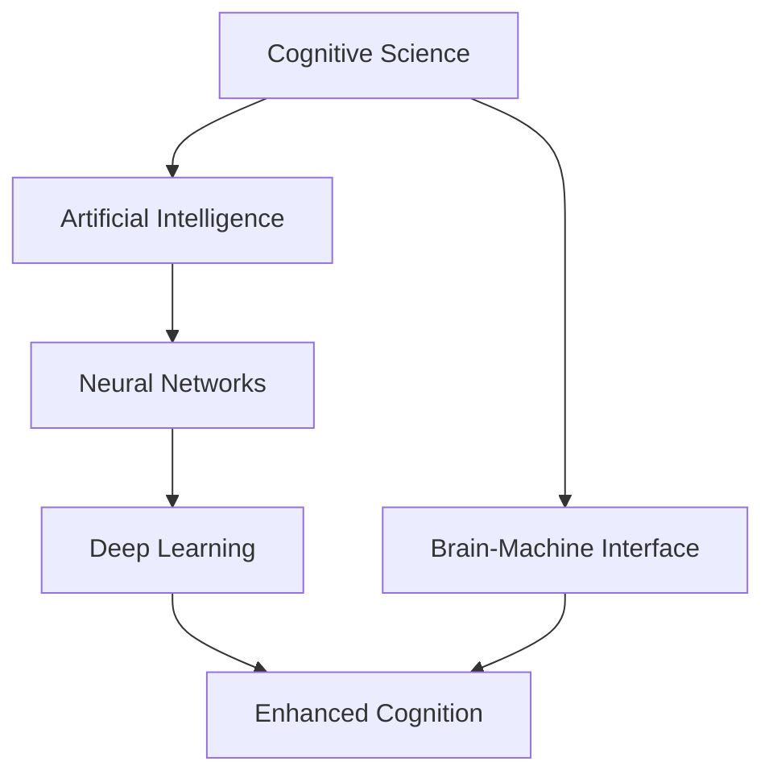

                 

# 人类认知：AI 时代的进步

> 关键词：认知科学, 人工智能, 机器学习, 神经网络, 深度学习, 脑机接口, 增强认知, 未来人类

## 1. 背景介绍

### 1.1 问题由来

在过去几十年中，人类社会经历了前所未有的技术变革。从个人电脑到移动互联网，从物联网到区块链，每一次的技术飞跃都深刻改变了人们的生活和工作方式。然而，尽管这些技术的进步让我们的生活更加便捷和高效，但它们并未触及人类认知的本质。人类认知，这一存在于我们大脑深处的复杂机制，仍然是一个未知的领域。

随着人工智能(AI)技术的迅速发展，越来越多的科学家和工程师开始关注如何将AI技术与人类认知结合，从而进一步提升人类的认知能力。AI技术的崛起，尤其是深度学习和神经网络的发展，为研究人类认知提供了一种全新的视角和工具。通过将AI应用于认知科学，我们可以更深入地理解人类认知的机制，进而开发出更加智能、高效的工具，推动人类社会向更高层次发展。

### 1.2 问题核心关键点

在探索AI与人类认知结合的过程中，有几个关键点需要重点关注：

- **认知模型的构建**：构建一个能够模拟人类认知过程的AI模型，是实现AI与人类认知结合的基础。这包括模型的结构设计、参数学习、训练过程等。

- **数据集的获取与标注**：高质量的数据集对于训练高效的认知模型至关重要。这些数据集需要涵盖各种认知任务，并且要进行精确的标注，以便模型能够准确学习人类认知的特征。

- **模型评估与验证**：如何评估AI认知模型的效果，验证其是否能够真正理解人类认知的机制，是实现AI与人类认知结合的关键。这包括选择适当的评估指标、设计科学的实验等。

- **伦理与隐私**：在研究人类认知与AI结合的过程中，需要特别关注数据的隐私保护和伦理问题。确保研究过程中的数据处理和模型应用符合道德规范。

## 2. 核心概念与联系

### 2.1 核心概念概述

在探讨AI与人类认知结合的过程中，需要理解以下几个核心概念：

- **认知科学**：研究人类认知机制的科学，包括感知、记忆、思维、语言等方面。认知科学的目标是揭示人类认知的本质，并开发出能够模拟人类认知的模型和工具。

- **人工智能**：通过模拟人类认知过程，实现智能机器的开发。人工智能技术包括机器学习、深度学习、神经网络等，这些技术为模拟人类认知提供了强大的工具。

- **神经网络**：一种能够模拟人类神经系统的计算模型。神经网络通过学习大量数据，能够实现复杂的计算和推理，是构建AI认知模型的重要基础。

- **深度学习**：一种基于多层神经网络的机器学习技术。深度学习通过构建深度神经网络，实现对复杂数据的有效处理和特征提取，是实现AI认知模型的关键。

- **脑机接口**：一种将人类大脑与计算机系统连接的技术。脑机接口可以实时采集人类大脑信号，并将其转化为计算机指令，从而实现人机交互。

### 2.2 核心概念原理和架构的 Mermaid 流程图(Mermaid 流程节点中不要有括号、逗号等特殊字符)



这个流程图展示了认知科学、人工智能、神经网络、深度学习、脑机接口和增强认知之间的联系。认知科学提供了对人类认知机制的理解，为构建AI认知模型提供了理论基础；人工智能通过模拟人类认知过程，开发出能够处理复杂任务的智能系统；神经网络和深度学习为构建AI认知模型提供了强大的计算工具；脑机接口实现人机交互，增强了认知模型与人类认知的结合；增强认知则展现了AI认知模型对人类认知的提升作用。

## 3. 核心算法原理 & 具体操作步骤

### 3.1 算法原理概述

AI与人类认知结合的核心算法原理可以概括为以下几点：

- **数据驱动**：认知模型的训练需要大量高质量的数据。这些数据可以来源于人类认知实验、自然语言处理、计算机视觉等多个领域。

- **模型选择**：选择合适的模型架构和算法是实现AI与人类认知结合的基础。常见的模型包括多层感知器、卷积神经网络、循环神经网络、自注意力机制等。

- **特征提取**：从输入数据中提取有用的特征，是训练高效认知模型的关键。这可以通过深度学习中的卷积层、池化层、全连接层等实现。

- **任务适配**：将认知模型应用于特定认知任务，需要设计合适的任务适配层。例如，对于分类任务，可以使用softmax激活函数输出类别概率；对于回归任务，可以使用线性激活函数输出预测值。

- **模型优化**：通过优化算法（如梯度下降、Adam、RMSprop等）训练认知模型，使其在特定任务上取得最优性能。

### 3.2 算法步骤详解

以下是一个详细的AI与人类认知结合的算法步骤：

**Step 1: 数据准备**
- 收集与认知任务相关的数据集，并进行数据清洗、标注等预处理工作。
- 例如，对于分类任务，需要标注每个样本的类别标签；对于回归任务，需要标注每个样本的数值标签。

**Step 2: 模型选择与初始化**
- 选择合适的模型架构，并初始化模型参数。例如，可以使用多层感知器、卷积神经网络、循环神经网络等。
- 对于神经网络模型，通常使用Xavier或He初始化方法初始化权重。

**Step 3: 特征提取**
- 使用卷积层、池化层等提取输入数据的特征。例如，在图像分类任务中，可以使用卷积层提取图像特征，使用池化层进行特征降维。
- 在自然语言处理任务中，可以使用循环神经网络提取文本特征，使用Attention机制关注重要信息。

**Step 4: 任务适配与模型训练**
- 设计合适的任务适配层，例如，在分类任务中使用softmax激活函数输出类别概率。
- 使用优化算法（如梯度下降、Adam等）训练模型，最小化损失函数。例如，在分类任务中使用交叉熵损失函数。

**Step 5: 模型评估与验证**
- 使用验证集评估模型性能，选择适当的评估指标，例如准确率、精确率、召回率等。
- 使用测试集进行最终评估，验证模型在未见过的数据上的表现。

**Step 6: 模型应用**
- 将训练好的模型应用于实际任务中，例如，在图像分类任务中使用模型预测新图像的类别。
- 根据模型表现，进行必要的调整和优化。

### 3.3 算法优缺点

AI与人类认知结合的算法具有以下优点：

- **高效性**：通过数据驱动和深度学习算法，能够高效地处理复杂任务，提取数据中的有用特征。
- **适应性强**：能够适应多种认知任务，例如分类、回归、聚类等。
- **可解释性**：通过可视化模型中的权重和激活函数，可以解释模型的推理过程和决策依据。

同时，也存在一些缺点：

- **数据依赖**：模型的性能很大程度上依赖于数据的质量和数量。数据不足可能导致模型泛化能力差。
- **复杂性**：构建高效的认知模型需要复杂的模型架构和算法，不易理解和实现。
- **资源消耗大**：深度学习模型通常需要大量的计算资源和存储空间，训练过程耗时较长。

### 3.4 算法应用领域

AI与人类认知结合的算法已经在多个领域得到了广泛应用，例如：

- **自然语言处理**：通过构建语言模型和翻译模型，实现机器翻译、情感分析、自动摘要等功能。
- **计算机视觉**：通过构建视觉模型和目标检测模型，实现图像分类、物体识别、人脸识别等功能。
- **医学影像分析**：通过构建医学影像模型，实现疾病诊断、手术辅助等功能。
- **增强现实**：通过构建增强现实模型，实现虚拟现实、混合现实等功能。
- **脑机接口**：通过构建脑机接口模型，实现人机交互、神经调控等功能。

## 4. 数学模型和公式 & 详细讲解 & 举例说明

### 4.1 数学模型构建

构建认知模型的数学模型可以概括为以下几点：

- **输入数据**：表示输入数据的向量或矩阵，例如，在图像分类任务中，输入数据为图像像素值矩阵。
- **权重矩阵**：表示神经网络的权重参数，例如，在多层感知器中，权重矩阵用于表示不同层的权重。
- **激活函数**：表示神经元的激活函数，例如，在多层感知器中，ReLU函数用于激活神经元。
- **损失函数**：表示模型预测输出与真实标签之间的差异，例如，在分类任务中，交叉熵损失函数用于衡量模型预测输出的误差。

### 4.2 公式推导过程

以下是一个典型的多层感知器模型的数学推导过程：

- **输入层**：将输入数据表示为向量 $\boldsymbol{x}$，其中 $\boldsymbol{x} \in \mathbb{R}^d$。
- **隐藏层**：使用多个神经元对输入数据进行非线性变换，例如，使用ReLU激活函数。
- **输出层**：将隐藏层的输出进行线性变换，得到模型预测输出 $\boldsymbol{y}$。
- **损失函数**：使用交叉熵损失函数衡量模型预测输出与真实标签的误差。

设 $n$ 表示隐藏层的神经元数，$d$ 表示输入数据的维度，$\boldsymbol{W}^{(1)}$ 和 $\boldsymbol{W}^{(2)}$ 分别表示输入层到隐藏层和隐藏层到输出层的权重矩阵，$\boldsymbol{b}^{(1)}$ 和 $\boldsymbol{b}^{(2)}$ 分别表示输入层和隐藏层的偏置向量。模型的数学表达式如下：

$$
\boldsymbol{h} = \sigma(\boldsymbol{W}^{(1)}\boldsymbol{x} + \boldsymbol{b}^{(1)})
$$

$$
\boldsymbol{y} = \boldsymbol{W}^{(2)}\boldsymbol{h} + \boldsymbol{b}^{(2)}
$$

其中，$\sigma$ 表示ReLU激活函数，$\boldsymbol{h}$ 表示隐藏层输出，$\boldsymbol{y}$ 表示模型预测输出。

损失函数定义为：

$$
L(\boldsymbol{y}, \boldsymbol{t}) = -\frac{1}{N}\sum_{i=1}^N \log P(y_i | x_i)
$$

其中，$N$ 表示样本数量，$\boldsymbol{t}$ 表示真实标签，$P(y_i | x_i)$ 表示模型预测输出 $\boldsymbol{y}$ 在输入 $x_i$ 上的概率分布。

### 4.3 案例分析与讲解

以图像分类为例，展示AI与人类认知结合的应用。

- **数据准备**：收集并标注大量图像数据，例如，使用ImageNet数据集。
- **模型选择**：选择卷积神经网络模型，例如，VGG、ResNet等。
- **特征提取**：使用卷积层提取图像特征，使用池化层进行特征降维。
- **任务适配**：在输出层使用softmax激活函数输出类别概率。
- **模型训练**：使用梯度下降算法最小化交叉熵损失函数。
- **模型评估**：使用验证集评估模型性能，选择适当的评估指标，例如准确率。
- **模型应用**：将训练好的模型应用于实际任务中，例如，对新图像进行分类。

## 5. 项目实践：代码实例和详细解释说明

### 5.1 开发环境搭建

在进行AI与人类认知结合的实践时，需要准备好开发环境。以下是使用Python进行TensorFlow开发的环境配置流程：

1. 安装Anaconda：从官网下载并安装Anaconda，用于创建独立的Python环境。

2. 创建并激活虚拟环境：
```bash
conda create -n tensorflow-env python=3.8 
conda activate tensorflow-env
```

3. 安装TensorFlow：根据CUDA版本，从官网获取对应的安装命令。例如：
```bash
conda install tensorflow
```

4. 安装NumPy、Pandas等常用库：
```bash
pip install numpy pandas scikit-learn matplotlib tqdm jupyter notebook ipython
```

完成上述步骤后，即可在`tensorflow-env`环境中开始实践。

### 5.2 源代码详细实现

以下是使用TensorFlow对卷积神经网络进行图像分类的代码实现：

```python
import tensorflow as tf
from tensorflow.keras import layers

# 定义模型
model = tf.keras.Sequential([
    layers.Conv2D(32, (3, 3), activation='relu', input_shape=(28, 28, 1)),
    layers.MaxPooling2D((2, 2)),
    layers.Flatten(),
    layers.Dense(10, activation='softmax')
])

# 定义损失函数
loss_fn = tf.keras.losses.SparseCategoricalCrossentropy(from_logits=True)

# 定义优化器
optimizer = tf.keras.optimizers.Adam()

# 训练模型
model.compile(optimizer=optimizer, loss=loss_fn, metrics=['accuracy'])
model.fit(train_images, train_labels, epochs=10, validation_data=(test_images, test_labels))

# 评估模型
model.evaluate(test_images, test_labels)

# 预测新样本
predictions = model.predict(new_images)
```

### 5.3 代码解读与分析

让我们再详细解读一下关键代码的实现细节：

**卷积神经网络模型定义**：
- `layers.Conv2D`：定义卷积层，提取图像特征。
- `layers.MaxPooling2D`：定义池化层，进行特征降维。
- `layers.Flatten`：定义展平层，将高维特征向量化。
- `layers.Dense`：定义全连接层，输出分类结果。

**损失函数定义**：
- `tf.keras.losses.SparseCategoricalCrossentropy`：定义交叉熵损失函数，用于衡量模型预测输出与真实标签的误差。

**优化器定义**：
- `tf.keras.optimizers.Adam`：定义Adam优化器，用于更新模型参数。

**模型训练**：
- `model.compile`：配置模型的损失函数、优化器等参数。
- `model.fit`：使用训练集训练模型，验证集用于评估模型性能。

**模型评估**：
- `model.evaluate`：使用测试集评估模型性能。

**模型预测**：
- `model.predict`：使用训练好的模型预测新样本的分类结果。

## 6. 实际应用场景

### 6.1 智能医疗

在智能医疗领域，AI与人类认知结合的应用具有重要意义。通过构建认知模型，可以实现疾病诊断、治疗方案推荐等功能。例如，可以使用卷积神经网络模型对医学影像进行分析和诊断，识别出病变区域，提供初步诊断建议。

### 6.2 教育系统

在教育系统中，AI与人类认知结合可以提升教学效果和学习效率。通过构建认知模型，可以实现个性化学习、智能评估等功能。例如，可以使用卷积神经网络模型对学生的学习行为进行分析，预测学习效果，提供个性化学习建议。

### 6.3 自动驾驶

在自动驾驶领域，AI与人类认知结合可以实现更加智能的驾驶决策。通过构建认知模型，可以实现道路场景理解、交通规则识别等功能。例如，可以使用卷积神经网络模型对道路图像进行分析和识别，实现自动驾驶功能。

### 6.4 未来应用展望

随着AI与人类认知结合技术的不断发展，未来将有更多领域受益于这一技术。

- **智能家居**：通过构建认知模型，可以实现语音识别、智能家居控制等功能。
- **智慧城市**：通过构建认知模型，可以实现交通流量监测、城市环境监测等功能。
- **增强现实**：通过构建认知模型，可以实现虚拟现实、混合现实等功能。
- **工业制造**：通过构建认知模型，可以实现设备故障预测、生产调度优化等功能。

## 7. 工具和资源推荐

### 7.1 学习资源推荐

为了帮助开发者系统掌握AI与人类认知结合的理论基础和实践技巧，这里推荐一些优质的学习资源：

1. **《深度学习》书籍**：由Yoshua Bengio、Ian Goodfellow、Aaron Courville合著，深入浅出地介绍了深度学习的基本概念和算法。

2. **Coursera《深度学习专项课程》**：由Andrew Ng等人主讲，系统讲解深度学习理论和实践。

3. **ArXiv论文库**：涵盖深度学习、认知科学等领域的最新研究成果，是学习和研究的重要资源。

4. **GitHub**：存储了大量深度学习模型和代码，开发者可以从中学习和借鉴。

5. **Kaggle**：提供各类机器学习竞赛，有助于开发者实践和提升技能。

### 7.2 开发工具推荐

高效的开发离不开优秀的工具支持。以下是几款用于AI与人类认知结合开发的常用工具：

1. **TensorFlow**：由Google主导开发的深度学习框架，支持分布式计算和GPU加速，是深度学习领域的主流工具。

2. **PyTorch**：由Facebook开发的深度学习框架，灵活易用，适合研究和教学。

3. **Keras**：由François Chollet开发的深度学习框架，易于上手，支持多种深度学习模型。

4. **Jupyter Notebook**：免费的交互式编程环境，支持代码编写、数据可视化和协作开发。

5. **Google Colab**：谷歌提供的免费Jupyter Notebook环境，支持GPU和TPU加速，适合大规模深度学习研究。

合理利用这些工具，可以显著提升AI与人类认知结合的开发效率，加快创新迭代的步伐。

### 7.3 相关论文推荐

AI与人类认知结合技术的发展源于学界的持续研究。以下是几篇奠基性的相关论文，推荐阅读：

1. **ImageNet Large Scale Visual Recognition Challenge（ILSVRC）**：由Alex Krizhevsky等人提出的图像分类任务，展示了深度学习在图像分类领域的巨大潜力。

2. **Playing Atari with Deep Reinforcement Learning**：由Vladimir Mnih等人提出的深度强化学习任务，展示了AI在复杂环境中的决策能力。

3. **A Three-Stream-CNN Architecture for Real-Time Object Detection**：由Kaiming He等人提出的目标检测任务，展示了深度学习在计算机视觉领域的应用。

4. **Understanding Deep Learning**：由Yann LeCun等人编写的深度学习教材，全面介绍了深度学习的基本概念和算法。

这些论文代表了大模型微调技术的发展脉络。通过学习这些前沿成果，可以帮助研究者把握学科前进方向，激发更多的创新灵感。

## 8. 总结：未来发展趋势与挑战

### 8.1 总结

本文对AI与人类认知结合方法进行了全面系统的介绍。首先阐述了AI与人类认知结合的研究背景和意义，明确了认知模型的构建、数据集的获取与标注、模型评估与验证等关键环节。其次，从原理到实践，详细讲解了认知模型的构建过程，给出了AI与人类认知结合的完整代码实现。同时，本文还广泛探讨了认知模型在智能医疗、教育系统、自动驾驶等多个领域的应用前景，展示了AI与人类认知结合的巨大潜力。最后，本文精选了认知模型相关的学习资源，力求为读者提供全方位的技术指引。

通过本文的系统梳理，可以看到，AI与人类认知结合方法正在成为认知科学和技术发展的重要方向，极大地拓展了人类认知的应用边界，带来了新的技术创新。未来，伴随认知科学和AI技术的不断进步，认知模型必将在更广阔的领域发挥重要作用，推动人类认知智能的进步。

### 8.2 未来发展趋势

展望未来，AI与人类认知结合技术将呈现以下几个发展趋势：

1. **模型规模持续增大**：随着算力成本的下降和数据规模的扩张，认知模型的参数量还将持续增长。超大规模认知模型蕴含的丰富认知知识，有望支撑更加复杂多变的认知任务。

2. **任务适配更加多样化**：未来将涌现更多任务适配方法，例如，针对不同认知任务的认知模型将采用不同的架构和算法，以适应任务的特点和需求。

3. **可解释性增强**：认知模型将更加注重可解释性，开发者可以通过可视化工具理解模型的内部机制和推理过程，增强模型的可信度。

4. **跨模态认知融合**：未来将更多地引入跨模态认知融合技术，例如，将视觉、听觉、文本等多模态信息进行融合，提升认知模型的综合能力。

5. **伦理与安全保障**：随着认知模型在实际应用中的普及，伦理与安全问题将变得愈发重要。开发者需要考虑数据隐私、模型偏见、决策透明性等问题。

6. **跨领域应用拓展**：未来认知模型将更加广泛地应用于多个领域，例如，医学、教育、交通、工业等，为这些领域带来变革性影响。

以上趋势凸显了AI与人类认知结合技术的广阔前景。这些方向的探索发展，必将进一步提升认知模型的性能和应用范围，为人类认知智能的进化带来深远影响。

### 8.3 面临的挑战

尽管AI与人类认知结合技术已经取得了瞩目成就，但在迈向更加智能化、普适化应用的过程中，它仍面临着诸多挑战：

1. **数据依赖**：高质量的数据集是认知模型训练的基础，然而，大规模高质量数据集的获取与标注仍是一个难题。数据不足可能导致模型泛化能力差。

2. **计算资源消耗大**：深度学习模型通常需要大量的计算资源和存储空间，训练过程耗时较长，大规模应用的资源需求较高。

3. **模型复杂性高**：认知模型的构建需要复杂的模型架构和算法，不易理解和实现，开发者需要具备较强的技术背景。

4. **可解释性不足**：认知模型的决策过程通常缺乏可解释性，难以对其推理逻辑进行分析和调试，尤其在医疗、金融等高风险应用中，模型的可解释性和可审计性尤为重要。

5. **伦理与安全问题**：认知模型可能会学习到有害信息或偏见，应用于实际应用中可能产生误导性或歧视性的输出，带来安全隐患。

6. **跨模态融合难度大**：将不同模态的信息进行融合，需要解决模态间的一致性、跨模态特征的表示等问题，技术难度较大。

正视认知模型面临的这些挑战，积极应对并寻求突破，将是大模型微调走向成熟的必由之路。相信随着学界和产业界的共同努力，这些挑战终将一一被克服，认知模型必将在构建人机协同的智能时代中扮演越来越重要的角色。

### 8.4 研究展望

面对认知模型面临的这些挑战，未来的研究需要在以下几个方面寻求新的突破：

1. **数据增强与生成技术**：开发更加高效的数据增强和生成技术，例如，通过数据扩增、对抗生成网络等方法，缓解数据依赖问题。

2. **模型压缩与优化技术**：开发更加高效的数据压缩与模型优化技术，例如，通过知识蒸馏、模型剪枝等方法，提高模型的计算效率。

3. **跨模态融合技术**：开发更加高效的跨模态融合技术，例如，通过多模态注意力机制、联合训练等方法，实现视觉、听觉、文本等多模态信息的有效融合。

4. **模型解释性与透明性**：开发更加透明的认知模型，例如，通过可解释性模型、因果推理模型等方法，增强模型的可解释性。

5. **伦理与安全保障技术**：开发更加安全可靠的认知模型，例如，通过隐私保护技术、模型偏见检测等方法，确保模型的伦理与安全。

这些研究方向的探索，必将引领认知模型向更高的台阶发展，为构建安全、可靠、可解释、可控的智能系统铺平道路。面向未来，认知模型需要与其他人工智能技术进行更深入的融合，如知识表示、因果推理、强化学习等，多路径协同发力，共同推动认知智能的进步。

## 9. 附录：常见问题与解答

**Q1：认知模型是否适用于所有认知任务？**

A: 认知模型在大多数认知任务上都能取得不错的效果，特别是对于数据量较小的任务。但对于一些特定领域的任务，如医学、法律等，仅仅依靠通用语料预训练的模型可能难以很好地适应。此时需要在特定领域语料上进一步预训练，再进行微调，才能获得理想效果。此外，对于一些需要时效性、个性化很强的任务，如对话、推荐等，认知模型也需要针对性的改进优化。

**Q2：构建认知模型需要哪些步骤？**

A: 构建认知模型通常需要以下步骤：

1. 收集与认知任务相关的数据集，并进行数据清洗、标注等预处理工作。
2. 选择合适的模型架构，并初始化模型参数。例如，可以使用卷积神经网络、循环神经网络等。
3. 使用卷积层、池化层等提取输入数据的特征。
4. 设计合适的任务适配层，例如，在分类任务中使用softmax激活函数输出类别概率。
5. 使用优化算法（如梯度下降、Adam等）训练模型，最小化损失函数。例如，在分类任务中使用交叉熵损失函数。

**Q3：认知模型在落地部署时需要注意哪些问题？**

A: 将认知模型转化为实际应用，还需要考虑以下因素：

1. 模型裁剪：去除不必要的层和参数，减小模型尺寸，加快推理速度。
2. 量化加速：将浮点模型转为定点模型，压缩存储空间，提高计算效率。
3. 服务化封装：将模型封装为标准化服务接口，便于集成调用。
4. 弹性伸缩：根据请求流量动态调整资源配置，平衡服务质量和成本。
5. 监控告警：实时采集系统指标，设置异常告警阈值，确保服务稳定性。
6. 安全防护：采用访问鉴权、数据脱敏等措施，保障数据和模型安全。

认知模型需要在实际应用中不断优化和改进，才能真正发挥其价值。只有从数据、算法、工程、业务等多个维度协同发力，才能真正实现认知模型在实际场景中的落地应用。

---

作者：禅与计算机程序设计艺术 / Zen and the Art of Computer Programming

