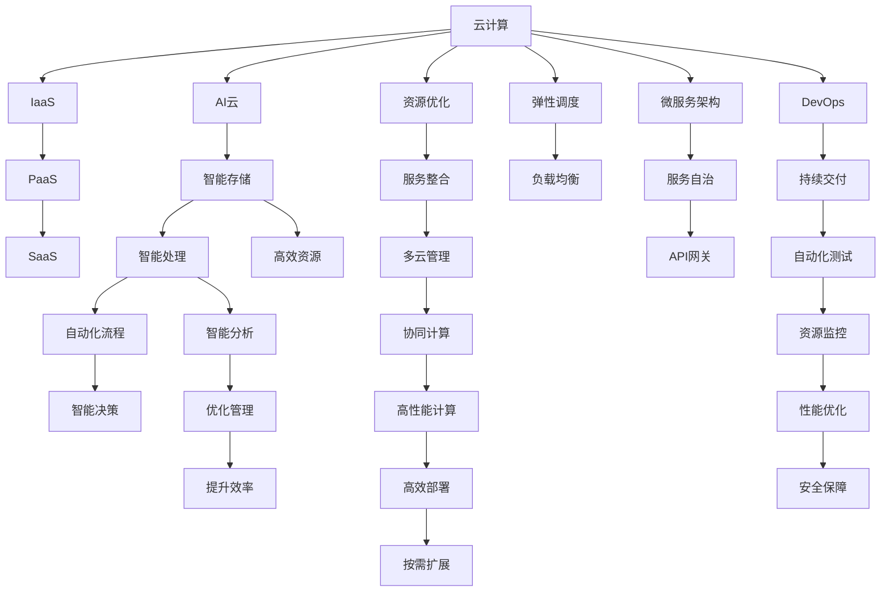

                 

# 从云计算到AI云：Lepton AI的转型之路

> 关键词：云计算,AI云,Lepton AI,转型,智能化,机器学习,深度学习,人工智能,企业转型

## 1. 背景介绍

### 1.1 问题由来
随着技术的进步和市场需求的变化，企业在转型过程中面临诸多挑战，尤其在高科技领域。Lepton AI作为一家科技公司，在面临从传统云计算向AI云的转型时，需要深刻理解云计算与AI云之间的异同，以及如何优化资源配置，提升业务智能化水平。

### 1.2 问题核心关键点
Lepton AI的转型重点在于如何将云计算基础设施与AI技术相结合，优化计算资源，提高智能化处理能力。转型过程中需考虑云计算资源的有效利用，以及如何通过AI技术提升业务的自动化、智能化程度。

### 1.3 问题研究意义
本研究旨在帮助Lepton AI及其同类企业，明确云计算到AI云的转型路径，利用云计算的资源优势和AI技术的能力，实现业务智能化升级，提升市场竞争力。

## 2. 核心概念与联系

### 2.1 核心概念概述

- **云计算**：指通过互联网提供动态可伸缩的虚拟化资源，用户可以按需使用。云计算主要包括IaaS、PaaS、SaaS三种服务模式。
- **AI云**：融合了云计算和AI技术，提供从数据存储、处理、分析到智能决策的全面解决方案。AI云的特点是高效、灵活、智能。
- **Lepton AI**：本文聚焦于Lepton AI，一家致力于推动企业智能化转型的科技公司，其转型目标是充分利用云计算的资源和AI技术，提供高质量、高效率的AI云服务。
- **转型**：指从一种业务模式、技术体系转变为另一种更先进、更高效的业务模式和技术体系。

这些核心概念之间通过以下Mermaid流程图展示联系：



这个流程图展示了云计算和AI云之间的连接和过渡，以及Lepton AI在转型过程中需考虑的关键技术要素和过程。

## 3. 核心算法原理 & 具体操作步骤
### 3.1 算法原理概述

Lepton AI的转型涉及云计算资源优化和AI技术应用，其核心算法原理主要包括以下几个方面：

- **资源优化算法**：优化云计算资源配置，如弹性计算、负载均衡、微服务架构等。
- **AI算法**：如深度学习、强化学习等，用于提升业务的智能化处理能力。
- **集成算法**：将AI技术集成到云计算平台，实现高效计算、数据处理和智能决策。

### 3.2 算法步骤详解

**Step 1: 云计算基础设施优化**
- 分析企业现有云计算基础设施，确定资源使用情况和瓶颈。
- 根据业务需求和数据处理特点，设计弹性计算资源分配策略。
- 采用容器化和微服务架构，提高资源利用率和系统灵活性。

**Step 2: AI技术应用与优化**
- 收集企业内部数据和外部数据，进行数据预处理和清洗。
- 选择合适的AI模型和算法，如深度学习、强化学习等。
- 在云计算平台上进行模型训练和优化，确保模型性能和资源效率。
- 应用AI技术优化业务流程，如自动化决策、智能客服等。

**Step 3: 云计算与AI技术的集成**
- 设计数据流动和计算资源调度的整体架构。
- 集成AI算法到云计算平台，实现高效数据处理和智能分析。
- 提供统一API接口，供企业应用调用。

### 3.3 算法优缺点

**优点**：
- 提升业务智能化水平，优化资源配置。
- 提升数据处理和分析效率，降低业务运营成本。
- 支持企业快速迭代和创新，增强市场竞争力。

**缺点**：
- 转型初期需投入大量资源和时间。
- 需要跨越云计算和AI技术的专业壁垒，技术复杂度高。
- 需不断优化和调整，确保系统的稳定性和性能。

### 3.4 算法应用领域

基于云计算和AI云的转型技术，Lepton AI的AI云服务广泛应用于多个行业，如金融、医疗、电商、制造等。

**金融行业**：提供智能风险管理、智能投顾、智能合规等服务。
**医疗行业**：实现智能诊断、智能导医、智能病历管理等服务。
**电商行业**：提供智能推荐、智能客服、智能库存管理等服务。
**制造行业**：实现智能生产、智能质检、智能运维等服务。

## 4. 数学模型和公式 & 详细讲解 & 举例说明

### 4.1 数学模型构建

Lepton AI的AI云服务涉及大量的数学模型构建，以实现高效的智能决策。这里以一个简化的线性回归模型为例，说明其构建过程。

线性回归模型的目标是最小化预测值与实际值之间的误差，即：

$$
\min_{\theta} \frac{1}{n}\sum_{i=1}^{n} (y_i - \theta^T x_i)^2
$$

其中 $\theta$ 是模型参数，$x_i$ 是输入特征向量，$y_i$ 是目标变量。

### 4.2 公式推导过程

求解上述最小化问题的梯度下降法如下：

1. 定义损失函数 $L(\theta)$：
$$
L(\theta) = \frac{1}{2n} \sum_{i=1}^{n} (y_i - \theta^T x_i)^2
$$

2. 计算梯度 $\nabla_{\theta} L(\theta)$：
$$
\nabla_{\theta} L(\theta) = \frac{1}{n} \sum_{i=1}^{n} (y_i - \theta^T x_i) x_i
$$

3. 迭代更新 $\theta$：
$$
\theta \leftarrow \theta - \eta \nabla_{\theta} L(\theta)
$$

其中 $\eta$ 是学习率。

### 4.3 案例分析与讲解

以智能推荐系统为例，该系统需要预测用户对商品的概率，并根据预测结果推荐商品。系统基于用户历史行为数据构建线性回归模型，通过梯度下降法迭代优化，最终实现高效推荐。

## 5. 项目实践：代码实例和详细解释说明

### 5.1 开发环境搭建

Lepton AI的AI云服务开发环境搭建需要以下步骤：

1. 搭建云平台：选择合适的云计算服务提供商，如AWS、Azure、Google Cloud等。
2. 配置环境：安装必要的开发工具和依赖库，如Python、NumPy、Pandas、TensorFlow等。
3. 设计架构：设计数据流和计算资源调度架构，实现高效处理和智能分析。

### 5.2 源代码详细实现

以下是一个简化的线性回归模型在Python中的实现，用于预测用户购买概率。

```python
import numpy as np
from sklearn.linear_model import LinearRegression

# 构建训练集
X_train = np.array([[1, 2, 3], [4, 5, 6], [7, 8, 9]])
y_train = np.array([2, 4, 6])

# 构建模型
model = LinearRegression()

# 训练模型
model.fit(X_train, y_train)

# 预测新数据
X_test = np.array([[10, 11, 12]])
y_pred = model.predict(X_test)
```

### 5.3 代码解读与分析

**X_train**：特征向量，表示用户历史购买行为。
**y_train**：目标变量，表示用户是否购买。
**model**：线性回归模型。
**model.fit(X_train, y_train)**：训练模型。
**X_test**：新数据，表示用户新行为。
**y_pred**：预测结果。

## 6. 实际应用场景

### 6.1 智能推荐系统

Lepton AI的智能推荐系统基于用户行为数据，采用线性回归、协同过滤等算法，结合AI技术进行深度学习和特征工程，提升推荐效果。

### 6.2 智能客服系统

Lepton AI的智能客服系统利用NLP技术进行自然语言处理，结合AI技术进行对话管理，实现智能客服机器人。

### 6.3 智能风险管理系统

Lepton AI的智能风险管理系统通过数据分析和机器学习，实时监控金融市场风险，提供智能决策支持。

### 6.4 未来应用展望

未来，Lepton AI将进一步深化云计算与AI技术的融合，提供更加智能化、个性化的服务，涵盖更多行业和应用场景。

## 7. 工具和资源推荐

### 7.1 学习资源推荐

1. **《深度学习》课程**：由斯坦福大学Andrew Ng教授开设，涵盖深度学习基础和实际应用。
2. **《TensorFlow实战》书籍**：介绍TensorFlow的使用和案例，适合实战学习。
3. **Kaggle竞赛平台**：参与数据科学竞赛，实战提升。

### 7.2 开发工具推荐

1. **AWS**：提供丰富的云服务，包括计算、存储、数据库等。
2. **Azure**：提供强大的AI和机器学习服务，如Azure ML。
3. **TensorFlow**：开源深度学习框架，支持分布式计算。
4. **Kubernetes**：容器编排系统，实现高效资源管理和调度。

### 7.3 相关论文推荐

1. **《云计算安全架构》**：介绍云计算安全架构设计，保障数据安全和隐私。
2. **《机器学习在电商推荐系统中的应用》**：介绍机器学习在电商推荐系统中的应用和优化。
3. **《智能客服系统设计》**：介绍智能客服系统的设计和实现。

## 8. 总结：未来发展趋势与挑战

### 8.1 研究成果总结

Lepton AI的云计算与AI云转型研究，从理论模型、算法优化、项目实践到实际应用，为云计算与AI技术的深度融合提供了实践经验。

### 8.2 未来发展趋势

1. **AI云服务普及**：随着技术成熟和成本降低，AI云服务将更加普及，广泛应用于各行各业。
2. **云计算与AI集成**：云计算将提供更多的AI基础设施和服务，实现高效、灵活、智能的业务处理。
3. **微服务架构流行**：微服务架构将进一步优化资源配置，提升系统灵活性和可扩展性。
4. **自动化运维发展**：自动化运维工具和平台将助力企业高效管理和运营云计算和AI系统。

### 8.3 面临的挑战

1. **技术复杂度高**：云计算与AI技术的融合涉及跨学科知识，技术复杂度高。
2. **数据隐私安全**：如何保护数据隐私和安全，是转型过程中需重点解决的问题。
3. **资源优化困难**：云计算资源优化和AI算法优化需要精细管理，存在一定难度。
4. **成本投入高**：初期投入较大，需平衡成本与效益。

### 8.4 研究展望

1. **技术融合创新**：探索新的云计算与AI技术融合方式，推动技术创新。
2. **智能应用拓展**：拓展AI云服务的应用领域，提升企业智能化水平。
3. **资源优化优化**：开发更高效的资源优化算法和工具，提升系统性能。
4. **数据隐私保护**：加强数据隐私保护技术研究，确保数据安全。

## 9. 附录：常见问题与解答

**Q1：云计算与AI云的区别是什么？**

A: 云计算提供计算资源，AI云将AI技术集成到云计算中，提供更高效、更智能的服务。

**Q2：如何优化云计算资源配置？**

A: 采用弹性计算、负载均衡、微服务架构等策略，实现资源的高效利用和灵活管理。

**Q3：AI云服务在转型过程中面临哪些挑战？**

A: 技术复杂度高、数据隐私安全、资源优化困难、成本投入高。

**Q4：如何确保AI云服务的稳定性和性能？**

A: 采用自动化运维工具，进行持续监控和优化，确保系统的稳定性和性能。

**Q5：AI云服务在哪些行业有应用前景？**

A: 金融、医疗、电商、制造等行业都有广泛应用前景。

---

作者：禅与计算机程序设计艺术 / Zen and the Art of Computer Programming

