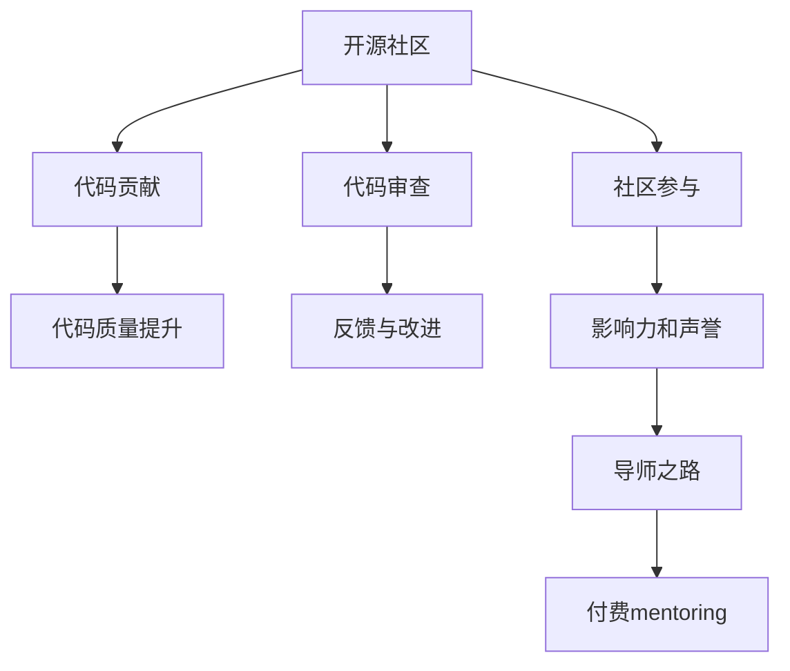

                 

# 从代码贡献到付费mentoring：程序员的导师之路

> 关键词：导师之路, 代码贡献, 付费mentoring, 编程实践, 职业发展

## 1. 背景介绍

### 1.1 问题由来

在当今快速发展的软件开发环境中，技术的迭代速度远远超过了个人的学习速度。如何成为一名优秀的程序员，如何通过代码贡献为社区做出贡献，如何在职业生涯中不断进步，成为许多程序员在职业发展中的重要课题。特别是在开源社区，如何从一名普通开发者成长为社区的导师或领导者，成为越来越多技术人员的目标。本文将从导师之路的角度，探讨程序员从代码贡献到付费mentoring的全过程，帮助读者实现职业生涯的飞跃。

### 1.2 问题核心关键点

- **导师之路**：指通过代码贡献、社区参与等方式，逐渐在开源社区中积累影响力，最终成为社区中的导师或领导者。
- **代码贡献**：指通过提交代码、修改文档、优化性能等方式为开源项目做出实际贡献。
- **付费mentoring**：指通过接受企业的付费委托，对其他技术人员进行技术指导和辅导。
- **编程实践**：指通过实践提升编程技能，学习最佳编码实践。
- **职业发展**：指通过技能提升、职业规划，实现个人职业生涯的持续进步。

## 2. 核心概念与联系

### 2.1 核心概念概述

要理解从代码贡献到付费mentoring的导师之路，需要先明确几个核心概念及其关系：

- **开源社区**：指以开源许可证为基础，软件代码、文档、设计等资源共享的社区。
- **代码贡献**：指在开源项目中提交代码、修改文档、优化性能等形式的贡献。
- **代码审查**：指社区成员对代码贡献的评估和反馈，是提升代码质量的重要环节。
- **社区参与**：指积极参与社区活动，如问题解答、会议发言、代码回顾等，提升个人在社区中的影响力。
- **导师之路**：指通过代码贡献和社区参与，逐渐在社区中积累影响力和声誉，最终成为社区中的导师或领导者。

这些概念之间的逻辑关系可以通过以下Mermaid流程图来展示：

这个流程图展示了从加入开源社区到成为社区导师的全过程，其中代码贡献是基础，社区参与是提升影响力的途径，而导师之路则是在这些基础上逐渐形成的。

## 3. 核心算法原理 & 具体操作步骤

### 3.1 算法原理概述

从代码贡献到付费mentoring的导师之路，涉及多个阶段和技能，每个阶段都有其核心算法和具体操作步骤。本文将从代码贡献和社区参与两个方面，详细讲解算法原理和具体操作步骤。

### 3.2 算法步骤详解

#### 3.2.1 代码贡献的算法步骤

1. **选择项目**：在GitHub、GitLab等平台搜索感兴趣的开源项目，选择具有活跃维护和贡献机制的项目。
2. **了解项目**：阅读项目文档、代码库和相关讨论，理解项目的需求和贡献流程。
3. **准备代码**：编写高质量的代码，遵循项目编码规范和风格指南，包括代码命名、注释、测试等。
4. **提交代码**：使用Git等版本控制系统，将代码提交到项目仓库，并附上详细的提交说明。
5. **代码审查**：等待项目维护者或社区成员的代码审查，根据反馈进行改进。
6. **合并代码**：代码审查通过后，被合并到主分支中，成为项目的一部分。

#### 3.2.2 社区参与的算法步骤

1. **参与讨论**：在项目论坛、邮件列表、社交媒体等渠道参与项目讨论，提出问题、分享经验。
2. **贡献解答**：在项目问答、Stack Overflow等平台上，提供专业解答和技术支持，积累社区声誉。
3. **组织活动**：参与或组织社区会议、研讨会、Hackathon等活动，提升个人在社区中的影响力。
4. **编写文档**：编写项目文档、教程、示例代码等，帮助新入坑者快速上手。
5. **提出改进**：通过 issue 或 pull request 形式，提出项目改进建议，解决潜在问题。

### 3.3 算法优缺点

#### 3.3.1 代码贡献的优缺点

**优点**：
- 提升编程技能：通过编写和优化代码，不断学习和应用新知识。
- 增强代码质量：经过代码审查和改进，提升代码质量和可维护性。
- 建立声誉：在开源社区中建立个人声誉，为职业发展奠定基础。

**缺点**：
- 时间和精力投入大：高质量的代码贡献需要大量时间和精力。
- 可能被拒绝：代码审查中可能被拒绝，需要耐心改进。

#### 3.3.2 社区参与的优缺点

**优点**：
- 扩大影响力：通过参与讨论和贡献解答，扩大在社区中的影响力。
- 学习交流：通过与社区成员的交流，学习先进技术和管理经验。
- 建立人脉：与社区成员建立良好关系，为职业发展积累资源。

**缺点**：
- 时间和精力投入大：社区参与需要大量时间，可能影响工作和生活。
- 竞争激烈：社区竞争激烈，可能难以突出自己。

### 3.4 算法应用领域

从代码贡献到付费mentoring的导师之路，适用于各种编程语言和技术栈的开源社区。特别适用于软件开发、数据科学、人工智能等技术领域，以及对技术开源有较高需求的企业和个人。

## 4. 数学模型和公式 & 详细讲解 & 举例说明

### 4.1 数学模型构建

假设有一个开源项目 $P$，贡献者 $C$ 提交的代码 $C$ 被项目维护者 $M$ 审查后，代码质量为 $Q$，代码质量 $Q$ 与贡献者技能 $S_C$、项目需求 $D_P$、代码审查反馈 $F$ 和社区支持 $C_S$ 有关。

$$
Q = f(S_C, D_P, F, C_S)
$$

其中 $f$ 为复杂函数，表示代码质量与这些因素的相互作用关系。

### 4.2 公式推导过程

在实际应用中，我们可以将上述复杂函数简化为线性模型：

$$
Q = aS_C + bD_P + cF + dC_S
$$

其中 $a, b, c, d$ 为系数，表示各项因素对代码质量的影响权重。

通过大量数据训练，可以确定这些系数，并用于评估代码贡献的质量。

### 4.3 案例分析与讲解

以GitHub上的TensorFlow项目为例，贡献者对项目的贡献质量可以通过以下指标衡量：
- 贡献数量：提交的代码行数、commit次数。
- 代码审查次数：代码被审查的次数，表示社区对贡献的关注度。
- 反馈改进次数：根据审查反馈修改代码的次数，表示代码质量和可维护性。
- 社区点赞：社区成员对贡献的点赞次数，表示社区对贡献的认可度。

## 5. 项目实践：代码实例和详细解释说明

### 5.1 开发环境搭建

在开始代码贡献和社区参与前，需要搭建开发环境，包括：
- 安装IDE和版本控制系统，如Visual Studio Code、Git等。
- 配置GitHub账号，并在GitHub、GitLab等平台创建仓库和fork。
- 设置代码审查工具，如Clang-Tidy、SonarQube等，提升代码质量。

### 5.2 源代码详细实现

以TensorFlow项目为例，贡献者可以通过以下步骤提交代码：
1. 在GitHub上fork TensorFlow项目。
2. 克隆项目到本地，并进行代码贡献。
3. 编写代码后，使用 `git add` 和 `git commit` 提交代码。
4. 使用 `git push` 将代码推送到自己的仓库。
5. 通过 `git pull request` 创建Pull Request，等待项目维护者审查。

### 5.3 代码解读与分析

代码贡献的质量评估包括多个方面，如代码风格、模块化、可读性等。贡献者可以通过查看代码审查反馈，改进代码质量。

### 5.4 运行结果展示

通过代码贡献和社区参与，贡献者可以逐步提升个人在社区中的影响力和声誉，最终成为社区的导师或领导者。

## 6. 实际应用场景

### 6.1 开源社区中的导师

在开源社区中，导师不仅传授技术知识，还帮助新人解决实际问题，引导新人成长。导师可以通过代码审查、社区讨论等方式，为新入坑者提供指导和支持。

### 6.2 企业中的技术指导

在企业中，导师可以接受企业的付费委托，对其他技术人员进行技术指导和辅导。通过一对一的指导，帮助新人快速上手，提升团队整体技术水平。

### 6.3 教育领域的知识分享

在教育领域，导师可以开设在线课程、编写教程等，分享自己的技术经验和知识，帮助更多人学习和进步。

### 6.4 未来应用展望

随着技术的不断发展和社区的日益壮大，导师之路将更加多元和广阔。未来，导师不仅可以在开源社区、企业内部发挥作用，还可以在教育、科研、政府等领域拓展影响力。

## 7. 工具和资源推荐

### 7.1 学习资源推荐

1. **《开源社区指南》**：详细介绍了开源社区的运作机制和贡献流程。
2. **《代码审查最佳实践》**：提供了代码审查的标准和工具，帮助提升代码质量。
3. **《社区参与的艺术》**：探讨了如何通过社区参与提升个人声誉和影响力。

### 7.2 开发工具推荐

1. **GitHub**：全球最大的代码托管平台，提供了丰富的开源项目和协作工具。
2. **Visual Studio Code**：流行的开源IDE，支持多种编程语言和插件。
3. **JIRA**：项目管理工具，帮助团队高效协作。

### 7.3 相关论文推荐

1. **《开源社区中的技术贡献者》**：研究开源社区中贡献者的行为和动机。
2. **《导师制在技术团队中的效果》**：评估导师制对技术团队的影响。
3. **《社区参与与个人声誉的关系》**：探讨社区参与如何提升个人声誉。

## 8. 总结：未来发展趋势与挑战

### 8.1 研究成果总结

从代码贡献到付费mentoring的导师之路，是程序员职业生涯中重要的发展路径。通过不断提升技术能力、积极参与社区，逐步建立个人声誉，最终成为社区中的导师或领导者。

### 8.2 未来发展趋势

1. **社区参与多样化**：未来社区参与将更加多样化，涵盖技术交流、项目合作、知识分享等多个方面。
2. **导师制普及化**：导师制将在企业内部和开源社区中普及，帮助更多技术人员提升技能。
3. **跨领域应用**：导师之路不仅限于技术领域，还将在教育、科研、政府等领域发挥更大作用。

### 8.3 面临的挑战

1. **时间和精力投入大**：代码贡献和社区参与需要大量时间和精力，可能影响工作和生活。
2. **社区竞争激烈**：社区竞争激烈，贡献者需要不断提升自身技术水平和影响力。
3. **反馈和改进困难**：代码审查和社区讨论中可能遇到大量负面反馈，需要耐心改进。

### 8.4 研究展望

未来，从代码贡献到付费mentoring的导师之路将更加系统和规范，通过标准化流程和工具，提升贡献质量和管理效率。同时，更多企业和机构将加入导师制，帮助技术人才快速成长，推动技术进步和社会发展。

## 9. 附录：常见问题与解答

### Q1：如何选择合适的开源项目进行贡献？

A: 选择开源项目时，可以从以下几个方面考虑：
1. **项目活跃度**：选择活跃维护的项目，确保代码能够及时更新和维护。
2. **项目需求**：选择有实际需求的项目，避免选择过于小众或无需求的项目。
3. **贡献机制**：选择有明确贡献机制和贡献指南的项目，确保贡献流程顺畅。

### Q2：如何进行高效的代码贡献？

A: 高效的代码贡献需要遵循以下几个步骤：
1. **深入理解项目**：在提交代码前，深入理解项目需求和代码库结构。
2. **遵循编码规范**：遵循项目的编码规范和风格指南，提升代码质量。
3. **合理提交代码**：使用描述清晰的提交说明，及时更新代码审查状态。
4. **积极改进反馈**：根据代码审查反馈，积极改进代码质量，提升贡献效果。

### Q3：如何提升社区参与度？

A: 提升社区参与度需要以下几个步骤：
1. **积极讨论**：积极参与项目讨论和问题解答，展示技术实力和沟通能力。
2. **贡献解答**：在社区平台提供高质量的技术解答，帮助社区成员解决问题。
3. **组织活动**：参与或组织社区会议、Hackathon等活动，增强社区成员的互动和联系。
4. **编写文档**：编写项目文档、教程、示例代码等，帮助新入坑者快速上手。

### Q4：如何成为社区中的导师？

A: 成为社区中的导师需要以下几个步骤：
1. **积累贡献**：通过大量的代码贡献和社区参与，积累个人声誉和影响力。
2. **积极引导**：积极参与社区管理和引导，帮助新人解决实际问题，提供技术支持。
3. **持续学习**：持续学习新技术和最佳实践，保持技术领先优势。

### Q5：导师之路是否有必要？

A: 导师之路对个人职业发展和技能提升有重要作用。通过代码贡献和社区参与，逐步建立个人声誉和影响力，最终成为社区中的导师或领导者。这对技术人员的职业成长和能力提升具有重要意义。

---

作者：禅与计算机程序设计艺术 / Zen and the Art of Computer Programming

