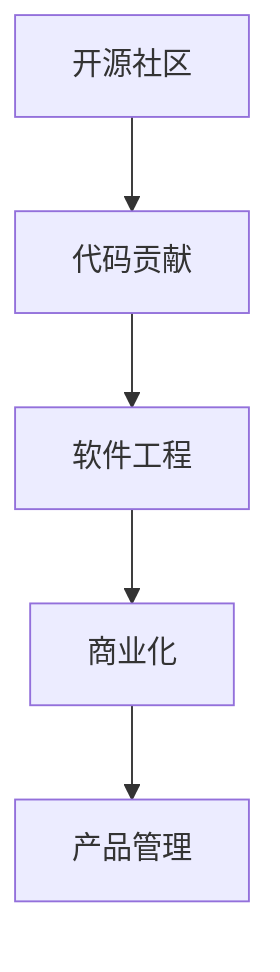

                 

# 从代码贡献到开源商业化之路

> 关键词：开源社区,代码贡献,商业化,软件工程,产品管理

## 1. 背景介绍

### 1.1 问题由来
开源社区作为全球软件创新的温床，吸引了来自全球各地的程序员、开发者和研究人员的积极参与。从代码贡献到开源商业化，是许多开源项目的成长之路，也是开源技术与企业商业价值的融合之道。然而，从代码贡献到商业化之路并非坦途，需要解决技术、商业、文化等多方面的问题。

### 1.2 问题核心关键点
开源商业化过程的核心关键点包括：

- **代码质量保证**：开源代码的质量直接影响商业化的成功率，需要构建高效的质量保证机制。
- **商业化战略**：明确商业化的方向和目标，制定详细的商业化计划。
- **社区管理**：维护良好的社区生态，促进技术交流与合作。
- **商业法律**：解决开源项目与商业公司的法律问题，保护商业化项目的技术和知识产权。
- **市场定位**：找到开源项目的市场定位，确定目标客户群体。
- **用户反馈**：根据用户反馈不断迭代和优化产品。

这些关键点构成了开源项目商业化的基础框架，本文将详细介绍如何从代码贡献走向开源商业化。

## 2. 核心概念与联系

### 2.1 核心概念概述

为更好地理解开源商业化的全过程，我们首先介绍几个核心概念：

- **开源社区**：一个共享资源、知识和技术的开放平台，鼓励开发者合作和共享代码。
- **代码贡献**：开发者将自己的代码提交到开源项目中，进行开源共享。
- **商业化**：将开源技术转化为商业产品，形成商业收入的过程。
- **软件工程**：包括需求分析、设计、实现、测试、部署和维护等全生命周期管理。
- **产品管理**：涉及产品规划、需求收集、市场推广、销售渠道等各个环节。

这些概念之间的逻辑关系可以通过以下Mermaid流程图来展示：

这个流程图展示了开源项目从代码贡献到商业化的整体流程：

1. 开发者在开源社区贡献代码。
2. 开源代码通过软件工程方法进行管理和优化。
3. 优化后的代码通过商业化策略转化为商业产品。
4. 商业产品通过产品管理推广到市场。

## 3. 核心算法原理 & 具体操作步骤
### 3.1 算法原理概述

开源商业化的核心算法原理包括软件工程和产品管理两大方面。

### 3.2 算法步骤详解

#### 3.2.1 软件工程

**版本控制**：使用如Git、SVN等版本控制系统管理代码，确保代码变更的记录和追溯。

**持续集成与持续交付(CI/CD)**：自动化构建、测试和部署，确保代码质量，快速响应市场变化。

**敏捷开发**：采用Scrum、Kanban等敏捷方法，提高开发效率和代码质量。

**代码审查**：通过代码审查机制，确保代码质量，促进知识共享和技术交流。

#### 3.2.2 产品管理

**市场调研**：通过问卷调查、用户访谈等方式，了解市场需求和用户痛点。

**产品规划**：根据市场需求和用户反馈，制定详细的产品规划和路线图。

**用户反馈**：建立用户反馈机制，及时收集和分析用户意见，快速迭代产品。

**市场推广**：通过广告、宣传、社交媒体等多种方式，推广商业化产品，吸引目标用户。

**销售渠道**：建立多元化的销售渠道，包括直接销售、合作伙伴、代理商等，扩大市场覆盖。

### 3.3 算法优缺点

开源商业化的优点包括：

- **降低成本**：共享开源资源，减少重复开发成本。
- **快速迭代**：代码贡献和持续交付机制，使产品可以快速迭代优化。
- **社区支持**：开放社区生态，获得广泛的技术支持和合作机会。

但同时也存在一些缺点：

- **质量控制**：开源代码质量可能参差不齐，需要严格的代码审查和质量保证。
- **商业化风险**：商业化过程中可能遇到法律、市场等问题，需要慎重考虑。
- **市场竞争**：开源项目面临众多竞争者，商业化过程中需要找到独特卖点。

### 3.4 算法应用领域

开源商业化在各个行业都有广泛应用，包括：

- **云计算**：如OpenStack、Kubernetes等开源项目商业化，形成云服务平台。
- **大数据**：如Hadoop、Spark等开源项目商业化，提供数据处理和分析服务。
- **物联网(IoT)**：如OpenWrt、MQTT等开源项目商业化，提供物联网解决方案。
- **人工智能(AI)**：如TensorFlow、OpenCV等开源项目商业化，提供AI工具和平台。

## 4. 数学模型和公式 & 详细讲解 & 举例说明

### 4.1 数学模型构建

#### 4.1.1 代码质量模型

**代码质量**：包括代码复杂度、可读性、可维护性等方面，可以使用如代码质量指标(CQM)来评估。

**代码审查**：使用如PULL REQUEST机制，对代码变更进行审查和评审。

**质量保证**：建立持续集成和持续交付(CI/CD)机制，自动执行代码审查和质量检测。

#### 4.1.2 商业化模型

**市场份额**：通过市场调研，估算商业化产品在市场上的份额。

**用户满意度**：通过用户反馈，评估用户对商业化产品的满意度。

**收入增长**：根据市场份额和用户满意度，预测商业化收入的增长。

#### 4.1.3 产品管理模型

**需求分析**：通过问卷调查和用户访谈，分析用户需求和痛点。

**市场推广**：使用如A/B测试、市场推广费用等，优化市场推广策略。

**销售渠道**：通过渠道分析，优化销售渠道和合作伙伴关系。

### 4.2 公式推导过程

#### 4.2.1 代码质量指标

代码质量指标(CQM)：
$$
CQM = \frac{Total Quality}{Total LinesOfCode}
$$

其中，Total Quality包括代码审查次数、代码变更次数等，Total LinesOfCode为代码总行数。

#### 4.2.2 市场份额

市场份额模型：
$$
MarketShare = \frac{Sales}{TotalMarketSize}
$$

其中，Sales为商业化产品的销售收入，TotalMarketSize为市场的总大小。

#### 4.2.3 用户满意度

用户满意度模型：
$$
UserSatisfaction = \frac{PositiveReviews}{TotalReviews}
$$

其中，PositiveReviews为正面评价的数量，TotalReviews为总评价数量。

### 4.3 案例分析与讲解

以TensorFlow为例，TensorFlow是一个开源的AI平台，通过对代码的持续优化和商业化，形成了强大的商业生态系统。

- **开源社区**：TensorFlow通过GitHub平台进行开源代码贡献，吸引了全球数万名开发者参与。
- **软件工程**：使用Google的CI/CD系统，确保代码的持续集成和交付，提高了开发效率。
- **商业化**：TensorFlow提供了TensorBoard、TensorFlow Serving、TensorFlow Extended等多款商业产品，形成了庞大的商业收入。
- **产品管理**：通过市场需求调研，推出符合企业需求的商业产品，通过市场推广和销售渠道，快速占领市场。

## 5. 项目实践：代码实例和详细解释说明

### 5.1 开发环境搭建

搭建开发环境的步骤如下：

1. 安装Git，用于版本控制。

2. 选择版本控制系统，如Git或SVN，创建代码仓库。

3. 安装CI/CD工具，如Jenkins、Travis CI等，配置自动化构建和测试流程。

4. 使用敏捷开发工具，如Jira、Trello等，进行项目管理和任务分配。

5. 安装代码质量工具，如SonarQube、Static Code Analyzer等，进行代码质量检查。

### 5.2 源代码详细实现

以OpenWrt为例，其代码贡献和商业化流程如下：

1. 开发者在GitHub上提交代码变更，通过Pull Request机制进行代码审查。

2. 使用Jenkins进行持续集成，自动化构建和测试开源代码。

3. 根据市场调研和用户反馈，制定详细的商业化计划。

4. 推出商业产品OpenWrt商业版，通过市场推广和销售渠道进行商业化。

### 5.3 代码解读与分析

**代码审查**：

- **Pull Request**：开发者提交代码变更请求，由社区成员进行审查和评审，确保代码质量。

- **代码变更**：代码变更需包括详细的变更描述和测试报告，确保变更的可追溯性和可维护性。

**持续集成与交付**：

- **Jenkins**：设置自动化构建流程，自动执行构建、测试和部署，提高开发效率和代码质量。

- **测试报告**：持续集成过程中，自动生成测试报告，评估代码变更的质量和稳定性。

**市场调研与商业化**：

- **市场调研**：通过问卷调查和用户访谈，了解市场需求和用户痛点。

- **商业化计划**：根据市场调研结果，制定详细的商业化计划，包括产品路线图、销售策略等。

**产品管理**：

- **敏捷开发**：使用Scrum、Kanban等敏捷方法，提高开发效率和代码质量。

- **用户反馈**：建立用户反馈机制，及时收集和分析用户意见，快速迭代产品。

- **市场推广**：通过广告、宣传、社交媒体等多种方式，推广商业化产品，吸引目标用户。

**销售渠道**：

- **渠道分析**：通过渠道分析，优化销售渠道和合作伙伴关系，扩大市场覆盖。

- **合作伙伴**：寻找合作伙伴和代理商，共同推广和销售商业化产品。

### 5.4 运行结果展示

TensorFlow的商业化结果展示如下：

- **市场份额**：TensorFlow成为全球领先的AI平台，市场份额不断增长。

- **用户满意度**：TensorFlow的产品和文档获得了高度评价，用户满意度不断提升。

- **商业收入**：TensorFlow通过多种商业化手段，形成了巨大的商业收入。

## 6. 实际应用场景

### 6.1 开源社区商业化

开源社区商业化在各个领域都有广泛应用，以下是几个典型场景：

- **企业开源**：企业通过开源社区贡献代码，形成内部技术共享平台，减少重复开发成本。

- **开源商业产品**：如Red Hat、Canonical等公司，通过开源社区商业化，形成强大的商业生态系统。

- **开源技术支持**：通过开源社区提供技术支持，吸引用户和合作伙伴，扩大市场影响力。

### 6.2 开源项目商业化

开源项目的商业化过程如下：

1. **代码贡献**：开发者将自己的代码提交到开源项目中，进行开源共享。

2. **软件工程**：使用Git、SVN等版本控制系统，确保代码变更的记录和追溯。

3. **持续集成与持续交付**：使用Jenkins、Travis CI等工具，自动化构建和测试代码变更。

4. **敏捷开发**：使用Scrum、Kanban等敏捷方法，提高开发效率和代码质量。

5. **代码审查**：使用Pull Request机制，确保代码质量和安全性。

6. **市场调研**：通过问卷调查和用户访谈，了解市场需求和用户痛点。

7. **商业化计划**：根据市场调研结果，制定详细的商业化计划。

8. **产品管理**：通过敏捷开发、用户反馈等手段，不断迭代和优化产品。

9. **市场推广**：通过广告、宣传、社交媒体等多种方式，推广商业化产品。

10. **销售渠道**：通过渠道分析，优化销售渠道和合作伙伴关系，扩大市场覆盖。

## 7. 工具和资源推荐

### 7.1 学习资源推荐

为了帮助开发者系统掌握开源商业化的理论基础和实践技巧，这里推荐一些优质的学习资源：

1. **《开源商业化实践》系列博文**：由开源社区和商业公司专家撰写，深入浅出地介绍了开源商业化的各个环节，涵盖代码贡献、软件工程、产品管理等。

2. **开源商业化公开课**：各大高校和机构提供的开源商业化课程，包括GitHub、GitLab等平台的使用技巧。

3. **开源商业化书籍**：如《Open Source Success: A Guide to the Future of Computing》，系统介绍开源社区和商业化的融合。

4. **开源社区管理指南**：如Apache基金会、Linux基金会等提供的社区管理手册，涵盖社区运营、代码贡献等方面的最佳实践。

5. **商业化策略工具包**：如《Crowdsourced Innovation: Transforming Open Innovation into Open Business》，介绍如何从开源项目实现商业化。

### 7.2 开发工具推荐

开源商业化过程中，需要使用各种工具提高效率和质量。以下是几款推荐的开发工具：

1. **版本控制系统**：如Git、SVN，用于代码的版本控制和管理。

2. **CI/CD工具**：如Jenkins、Travis CI，用于持续集成和持续交付。

3. **敏捷开发工具**：如Jira、Trello，用于项目管理、任务分配和进度跟踪。

4. **代码质量工具**：如SonarQube、Static Code Analyzer，用于代码质量检查和分析。

5. **市场调研工具**：如SurveyMonkey、Qualtrics，用于用户调研和需求分析。

6. **产品管理工具**：如JIRA、Trello、Asana，用于需求管理、用户反馈和市场推广。

7. **销售渠道工具**：如Shopify、Magento，用于销售渠道管理、客户关系管理和订单管理。

### 7.3 相关论文推荐

开源商业化技术的发展离不开学界的持续研究。以下是几篇奠基性的相关论文，推荐阅读：

1. **《开源社区商业化的成功因素》**：详细分析了开源社区商业化的成功案例和失败教训。

2. **《从开源到商业：TensorFlow的商业化之路》**：介绍了TensorFlow从开源项目到商业产品的全过程。

3. **《开源商业化的挑战与机遇》**：讨论了开源商业化面临的挑战和机遇，提出了有效的应对策略。

4. **《开源社区的商业化和产品管理》**：介绍了开源社区商业化过程中，产品管理的重要性和具体实践。

5. **《开源项目的商业化和软件工程》**：探讨了开源项目商业化过程中，软件工程的运用和优化。

这些论文代表了开源商业化技术的发展脉络，通过学习这些前沿成果，可以帮助研究者把握学科前进方向，激发更多的创新灵感。

## 8. 总结：未来发展趋势与挑战

### 8.1 总结

本文对开源项目从代码贡献到商业化的全过程进行了详细介绍。首先，我们介绍了开源社区、代码贡献、商业化、软件工程、产品管理等核心概念，明确了开源商业化的核心流程和关键点。其次，从软件工程和产品管理两个方面，详细讲解了开源商业化的算法原理和具体操作步骤。最后，通过TensorFlow等实际案例，展示了开源商业化的成功实践，并提出了开源社区和商业化过程中可能面临的挑战和解决方案。

通过本文的系统梳理，可以看到，开源商业化技术正在成为开源项目成长的重要路径，极大地拓展了开源技术的商业应用范围，为科技创新和产业发展带来了新的机遇。未来，伴随开源社区和商业化过程的不断完善，相信开源商业化必将在更多行业领域大放异彩，推动人类社会的数字化转型。

### 8.2 未来发展趋势

展望未来，开源商业化技术将呈现以下几个发展趋势：

1. **开源与商业无缝融合**：开源与商业化的界限逐渐模糊，更多企业将开源项目作为商业创新的重要基础。

2. **开源生态系统的建立**：开源社区将更加注重生态系统的建设，形成良好的开源-商业合作模式。

3. **开源商业化技术的普及**：更多开发者和企业将掌握开源商业化的技术和方法，加速技术创新和商业应用。

4. **开源商业化的全球化**：开源商业化将跨越国界和区域，形成全球化的商业生态系统。

5. **开源商业化的技术演进**：开源商业化技术将持续演进，包括代码质量管理、商业化策略等各个环节的优化。

6. **开源商业化的社会影响**：开源商业化将推动社会各领域的数字化转型，带来更广泛的社会和经济效益。

以上趋势凸显了开源商业化技术的广阔前景，这些方向的探索发展，必将进一步推动开源技术的商业化和普及，为科技创新和产业发展带来新的动力。

### 8.3 面临的挑战

尽管开源商业化技术已经取得了显著成就，但在迈向更加智能化、普适化应用的过程中，它仍面临诸多挑战：

1. **开源社区管理**：开源社区的管理和运营需要投入大量资源，如何吸引和保持开发者参与，是一个长期挑战。

2. **商业化风险**：开源项目的商业化过程中可能遇到法律、市场等问题，如何平衡开源和商业的利益，是一个复杂问题。

3. **商业化成本**：开源商业化过程中需要投入大量的市场推广和销售资源，如何控制成本，是一个重要的挑战。

4. **市场竞争**：开源项目面临众多竞争者，如何在市场中脱颖而出，是一个重要的课题。

5. **用户隐私保护**：开源项目商业化过程中需要处理大量用户数据，如何保护用户隐私，是一个重要的挑战。

6. **开源商业化的道德责任**：开源商业化需要考虑社会的道德责任，如何避免商业化过程中的不正当竞争，是一个重要的课题。

这些挑战需要通过不断优化开源社区管理、商业化策略和市场推广，才能逐步克服。只有不断创新和完善，开源商业化才能真正实现开源技术与商业价值的有机结合。

### 8.4 研究展望

面对开源商业化面临的种种挑战，未来的研究需要在以下几个方面寻求新的突破：

1. **开源社区管理的优化**：开发更高效的社区管理工具和平台，吸引和保持更多的开发者参与。

2. **商业化策略的创新**：开发更灵活和高效的商业化策略，降低商业化成本，提高商业化效率。

3. **市场推广的优化**：利用大数据和人工智能技术，优化市场推广策略，提高市场覆盖和销售效果。

4. **用户隐私保护**：建立严格的用户隐私保护机制，确保用户数据的安全和隐私。

5. **道德责任的规范**：制定开源商业化的道德规范，确保商业化过程中的公平和透明。

这些研究方向的探索，必将引领开源商业化技术迈向更高的台阶，为构建安全、可靠、可解释、可控的智能系统铺平道路。面向未来，开源商业化技术还需要与其他人工智能技术进行更深入的融合，如知识表示、因果推理、强化学习等，多路径协同发力，共同推动自然语言理解和智能交互系统的进步。只有勇于创新、敢于突破，才能不断拓展开源商业化的边界，让开源技术更好地造福人类社会。

## 9. 附录：常见问题与解答

**Q1：开源项目如何进行商业化？**

A: 开源项目商业化的主要步骤包括：

1. **代码贡献**：开发者将自己的代码提交到开源项目中，进行开源共享。

2. **软件工程**：使用版本控制系统、持续集成和持续交付工具，确保代码变更的质量和稳定性。

3. **敏捷开发**：采用敏捷开发方法，提高开发效率和代码质量。

4. **代码审查**：使用Pull Request机制，确保代码质量和安全性。

5. **市场调研**：通过问卷调查和用户访谈，了解市场需求和用户痛点。

6. **商业化计划**：根据市场调研结果，制定详细的商业化计划。

7. **产品管理**：通过敏捷开发、用户反馈等手段，不断迭代和优化产品。

8. **市场推广**：通过广告、宣传、社交媒体等多种方式，推广商业化产品。

9. **销售渠道**：通过渠道分析，优化销售渠道和合作伙伴关系，扩大市场覆盖。

**Q2：开源社区的管理和运营有哪些关键点？**

A: 开源社区的管理和运营关键点包括：

1. **社区规则和流程**：制定明确的社区规则和流程，确保社区有序运行。

2. **社区参与度**：吸引和保持社区成员的积极参与，包括代码贡献、社区活动等。

3. **社区生态建设**：促进社区成员之间的交流与合作，形成良好的社区生态。

4. **社区治理结构**：建立社区的治理结构，包括管理员、审核员、贡献者等角色。

5. **社区文化建设**：培养积极的社区文化，包括尊重、包容、合作等价值观。

6. **社区反馈机制**：建立社区反馈机制，及时收集和处理社区成员的意见和建议。

**Q3：开源商业化过程中如何处理法律问题？**

A: 开源商业化过程中，法律问题处理的关键点包括：

1. **知识产权保护**：确保开源项目中的代码和文档符合知识产权要求，避免侵犯他人权利。

2. **许可协议**：选择适合的许可协议，明确开源项目的许可和使用方法。

3. **商业化协议**：制定商业化协议，明确商业化产品的许可和销售方式。

4. **合规审计**：定期进行合规审计，确保商业化过程符合法律法规要求。

5. **法律顾问**：聘请法律顾问，提供专业的法律咨询和支持。

6. **法律培训**：定期进行法律培训，提高社区成员和商业化团队的法律意识。

**Q4：开源商业化过程中如何处理用户隐私问题？**

A: 开源商业化过程中，处理用户隐私问题的关键点包括：

1. **数据最小化**：仅收集必要的数据，避免收集过多个人信息。

2. **数据加密**：使用数据加密技术，保护用户数据的安全和隐私。

3. **匿名化处理**：对用户数据进行匿名化处理，避免数据泄露。

4. **数据访问控制**：限制数据访问权限，确保数据仅被授权人员访问。

5. **隐私政策**：制定隐私政策，明确用户数据的收集、使用和保护方式。

6. **用户授权**：确保用户对数据收集和使用有明确的授权，避免侵犯用户隐私。

**Q5：开源商业化过程中如何提高市场推广效果？**

A: 开源商业化过程中，提高市场推广效果的关键点包括：

1. **市场调研**：通过问卷调查和用户访谈，了解市场需求和用户痛点。

2. **市场细分**：根据市场需求，进行市场细分，找到目标客户群体。

3. **广告策略**：制定有效的广告策略，选择合适的广告平台和渠道。

4. **内容营销**：通过博客、白皮书、视频等多种内容形式，吸引用户关注和参与。

5. **社交媒体**：利用社交媒体平台，进行品牌宣传和用户互动。

6. **合作伙伴**：寻找合适的合作伙伴和代理商，共同推广和销售商业化产品。

**Q6：开源商业化过程中如何处理开源与商业的冲突？**

A: 开源商业化过程中，处理开源与商业冲突的关键点包括：

1. **开源与商业分离**：明确开源和商业化的边界，避免商业化对开源社区的影响。

2. **商业化承诺**：在开源许可协议中明确商业化的承诺，避免侵犯开源社区的利益。

3. **社区反馈**：及时收集和处理社区成员对商业化的意见和建议，避免商业化过程中的不正当竞争。

4. **透明沟通**：建立透明的沟通机制，确保商业化过程中的决策透明和公正。

5. **商业化支持**：提供商业化的支持和帮助，促进开源项目的发展和创新。

**Q7：开源商业化过程中如何确保产品高质量？**

A: 开源商业化过程中，确保产品高质量的关键点包括：

1. **代码质量管理**：使用代码质量工具，如SonarQube、Static Code Analyzer等，确保代码质量。

2. **持续集成与交付**：使用CI/CD工具，如Jenkins、Travis CI等，自动化构建和测试代码变更。

3. **敏捷开发**：采用敏捷开发方法，提高开发效率和代码质量。

4. **代码审查**：使用Pull Request机制，确保代码质量和安全性。

5. **用户反馈**：建立用户反馈机制，及时收集和分析用户意见，快速迭代产品。

6. **测试覆盖**：进行全面的测试覆盖，确保产品的稳定性和可靠性。

**Q8：开源商业化过程中如何处理商业化成本问题？**

A: 开源商业化过程中，处理商业化成本问题的关键点包括：

1. **市场调研**：通过市场调研，了解市场需求和用户痛点，避免盲目投入。

2. **敏捷开发**：采用敏捷开发方法，快速迭代和优化产品，降低开发成本。

3. **用户反馈**：通过用户反馈，优化产品设计和功能，避免不必要的开发成本。

4. **市场推广**：利用大数据和人工智能技术，优化市场推广策略，提高市场覆盖和销售效果。

5. **合作伙伴**：寻找合适的合作伙伴和代理商，共同推广和销售商业化产品，降低销售成本。

**Q9：开源商业化过程中如何处理开源商业化的道德责任？**

A: 开源商业化过程中，处理开源商业化道德责任的关键点包括：

1. **公平竞争**：确保商业化过程的公平和透明，避免不正当竞争。

2. **用户隐私保护**：确保用户数据的安全和隐私，避免数据泄露。

3. **知识产权保护**：确保开源项目中的代码和文档符合知识产权要求，避免侵犯他人权利。

4. **合规审计**：定期进行合规审计，确保商业化过程符合法律法规要求。

5. **社会责任**：承担社会责任，促进开源社区和社会的可持续发展。

通过这些常见问题的解答，希望能帮助开发者更好地理解开源商业化的全过程，解决实际开发中遇到的问题。

