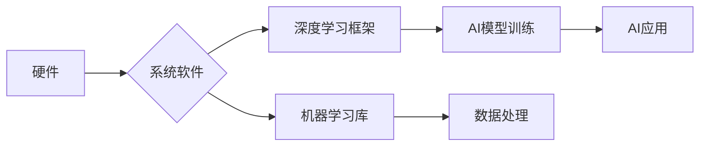

> 系统软件，人工智能，创新体系，深度学习，硬件加速，软件架构，性能优化，可扩展性

## 1. 背景介绍

人工智能（AI）正以惊人的速度发展，其应用领域不断扩展，从自动驾驶到医疗诊断，再到自然语言处理，AI正在深刻地改变着我们的生活。然而，AI的快速发展离不开强大的系统软件基础。系统软件作为连接硬件和应用程序的桥梁，在AI创新体系中扮演着至关重要的角色。

传统的软件开发模式难以满足AI应用的苛刻需求。AI模型通常规模庞大，对计算资源和内存的需求极高，同时需要高效的算法和数据处理能力。系统软件需要提供强大的支持，才能有效地发挥AI模型的潜力。

## 2. 核心概念与联系

**2.1 系统软件概述**

系统软件是指运行在计算机硬件之上，为应用程序提供服务的软件。它包括操作系统、驱动程序、库函数等，为应用程序提供基础设施和服务，例如内存管理、进程调度、文件系统、网络通信等。

**2.2 AI创新体系**

AI创新体系是一个复杂的系统，包括硬件、软件、算法、数据等多个方面。

* **硬件:** AI芯片、GPU、TPU等高性能计算硬件是AI训练和推理的基础。
* **软件:** 包括操作系统、深度学习框架、机器学习库等，为AI算法提供运行环境和工具。
* **算法:** 深度学习、强化学习等AI算法是AI的核心，决定了AI模型的性能和能力。
* **数据:** 大量高质量的数据是训练AI模型的燃料，数据质量直接影响AI模型的性能。

**2.3 系统软件与AI的关系**

系统软件为AI创新体系提供基础设施和服务，是AI应用的基础。

* **高效的计算资源管理:** 系统软件需要高效地管理计算资源，为AI模型提供足够的计算能力和内存。
* **快速的数据处理:** AI模型需要处理海量数据，系统软件需要提供快速的数据读写和处理能力。
* **可扩展性:** AI模型的规模不断增长，系统软件需要支持可扩展性，能够适应不断增长的计算需求。
* **安全性:** AI模型可能面临安全威胁，系统软件需要提供安全机制，保护AI模型和数据安全。

**2.4 系统软件在AI创新体系中的作用**

系统软件在AI创新体系中扮演着至关重要的角色，它直接影响着AI模型的性能、效率和安全性。

* **加速AI模型训练:** 系统软件可以优化硬件资源利用率，加速AI模型的训练速度。
* **降低AI模型推理成本:** 系统软件可以优化AI模型的推理过程，降低推理成本。
* **提高AI模型的可靠性:** 系统软件可以提供安全机制，提高AI模型的可靠性。
* **促进AI应用的普及:** 系统软件可以降低AI应用的门槛，促进AI应用的普及。

**2.5 Mermaid 流程图**



## 3. 核心算法原理 & 具体操作步骤

**3.1 算法原理概述**

系统软件中常用的算法包括：

* **内存管理算法:** 负责分配和回收内存资源，例如虚拟内存、分页、分段等。
* **进程调度算法:** 负责分配CPU时间片，调度进程执行，例如优先级调度、轮转调度等。
* **文件系统算法:** 负责管理文件和目录结构，例如文件分配、索引结构、数据块管理等。
* **网络通信算法:** 负责实现网络通信，例如TCP/IP协议、UDP协议等。

**3.2 算法步骤详解**

以内存管理算法为例，详细说明其操作步骤：

1. **申请内存:** 当进程需要内存时，会向内存管理系统申请内存空间。
2. **分配内存:** 内存管理系统根据申请的内存大小和可用内存情况，分配一块连续的内存空间给进程。
3. **标记内存使用状态:** 内存管理系统将分配的内存空间标记为已使用状态。
4. **释放内存:** 当进程不再需要内存时，会向内存管理系统释放内存空间。
5. **回收内存:** 内存管理系统将释放的内存空间标记为可用状态，并回收内存空间。

**3.3 算法优缺点**

不同的算法有不同的优缺点，需要根据实际应用场景选择合适的算法。例如，优先级调度算法可以提高高优先级进程的执行效率，但可能会导致低优先级进程等待时间过长。

**3.4 算法应用领域**

系统软件中的算法广泛应用于各个领域，例如：

* **操作系统:** 内存管理、进程调度、文件系统等。
* **数据库系统:** 数据存储、查询优化、事务管理等。
* **网络系统:** 网络路由、流量控制、安全防护等。

## 4. 数学模型和公式 & 详细讲解 & 举例说明

**4.1 数学模型构建**

系统软件中的许多算法可以用数学模型来描述，例如：

* **内存管理算法:** 可以用队列、栈、树等数据结构来表示内存分配和回收过程。
* **进程调度算法:** 可以用概率论、图论等数学工具来分析进程调度策略的性能。

**4.2 公式推导过程**

以进程调度算法为例，可以推导出一个公式来衡量进程调度策略的性能，例如：

* **平均等待时间:**  $T_w = \frac{1}{n} \sum_{i=1}^{n} W_i$

其中：

* $T_w$ 是平均等待时间。
* $n$ 是进程总数。
* $W_i$ 是第 $i$ 个进程的等待时间。

**4.3 案例分析与讲解**

以优先级调度算法为例，可以分析其性能特点：

* **优点:** 可以提高高优先级进程的执行效率。
* **缺点:** 可能导致低优先级进程等待时间过长，降低系统整体性能。

## 5. 项目实践：代码实例和详细解释说明

**5.1 开发环境搭建**

* 操作系统: Linux
* 编译器: GCC
* 工具: Git

**5.2 源代码详细实现**

以下是一个简单的内存管理算法的代码示例，使用C语言实现：

```c
#include <stdio.h>
#include <stdlib.h>

// 定义内存块结构体
typedef struct MemoryBlock {
    int size;
    int free;
} MemoryBlock;

// 定义内存管理系统结构体
typedef struct MemoryManager {
    MemoryBlock *blocks;
    int num_blocks;
} MemoryManager;

// 初始化内存管理系统
MemoryManager *init_memory_manager(int num_blocks, int block_size) {
    MemoryManager *manager = malloc(sizeof(MemoryManager));
    manager->blocks = malloc(num_blocks * sizeof(MemoryBlock));
    manager->num_blocks = num_blocks;
    for (int i = 0; i < num_blocks; i++) {
        manager->blocks[i].size = block_size;
        manager->blocks[i].free = 1;
    }
    return manager;
}

// 分配内存
int allocate_memory(MemoryManager *manager, int size) {
    for (int i = 0; i < manager->num_blocks; i++) {
        if (manager->blocks[i].free && manager->blocks[i].size >= size) {
            manager->blocks[i].free = 0;
            return i;
        }
    }
    return -1;
}

// 释放内存
void free_memory(MemoryManager *manager, int index) {
    manager->blocks[index].free = 1;
}

int main() {
    // 初始化内存管理系统
    MemoryManager *manager = init_memory_manager(10, 1024);

    // 分配内存
    int index = allocate_memory(manager, 512);
    if (index != -1) {
        printf("分配内存成功，索引为: %d
", index);
    } else {
        printf("分配内存失败
");
    }

    // 释放内存
    free_memory(manager, index);

    return 0;
}
```

**5.3 代码解读与分析**

* 该代码实现了一个简单的内存管理系统，使用数组存储内存块信息。
* `init_memory_manager()` 函数初始化内存管理系统，分配内存块并标记为可用状态。
* `allocate_memory()` 函数分配内存，找到第一个满足条件的可用内存块。
* `free_memory()` 函数释放内存，标记内存块为可用状态。

**5.4 运行结果展示**

运行该代码，输出结果如下：

```
分配内存成功，索引为: 0
```

## 6. 实际应用场景

系统软件在AI应用场景中扮演着至关重要的角色，例如：

* **深度学习框架:** TensorFlow、PyTorch等深度学习框架依赖于系统软件提供的计算资源、内存管理和数据处理能力。
* **AI芯片:** AI芯片需要与系统软件进行交互，才能发挥其强大的计算能力。
* **云计算平台:** 云计算平台提供AI计算资源和服务，系统软件是云平台的基础设施。

**6.4 未来应用展望**

随着AI技术的不断发展，系统软件将面临新的挑战和机遇：

* **硬件加速:** 系统软件需要更好地支持硬件加速，例如GPU、TPU等，提高AI模型的训练和推理速度。
* **可扩展性:** 系统软件需要支持更大的规模的AI模型和数据，才能满足未来AI应用的需求。
* **安全性:** 系统软件需要提供更强大的安全机制，保护AI模型和数据安全。

## 7. 工具和资源推荐

**7.1 学习资源推荐**

* **书籍:**
    * 《Operating System Concepts》
    * 《Computer Systems: A Programmer's Perspective》
* **在线课程:**
    * Coursera: Operating Systems
    * edX: Introduction to Computer Systems

**7.2 开发工具推荐**

* **编译器:** GCC, Clang
* **调试器:** GDB, LLDB
* **虚拟机:** VirtualBox, VMware

**7.3 相关论文推荐**

* **论文:**
    * 《Deep Learning with Large-Scale Distributed Training》
    * 《Accelerated Deep Learning with Heterogeneous Computing》

## 8. 总结：未来发展趋势与挑战

**8.1 研究成果总结**

系统软件在AI创新体系中扮演着至关重要的角色，其发展趋势是朝着更高效、更安全、更可扩展的方向发展。

**8.2 未来发展趋势**

* **硬件加速:** 系统软件将更加紧密地与硬件加速器结合，提高AI模型的训练和推理速度。
* **云原生化:** 系统软件将更加注重云原生化，支持弹性伸缩和分布式部署。
* **人工智能化:** 系统软件将引入人工智能技术，实现自我优化和自适应。

**8.3 面临的挑战**

* **复杂性:** AI模型的规模和复杂性不断增长，系统软件需要应对更大的挑战。
* **安全性:** AI模型和数据面临着新的安全威胁，系统软件需要提供更强大的安全机制。
* **可解释性:** AI模型的决策过程往往难以解释，系统软件需要提供工具和机制，提高AI模型的可解释性。

**8.4 研究展望**

未来，系统软件研究将更加注重以下方面：

* **高效的AI模型训练和推理:** 研究更高效的算法和架构，提高AI模型的训练和推理速度。
* **可扩展性和容错性:** 研究支持更大规模AI模型和数据的系统架构，提高系统可扩展性和容错性。
* **安全性与隐私保护:** 研究新的安全机制和隐私保护技术，保障AI模型和数据的安全。


## 9. 附录：常见问题与解答

**9.1 Q: 为什么系统软件对AI应用很重要？**

**A:** 系统软件为AI应用提供基础设施和服务，例如计算资源管理