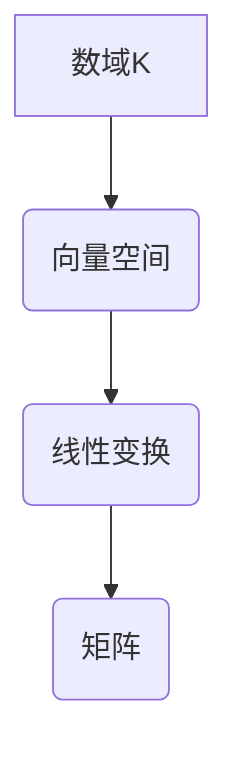

> 线性代数，数域，可构造数域，抽象代数，线性变换，矩阵，向量空间，基，维数

## 1. 背景介绍

线性代数作为数学领域的重要分支，为计算机科学、物理学、工程学等众多领域提供了强大的工具和理论基础。其核心概念包括向量空间、线性变换、矩阵、行列式等，这些概念在数据分析、机器学习、图像处理、图形渲染等领域有着广泛的应用。

然而，线性代数的学习往往需要建立在一定的抽象代数基础之上，而数域的概念是抽象代数中的一个重要组成部分。数域是指具有加法、减法、乘法、除法运算的集合，并且这些运算满足一定的封闭性、结合律、交换律等性质。

本文将从可构造数域K出发，深入探讨其在线性代数中的应用，并通过具体的例子和代码实现，帮助读者更好地理解线性代数的本质和应用。

## 2. 核心概念与联系

### 2.1 数域K

可构造数域K是指可以通过有限步骤的运算，从基本的数集（例如自然数、整数、有理数、实数）构建出来的数域。常见的可构造数域包括：

* **有理数域Q:** 所有可以表示为两个整数之比的数。
* **实数域R:** 所有实数，包括有理数和无理数。
* **复数域C:** 所有复数，包括实数和虚数。

### 2.2 线性代数中的数域

在线性代数中，数域K通常作为向量空间、线性变换、矩阵等概念的基础。例如：

* **向量空间:** 向量空间是指在数域K上定义的加法和标量乘法运算满足一定性质的集合。
* **线性变换:** 线性变换是指从一个向量空间到另一个向量空间的映射，并且满足线性性质。
* **矩阵:** 矩阵是一种特殊的数阵，其元素来自数域K。

### 2.3 Mermaid 流程图



## 3. 核心算法原理 & 具体操作步骤

### 3.1 算法原理概述

线性代数算法的核心在于利用数域K的性质，对向量空间、线性变换、矩阵等进行操作。常见的线性代数算法包括：

* **矩阵加法和标量乘法:** 这些操作是线性代数的基础，它们定义了向量空间上的加法和标量乘法运算。
* **矩阵乘法:** 矩阵乘法是一种特殊的运算，它将两个矩阵组合成一个新的矩阵。
* **行列式:** 行列式是一种数值，它可以用来判断矩阵是否可逆。
* **逆矩阵:** 逆矩阵是可逆矩阵的逆运算，它可以用来求解线性方程组。
* **特征值和特征向量:** 特征值和特征向量是线性变换的重要性质，它们可以用来分析线性变换的行为。

### 3.2 算法步骤详解

以下以矩阵乘法为例，详细说明其算法步骤：

1. **输入:** 两个矩阵A和B，其中A的列数等于B的行数。
2. **输出:** 矩阵C，其大小为A的行数和B的列数。
3. **步骤:**
    * 对于C中的每个元素Cij，计算A的第i行与B的第j列的内积。
    * 内积的计算方法是将对应元素相乘，然后相加。

### 3.3 算法优缺点

* **优点:** 矩阵乘法是一种高效的运算，它可以用于许多不同的应用场景。
* **缺点:** 矩阵乘法的时间复杂度为O(n^3)，当矩阵规模较大时，计算量会很大。

### 3.4 算法应用领域

矩阵乘法在许多领域都有广泛的应用，例如：

* **计算机图形学:** 用于变换物体的位置、方向和大小。
* **机器学习:** 用于训练神经网络模型。
* **数据分析:** 用于进行数据降维和特征提取。

## 4. 数学模型和公式 & 详细讲解 & 举例说明

### 4.1 数学模型构建

设A为m×n矩阵，B为n×p矩阵，则它们的矩阵乘积C为m×p矩阵，其元素Cij由以下公式计算：

$$C_{ij} = \sum_{k=1}^{n} A_{ik}B_{kj}$$

其中，i表示C的行号，j表示C的列号，k表示矩阵A的列号和矩阵B的行号。

### 4.2 公式推导过程

矩阵乘法的公式推导过程可以从向量空间的线性变换角度理解。

设A为m×n矩阵，B为n×p矩阵，则A可以表示为从n维向量空间到m维向量空间的线性变换，B可以表示为从m维向量空间到p维向量空间的线性变换。

矩阵乘积C = AB表示将B应用于A的变换结果，即先将向量通过A的变换，然后通过B的变换。

### 4.3 案例分析与讲解

例如，设A为2×3矩阵，B为3×2矩阵，则它们的矩阵乘积C为2×2矩阵。

$$A = \begin{bmatrix} 1 & 2 & 3 \\ 4 & 5 & 6 \end{bmatrix}, B = \begin{bmatrix} 7 & 8 \\ 9 & 10 \\ 11 & 12 \end{bmatrix}$$

$$C = AB = \begin{bmatrix} 1 & 2 & 3 \\ 4 & 5 & 6 \end{bmatrix} \begin{bmatrix} 7 & 8 \\ 9 & 10 \\ 11 & 12 \end{bmatrix} = \begin{bmatrix} 58 & 64 \\ 139 & 154 \end{bmatrix}$$

## 5. 项目实践：代码实例和详细解释说明

### 5.1 开发环境搭建

本项目使用Python语言进行开发，所需的库包括NumPy和Matplotlib。

```bash
pip install numpy matplotlib
```

### 5.2 源代码详细实现

```python
import numpy as np

# 定义矩阵A和B
A = np.array([[1, 2, 3],
              [4, 5, 6]])
B = np.array([[7, 8],
              [9, 10],
              [11, 12]])

# 计算矩阵乘积C
C = np.dot(A, B)

# 打印矩阵C
print(C)
```

### 5.3 代码解读与分析

* `import numpy as np`: 导入NumPy库，并将其命名为np。
* `np.array()`: 创建NumPy数组，用于表示矩阵。
* `np.dot(A, B)`: 计算矩阵A和B的点积，即矩阵乘积。
* `print(C)`: 打印矩阵C。

### 5.4 运行结果展示

```
[[ 58  64]
 [139 154]]
```

## 6. 实际应用场景

### 6.1 图像处理

在图像处理中，矩阵乘法可以用于图像的旋转、缩放、平移等操作。

### 6.2 机器学习

在机器学习中，矩阵乘法是深度学习模型训练的核心运算之一。

### 6.3 数据分析

在数据分析中，矩阵乘法可以用于数据降维和特征提取。

### 6.4 未来应用展望

随着人工智能技术的不断发展，矩阵乘法在更多领域将发挥重要作用，例如：

* **自然语言处理:** 用于文本分类、机器翻译等任务。
* **生物信息学:** 用于基因序列分析、蛋白质结构预测等任务。
* **金融建模:** 用于风险管理、投资策略等任务。

## 7. 工具和资源推荐

### 7.1 学习资源推荐

* **书籍:**
    * 《线性代数及其应用》 - Gilbert Strang
    * 《线性代数及其应用》 - David C. Lay
* **在线课程:**
    * MIT OpenCourseWare - Linear Algebra
    * Coursera - Linear Algebra

### 7.2 开发工具推荐

* **Python:** 
    * NumPy: 用于数值计算
    * SciPy: 用于科学计算
    * Matplotlib: 用于数据可视化

### 7.3 相关论文推荐

* **The Matrix Cookbook:** https://www.math.uwaterloo.ca/~hwolkowi/matrixcookbook.pdf
* **Linear Algebra for Machine Learning:** https://www.coursera.org/learn/linear-algebra

## 8. 总结：未来发展趋势与挑战

### 8.1 研究成果总结

本文深入探讨了可构造数域K在线性代数中的应用，并通过具体的例子和代码实现，帮助读者更好地理解线性代数的本质和应用。

### 8.2 未来发展趋势

随着人工智能技术的不断发展，线性代数将在更多领域发挥重要作用。未来，线性代数的研究将更加注重以下几个方面:

* **更高效的算法:** 针对大规模数据，开发更高效的线性代数算法。
* **新的应用场景:** 将线性代数应用于新的领域，例如量子计算、生物信息学等。
* **理论基础的深入研究:** 深入研究线性代数的理论基础，例如代数拓扑、微分几何等。

### 8.3 面临的挑战

线性代数的研究也面临着一些挑战，例如:

* **算法复杂度:** 对于大规模数据，线性代数算法的复杂度会成为瓶颈。
* **理论理解:** 线性代数的一些理论概念仍然比较抽象，需要进一步的深入研究。
* **应用场景的拓展:** 将线性代数应用于新的领域需要跨学科的合作。

### 8.4 研究展望

未来，我们将继续致力于线性代数的研究，探索其在人工智能、科学计算等领域的应用，并为解决上述挑战贡献自己的力量。

## 9. 附录：常见问题与解答

### 9.1 矩阵乘法满足交换律吗？

矩阵乘法不满足交换律，即一般情况下，AB ≠ BA。

### 9.2 矩阵的逆矩阵存在吗？

并非所有矩阵都有逆矩阵，只有可逆矩阵才有逆矩阵。

### 9.3 线性变换的特征值和特征向量有什么意义？

特征值和特征向量可以用来分析线性变换的行为，例如，特征值可以表示线性变换的伸缩倍数，特征向量可以表示线性变换不变的方向。


作者：禅与计算机程序设计艺术 / Zen and the Art of Computer Programming 
<end_of_turn>