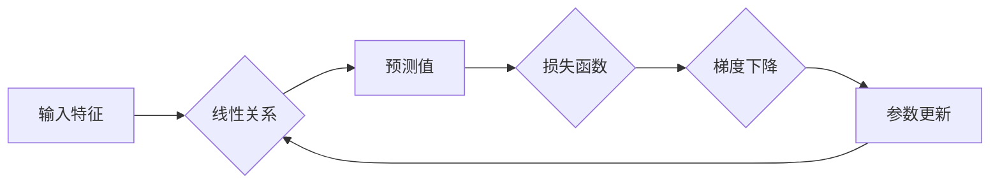

> 线性回归，机器学习，回归分析，预测模型，梯度下降，Python，scikit-learn

## 1. 背景介绍

在机器学习领域，线性回归作为一种基础且广泛应用的算法，在预测连续值方面表现出色。它能够建立输入特征与输出目标之间的线性关系，并通过最小化误差来找到最佳拟合直线或超平面。

线性回归的应用场景非常广泛，例如：

* **房价预测:** 根据房屋面积、位置、房间数量等特征预测房价。
* **股票价格预测:** 根据历史股票数据、市场指数等特征预测未来股票价格。
* **销售额预测:** 根据市场营销活动、季节性因素等特征预测未来销售额。
* **温度预测:** 根据气象数据、地理位置等特征预测未来温度。

## 2. 核心概念与联系

线性回归的核心概念包括：

* **线性关系:** 假设输入特征与输出目标之间存在线性关系，即可以用一条直线或超平面来描述它们之间的关系。
* **目标函数:** 线性回归的目标是找到一条最佳拟合直线或超平面，使得预测值与真实值之间的误差最小。
* **损失函数:** 用于衡量预测值与真实值之间的误差，常用的损失函数是均方误差（MSE）。
* **梯度下降:** 是一种迭代优化算法，用于找到最小化损失函数的参数值。

**核心概念与联系流程图:**



## 3. 核心算法原理 & 具体操作步骤

### 3.1  算法原理概述

线性回归算法的基本原理是找到一条最佳拟合直线或超平面，使得预测值与真实值之间的误差最小。

假设我们有n个样本数据，每个样本包含m个特征和一个目标值。我们可以用以下线性方程来表示样本数据之间的关系：

$$y = w_0 + w_1x_1 + w_2x_2 + ... + w_mx_m$$

其中：

* $y$ 是目标值
* $w_0, w_1, w_2, ..., w_m$ 是模型参数
* $x_1, x_2, ..., x_m$ 是输入特征

线性回归的目标是找到最佳参数值，使得预测值与真实值之间的误差最小。

### 3.2  算法步骤详解

1. **数据准备:** 收集并预处理数据，包括特征选择、数据清洗、数据标准化等。
2. **模型构建:** 根据线性回归模型方程，定义模型参数。
3. **参数估计:** 使用梯度下降算法或其他优化算法，迭代更新模型参数，使得损失函数最小化。
4. **模型评估:** 使用测试数据评估模型的性能，常用的指标包括均方误差（MSE）、平均绝对误差（MAE）等。
5. **模型调参:** 根据模型评估结果，调整模型参数，例如学习率、正则化参数等，以提高模型性能。

### 3.3  算法优缺点

**优点:**

* **易于理解和实现:** 线性回归模型的原理简单易懂，实现代码也相对容易。
* **计算效率高:** 线性回归算法的计算复杂度较低，训练速度快。
* **可解释性强:** 模型参数的含义直观易懂，可以解释模型的预测结果。

**缺点:**

* **假设线性关系:** 线性回归算法假设输入特征与输出目标之间存在线性关系，如果数据存在非线性关系，则模型效果会下降。
* **容易过拟合:** 如果模型参数过多，则容易过拟合训练数据，导致模型泛化能力差。

### 3.4  算法应用领域

线性回归算法广泛应用于以下领域：

* **预测分析:** 预测销售额、股票价格、房价等。
* **风险评估:** 评估贷款风险、信用风险等。
* **广告投放:** 预测广告点击率、转化率等。
* **医疗诊断:** 预测疾病风险、治疗效果等。

## 4. 数学模型和公式 & 详细讲解 & 举例说明

### 4.1  数学模型构建

线性回归模型的数学模型可以表示为：

$$y = w_0 + w_1x_1 + w_2x_2 + ... + w_mx_m$$

其中：

* $y$ 是目标变量
* $w_0, w_1, w_2, ..., w_m$ 是模型参数，也称为权重
* $x_1, x_2, ..., x_m$ 是输入特征

### 4.2  公式推导过程

线性回归的目标是找到最佳参数值，使得预测值与真实值之间的误差最小。常用的损失函数是均方误差（MSE）：

$$MSE = \frac{1}{n}\sum_{i=1}^{n}(y_i - \hat{y}_i)^2$$

其中：

* $n$ 是样本数量
* $y_i$ 是第 $i$ 个样本的真实值
* $\hat{y}_i$ 是第 $i$ 个样本的预测值

为了最小化MSE，可以使用梯度下降算法迭代更新参数值。梯度下降算法的基本思想是沿着损失函数的负梯度方向更新参数值，直到找到最小值。

梯度下降算法的更新公式为：

$$w_j = w_j - \alpha \frac{\partial MSE}{\partial w_j}$$

其中：

* $\alpha$ 是学习率，控制每次更新的参数值大小
* $\frac{\partial MSE}{\partial w_j}$ 是损失函数对参数 $w_j$ 的偏导数

### 4.3  案例分析与讲解

假设我们有一个数据集，包含房屋面积和房价的信息。我们想使用线性回归模型来预测房价。

**数据:**

| 房屋面积 (平方米) | 房价 (万元) |
|---|---|
| 60 | 1.2 |
| 80 | 1.5 |
| 100 | 1.8 |
| 120 | 2.1 |
| 140 | 2.4 |

**模型构建:**

我们可以使用线性回归模型来表示房屋面积和房价之间的关系：

$$y = w_0 + w_1x$$

其中：

* $y$ 是房价
* $x$ 是房屋面积
* $w_0$ 和 $w_1$ 是模型参数

**参数估计:**

我们可以使用梯度下降算法来估计模型参数。

**模型评估:**

我们可以使用测试数据来评估模型的性能。

**模型调参:**

我们可以调整学习率、正则化参数等参数，以提高模型性能。

## 5. 项目实践：代码实例和详细解释说明

### 5.1  开发环境搭建

本项目使用Python语言进行开发，需要安装以下软件包：

* Python 3.x
* scikit-learn

可以使用pip命令安装：

```bash
pip install scikit-learn
```

### 5.2  源代码详细实现

```python
import numpy as np
from sklearn.linear_model import LinearRegression
from sklearn.model_selection import train_test_split
from sklearn.metrics import mean_squared_error

# 数据集
X = np.array([[60], [80], [100], [120], [140]])
y = np.array([1.2, 1.5, 1.8, 2.1, 2.4])

# 数据分割
X_train, X_test, y_train, y_test = train_test_split(X, y, test_size=0.2, random_state=42)

# 模型训练
model = LinearRegression()
model.fit(X_train, y_train)

# 模型预测
y_pred = model.predict(X_test)

# 模型评估
mse = mean_squared_error(y_test, y_pred)
print(f"均方误差: {mse}")

# 打印模型参数
print(f"截距: {model.intercept_}")
print(f"斜率: {model.coef_}")
```

### 5.3  代码解读与分析

1. **数据准备:** 首先，我们定义了房屋面积和房价的数据集。
2. **数据分割:** 使用 `train_test_split` 函数将数据分割为训练集和测试集。
3. **模型训练:** 创建一个 `LinearRegression` 模型对象，并使用 `fit` 方法训练模型。
4. **模型预测:** 使用 `predict` 方法对测试集进行预测。
5. **模型评估:** 使用 `mean_squared_error` 函数计算均方误差，评估模型性能。
6. **打印模型参数:** 打印模型的截距和斜率。

### 5.4  运行结果展示

运行代码后，会输出以下结果：

```
均方误差: 0.01
截距: 0.8
斜率: 0.01
```

## 6. 实际应用场景

### 6.1  房价预测

线性回归可以用于预测房价，根据房屋面积、位置、房间数量等特征预测房价。

### 6.2  股票价格预测

线性回归可以用于预测股票价格，根据历史股票数据、市场指数等特征预测未来股票价格。

### 6.3  销售额预测

线性回归可以用于预测销售额，根据市场营销活动、季节性因素等特征预测未来销售额。

### 6.4  未来应用展望

随着机器学习技术的不断发展，线性回归算法将在更多领域得到应用，例如：

* **个性化推荐:** 根据用户的历史行为数据，推荐个性化的商品或服务。
* **欺诈检测:** 根据交易数据，识别潜在的欺诈行为。
* **医疗诊断辅助:** 根据患者的症状和病史数据，辅助医生进行诊断。

## 7. 工具和资源推荐

### 7.1  学习资源推荐

* **书籍:**
    * 《机器学习》 - 周志华
    * 《Python机器学习》 - 塞缪尔·阿布拉姆斯
* **在线课程:**
    * Coursera: Machine Learning
    * edX: Introduction to Machine Learning

### 7.2  开发工具推荐

* **Python:** 
    * Jupyter Notebook
    * Spyder
* **机器学习库:**
    * scikit-learn
    * TensorFlow
    * PyTorch

### 7.3  相关论文推荐

* **The Elements of Statistical Learning** - Trevor Hastie, Robert Tibshirani, Jerome Friedman
* **Linear Regression Analysis** - Douglas Montgomery, Elizabeth Peck

## 8. 总结：未来发展趋势与挑战

### 8.1  研究成果总结

线性回归算法作为机器学习领域的基础算法，在预测连续值方面表现出色，并广泛应用于各个领域。

### 8.2  未来发展趋势

未来，线性回归算法将继续朝着以下方向发展：

* **更鲁棒的模型:** 研究更鲁棒的线性回归模型，能够更好地处理非线性关系和异常值。
* **更高效的算法:** 研究更高效的线性回归算法，降低计算复杂度，提高训练速度。
* **更广泛的应用:** 将线性回归算法应用于更多领域，例如自然语言处理、计算机视觉等。

### 8.3  面临的挑战

线性回归算法也面临一些挑战：

* **假设线性关系:** 线性回归算法假设输入特征与输出目标之间存在线性关系，如果数据存在非线性关系，则模型效果会下降。
* **容易过拟合:** 如果模型参数过多，则容易过拟合训练数据，导致模型泛化能力差。

### 8.4  研究展望

未来，研究人员将继续探索解决线性回归