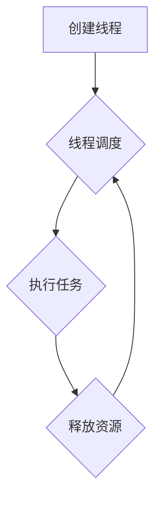

> 线程管理，高吞吐量，并发编程，性能优化，多核处理，操作系统，进程调度

## 1. 背景介绍

在现代软件开发中，高吞吐量和低延迟已成为许多应用的核心需求。随着硬件性能的不断提升，多核处理器成为主流，充分利用多核资源成为实现高吞吐量的关键。线程管理作为并发编程的核心技术，在高吞吐量应用中扮演着至关重要的角色。

传统的单线程程序只能一次执行一个任务，这在处理大量并发请求时效率低下。线程管理技术允许程序同时执行多个任务，从而提高资源利用率和整体性能。

## 2. 核心概念与联系

### 2.1 线程的概念

线程是程序执行的最小单位，它拥有自己的独立执行栈和局部变量，可以独立执行代码。与进程相比，线程共享进程的资源，例如内存空间和文件描述符，因此创建和销毁线程比创建和销毁进程更加轻量级。

### 2.2 线程模型

常见的线程模型包括：

* **用户级线程模型:** 由应用程序直接管理线程，操作系统不参与线程调度。
* **内核级线程模型:** 操作系统负责线程的调度和管理，应用程序通过系统调用与操作系统交互。

### 2.3 线程调度

线程调度是指操作系统根据一定的策略选择并运行线程。常见的调度算法包括：

* **时间片轮转:** 将处理器时间分配给每个线程，每个线程在时间片内执行，然后轮流切换。
* **优先级调度:** 根据线程的优先级决定线程的运行顺序，优先级高的线程优先获得处理器时间。

### 2.4 线程同步与通信

当多个线程访问共享资源时，需要进行同步和通信，以避免数据竞争和不一致性。常见的同步机制包括：

* **互斥锁:** 确保只有一个线程可以同时访问共享资源。
* **条件变量:** 允许线程等待特定条件的满足。
* **信号量:** 控制对共享资源的访问权限。

**Mermaid 流程图**



## 3. 核心算法原理 & 具体操作步骤

### 3.1 算法原理概述

高吞吐量应用中常用的线程管理算法包括：

* **多线程池:** 创建一个固定大小的线程池，用于处理并发请求。
* **工作窃取:** 线程池中的线程之间共享任务队列，当一个线程完成任务时，可以从其他线程的任务队列中窃取任务。
* **异步编程:** 使用异步机制处理任务，避免阻塞主线程，提高吞吐量。

### 3.2 算法步骤详解

**多线程池算法步骤:**

1. 创建一个固定大小的线程池。
2. 当有新的请求到来时，将请求添加到任务队列中。
3. 线程池中的线程从任务队列中获取任务并执行。
4. 线程执行完成后，将结果返回给请求者。

**工作窃取算法步骤:**

1. 创建一个线程池和多个任务队列。
2. 每个线程从自己的任务队列中获取任务执行。
3. 当一个线程完成任务时，它会检查其他线程的任务队列，如果队列中有任务，则窃取任务执行。

**异步编程算法步骤:**

1. 使用异步机制将任务提交给操作系统或其他线程池。
2. 主线程继续执行其他任务，等待异步任务完成。
3. 当异步任务完成时，会回调主线程处理结果。

### 3.3 算法优缺点

**多线程池算法:**

* **优点:** 容易实现，管理简单，可控制线程数量。
* **缺点:** 线程创建和销毁成本较高，线程池大小难以确定。

**工作窃取算法:**

* **优点:** 提高了资源利用率，减少了线程空闲时间。
* **缺点:** 增加了算法复杂度，可能导致线程竞争。

**异步编程算法:**

* **优点:** 提高了吞吐量，避免了阻塞主线程。
* **缺点:** 代码复杂度较高，需要处理回调函数。

### 3.4 算法应用领域

* **Web服务器:** 处理大量并发请求。
* **数据库系统:** 并行处理查询和更新操作。
* **游戏服务器:** 处理玩家操作和游戏逻辑。
* **科学计算:** 并行计算和数据分析。

## 4. 数学模型和公式 & 详细讲解 & 举例说明

### 4.1 数学模型构建

假设一个系统有 N 个处理器，每个处理器可以同时执行一个任务。系统中有 M 个任务需要执行。

我们可以用以下数学模型来描述系统吞吐量：

* **吞吐量 (Throughput):** 每单位时间内完成的任务数量。
* **任务执行时间 (Task Execution Time):** 每个任务执行所需的时间。

吞吐量可以表示为：

$$Throughput = \frac{M}{Total Execution Time}$$

### 4.2 公式推导过程

总执行时间可以表示为：

$$Total Execution Time = \frac{M}{N}$$

因为每个处理器可以同时执行一个任务，所以总执行时间等于所有任务执行时间的总和除以处理器数量。

将总执行时间代入吞吐量公式，得到：

$$Throughput = \frac{M}{\frac{M}{N}} = N$$

### 4.3 案例分析与讲解

假设一个系统有 4 个处理器，需要执行 10 个任务，每个任务执行时间为 1 秒。

根据公式推导，系统吞吐量为：

$$Throughput = 4$$

这意味着系统每秒可以完成 4 个任务。

## 5. 项目实践：代码实例和详细解释说明

### 5.1 开发环境搭建

* 操作系统: Linux
* 编程语言: Python
* 线程库: threading

### 5.2 源代码详细实现

```python
import threading
import time

# 任务函数
def task(name):
    print(f"任务 {name} 开始执行")
    time.sleep(2)
    print(f"任务 {name} 执行完成")

# 创建线程池
thread_pool = []
for i in range(5):
    thread = threading.Thread(target=task, args=(i,))
    thread_pool.append(thread)

# 启动线程池
for thread in thread_pool:
    thread.start()

# 等待所有线程完成
for thread in thread_pool:
    thread.join()

print("所有任务已完成")
```

### 5.3 代码解读与分析

* 代码首先定义了一个任务函数 `task`，该函数模拟执行一个任务。
* 然后创建了一个线程池 `thread_pool`，并为每个线程分配一个任务。
* 使用 `threading.Thread` 创建线程对象，并将任务函数和参数传递给 `target` 参数。
* 使用 `thread.start()` 启动线程。
* 使用 `thread.join()` 等待所有线程完成执行。

### 5.4 运行结果展示

```
任务 0 开始执行
任务 1 开始执行
任务 2 开始执行
任务 3 开始执行
任务 4 开始执行
任务 0 执行完成
任务 1 执行完成
任务 2 执行完成
任务 3 执行完成
任务 4 执行完成
所有任务已完成
```

## 6. 实际应用场景

### 6.1 Web服务器

高吞吐量Web服务器通常使用多线程池来处理并发请求。每个线程负责处理一个请求，从而提高服务器的响应速度和处理能力。

### 6.2 数据库系统

数据库系统中，多线程可以用于并行处理查询和更新操作，提高数据库的性能和吞吐量。

### 6.3 游戏服务器

游戏服务器需要处理大量的玩家操作和游戏逻辑，多线程可以帮助游戏服务器提高响应速度和处理能力，提供流畅的游戏体验。

### 6.4 未来应用展望

随着云计算和大数据的发展，高吞吐量应用的需求将更加迫切。线程管理技术将继续发展，并与其他技术，例如容器化和微服务架构，相结合，以实现更高的性能和可扩展性。

## 7. 工具和资源推荐

### 7.1 学习资源推荐

* **《深入理解Java虚拟机》:** 深入了解Java虚拟机和线程管理机制。
* **《操作系统导论》:** 学习操作系统基础知识，包括进程调度和线程管理。
* **《并发编程艺术》:** 学习并发编程的最佳实践和常见问题。

### 7.2 开发工具推荐

* **Visual Studio Code:** 轻量级、功能强大的代码编辑器。
* **IntelliJ IDEA:** 专业的Java IDE，提供强大的代码分析和调试功能。
* **Eclipse:** 开源的Java IDE，功能丰富，支持多种编程语言。

### 7.3 相关论文推荐

* **"The Art of Multiprocessor Programming" by Maurice Herlihy and Nir Shavit:** 
* **"Concurrent Programming in Java" by Brian Goetz:**

## 8. 总结：未来发展趋势与挑战

### 8.1 研究成果总结

线程管理技术在高吞吐量应用中发挥着至关重要的作用。多线程池、工作窃取和异步编程等算法为提高吞吐量提供了有效的方法。

### 8.2 未来发展趋势

* **更智能的线程调度算法:** 基于机器学习和人工智能的线程调度算法，能够更智能地分配资源，提高吞吐量。
* **更强大的并发编程工具:** 更强大的并发编程工具和框架，能够帮助开发人员更轻松地编写高性能的并发程序。
* **多核处理器的进一步发展:** 随着多核处理器的不断发展，线程管理技术将面临新的挑战和机遇。

### 8.3 面临的挑战

* **线程安全问题:** 并发编程容易导致线程安全问题，需要开发人员更加注重线程同步和通信机制。
* **性能优化问题:** 复杂的并发程序难以优化，需要开发人员具备深入的性能分析和调优能力。
* **可维护性问题:** 并发程序的代码结构复杂，难以维护和调试。

### 8.4 研究展望

未来，线程管理技术将继续朝着更智能、更高效、更易于使用的方向发展。研究人员将继续探索新的算法和工具，以解决并发编程中的挑战，并为高吞吐量应用提供更强大的支持。

## 9. 附录：常见问题与解答

### 9.1 什么是死锁？

死锁是指两个或多个线程互相等待对方释放资源，导致所有线程都处于阻塞状态。

### 9.2 如何避免死锁？

* 使用互斥锁或信号量来控制资源访问。
* 采用资源分配顺序规则，确保资源分配的顺序一致。
* 使用死锁检测和恢复机制。

### 9.3 什么是线程饥饿？

线程饥饿是指某个线程长时间无法获得资源，导致其执行效率低下。

### 9.4 如何避免线程饥饿？

* 使用优先级调度算法，为重要线程分配更高的优先级。
* 使用时间片轮转算法，确保所有线程都有机会获得资源。


作者：禅与计算机程序设计艺术 / Zen and the Art of Computer Programming 
<end_of_turn>