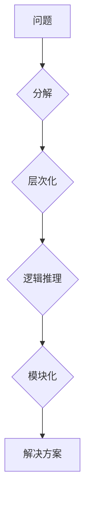

> 结构化思维，算法设计，数据结构，编程实践，软件架构，复杂系统，问题解决，代码优化

## 1. 背景介绍

在当今科技日新月异的时代，软件开发和系统设计面临着越来越大的挑战。复杂系统、海量数据、快速迭代的需求，都对程序员的思维能力提出了更高的要求。如何有效地组织和处理信息，如何清晰地表达和实现想法，成为了决定成功与否的关键因素。

结构化思维，作为一种高效的认知模式，为我们提供了解决复杂问题、设计复杂系统、提高编程效率的强大工具。它强调将问题分解成更小的、可管理的子问题，并通过逻辑推理和算法设计，逐步解决这些子问题，最终达到目标。

## 2. 核心概念与联系

结构化思维的核心概念包括：

* **分解：** 将复杂问题分解成更小的、可处理的子问题。
* **层次化：** 将子问题按照逻辑关系进行层次化组织，形成清晰的结构。
* **逻辑推理：** 使用逻辑规则和算法，从已知条件推导出未知结果。
* **模块化：** 将代码和功能模块化设计，提高代码的可读性、可维护性和可扩展性。

**Mermaid 流程图：**



## 3. 核心算法原理 & 具体操作步骤

### 3.1  算法原理概述

算法是一种解决特定问题的步骤序列，它描述了如何使用有限的资源，在有限的时间内，完成特定的任务。

结构化思维的核心在于使用算法来解决问题。算法的设计需要遵循以下原则：

* **明确性：** 算法的每个步骤都必须明确定义，避免歧义。
* **有限性：** 算法必须在有限的时间内完成，不能无限循环。
* **有效性：** 算法必须能够正确解决问题，并产生期望的结果。

### 3.2  算法步骤详解

算法设计通常遵循以下步骤：

1. **问题分析：** 仔细分析问题，明确问题的目标和约束条件。
2. **算法设计：** 根据问题分析结果，设计出解决问题的算法。
3. **算法实现：** 将算法用编程语言实现，并进行测试验证。
4. **算法优化：** 对算法进行优化，提高其效率和性能。

### 3.3  算法优缺点

不同的算法具有不同的优缺点，选择合适的算法取决于具体的问题和需求。

* **时间复杂度：** 算法执行的时间与输入数据大小的关系。
* **空间复杂度：** 算法使用的内存空间大小。
* **易读性：** 算法的代码是否易于理解和维护。

### 3.4  算法应用领域

算法广泛应用于各个领域，例如：

* **计算机科学：** 数据结构、排序算法、搜索算法、加密算法等。
* **人工智能：** 机器学习、深度学习、自然语言处理等。
* **生物信息学：** 基因序列分析、蛋白质结构预测等。
* **金融领域：** 风险管理、投资策略等。

## 4. 数学模型和公式 & 详细讲解 & 举例说明

### 4.1  数学模型构建

数学模型可以用来描述和分析复杂系统，并帮助我们理解其行为规律。

例如，我们可以使用线性回归模型来预测房价，使用Logistic回归模型来预测客户是否会购买产品。

### 4.2  公式推导过程

数学公式是数学模型的核心，它描述了模型中变量之间的关系。

例如，线性回归模型的公式如下：

$$y = mx + c$$

其中：

* $y$ 是预测值
* $x$ 是输入变量
* $m$ 是斜率
* $c$ 是截距

### 4.3  案例分析与讲解

我们可以通过案例分析来理解数学模型的应用。

例如，假设我们想要预测房价，我们可以收集房价和房屋面积的数据，并使用线性回归模型进行预测。

**举例说明：**

假设我们收集了以下数据：

| 房屋面积 (平方米) | 房价 (万元) |
|---|---|
| 60 | 100 |
| 80 | 150 |
| 100 | 200 |

我们可以使用线性回归模型来拟合这些数据，得到以下模型：

$$y = 1.5x + 50$$

其中：

* $y$ 是房价 (万元)
* $x$ 是房屋面积 (平方米)

如果我们想要预测一个面积为 120 平方米的房价，我们可以将 $x$ 代入模型中：

$$y = 1.5 * 120 + 50 = 230$$

因此，我们预测这个面积为 120 平方米的房价为 230 万元。

## 5. 项目实践：代码实例和详细解释说明

### 5.1  开发环境搭建

为了实现结构化思维的应用，我们可以选择合适的开发环境和工具。

例如，我们可以使用以下工具：

* **编程语言：** Python、Java、C++ 等
* **代码编辑器：** VS Code、Sublime Text 等
* **版本控制系统：** Git

### 5.2  源代码详细实现

以下是一个简单的代码实例，演示了如何使用结构化思维来实现一个简单的算法：

```python
def factorial(n):
  """
  计算阶乘
  """
  if n == 0:
    return 1
  else:
    return n * factorial(n-1)

# 获取用户输入
n = int(input("请输入一个整数："))

# 计算阶乘
result = factorial(n)

# 打印结果
print(f"阶乘结果为：{result}")
```

### 5.3  代码解读与分析

这段代码实现了阶乘的计算。

* **函数定义：** `factorial(n)` 函数定义了计算阶乘的逻辑。
* **递归调用：** 函数内部使用递归调用自身，计算阶乘。
* **边界条件：** 当 `n` 等于 0 时，返回 1，作为递归的终止条件。
* **用户输入：** 代码获取用户输入的整数 `n`。
* **结果输出：** 代码打印计算结果。

### 5.4  运行结果展示

当用户输入 5 时，程序输出：

```
阶乘结果为：120
```

## 6. 实际应用场景

结构化思维在软件开发、系统设计、数据分析等领域都有广泛的应用场景。

### 6.1  软件开发

* **模块化设计：** 将软件系统分解成独立的模块，提高代码的可读性、可维护性和可扩展性。
* **算法设计：** 使用算法解决软件中的各种问题，例如排序、搜索、加密等。
* **代码优化：** 通过分析代码结构和算法效率，优化代码性能。

### 6.2  系统设计

* **系统架构设计：** 将复杂系统分解成层次结构，明确各模块的功能和职责。
* **数据结构设计：** 选择合适的數據结构来存储和处理数据，提高数据访问效率。
* **流程设计：** 使用流程图或状态机等方式描述系统的运行流程。

### 6.3  数据分析

* **数据清洗：** 使用算法去除数据中的噪声和异常值。
* **数据挖掘：** 使用算法从数据中发现隐藏的模式和规律。
* **数据可视化：** 使用图表和图形等方式展示数据，帮助人们理解数据。

### 6.4  未来应用展望

随着人工智能、大数据等技术的快速发展，结构化思维将发挥更加重要的作用。

* **智能系统设计：** 在设计智能系统时，需要使用结构化思维来构建系统的知识表示、推理机制和决策逻辑。
* **复杂系统管理：** 在管理复杂系统时，需要使用结构化思维来分析系统结构、识别关键节点和风险点，并制定相应的管理策略。
* **跨领域应用：** 结构化思维的应用范围将不断扩展，覆盖更多领域，例如医疗、教育、金融等。

## 7. 工具和资源推荐

### 7.1  学习资源推荐

* **书籍：**
    * 《结构化编程》
    * 《算法导论》
    * 《设计模式》
* **在线课程：**
    * Coursera
    * edX
    * Udemy

### 7.2  开发工具推荐

* **编程语言：** Python、Java、C++
* **代码编辑器：** VS Code、Sublime Text
* **版本控制系统：** Git

### 7.3  相关论文推荐

* **ACM Digital Library**
* **IEEE Xplore**
* **ScienceDirect**

## 8. 总结：未来发展趋势与挑战

### 8.1  研究成果总结

结构化思维已经成为软件开发和系统设计的重要方法论，它帮助我们有效地解决复杂问题，提高代码质量和系统效率。

### 8.2  未来发展趋势

未来，结构化思维将继续发展和完善，并与人工智能、大数据等新技术融合，形成更加强大的应用能力。

* **智能化结构化思维：** 利用人工智能技术，自动生成结构化代码和系统架构。
* **可视化结构化思维：** 使用图形化工具，直观地展示结构化思维过程和结果。
* **跨领域应用：** 将结构化思维应用于更多领域，例如医疗、教育、金融等。

### 8.3  面临的挑战

结构化思维的应用也面临一些挑战：

* **复杂系统建模：** 如何对复杂系统进行有效的建模和分析，仍然是一个难题。
* **知识表示和推理：** 如何将人类知识表示为计算机可理解的形式，并进行有效的推理，也是一个重要的研究方向。
* **跨学科合作：** 结构化思维的应用需要跨学科合作，需要软件工程师、系统架构师、数据科学家等多学科人才的共同努力。

### 8.4  研究展望

未来，我们将继续深入研究结构化思维，探索其更深层次的原理和应用，并将其与其他新技术融合，推动科技创新和社会发展。

## 9. 附录：常见问题与解答

### 9.1  什么是结构化思维？

结构化思维是一种将问题分解成更小的、可管理的子问题，并通过逻辑推理和算法设计，逐步解决这些子问题，最终达到目标的思维方式。

### 9.2  结构化思维有什么好处？

结构化思维可以帮助我们：

* **提高问题解决能力：** 将复杂问题分解成更小的子问题，更容易理解和解决。
* **提高代码质量：** 模块化设计和算法设计，提高代码的可读性、可维护性和可扩展性。
* **提高工作效率：** 通过逻辑推理和算法优化，提高工作效率。

### 9.3  如何培养结构化思维？

可以通过以下方式培养结构化思维：

* **阅读相关书籍和文章：** 学习结构化思维的原理和方法。
* **练习编程：** 通过编程实践，锻炼逻辑推理和算法设计能力。
* **分析问题：** 遇到问题时，尝试将其分解成更小的子问题，并寻找解决问题的方案。


作者：禅与计算机程序设计艺术 / Zen and the Art of Computer Programming 
<end_of_turn>