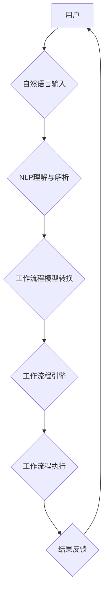

> 自然语言处理，工作流设计，流程自动化，智能化，NLP，BPMN

## 1. 背景介绍

随着数字化转型和智能化浪潮的不断深入，企业对工作流程的自动化和智能化需求日益强烈。传统的工作流设计方法往往依赖于人工规则和流程图，难以适应复杂、动态变化的工作场景。而自然语言处理（NLP）技术作为人工智能领域的重要分支，能够理解和处理人类语言，为工作流设计提供了新的思路和可能性。

NLP技术在工作流设计中的应用，可以实现以下几个方面的突破：

* **无代码/低代码工作流设计:** 通过自然语言描述工作流程，无需编写复杂的代码，即可快速构建工作流，降低了工作流设计的门槛。
* **智能化流程优化:** 利用NLP技术分析历史工作流程数据，识别流程中的瓶颈和冗余环节，并自动生成优化建议，提高工作流程效率。
* **动态调整工作流程:** 根据实时变化的业务需求，通过自然语言指令动态调整工作流程，实现流程的灵活性。
* **智能化流程监控和管理:** 利用NLP技术对工作流程执行情况进行监控和分析，及时发现问题并进行处理，提高工作流程的可靠性。

## 2. 核心概念与联系

**2.1 工作流设计**

工作流设计是指定义和组织一系列任务和活动，以实现特定业务目标的过程。它通常采用流程图或模型来描述工作流程的各个步骤、参与者和数据流。

**2.2 自然语言处理 (NLP)**

自然语言处理 (NLP) 是一门研究计算机如何理解、处理和生成人类语言的技术。它涵盖了文本分析、语音识别、机器翻译等多个领域。

**2.3 核心概念联系**

NLP技术可以将自然语言描述的工作流程转换为计算机可理解的格式，从而实现工作流的自动化和智能化。

**2.4 工作流程设计与NLP技术融合架构**



## 3. 核心算法原理 & 具体操作步骤

**3.1 算法原理概述**

NLP技术在工作流设计中的核心算法主要包括：

* **自然语言理解 (NLU):** 将自然语言文本转换为结构化数据，例如实体识别、关系抽取、意图识别等。
* **知识图谱构建:** 将工作流程中的知识和关系表示为知识图谱，以便于知识推理和流程优化。
* **流程模型生成:** 将结构化数据和知识图谱转换为工作流程模型，例如BPMN流程图。

**3.2 算法步骤详解**

1. **自然语言输入:** 用户使用自然语言描述工作流程，例如“申请贷款需要提交材料、审核、审批、放款”。
2. **NLP理解与解析:** 利用NLU算法对自然语言文本进行分析，识别出实体（例如“申请贷款”、“材料”、“审核”、“审批”、“放款”）、关系（例如“申请贷款需要提交材料”）和意图（例如“申请贷款流程”）。
3. **知识图谱构建:** 将识别出的实体和关系构建成知识图谱，例如：

```
实体：申请贷款、材料、审核、审批、放款
关系：申请贷款需要提交材料，审核需要审批，审批需要放款
```

4. **流程模型生成:** 利用知识图谱构建工作流程模型，例如BPMN流程图。

**3.3 算法优缺点**

**优点:**

* **易于理解和使用:** 用户可以使用自然语言描述工作流程，无需学习复杂的编程语言。
* **灵活性强:** 可以根据业务需求动态调整工作流程。
* **智能化程度高:** 可以利用NLP技术自动识别流程瓶颈和优化建议。

**缺点:**

* **语义理解复杂:** 自然语言的语义理解仍然是一个挑战，需要不断改进算法精度。
* **数据依赖性强:** 需要大量的历史工作流程数据进行训练和优化。
* **安全性和隐私性问题:** 需要确保用户输入的自然语言数据安全和隐私。

**3.4 算法应用领域**

* **企业流程自动化:** 自动化审批流程、采购流程、客户服务流程等。
* **智能客服:** 利用NLP技术理解客户问题，并自动提供解决方案。
* **流程监控和管理:** 利用NLP技术分析工作流程执行情况，及时发现问题并进行处理。

## 4. 数学模型和公式 & 详细讲解 & 举例说明

**4.1 数学模型构建**

在NLP技术应用于工作流设计中，常用的数学模型包括：

* **词嵌入模型:** 将单词映射到低维向量空间，捕捉单词之间的语义关系。例如Word2Vec、GloVe等模型。
* **序列标注模型:** 用于识别文本序列中的标签，例如实体识别、关系抽取等。例如CRF、BERT等模型。
* **图神经网络:** 用于处理图结构数据，例如知识图谱构建和流程优化。

**4.2 公式推导过程**

由于篇幅限制，这里只列举一个词嵌入模型Word2Vec的训练目标函数：

$$
J(\theta) = \sum_{i=1}^{N} \sum_{j \in \mathcal{C}(i)} \log p(w_j | w_i; \theta)
$$

其中：

* $J(\theta)$ 是目标函数
* $\theta$ 是模型参数
* $N$ 是训练语料库的大小
* $w_i$ 是上下文词
* $w_j$ 是目标词
* $\mathcal{C}(i)$ 是 $w_i$ 的上下文词集合
* $p(w_j | w_i; \theta)$ 是目标词 $w_j$ 在给定上下文词 $w_i$ 时的概率

**4.3 案例分析与讲解**

假设我们有一个工作流程描述：“申请贷款需要提交材料，审核需要审批，审批需要放款”。

利用Word2Vec模型，我们可以将这些单词映射到低维向量空间，例如：

* 申请贷款: [0.2, 0.5, 0.1, ...]
* 提交材料: [0.1, 0.3, 0.7, ...]
* 审核: [0.4, 0.2, 0.1, ...]

通过计算向量之间的相似度，我们可以识别出“申请贷款”和“提交材料”之间的关系，以及“审核”和“审批”之间的关系。

## 5. 项目实践：代码实例和详细解释说明

**5.1 开发环境搭建**

* Python 3.x
* TensorFlow 或 PyTorch
* NLTK 或 SpaCy

**5.2 源代码详细实现**

```python
import nltk
from nltk.tokenize import word_tokenize
from nltk.corpus import stopwords

# 下载 NLTK 数据
nltk.download('punkt')
nltk.download('stopwords')

# 定义工作流程描述文本
workflow_description = "申请贷款需要提交材料，审核需要审批，审批需要放款。"

# 分词
tokens = word_tokenize(workflow_description)

# 去除停用词
stop_words = set(stopwords.words('english'))
filtered_tokens = [word for word in tokens if word.lower() not in stop_words]

# ... (后续代码实现 NLP 算法，构建知识图谱，生成流程模型)
```

**5.3 代码解读与分析**

* 代码首先使用NLTK库对工作流程描述文本进行分词和停用词去除。
* 然后，可以使用其他NLP算法，例如实体识别、关系抽取等，进一步分析文本内容。
* 最后，将分析结果转换为工作流程模型，例如BPMN流程图。

**5.4 运行结果展示**

运行代码后，可以得到以下结果：

* 实体：申请贷款、材料、审核、审批、放款
* 关系：申请贷款需要提交材料，审核需要审批，审批需要放款

这些结果可以用于构建工作流程模型。

## 6. 实际应用场景

**6.1 企业流程自动化**

* **审批流程自动化:** 利用NLP技术自动识别审批流程中的关键信息，例如申请人、审批意见、审批结果等，并自动完成审批流程的执行。
* **采购流程自动化:** 利用NLP技术自动识别采购需求、供应商信息、价格信息等，并自动完成采购流程的执行。
* **客户服务流程自动化:** 利用NLP技术自动识别客户问题、提供解决方案，并自动完成客户服务流程的执行。

**6.2 智能客服**

* 利用NLP技术理解客户问题，并自动提供解决方案。
* 利用聊天机器人技术，与客户进行自然语言对话，提供个性化服务。

**6.3 流程监控和管理**

* 利用NLP技术分析工作流程执行情况，识别流程瓶颈和冗余环节。
* 利用机器学习算法，预测工作流程执行时间和风险。

**6.4 未来应用展望**

* **更智能化的流程设计:** 利用深度学习技术，自动生成更智能化的工作流程模型。
* **更个性化的流程体验:** 利用用户行为数据，个性化定制工作流程。
* **跨部门协同流程:** 利用NLP技术，实现跨部门协同工作流程。

## 7. 工具和资源推荐

**7.1 学习资源推荐**

* **书籍:**
    * 自然语言处理与深度学习
    * 自然语言处理入门
* **在线课程:**
    * Coursera: Natural Language Processing Specialization
    * edX: Natural Language Processing

**7.2 开发工具推荐**

* **Python:** 自然语言处理的常用编程语言
* **NLTK:** 自然语言处理工具包
* **SpaCy:** 高性能自然语言处理库
* **TensorFlow:** 深度学习框架
* **PyTorch:** 深度学习框架

**7.3 相关论文推荐**

* **BERT: Pre-training of Deep Bidirectional Transformers for Language Understanding**
* **GPT-3: Language Models are Few-Shot Learners**
* **XLNet: Generalized Autoregressive Pretraining for Language Understanding**

## 8. 总结：未来发展趋势与挑战

**8.1 研究成果总结**

NLP技术在工作流设计领域的应用取得了显著进展，能够实现工作流程的自动化、智能化和灵活性。

**8.2 未来发展趋势**

* **更智能化的流程设计:** 利用深度学习技术，自动生成更智能化的工作流程模型。
* **更个性化的流程体验:** 利用用户行为数据，个性化定制工作流程。
* **跨部门协同流程:** 利用NLP技术，实现跨部门协同工作流程。

**8.3 面临的挑战**

* **语义理解复杂:** 自然语言的语义理解仍然是一个挑战，需要不断改进算法精度。
* **数据依赖性强:** 需要大量的历史工作流程数据进行训练和优化。
* **安全性和隐私性问题:** 需要确保用户输入的自然语言数据安全和隐私。

**8.4 研究展望**

未来，将继续研究更先进的NLP算法，提高语义理解能力，并探索更广泛的应用场景。


## 9. 附录：常见问题与解答

**9.1 如何训练NLP模型？**

需要准备大量的文本数据，并使用深度学习框架（例如TensorFlow或PyTorch）训练模型。

**9.2 如何评估NLP模型的性能？**

可以使用准确率、召回率、F1-score等指标评估模型的性能。

**9.3 如何确保用户数据安全？**

需要采取相应的安全措施，例如数据加密、访问控制等，保护用户数据安全。


作者：禅与计算机程序设计艺术 / Zen and the Art of Computer Programming 
<end_of_turn>