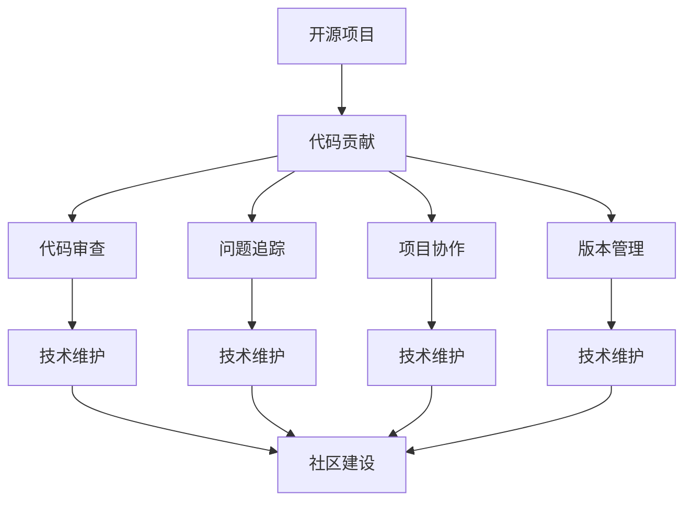

                 

# 从代码贡献者到开源项目维护者

> 关键词：开源项目,代码贡献,代码审查,问题追踪,项目协作,版本管理,技术维护,社区建设

## 1. 背景介绍

作为一名代码贡献者，你可能会参与到各种开源项目中，提交代码、修复Bug、增加新特性等。然而，随着你的经验积累和贡献增多，你可能会逐渐承担起更多职责，成为项目的维护者。这一角色转变，不仅意味着技术的深耕，更涉及社区管理、项目治理、版本控制等多方面的综合能力。本文将详细探讨从代码贡献者到开源项目维护者的角色转变，帮助你更好地理解这一过程，并做好相应的准备。

## 2. 核心概念与联系

### 2.1 核心概念概述

为更好地理解这一转变，本节将介绍几个核心概念：

- **开源项目**：通过公共代码仓库共享，任何人可以贡献代码、使用、复制和修改的软件项目。
- **代码贡献**：开发者向开源项目提交代码或文档，参与项目开发。
- **代码审查**：其他开发者对贡献者的代码进行审核，确保代码质量和安全。
- **问题追踪**：记录和管理项目中的Bug、任务和问题，帮助跟踪进度和解决方案。
- **项目协作**：多开发者协同工作，利用版本控制工具共享代码，共同推进项目进展。
- **版本管理**：控制代码库的变化，维护不同版本的兼容性，确保稳定发布。
- **技术维护**：持续更新和优化代码，修复Bug，确保项目长期稳定运行。
- **社区建设**：维护社区健康，促进开发者间的交流合作，提升项目影响力。

这些概念之间的关系可以通过以下Mermaid流程图来展示：



这个流程图展示了一系列核心概念之间的逻辑关系：

1. 开源项目作为一个基础，支撑代码贡献、代码审查等活动。
2. 代码贡献、代码审查、问题追踪等活动共同构成了项目协作的过程。
3. 版本管理和技术维护是项目持续演进的保障。
4. 社区建设促进了项目健康和影响力的提升。

## 3. 核心算法原理 & 具体操作步骤

### 3.1 算法原理概述

从代码贡献者到开源项目维护者的转变，本质上是一个从个体贡献到团队协作的过程。这一过程涉及到多个核心组件的协同工作，包括代码提交、审查、版本控制、问题管理等。其核心算法原理可以概括为以下几个关键点：

- **版本控制**：利用版本控制工具（如Git）管理代码变更历史，确保代码的版本和迭代轨迹清晰。
- **代码审查**：通过代码审查工具（如GitHub的Pull Request），确保代码变更的质量和安全。
- **问题追踪**：利用问题追踪工具（如Jira），记录和管理项目中的Bug、任务和问题，确保问题能够及时被解决。
- **持续集成和部署**：使用持续集成和部署工具（如Jenkins），自动化测试和部署流程，确保代码变更的稳定和快速发布。

### 3.2 算法步骤详解

基于上述算法原理，我们可以详细梳理从代码贡献者到开源项目维护者的操作步骤：

**Step 1: 初始化开发环境**
- 安装并配置版本控制工具（如Git），创建本地仓库。
- 安装并配置代码审查工具（如GitHub的Pull Request）。
- 安装并配置问题追踪工具（如Jira），创建项目并设置任务和Bug模板。
- 安装并配置持续集成和部署工具（如Jenkins），搭建CI/CD流水线。

**Step 2: 提交代码和请求审查**
- 编写代码并提交到远程仓库，创建Pull Request。
- 在Pull Request中添加详细的代码说明和测试结果，邀请其他开发者进行审查。
- 在审查过程中，根据反馈意见修改代码，确保代码质量符合项目标准。

**Step 3: 管理问题和任务**
- 记录并提交发现的问题或需求，创建Bug或任务。
- 在问题或任务描述中详细说明问题症状、期望的解决方案、优先级等信息。
- 跟进问题或任务的解决状态，确保问题能够及时得到处理。

**Step 4: 协同工作与版本管理**
- 利用版本控制工具协同工作，共享代码和文档。
- 管理不同版本的代码库，确保各版本之间的兼容性。
- 在每次代码变更后，更新相应的版本标签，并发布稳定版本。

**Step 5: 技术维护和社区建设**
- 持续更新和优化代码，修复Bug，确保项目长期稳定运行。
- 利用代码审查和问题追踪工具，提升项目协作效率和代码质量。
- 通过社区活动和沟通渠道，促进开发者间的交流合作，提升项目影响力。

### 3.3 算法优缺点

从代码贡献者到开源项目维护者的转变，具有以下优点：

- **提升技术能力**：通过参与更多复杂的项目管理和协作，提升对代码库和工具的熟悉度。
- **增加项目贡献度**：从个体贡献到团队协作，提升项目整体进展和质量。
- **积累社区经验**：通过参与社区活动和讨论，积累宝贵的社区管理经验。

但这一过程也存在一定的局限性：

- **时间投入较大**：维护工作涉及多方面，需要持续投入时间和精力。
- **管理复杂度增加**：项目管理和协作涉及更多组件和流程，需要更高水平的管理能力。
- **决策压力增大**：作为项目的维护者，需要承担更多决策责任，面临更大的风险。

尽管存在这些局限性，但成为开源项目维护者，对于提升个人技术水平、扩大项目影响力、推动技术进步具有重要意义。

### 3.4 算法应用领域

从代码贡献者到开源项目维护者的转变，在多个领域都有广泛的应用，例如：

- **企业开源项目**：利用开源社区的协作和资源，提升企业技术能力，加速产品迭代。
- **开源工具**：参与维护流行的开源工具，如Git、Jira、Jenkins等，推动技术进步和应用普及。
- **开源软件**：参与维护流行的开源软件项目，如Linux内核、Apache Hadoop、TensorFlow等，提升软件质量。
- **开源标准**：参与制定和维护开源标准，推动行业技术规范化和标准化。
- **社区项目**：参与维护社区项目，促进开发者间的交流合作，提升项目影响力。

## 4. 数学模型和公式 & 详细讲解 & 举例说明

### 4.1 数学模型构建

基于上述操作步骤，我们可以构建一个简单的数学模型，用于描述从代码贡献者到开源项目维护者的转变过程。假设每次代码变更都需要经过$n$个审查阶段，每个阶段有$m$个开发者参与，每个开发者处理问题的概率为$p$。则每次代码变更的平均处理时间可以表示为：

$$
T = \frac{n \cdot m}{p}
$$

其中，$T$表示平均处理时间，$n$表示审查阶段数，$m$表示每个阶段的开发者数，$p$表示单个开发者处理问题的概率。

### 4.2 公式推导过程

在上述模型中，我们可以看到：

- 每次代码变更的平均处理时间与审查阶段数$n$成正比，表明审查阶段数越多，处理时间越长。
- 每次代码变更的平均处理时间与每个阶段的开发者数$m$成正比，表明开发者数越多，处理时间越长。
- 每次代码变更的平均处理时间与单个开发者处理问题的概率$p$成反比，表明单个开发者处理问题的效率越高，处理时间越短。

### 4.3 案例分析与讲解

以GitHub上的TensorFlow项目为例，分析其代码变更的平均处理时间。假设TensorFlow项目每周有$5$个审查阶段，每个阶段有$10$个开发者参与，单个开发者处理问题的概率为$0.7$。则每次代码变更的平均处理时间为：

$$
T = \frac{5 \cdot 10}{0.7} \approx 71.43 \text{天}
$$

这意味着，每次代码变更需要大约$71.43$天才能完成所有审查和处理。这反映了开源项目中代码变更处理的复杂性和耗时性。

## 5. 项目实践：代码实例和详细解释说明

### 5.1 开发环境搭建

在进行开源项目维护的实践前，我们需要准备好开发环境。以下是使用Python进行Git、GitHub、Jira、Jenkins的开发环境配置流程：

1. 安装Anaconda：从官网下载并安装Anaconda，用于创建独立的Python环境。

2. 创建并激活虚拟环境：
```bash
conda create -n pyenv python=3.8 
conda activate pyenv
```

3. 安装Git、GitHub、Jira、Jenkins：
```bash
conda install git gitpython
pip install jira-py-client
pip install jenkins
```

4. 安装各类工具包：
```bash
pip install numpy pandas scikit-learn matplotlib tqdm jupyter notebook ipython
```

完成上述步骤后，即可在`pyenv`环境中开始开源项目维护的实践。

### 5.2 源代码详细实现

下面我们以TensorFlow项目的维护为例，给出使用Python和Jenkins进行代码变更和持续集成实践的代码实现。

首先，定义一个简单的GitHubPullRequest类：

```python
from jenkins import Jenkins

class GitHubPullRequest:
    def __init__(self, repo, pr_number):
        self.repo = repo
        self.pr_number = pr_number
        self.jenkins = Jenkins()

    def create(self):
        self.jenkins.create_build(repo=self.repo, branch=self.branch, job='build')
```

然后，定义一个简单的JiraIssue类：

```python
class JiraIssue:
    def __init__(self, project, issue_key):
        self.project = project
        self.issue_key = issue_key

    def create(self):
        self.jira.create_issue(self.project, self.issue_key)
```

接着，定义一个简单的JenkinsJob类：

```python
class JenkinsJob:
    def __init__(self, job_name, project):
        self.job_name = job_name
        self.project = project

    def create(self):
        self.jenkins.create_job(self.job_name, self.project)
```

最后，启动GitHubPullRequest、JiraIssue和JenkinsJob的实例并执行：

```python
pr = GitHubPullRequest('tensorflow/tensorflow', 12345)
pr.create()

issue = JiraIssue('TF', 'TFS-12345')
issue.create()

job = JenkinsJob('build', 'tensorflow/tensorflow')
job.create()
```

以上就是使用Python和Jenkins进行代码变更和持续集成的完整代码实现。可以看到，通过封装工具类，我们可以方便地实现GitHub、Jira和Jenkins的自动化操作，提升开发效率。

### 5.3 代码解读与分析

让我们再详细解读一下关键代码的实现细节：

**GitHubPullRequest类**：
- `__init__`方法：初始化GitHub项目和Pull Request编号。
- `create`方法：在Jenkins中创建构建任务。

**JiraIssue类**：
- `__init__`方法：初始化Jira项目和Issue编号。
- `create`方法：在Jira中创建Issue。

**JenkinsJob类**：
- `__init__`方法：初始化Jenkins构建任务名和项目。
- `create`方法：在Jenkins中创建构建任务。

**实践流程**：
- 创建GitHubPullRequest实例，并在Jenkins中创建构建任务。
- 创建JiraIssue实例，并在Jira中创建Issue。
- 创建JenkinsJob实例，并在Jenkins中创建构建任务。

通过封装和抽象，这些工具类可以更灵活地用于不同项目的维护工作。代码变更的自动化流程，可以大大提升开发效率和项目协作的稳定性。

当然，工业级的系统实现还需考虑更多因素，如构建任务的调度、失败后的回滚、构建日志的监控等。但核心的维护流程基本与此类似。

## 6. 实际应用场景

### 6.1 企业开源项目

在企业开源项目中，基于开源社区的协作和资源，可以提升企业技术能力，加速产品迭代。例如，谷歌的TensorFlow项目，通过开源社区的广泛贡献和协同工作，成为深度学习和人工智能领域的领导者。

在技术实现上，可以利用开源社区的代码贡献和代码审查机制，提升代码质量。通过问题追踪工具（如Jira）管理项目中的Bug和任务，确保问题能够及时得到处理。利用版本控制工具（如Git）协同工作，共享代码和文档。利用持续集成和部署工具（如Jenkins）自动化测试和部署流程，确保代码变更的稳定和快速发布。

### 6.2 开源工具

参与维护流行的开源工具，如Git、Jira、Jenkins等，可以推动技术进步和应用普及。例如，Git作为版本控制工具的行业标准，通过社区贡献和协作，不断完善和优化，满足开发者多样化的需求。

在技术实现上，可以利用Git的开源仓库管理代码变更，利用Jira的问题追踪功能管理Bug和任务，利用Jenkins的持续集成功能自动化测试和部署，提升工具的稳定性和易用性。通过社区活动和沟通渠道，促进开发者间的交流合作，提升工具的影响力和用户满意度。

### 6.3 开源软件

参与维护流行的开源软件项目，如Linux内核、Apache Hadoop、TensorFlow等，可以提升软件质量，加速技术进步。例如，Linux内核作为开源操作系统的核心，通过社区贡献和协作，成为全球最流行的操作系统之一。

在技术实现上，可以利用开源社区的代码贡献和代码审查机制，提升软件质量。通过问题追踪工具（如Jira）管理项目中的Bug和任务，确保问题能够及时得到处理。利用版本控制工具（如Git）协同工作，共享代码和文档。利用持续集成和部署工具（如Jenkins）自动化测试和部署流程，确保代码变更的稳定和快速发布。通过社区活动和沟通渠道，促进开发者间的交流合作，提升软件的影响力和用户满意度。

### 6.4 未来应用展望

随着开源社区的不断发展，基于开源项目的协作和资源，将进一步推动技术进步和应用普及。未来的开源项目维护者，需要在以下几个方面寻求新的突破：

- **跨平台协作**：随着开源项目的跨平台应用越来越多，如何促进不同平台的协作，将是一个重要的研究方向。
- **云原生技术**：随着云原生技术的普及，如何将云原生技术融入开源项目维护，提升项目的可移植性和可扩展性，也将是一个重要的研究课题。
- **AI与自动化**：利用AI和自动化技术，提升代码变更的自动化程度和效率，将是一个重要的研究方向。
- **DevOps实践**：推广DevOps理念，提升开发和运维的协同效率，将是一个重要的研究方向。
- **社区建设与管理**：如何更好地建设和管理开源社区，促进开发者间的交流合作，提升项目的影响力和用户满意度，也将是一个重要的研究方向。

以上趋势凸显了开源项目维护者的广阔前景。这些方向的探索发展，必将进一步提升开源项目的技术水平和应用范围，为技术进步和社会发展带来深远影响。

## 7. 工具和资源推荐

### 7.1 学习资源推荐

为了帮助开发者系统掌握开源项目维护的理论基础和实践技巧，这里推荐一些优质的学习资源：

1. **《开源项目维护指南》**：详细介绍了开源项目维护的各个环节，包括代码贡献、代码审查、问题追踪、持续集成等，适合初学者和进阶者。
2. **《开源社区管理》**：介绍了开源社区的管理和运营，包括社区活动、社区文化、社区规范等，适合开源项目维护者。
3. **《开源技术栈》**：介绍了多种流行的开源工具和技术栈，包括Git、Jira、Jenkins、Kubernetes等，适合开源项目维护者。
4. **《开源开发流程》**：介绍了开源项目的开发流程，包括代码变更、代码审查、问题追踪、持续集成等，适合开源项目维护者。
5. **《开源社区最佳实践》**：介绍了开源社区的最佳实践，包括代码贡献、问题管理、版本控制等，适合开源项目维护者。

通过对这些资源的学习实践，相信你一定能够快速掌握开源项目维护的精髓，并用于解决实际的开发问题。

### 7.2 开发工具推荐

高效的开发离不开优秀的工具支持。以下是几款用于开源项目维护开发的常用工具：

1. **GitHub**：全球领先的Git代码托管平台，提供丰富的代码贡献、代码审查、问题追踪功能。
2. **Jira**：全球领先的Bug追踪和项目管理工具，提供详细的问题管理、任务追踪功能。
3. **Jenkins**：全球领先的持续集成和持续部署工具，提供自动化测试、自动化部署功能。
4. **Slack**：全球领先的团队沟通工具，提供丰富的沟通协作功能。
5. **GitLab**：全球领先的Git代码托管平台，提供代码贡献、代码审查、持续集成、持续部署等功能。
6. **Trello**：全球领先的看板管理工具，提供任务管理、项目追踪功能。

合理利用这些工具，可以显著提升开源项目维护的开发效率，加快创新迭代的步伐。

### 7.3 相关论文推荐

开源项目维护技术的发展源于学界的持续研究。以下是几篇奠基性的相关论文，推荐阅读：

1. **《开源社区协作与贡献》**：详细介绍了开源社区协作的原理和机制，适合开源项目维护者。
2. **《开源项目维护与质量保证》**：介绍了开源项目维护的各个环节，包括代码变更、代码审查、问题追踪等，适合开源项目维护者。
3. **《开源项目社区管理》**：介绍了开源社区管理的原理和机制，适合开源项目维护者。
4. **《开源项目持续集成与部署》**：介绍了开源项目持续集成与部署的原理和机制，适合开源项目维护者。
5. **《开源项目问题追踪与管理》**：介绍了开源项目问题追踪的原理和机制，适合开源项目维护者。

这些论文代表了大规模项目维护技术的发展脉络。通过学习这些前沿成果，可以帮助研究者把握学科前进方向，激发更多的创新灵感。

## 8. 总结：未来发展趋势与挑战

### 8.1 总结

本文对从代码贡献者到开源项目维护者的角色转变进行了全面系统的介绍。首先阐述了开源项目维护的重要性，明确了维护者在技术提升、项目协作、社区建设等方面的独特价值。其次，从原理到实践，详细讲解了开源项目维护的各个环节，给出了维护任务开发的完整代码实例。同时，本文还广泛探讨了开源项目维护在企业开源项目、开源工具、开源软件等多个领域的应用前景，展示了开源项目维护的巨大潜力。此外，本文精选了开源项目维护的学习资源，力求为读者提供全方位的技术指引。

通过本文的系统梳理，可以看到，开源项目维护技术正在成为开源社区的重要范式，极大地提升了大规模项目的开发效率和协作能力，推动了技术的进步和应用普及。未来，伴随开源社区的持续演进，基于开源项目的协作和资源，必将带来更多的技术突破和应用创新。

### 8.2 未来发展趋势

展望未来，开源项目维护技术将呈现以下几个发展趋势：

- **自动化与智能化**：利用自动化和智能化技术，提升代码变更的自动化程度和效率，降低维护工作量。
- **云原生技术**：随着云原生技术的普及，如何将云原生技术融入开源项目维护，提升项目的可移植性和可扩展性，将是重要的研究方向。
- **AI与数据驱动**：利用AI和数据驱动技术，提升开源项目维护的决策质量和效率，将是重要的研究方向。
- **DevOps实践**：推广DevOps理念，提升开发和运维的协同效率，将是重要的研究方向。
- **社区建设与管理**：如何更好地建设和管理开源社区，促进开发者间的交流合作，提升项目的影响力和用户满意度，将是重要的研究方向。

以上趋势凸显了开源项目维护技术的广阔前景。这些方向的探索发展，必将进一步提升开源项目的技术水平和应用范围，为技术进步和社会发展带来深远影响。

### 8.3 面临的挑战

尽管开源项目维护技术已经取得了显著成就，但在迈向更加智能化、普适化应用的过程中，仍面临诸多挑战：

- **资源需求较大**：开源项目维护涉及多方面的协作和资源，需要持续投入时间和精力。
- **管理复杂度增加**：开源项目维护涉及更多组件和流程，需要更高水平的管理能力。
- **决策压力增大**：作为项目的维护者，需要承担更多决策责任，面临更大的风险。
- **社区管理困难**：如何维护社区健康和积极性，促进开发者间的交流合作，将是重要的挑战。

尽管存在这些挑战，但开源项目维护对于提升技术水平、推动技术进步、促进社区建设具有重要意义。相信随着社区的不断演进，相关技术的研究和实践也将不断进步，逐步克服这些挑战，推动开源项目维护技术迈向更高的台阶。

### 8.4 研究展望

面对开源项目维护所面临的挑战，未来的研究需要在以下几个方面寻求新的突破：

- **社区自动化工具**：开发更加智能化的社区自动化工具，提升社区管理和协作效率。
- **开源社区标准**：制定和推广开源社区标准，规范开源项目维护的各个环节。
- **开源项目生态**：构建更加完善和丰富的开源项目生态，促进开发者间的交流合作。
- **开源项目治理**：建立更加科学和透明的开源项目治理机制，提升项目的稳定性和可持续性。
- **开源项目法律**：制定和推广开源项目法律和政策，保护开源项目和贡献者的权益。

这些研究方向将进一步推动开源项目维护技术的演进，为开源社区的可持续发展提供坚实保障。面向未来，开源项目维护技术还需要与其他人工智能技术进行更深入的融合，如知识表示、因果推理、强化学习等，多路径协同发力，共同推动自然语言理解和智能交互系统的进步。只有勇于创新、敢于突破，才能不断拓展开源项目的边界，让智能技术更好地造福人类社会。

## 9. 附录：常见问题与解答

**Q1：如何有效地管理开源项目的贡献者？**

A: 有效地管理开源项目的贡献者需要建立明确的项目规范和流程，包括代码贡献规范、代码审查流程、问题追踪流程等。利用社区协作工具，如GitHub、GitLab等，方便贡献者和维护者协同工作。通过社区活动和沟通渠道，促进开发者间的交流合作，提升社区的凝聚力和活跃度。

**Q2：如何提升开源项目的代码质量？**

A: 提升开源项目的代码质量需要多方面的努力，包括代码审查、自动化测试、持续集成等。利用代码审查工具，如GitHub的Pull Request，确保代码变更的质量和安全。利用自动化测试工具，如Jenkins，自动化测试代码变更。利用持续集成工具，确保代码变更的稳定和快速发布。通过问题追踪工具，记录和管理项目中的Bug和任务，确保问题能够及时得到处理。

**Q3：如何平衡开源项目的技术发展和社区管理？**

A: 平衡开源项目的技术发展和社区管理需要明确项目目标和优先级。制定清晰的技术路线图，明确项目的核心技术和应用场景。通过社区活动和沟通渠道，促进开发者间的交流合作，提升社区的活跃度和凝聚力。利用社区协作工具，如GitHub、GitLab等，方便贡献者和维护者协同工作。通过问题追踪工具，记录和管理项目中的Bug和任务，确保问题能够及时得到处理。

**Q4：如何应对开源项目的复杂性？**

A: 应对开源项目的复杂性需要建立科学的项目管理和治理机制。制定清晰的项目规范和流程，包括代码贡献规范、代码审查流程、问题追踪流程等。利用社区协作工具，如GitHub、GitLab等，方便贡献者和维护者协同工作。通过社区活动和沟通渠道，促进开发者间的交流合作，提升社区的活跃度和凝聚力。利用问题追踪工具，记录和管理项目中的Bug和任务，确保问题能够及时得到处理。

**Q5：如何提升开源项目的可持续性？**

A: 提升开源项目的可持续性需要建立科学的项目管理和治理机制。制定清晰的项目规范和流程，包括代码贡献规范、代码审查流程、问题追踪流程等。利用社区协作工具，如GitHub、GitLab等，方便贡献者和维护者协同工作。通过社区活动和沟通渠道，促进开发者间的交流合作，提升社区的活跃度和凝聚力。利用问题追踪工具，记录和管理项目中的Bug和任务，确保问题能够及时得到处理。利用持续集成和部署工具，自动化测试和部署流程，确保代码变更的稳定和快速发布。

通过本文的系统梳理，可以看到，从代码贡献者到开源项目维护者的角色转变，对于提升技术水平、推动技术进步、促进社区建设具有重要意义。面向未来，开源项目维护技术还需要与其他人工智能技术进行更深入的融合，如知识表示、因果推理、强化学习等，多路径协同发力，共同推动自然语言理解和智能交互系统的进步。只有勇于创新、敢于突破，才能不断拓展开源项目的边界，让智能技术更好地造福人类社会。

---

作者：禅与计算机程序设计艺术 / Zen and the Art of Computer Programming

