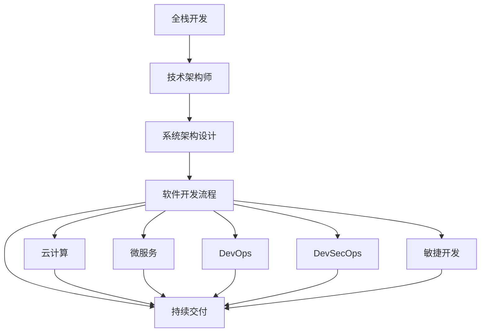
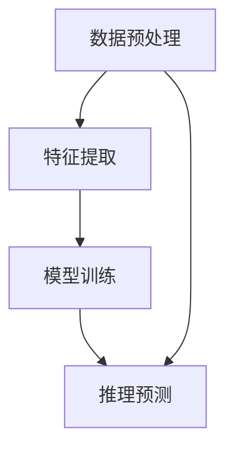

                 

# 从全栈开发到技术架构师的进阶

> 关键词：全栈开发,技术架构师,技术演进,软件开发流程,系统架构设计,云计算,微服务,DevOps,DevSecOps,敏捷开发,项目管理,持续交付

## 1. 背景介绍

### 1.1 问题由来
在IT行业的发展过程中，技术的演进使得传统的全栈开发人员逐渐难以胜任现代复杂系统的构建。如今，一个典型的互联网应用项目不仅涉及到前端用户界面、后端服务逻辑、数据库存储，还可能集成多种中间件，如消息队列、缓存、负载均衡等。因此，对技术人员的专业技能要求也日益增加。在这一背景下，技术架构师的角色应运而生，专门负责设计、优化和构建可扩展、高性能、安全可靠的系统架构。

### 1.2 问题核心关键点
技术架构师需要具备的能力包括但不限于：

- **技术深度与广度**：对多种编程语言、数据库、中间件、云平台等技术的深度理解，以及对技术趋势和最佳实践的广泛了解。
- **系统设计思维**：从整体上考虑系统的架构、性能、可维护性、安全性等问题，能根据实际需求设计合理的系统架构。
- **项目管理经验**：具备项目管理和团队协作的能力，能够在多变的项目环境中协调沟通、推进项目。
- **持续学习能力**：技术栈的变化日新月异，架构师需要不断学习新的技术和工具，跟上行业发展的步伐。
- **问题解决能力**：在项目实施过程中遇到的各种复杂问题，架构师需具备快速分析、高效解决的能力。

### 1.3 问题研究意义
技术架构师的角色对于推动软件开发流程的效率、质量和可靠性至关重要。现代系统往往复杂庞大，架构师的工作不仅关系到系统的短期目标，更关乎长期稳定运行和扩展升级。技术架构师能够将业务需求和技术实现有机结合，从整体上提升系统架构的合理性和可用性，从而实现企业价值的最大化。

## 2. 核心概念与联系

### 2.1 核心概念概述

为更好地理解从全栈开发到技术架构师的进阶过程，本节将介绍几个核心概念：

- **全栈开发**：指开发人员掌握前端和后端的多种技术栈，能够独立完成从需求分析到最终部署的全过程。全栈开发人员在传统项目中发挥着不可或缺的作用。
- **技术架构师**：负责设计和优化系统架构的专业人员，涵盖技术选型、架构设计、性能优化、安全保障等各方面的工作。技术架构师的作用是对系统架构进行顶层设计和治理。
- **软件开发流程**：指从需求提出、系统设计、代码开发、测试、部署到运维的整个生命周期。软件开发流程的优化能够显著提升开发效率和软件质量。
- **系统架构设计**：指根据系统需求，选择最优的技术方案和架构模式，构建高性能、可扩展、易于维护的系统架构。系统架构设计是技术架构师最重要的工作之一。
- **云计算**：指通过网络提供可计量的计算资源和存储资源，实现按需使用的服务模式。云计算对系统架构设计具有深远影响。
- **微服务**：指将大型应用拆分成多个小服务，每个服务独立部署、扩展和更新，从而实现高可维护性和高扩展性。微服务架构是现代系统架构的重要趋势。
- **DevOps**：一种将开发和运维紧密结合的敏捷文化，旨在缩短软件发布周期，提升软件交付质量。DevOps实践包括持续集成、持续部署、自动化测试等。
- **DevSecOps**：DevOps与安全管理的结合，强调从开发到运维的全过程安全防护，涵盖代码审计、漏洞扫描、安全配置等多方面。
- **敏捷开发**：一种基于迭代和反馈的开发模式，强调快速响应需求变化，提升开发效率和软件质量。敏捷开发的核心在于灵活应对变化，持续交付价值。
- **持续交付**：指在开发过程中不断构建、测试、发布和部署软件，旨在快速响应需求变化，提升交付速度和质量。持续交付是DevOps的重要组成部分。

这些核心概念之间的逻辑关系可以通过以下Mermaid流程图来展示：



这个流程图展示了一些关键概念及其之间的关系：

1. 全栈开发是技术架构师的基础。
2. 技术架构师负责系统架构设计，涵盖软件开发流程的各个阶段。
3. 系统架构设计要结合云计算、微服务、DevOps等现代技术。
4. DevOps、DevSecOps、敏捷开发和持续交付是软件开发流程中的重要实践。

通过理解这些核心概念，我们可以更好地把握从全栈开发到技术架构师进阶的全过程。

## 3. 核心算法原理 & 具体操作步骤
### 3.1 算法原理概述

从全栈开发到技术架构师的进阶，本质上是从技术细节的掌握到系统设计和架构优化的转变。其核心思想是：

- **从局部到整体**：全栈开发人员注重代码的编写和调试，而技术架构师则需从整体上考虑系统的架构、性能、安全性和可维护性。
- **从短期到长期**：全栈开发关注项目的短期交付，而技术架构师需考虑系统的长期稳定性和扩展性。
- **从细节到架构**：全栈开发聚焦于技术实现，而技术架构师需综合考虑技术选型、架构模式和系统设计。

### 3.2 算法步骤详解

从全栈开发到技术架构师的进阶过程主要包括以下几个关键步骤：

**Step 1: 技术栈扩展与深度学习**
- 不断扩展自己的技术栈，学习新的编程语言、框架、数据库、云平台等技术。
- 对每种技术进行深度学习，掌握其原理、优势和应用场景。

**Step 2: 项目管理与团队协作**
- 学习项目管理和团队协作技巧，掌握敏捷开发和Scrum等敏捷方法。
- 熟练使用项目管理工具，如Jira、Trello、Confluence等，提高项目管理的效率。

**Step 3: 系统架构设计与优化**
- 学习系统架构设计原则，掌握架构模式如MVC、MVC-Architecture、MVP等。
- 深入理解云计算、微服务、DevOps、DevSecOps等现代技术，构建高性能、可扩展的系统架构。

**Step 4: 持续学习与技术演进**
- 关注技术演进的趋势，如人工智能、区块链、物联网等，不断学习新的技术和工具。
- 参与开源社区，贡献代码、撰写技术文章，积累实践经验。

### 3.3 算法优缺点

从全栈开发到技术架构师的进阶过程具有以下优点：

1. **系统性提升**：技术架构师能从全局角度思考问题，构建更稳定、高效的系统架构。
2. **技能多元化**：技术架构师需要掌握多种技术栈和工具，形成多维度的知识体系。
3. **长远考虑**：技术架构师能够考虑系统的长期维护和扩展，避免短期行为带来的技术债务。

同时，该过程也存在一定的挑战：

1. **学习成本高**：技术栈和系统设计的学习成本较高，需要投入大量时间和精力。
2. **跨学科挑战**：系统架构涉及多个学科，如计算机科学、软件工程、系统设计等，跨学科学习难度较大。
3. **持续更新**：技术演进迅速，技术架构师需不断学习新技术，保持自身竞争力。
4. **项目复杂度**：系统架构设计涉及多个组件和系统的集成，复杂度较高，需要较强的综合能力。

### 3.4 算法应用领域

技术架构师的知识和技能不仅适用于大型企业，还广泛适用于中小企业、初创公司等。技术架构师的工作范围包括但不限于：

- **企业级应用系统**：设计大型企业级应用的架构，如ERP、CRM、B2B等。
- **云原生应用**：构建基于云计算平台的应用，如微服务、云数据库、云存储等。
- **大数据系统**：设计和优化大数据处理系统，如数据湖、数据管道、数据仓库等。
- **物联网系统**：构建物联网设备的通信和数据处理架构，实现设备间的互联互通。
- **人工智能系统**：设计和优化人工智能系统，如图像识别、自然语言处理、机器学习等。

这些应用领域对技术架构师的能力和经验提出了更高的要求，也展示了技术架构师的重要性和必要性。

## 4. 数学模型和公式 & 详细讲解 & 举例说明
### 4.1 数学模型构建

在技术架构师的工作中，涉及到大量的数学模型和算法，以下是一些常见的数学模型：

- **线性回归**：用于预测和建模变量之间的关系，常用于数据挖掘和机器学习。
- **逻辑回归**：用于分类和预测二元或多元分类问题，常用于广告推荐和用户行为分析。
- **深度学习**：一种基于神经网络的机器学习方法，常用于图像识别、自然语言处理等任务。
- **蒙特卡罗方法**：一种基于随机采样的方法，常用于优化和模拟。
- **MILP（混合整数线性规划）**：用于优化多目标函数，常用于资源分配和调度问题。
- **模拟退火算法**：一种基于概率的优化算法，常用于求解复杂优化问题。

### 4.2 公式推导过程

以**线性回归模型**为例，推导其数学表达式：

设输入向量 $x=(x_1,x_2,\ldots,x_n)$，输出向量 $y=(y_1,y_2,\ldots,y_m)$，回归函数 $f(x)=wx+b$，其中 $w$ 为权重向量，$b$ 为偏置。假设 $y$ 与 $x$ 之间存在线性关系，则线性回归模型的目标是找到最优的 $w$ 和 $b$，使得误差函数 $E=\frac{1}{2m}\sum_{i=1}^m(y_i-f(x_i))^2$ 最小化。

通过求导，得到误差函数对 $w$ 和 $b$ 的梯度，进而得到优化问题的解：

$$
w^* = \left(\sum_{i=1}^m x_ix_i^T\right)^{-1}\sum_{i=1}^m x_iy_i
$$
$$
b^* = \bar{y} - w^* \bar{x}
$$

其中 $\bar{x}=\frac{1}{m}\sum_{i=1}^m x_i$，$\bar{y}=\frac{1}{m}\sum_{i=1}^m y_i$。

### 4.3 案例分析与讲解

以**人工智能系统**为例，分析其系统架构设计：

人工智能系统通常涉及多个组件，如数据预处理、特征提取、模型训练、推理预测等。一个典型的人工智能系统架构如图：



该系统架构中，数据预处理组件负责清洗和转换原始数据，特征提取组件负责从数据中提取有用的特征，模型训练组件负责训练和优化模型，推理预测组件负责对新数据进行预测。各组件通过API接口进行通信和数据交换，形成完整的系统架构。

## 5. 项目实践：代码实例和详细解释说明
### 5.1 开发环境搭建

在进行技术架构设计时，需要搭建合适的开发环境。以下是使用JVM栈进行Spring Boot开发的常用工具配置：

1. 安装JDK：从官网下载并安装最新版本的Java Development Kit，设置JAVA_HOME环境变量。
2. 安装Maven：下载并安装Maven，用于项目依赖管理和构建工具。
3. 安装Spring Boot：从官网下载并安装Spring Boot，用于快速构建Web应用。
4. 安装PostgreSQL：安装并配置PostgreSQL数据库，用于数据存储和查询。
5. 安装Redis：安装并配置Redis缓存，用于优化数据访问性能。

完成上述步骤后，即可在开发环境中进行架构设计和应用开发。

### 5.2 源代码详细实现

下面以**电商系统**为例，给出使用Spring Boot进行系统架构设计和开发的完整代码实现。

首先，定义数据访问层：

```java
@Component
public class ProductRepository {
    @Autowired
    private EntityManager entityManager;
    
    public List<Product> findAll() {
        String hql = "SELECT p FROM Product p";
        return entityManager.createQuery(hql, Product.class).getResultList();
    }
    
    public void save(Product product) {
        entityManager.persist(product);
    }
}
```

然后，定义服务层：

```java
@Service
public class ProductService {
    @Autowired
    private ProductRepository productRepository;
    
    public List<Product> getAllProducts() {
        return productRepository.findAll();
    }
    
    public void saveProduct(Product product) {
        productRepository.save(product);
    }
}
```

接着，定义控制器层：

```java
@RestController
public class ProductController {
    @Autowired
    private ProductService productService;
    
    @RequestMapping("/products")
    public List<Product> getAllProducts() {
        return productService.getAllProducts();
    }
    
    @RequestMapping("/products/save")
    public void saveProduct(@RequestBody Product product) {
        productService.saveProduct(product);
    }
}
```

最后，启动Spring Boot应用并测试：

```java
@SpringBootApplication
public class App {
    public static void main(String[] args) {
        SpringApplication.run(App.class, args);
        // 启动应用
        // 测试接口
    }
}
```

以上是使用Spring Boot进行电商系统架构设计和开发的完整代码实现。可以看到，Spring Boot提供了丰富的Web和数据访问支持，简化了架构设计和开发过程。

### 5.3 代码解读与分析

让我们再详细解读一下关键代码的实现细节：

**ProductRepository类**：
- 定义了数据访问层的接口，提供了查询和保存产品的方法。
- 使用JPA（Java Persistence API）进行数据访问，通过注解和注解处理器生成数据访问的SQL语句。

**ProductService类**：
- 定义了业务层的接口，提供了获取和保存产品的方法。
- 依赖注入ProductRepository，使用JPA进行数据访问，实现业务逻辑的封装。

**ProductController类**：
- 定义了Web层的接口，提供了获取和保存产品的方法。
- 依赖注入ProductService，通过RestTemplate调用服务层的方法，实现Web接口的封装。

**App类**：
- 定义了Spring Boot应用的入口点，使用SpringApplication启动应用。
- 通过注解@Component、@Service、@RestController等，构建Spring IOC容器，实现了各组件的装配和依赖注入。

通过这段代码实现，可以看到Spring Boot的架构设计和开发过程非常清晰，通过分层设计、组件化和注解驱动的方式，极大地提高了开发效率和代码的可维护性。

## 6. 实际应用场景

### 6.1 智能客服系统

智能客服系统是一种典型的技术架构师应用场景。智能客服系统通过自然语言处理（NLP）技术，结合语音识别、情感分析、机器学习等技术，实现客户问题的自动化解答和情感的智能识别，提升客户体验和满意度。

在实际应用中，技术架构师需从整体上考虑系统的架构设计，包括前端用户界面、后端服务逻辑、数据库存储、缓存优化等多个方面。同时，还需要结合DevOps实践，实现持续集成、持续部署和自动化测试，确保系统的稳定运行和快速迭代。

### 6.2 金融风险管理系统

金融风险管理系统需要处理海量的金融数据，进行风险评估、信用评分和欺诈检测等操作。技术架构师需设计高性能、高可靠性的系统架构，包括分布式计算、负载均衡、数据分片和数据同步等。

在实际应用中，技术架构师还需要考虑数据安全和隐私保护，确保系统符合相关法律法规和行业标准。同时，还需要结合DevSecOps实践，实现自动化安全扫描和漏洞检测，保障系统的安全性和稳定性。

### 6.3 物联网智能家居系统

物联网智能家居系统通过传感器、智能设备等实现家庭自动化和智能控制，如智能灯光、智能温控、智能安防等。技术架构师需设计高效、安全的系统架构，包括传感器数据的采集、传输、存储和分析等多个方面。

在实际应用中，技术架构师还需要考虑设备的兼容性和互操作性，确保系统能够实现无缝集成。同时，还需要结合DevOps实践，实现自动化部署和监控，保障系统的稳定运行和高效性能。

### 6.4 未来应用展望

随着技术的不断演进，技术架构师的应用场景将越来越广泛，涉及到更多的前沿技术和跨领域融合。以下是一些未来可能的应用场景：

- **人工智能辅助决策**：结合人工智能技术，实现数据分析、趋势预测、风险评估等功能，辅助高层决策。
- **区块链技术应用**：结合区块链技术，实现数据透明、可信和不可篡改，保障系统安全和隐私保护。
- **边缘计算**：结合边缘计算技术，实现数据本地化处理和存储，提升系统的实时性和可靠性。
- **微服务架构**：结合微服务架构，实现系统的高可扩展性和高可靠性，提升系统的扩展性和灵活性。

这些应用场景展示了技术架构师的重要性和必要性，也展示了未来技术架构师的工作方向和研究热点。

## 7. 工具和资源推荐
### 7.1 学习资源推荐

为帮助开发者系统掌握技术架构师的知识和技能，这里推荐一些优质的学习资源：

1. **《系统架构设计》系列书籍**：详细讲解了系统架构设计的原则、方法和最佳实践，包括《系统架构》、《架构模式》等。
2. **《微服务架构》系列书籍**：深入浅出地介绍了微服务架构的设计、实现和运维，包括《微服务设计》、《微服务模式》等。
3. **《DevOps实践指南》书籍**：详细讲解了DevOps的核心理念、实践和工具，包括《DevOps实践指南》、《持续交付》等。
4. **《敏捷开发》系列书籍**：深入讲解了敏捷开发的核心理念、实践和工具，包括《敏捷开发》、《Scrum框架》等。
5. **Udemy、Coursera等在线平台**：提供大量的系统架构设计、DevOps、微服务、敏捷开发等课程，适合自学和提升。
6. **Kubernetes官方文档**：Kubernetes是目前最流行的容器编排系统，文档中详细介绍了Kubernetes的安装、配置和部署，适合深入学习和实践。

通过对这些资源的学习实践，相信你一定能够系统掌握技术架构师的知识和技能，并应用于实际项目中。

### 7.2 开发工具推荐

高效的开发离不开优秀的工具支持。以下是几款用于技术架构师开发的常用工具：

1. **Spring Boot**：基于Spring框架的快速Web应用开发框架，支持RESTful接口、自动配置、嵌入式Web服务器等，适合快速构建Web应用。
2. **Docker**：容器化解决方案，支持将应用打包成容器，方便部署、扩展和迁移。
3. **Kubernetes**：容器编排系统，支持自动化部署、扩展、监控和运维，适合大规模应用。
4. **Jenkins**：开源持续集成和持续部署工具，支持自动化构建、测试和部署，适合DevOps实践。
5. **JIRA**：项目管理工具，支持敏捷开发、缺陷跟踪、任务管理等，适合项目管理和团队协作。
6. **Confluence**：协作平台，支持文档管理、知识共享、团队协作等，适合知识库管理和团队协作。

合理利用这些工具，可以显著提升技术架构师的工作效率和项目质量。

### 7.3 相关论文推荐

技术架构师的研究方向广泛，涉及多个领域。以下是几篇具有代表性的论文，推荐阅读：

1. **《分布式系统设计》**：讲解了分布式系统的设计原则、方法和案例，适合理解分布式架构。
2. **《微服务架构模式》**：详细讲解了微服务架构的设计模式、最佳实践和案例，适合理解微服务架构。
3. **《敏捷开发实践指南》**：讲解了敏捷开发的核心理念、实践和工具，适合理解敏捷开发。
4. **《DevOps实践指南》**：详细讲解了DevOps的核心理念、实践和工具，适合理解DevOps实践。
5. **《区块链技术与应用》**：讲解了区块链技术的设计、实现和应用，适合理解区块链技术。
6. **《人工智能系统架构设计》**：讲解了人工智能系统架构的设计原则、方法和案例，适合理解人工智能系统架构。

这些论文代表了大数据和人工智能领域的最新研究成果，通过学习这些前沿成果，可以帮助研究者把握学科前进方向，激发更多的创新灵感。

## 8. 总结：未来发展趋势与挑战
### 8.1 研究成果总结

本文对技术架构师的工作内容、技能要求和进阶过程进行了全面系统的介绍。首先阐述了技术架构师的角色定位和重要性，明确了技术架构师在企业价值实现中的核心地位。其次，从原理到实践，详细讲解了技术架构师的工作流程和关键步骤，给出了技术架构师的工作方法和工具推荐。最后，通过案例分析和未来展望，展示了技术架构师的广泛应用和未来发展方向。

通过本文的系统梳理，可以看到，技术架构师的角色在不断演变和发展，从全栈开发到技术架构师的进阶过程，需要从技术细节的掌握到系统设计和架构优化的转变。技术架构师的工作不仅关乎系统的短期目标，更关乎系统的长期稳定性和扩展性，需要从整体上考虑系统的架构、性能、安全性和可维护性。

### 8.2 未来发展趋势

展望未来，技术架构师的角色和职责将更加多样化和复杂化，将涉及更多的前沿技术和跨领域融合。以下是一些可能的发展趋势：

1. **技术深度与广度**：技术架构师需要掌握更多的技术和工具，包括大数据、人工智能、区块链等。
2. **系统设计思维**：技术架构师需要具备更强的系统设计思维，能够从全局角度考虑系统架构和性能。
3. **项目管理能力**：技术架构师需要具备更强的项目管理能力，能够高效地推进项目和协调团队。
4. **持续学习与创新**：技术架构师需要持续学习新技术，不断创新，保持技术领先。
5. **跨学科融合**：技术架构师需要具备跨学科融合的能力，能够将不同领域的知识和经验应用到技术架构设计中。

这些发展趋势将使得技术架构师的角色更加重要，也展示了技术架构师的工作方向和研究热点。

### 8.3 面临的挑战

尽管技术架构师的发展前景广阔，但在迈向更加智能化、普适化应用的过程中，仍面临诸多挑战：

1. **技术演进速度**：技术演进迅速，技术架构师需要不断学习新技术，保持自身竞争力。
2. **系统复杂性**：现代系统越来越复杂，技术架构师需要具备较强的综合能力和跨学科知识。
3. **跨领域融合**：技术架构师需要具备跨领域融合的能力，能够将不同领域的知识和经验应用到技术架构设计中。
4. **团队协作**：技术架构师需要具备较强的沟通能力和协调能力，能够高效地推进项目和协调团队。

这些挑战需要技术架构师不断学习和提升，才能应对未来的发展需求。

### 8.4 研究展望

面向未来，技术架构师的研究方向将更加多样化，涉及更多的新兴技术和跨领域融合。以下是一些可能的研究方向：

1. **人工智能辅助设计**：结合人工智能技术，实现自动化的系统架构设计和优化。
2. **区块链技术应用**：结合区块链技术，实现数据透明、可信和不可篡改，保障系统安全和隐私保护。
3. **边缘计算**：结合边缘计算技术，实现数据本地化处理和存储，提升系统的实时性和可靠性。
4. **微服务架构**：结合微服务架构，实现系统的高可扩展性和高可靠性，提升系统的扩展性和灵活性。
5. **DevOps与DevSecOps**：结合DevOps和DevSecOps实践，实现持续集成、持续部署和自动化安全扫描，保障系统的稳定运行和安全性。
6. **自动化与智能化**：结合自动化技术和智能化算法，实现系统的自动化部署、优化和智能化管理。

这些研究方向展示了技术架构师的重要性和必要性，也展示了未来技术架构师的研究方向和研究热点。

## 9. 附录：常见问题与解答

**Q1: 技术架构师的工作职责有哪些？**

A: 技术架构师的工作职责包括但不限于：

- **系统架构设计**：设计系统架构，选择最优的技术方案和架构模式。
- **技术选型与评估**：评估各种技术方案，选择最优的技术栈和工具。
- **性能优化与调优**：优化系统性能，提升系统的响应速度和吞吐量。
- **安全防护与保障**：设计安全架构，保障系统数据和用户安全。
- **持续交付与优化**：实现持续集成、持续部署和自动化测试，提升交付速度和质量。
- **团队协作与沟通**：协调团队工作，推进项目进展，解决技术难题。

**Q2: 技术架构师如何实现系统的可扩展性和高可靠性？**

A: 实现系统的可扩展性和高可靠性，需要从多个方面进行设计和优化：

- **架构设计**：设计灵活、可扩展的架构，如微服务架构、分布式架构等。
- **技术选型**：选择高性能、高可靠的技术栈和工具，如云平台、数据库、缓存等。
- **性能优化**：优化代码和数据库，提升系统的响应速度和吞吐量。
- **数据管理**：设计合理的数据存储和访问方案，保障数据一致性和可用性。
- **故障恢复**：设计自动化的故障恢复机制，保障系统的稳定性。
- **持续集成与交付**：实现持续集成、持续部署和自动化测试，提升交付速度和质量。

**Q3: 技术架构师如何提升系统的安全性？**

A: 提升系统的安全性，需要从多个方面进行设计和优化：

- **安全架构设计**：设计安全架构，如访问控制、加密、认证等。
- **数据保护**：保护数据隐私和安全，防止数据泄露和篡改。
- **威胁检测**：实现自动化的威胁检测和防御，防止系统受到攻击。
- **合规性管理**：确保系统符合相关法律法规和行业标准，保障系统合法合规。
- **安全培训**：对开发人员进行安全培训，提升安全意识和技能。

通过这些措施，技术架构师可以构建更加安全、可靠的系统，保障系统的稳定运行和用户数据安全。

**Q4: 技术架构师如何持续学习和提升？**

A: 技术架构师需要持续学习和提升，跟上技术演进的步伐：

- **阅读学习**：阅读相关书籍、论文和技术文章，深入理解新技术和最佳实践。
- **实践探索**：在实际项目中应用新技术，探索实践经验和问题解决。
- **社区参与**：参与开源社区，贡献代码和经验，与其他开发者交流合作。
- **技术交流**：参加技术会议、讲座和培训，与技术大咖交流学习。
- **创新尝试**：尝试新技术和创新方案，推动技术架构的演进和优化。

通过这些方式，技术架构师可以不断提升自身技术水平和能力，保持技术领先。

**Q5: 技术架构师如何应对技术演进的速度？**

A: 技术演进的速度很快，技术架构师需要不断学习和适应：

- **持续学习**：保持对新技术的学习热情，关注技术发展动态。
- **实验验证**：在实际项目中进行技术实验，验证新技术的可行性和效果。
- **技术储备**：保持技术储备，能够快速应对技术变化。
- **跨领域学习**：学习其他领域的技术和知识，拓宽自己的知识面。
- **团队协作**：与团队成员合作，共同应对技术变化和挑战。

通过这些方式，技术架构师可以应对技术演进的速度，保持技术领先。

总之，技术架构师的工作不仅关乎系统的短期目标，更关乎系统的长期稳定性和扩展性。技术架构师需要具备较强的技术深度和广度，具备系统设计思维，具备项目管理能力，具备持续学习与创新精神，才能在未来的技术演进中保持竞争力。只有勇于创新、敢于突破，才能不断拓展技术架构的边界，推动技术的进步和发展。面向未来，技术架构师的研究方向和应用场景将更加多样化，前景广阔。

