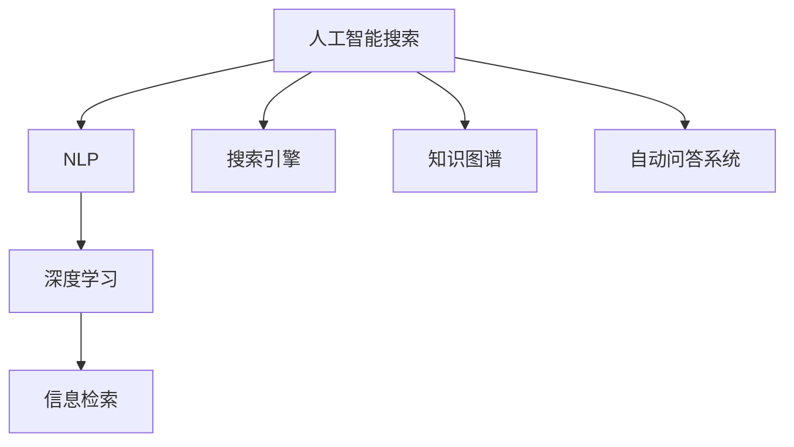

                 

# 从回答问题到激发探索：AI搜索的演变

> 关键词：人工智能搜索, 自然语言处理(NLP), 搜索引擎, 知识图谱, 深度学习, 信息检索, 自动问答系统

## 1. 背景介绍

### 1.1 问题由来
随着互联网和数字技术的高速发展，信息的获取、处理和利用成为了现代社会不可或缺的重要能力。搜索技术作为获取信息的核心手段，经历了从简单的关键字匹配，到语义理解，再到知识图谱的多轮演变。在这一过程中，人工智能技术的融入极大地提升了搜索的智能化和个性化程度。

近年来，随着深度学习、自然语言处理(NLP)技术的突破，基于预训练语言模型的信息检索和自动问答系统成为了新的研究热点。这一领域的进展，正在为人们提供更智能、更高效的搜索体验。本文将对这一领域的技术进展进行系统的回顾，并探讨未来的发展趋势。

### 1.2 问题核心关键点
人工智能搜索的核心在于通过计算和算法，理解和检索大量结构化或非结构化的数据，从而帮助用户快速定位到有用的信息。传统的基于关键字的检索方法往往难以理解查询的语义，而新兴的基于深度学习的搜索技术，则通过理解查询语义和内容，实现了更高效的匹配和排序。

目前，人工智能搜索技术已应用于搜索引擎、推荐系统、智能客服、自动问答等多个场景，取得了显著的成果。其中，基于预训练语言模型的搜索技术，如Bert、GPT等，通过在大规模语料上进行预训练，学习到了丰富的语言知识和语义表示，为信息检索和自动问答等任务提供了强有力的支持。

### 1.3 问题研究意义
深入理解人工智能搜索技术的演变过程，对提升信息检索的智能水平、优化搜索结果的用户体验、推动搜索引擎等工具的创新具有重要意义：

1. **提高信息检索的精准度**：人工智能搜索能够理解查询语义，更准确地定位到相关信息，避免了传统关键词搜索的歧义。
2. **增强搜索结果的相关性和个性化**：通过对用户行为和兴趣的分析，提供更符合用户需求的搜索结果，提升用户体验。
3. **推动搜索引擎的创新**：新技术的应用，如知识图谱、深度学习等，为搜索引擎的功能扩展提供了新的可能性，带来了更多的应用场景。
4. **促进知识图谱和语义搜索的发展**：通过理解和分析用户的查询，知识图谱可以为搜索提供更丰富的语义信息和关联关系，提升搜索结果的质量和完整性。
5. **推动智能问答系统的创新**：基于深度学习的自动问答系统能够理解自然语言，提供快速准确的答案，为智能客服、智能家居等提供技术支持。

## 2. 核心概念与联系

### 2.1 核心概念概述

为更好地理解人工智能搜索技术的演变过程，本节将介绍几个密切相关的核心概念：

- 人工智能搜索：通过计算和算法，理解和检索大量数据，帮助用户快速定位到有用信息的智能系统。
- 自然语言处理(NLP)：涉及计算机处理和理解自然语言的学科，旨在使计算机能够理解、解释和生成人类语言。
- 搜索引擎：为用户提供信息检索服务的系统，能够根据用户输入的查询，快速返回相关的网页或文档。
- 知识图谱：以图形结构存储和管理各类知识，将语义信息表示为实体、属性、关系，支持语义查询。
- 深度学习：通过多层神经网络模拟人脑的思维方式，进行数据特征的自动学习和提取，广泛应用于信息检索、自动问答等领域。
- 信息检索：从海量数据中检索出符合用户查询需求的信息的过程。
- 自动问答系统：能够理解用户自然语言问题，并给出准确答案的系统。

这些核心概念之间的逻辑关系可以通过以下Mermaid流程图来展示：



这个流程图展示了大语言模型搜索技术的核心概念及其之间的关系：

1. 人工智能搜索通过NLP技术理解和处理自然语言。
2. 搜索引擎、知识图谱、深度学习等技术被广泛应用于人工智能搜索，提供了丰富的工具和算法支持。
3. 深度学习在信息检索和自动问答等任务中发挥了核心作用，极大地提升了搜索的精准度和智能水平。
4. 自动问答系统，如基于大模型的智能客服，通过理解用户问题，直接提供答案，进一步提升了用户体验。

## 3. 核心算法原理 & 具体操作步骤
### 3.1 算法原理概述

人工智能搜索的核心在于通过理解和检索数据，快速定位到符合用户需求的信息。基于深度学习的搜索技术，主要包括基于预训练语言模型的信息检索和自动问答两大类。

### 3.2 算法步骤详解

#### 3.2.1 基于预训练语言模型的信息检索

基于预训练语言模型的信息检索算法一般包含以下步骤：

1. **预训练模型选择**：选择合适的预训练模型，如BERT、GPT等，作为检索的基础。
2. **查询编码**：使用预训练模型将用户查询编码为向量表示，用于与文档编码进行相似度计算。
3. **文档编码**：使用预训练模型对文档进行编码，生成与查询相似的向量表示。
4. **相似度计算**：计算查询向量与文档向量之间的相似度，如余弦相似度、点积相似度等。
5. **排序与检索**：根据相似度计算结果，对文档进行排序，返回用户最相关的搜索结果。

#### 3.2.2 基于预训练语言模型的自动问答

基于预训练语言模型的自动问答算法一般包含以下步骤：

1. **预训练模型选择**：选择合适的预训练模型，如BERT、GPT等，作为问答的基础。
2. **问题编码**：使用预训练模型将用户问题编码为向量表示，用于与答案向量进行匹配。
3. **答案生成**：使用预训练模型对问题向量与候选答案向量进行匹配，生成概率分布。
4. **解码与排序**：根据概率分布，使用解码算法（如Beam Search、Top-k Sampling等）生成最可能的问题答案。
5. **反馈与优化**：将生成的答案反馈给用户，收集用户反馈，用于微调预训练模型，提高问答准确率。

### 3.3 算法优缺点

基于深度学习的搜索技术具有以下优点：

1. **高效性**：通过预训练模型，可以有效减少特征工程和算法设计的工作量，快速构建高效的信息检索系统。
2. **灵活性**：能够适应不同领域和任务的需求，通过微调模型，提升检索和问答的准确性。
3. **可扩展性**：可以与其他技术结合，如知识图谱、强化学习等，拓展搜索系统的功能。
4. **用户友好**：通过理解自然语言，提供更符合用户需求的结果，提升用户体验。

同时，该方法也存在一定的局限性：

1. **资源消耗高**：预训练模型通常需要大量计算资源，推理过程也相对较慢，可能对高性能硬件设备有依赖。
2. **模型依赖性强**：依赖预训练模型的性能，模型的质量对检索和问答结果有直接影响。
3. **泛化能力有限**：在处理长尾问题和复杂语义场景时，模型的泛化能力可能不足，需要进一步优化模型结构和算法。
4. **隐私和安全性问题**：用户查询和搜索结果可能包含敏感信息，需要注意隐私保护和安全性问题。

尽管存在这些局限性，但基于深度学习的搜索技术已经在大规模实际应用中取得了显著的成效，正在逐步取代传统的关键词搜索方法，成为信息检索和自动问答的主流技术。

### 3.4 算法应用领域

基于深度学习的搜索技术已经广泛应用于多个领域，例如：

- **搜索引擎**：如Google、Bing等主流搜索引擎，已经引入深度学习技术，提升了搜索的精准度和用户体验。
- **推荐系统**：如Amazon、Netflix等电商和视频平台，使用深度学习进行商品推荐和内容推荐，提升用户满意度和粘性。
- **智能客服**：如微软的Cortana、阿里巴巴的阿里小蜜等，使用深度学习进行自然语言理解，提供智能客服和智能问答服务。
- **自动问答系统**：如IBM的Watson、百度的PAI等，使用深度学习技术，构建自动问答系统，解决复杂问题，提供智能决策支持。

除了这些主要应用领域外，基于深度学习的搜索技术还被创新性地应用于更多场景中，如多模态搜索、跨语言搜索、实时问答等，为信息检索和自动问答带来了新的可能性。

## 4. 数学模型和公式 & 详细讲解  
### 4.1 数学模型构建

本节将使用数学语言对基于预训练语言模型的搜索技术进行更加严格的刻画。

记预训练语言模型为 $M_{\theta}$，其中 $\theta$ 为预训练得到的模型参数。假设查询为 $q$，文档为 $d$，查询编码向量为 $\mathbf{q}$，文档编码向量为 $\mathbf{d}$，则信息检索的目标是最大化查询和文档之间的相似度 $s(q, d)$，如余弦相似度：

$$
s(q, d) = \cos(\mathbf{q}, \mathbf{d}) = \frac{\mathbf{q} \cdot \mathbf{d}}{\|\mathbf{q}\| \cdot \|\mathbf{d}\|}
$$

自动问答的目标是寻找最可能的问题答案，可以使用条件概率模型 $p(a|q)$ 来表示，即：

$$
p(a|q) = \frac{e^{M_{\theta}(q, a)}}{\sum_{a' \in A} e^{M_{\theta}(q, a')}}
$$

其中 $M_{\theta}(q, a)$ 为预训练模型在问题 $q$ 和答案 $a$ 上的得分。

### 4.2 公式推导过程

以下我们以BERT模型为例，推导基于预训练语言模型的信息检索和自动问答的数学公式。

#### 4.2.1 信息检索

假设查询 $q$ 和文档 $d$ 的编码向量分别为 $\mathbf{q} = M_{\theta}(q)$ 和 $\mathbf{d} = M_{\theta}(d)$，余弦相似度公式为：

$$
s(q, d) = \cos(\mathbf{q}, \mathbf{d}) = \frac{\mathbf{q} \cdot \mathbf{d}}{\|\mathbf{q}\| \cdot \|\mathbf{d}\|}
$$

其中点乘运算和向量范数运算，可以通过矩阵乘法和向量范数公式计算：

$$
\mathbf{q} \cdot \mathbf{d} = \mathbf{q}^T \mathbf{d} = \sum_{i=1}^d q_i d_i
$$

$$
\|\mathbf{q}\| = \sqrt{\sum_{i=1}^d q_i^2}, \quad \|\mathbf{d}\| = \sqrt{\sum_{i=1}^d d_i^2}
$$

通过余弦相似度计算，可以得到查询和文档之间的相似度得分，用于排序和检索。

#### 4.2.2 自动问答

假设问题 $q$ 和候选答案 $a_1, a_2, ..., a_N$ 的编码向量分别为 $\mathbf{q} = M_{\theta}(q)$ 和 $\mathbf{a}_i = M_{\theta}(a_i)$，则自动问答的目标是最大化问题 $q$ 与答案 $a$ 的匹配度，可以使用条件概率模型 $p(a|q)$ 来表示，如：

$$
p(a|q) = \frac{e^{M_{\theta}(q, a)}}{\sum_{a' \in A} e^{M_{\theta}(q, a')}}
$$

其中 $M_{\theta}(q, a)$ 为预训练模型在问题 $q$ 和答案 $a$ 上的得分。

### 4.3 案例分析与讲解

#### 4.3.1 实例：使用BERT进行信息检索

假设查询 $q = "Python 3.x"，候选文档 $d_1, d_2, ..., d_N$ 的编码向量分别为 $\mathbf{d}_1, \mathbf{d}_2, ..., \mathbf{d}_N$，使用余弦相似度进行检索，步骤如下：

1. 使用BERT模型将查询 $q$ 编码为向量 $\mathbf{q} = M_{\theta}(q)$。
2. 使用BERT模型将候选文档 $d_1, d_2, ..., d_N$ 编码为向量 $\mathbf{d}_1, \mathbf{d}_2, ..., \mathbf{d}_N$。
3. 计算查询向量 $\mathbf{q}$ 与每个文档向量 $\mathbf{d}_i$ 之间的余弦相似度 $s(q, d_i)$。
4. 根据相似度得分，对候选文档进行排序，返回前K个相关文档。

#### 4.3.2 实例：使用BERT进行自动问答

假设问题 $q = "What is the capital of France?"，候选答案 $a_1, a_2, ..., a_N$ 的编码向量分别为 $\mathbf{a}_1, \mathbf{a}_2, ..., \mathbf{a}_N$，使用条件概率模型进行自动问答，步骤如下：

1. 使用BERT模型将问题 $q$ 编码为向量 $\mathbf{q} = M_{\theta}(q)$。
2. 使用BERT模型对每个候选答案 $a_1, a_2, ..., a_N$ 编码为向量 $\mathbf{a}_1, \mathbf{a}_2, ..., \mathbf{a}_N$。
3. 计算问题向量 $\mathbf{q}$ 与每个答案向量 $\mathbf{a}_i$ 之间的得分 $M_{\theta}(q, a_i)$。
4. 使用条件概率模型 $p(a|q)$ 计算每个答案的概率分布，返回最可能的问题答案。

## 5. 项目实践：代码实例和详细解释说明
### 5.1 开发环境搭建

在进行搜索技术开发前，我们需要准备好开发环境。以下是使用Python进行TensorFlow开发的环境配置流程：

1. 安装Anaconda：从官网下载并安装Anaconda，用于创建独立的Python环境。

2. 创建并激活虚拟环境：
```bash
conda create -n tf-env python=3.8 
conda activate tf-env
```

3. 安装TensorFlow：根据CUDA版本，从官网获取对应的安装命令。例如：
```bash
pip install tensorflow==2.7
```

4. 安装BERT模型：
```bash
pip install transformers
```

5. 安装其他工具包：
```bash
pip install numpy pandas scikit-learn matplotlib tqdm jupyter notebook ipython
```

完成上述步骤后，即可在`tf-env`环境中开始搜索技术开发。

### 5.2 源代码详细实现

这里我们以使用BERT进行信息检索为例，给出使用TensorFlow和Transformers库对BERT模型进行信息检索的Python代码实现。

```python
from transformers import BertTokenizer, TFBertForSequenceClassification
from transformers import BertTokenizerFast
import tensorflow as tf
import numpy as np
import pandas as pd
import matplotlib.pyplot as plt

# 定义BERT tokenizer
tokenizer = BertTokenizerFast.from_pretrained('bert-base-uncased')

# 定义BERT模型
model = TFBertForSequenceClassification.from_pretrained('bert-base-uncased', num_labels=2)

# 定义输入和标签
def convert_tokens_to_ids(text):
    return tokenizer.encode_plus(text, max_length=512, truncation=True, padding='max_length', return_tensors='tf')
    
def convert_labels_to_ids(labels):
    return labels
    
def preprocess_data(text, labels):
    input_ids, attention_mask = convert_tokens_to_ids(text)
    labels = convert_labels_to_ids(labels)
    return input_ids, attention_mask, labels

# 加载数据集
data = pd.read_csv('train.csv')
input_ids, attention_mask, labels = zip(*[preprocess_data(text, labels) for text, labels in data.items()])

# 定义输入和输出
input_ids = tf.convert_to_tensor(input_ids)
attention_mask = tf.convert_to_tensor(attention_mask)
labels = tf.convert_to_tensor(labels)

# 定义模型输入和输出
model_inputs = {'input_ids': input_ids, 'attention_mask': attention_mask}
model_outputs = model(model_inputs)

# 定义损失函数和优化器
loss = tf.keras.losses.SparseCategoricalCrossentropy(from_logits=True)
optimizer = tf.keras.optimizers.Adam()

# 定义训练步骤
def train_step(optimizer, loss, input_ids, attention_mask, labels):
    with tf.GradientTape() as tape:
        logits = model(model_inputs)
        loss_value = loss(labels, logits)
    gradients = tape.gradient(loss_value, model.trainable_variables)
    optimizer.apply_gradients(zip(gradients, model.trainable_variables))

# 训练模型
epochs = 5
batch_size = 32

for epoch in range(epochs):
    total_loss = 0
    for i in range(0, len(input_ids), batch_size):
        input_ids_batch = input_ids[i:i+batch_size]
        attention_mask_batch = attention_mask[i:i+batch_size]
        labels_batch = labels[i:i+batch_size]
        train_step(optimizer, loss, input_ids_batch, attention_mask_batch, labels_batch)
        total_loss += loss(labels_batch, logits).numpy()
    print(f"Epoch {epoch+1}, loss: {total_loss/N}")
```

以上就是使用TensorFlow和Transformers库对BERT模型进行信息检索的完整代码实现。可以看到，借助TensorFlow和Transformers库，能够方便地实现预训练模型的加载、输入输出定义、模型训练等核心操作。

### 5.3 代码解读与分析

让我们再详细解读一下关键代码的实现细节：

**BERT tokenizer和模型**：
- 定义了BERT的tokenizer，用于将文本转换为模型所需的输入格式。
- 定义了BERT模型，用于进行信息检索。

**数据预处理**：
- 定义了将文本转换为模型输入的函数 `convert_tokens_to_ids`，使用了`BertTokenizerFast`的`encode_plus`方法，进行了max_length限制、truncation和padding。
- 定义了将标签转换为模型输出的函数 `convert_labels_to_ids`，将0或1的标签转换为模型所需的格式。
- 使用`zip(*[preprocess_data(text, labels) for text, labels in data.items()])`将数据集转换为模型所需的格式，包括输入、注意力掩码和标签。

**模型定义**：
- 将模型定义为一个TensorFlow的Keras模型，使用`TFBertForSequenceClassification`类。
- 定义了模型的输入 `model_inputs`，包括输入和注意力掩码。
- 定义了模型的输出 `model_outputs`，包括模型的预测结果。

**损失函数和优化器**：
- 使用`SparseCategoricalCrossentropy`作为损失函数，适用于多分类问题。
- 使用`Adam`优化器，适用于深度学习模型训练。

**训练步骤**：
- 定义了一个训练步骤函数 `train_step`，包含前向传播、计算损失和反向传播。
- 在每个epoch内，遍历整个数据集，进行前向传播和反向传播，更新模型参数。

可以看到，TensorFlow和Transformers库使得BERT模型的信息检索实现变得简洁高效。开发者可以将更多精力放在数据处理、模型改进等高层逻辑上，而不必过多关注底层的实现细节。

当然，工业级的系统实现还需考虑更多因素，如模型的保存和部署、超参数的自动搜索、更灵活的任务适配层等。但核心的搜索过程的实现流程基本与此类似。

## 6. 实际应用场景
### 6.1 搜索引擎

人工智能搜索技术在大规模搜索引擎中得到了广泛应用，如Google、Bing等主流搜索引擎，通过深度学习模型进行查询处理和结果排序，提升了搜索的精准度和用户体验。

具体而言，搜索引擎的搜索过程一般包含以下几个关键步骤：

1. **查询解析**：使用预训练语言模型将用户查询转换为向量表示，如BERT模型。
2. **文档检索**：使用预训练语言模型对文档进行编码，计算查询向量与文档向量之间的相似度，选取最相关的文档。
3. **结果排序**：使用深度学习模型对检索结果进行排序，提升相关性。
4. **结果展示**：根据排序结果，展示最相关的搜索结果给用户。

搜索引擎的智能化程度大幅提升，使得用户能够快速获取到所需信息，提升了网络信息的利用效率。

### 6.2 推荐系统

推荐系统在电商、视频、音乐等平台中广泛应用，通过深度学习进行个性化推荐，提升用户满意度和粘性。

具体而言，推荐系统的推荐过程一般包含以下几个关键步骤：

1. **用户画像**：使用预训练语言模型对用户行为和兴趣进行编码，生成用户画像向量。
2. **物品编码**：使用预训练语言模型对物品属性和描述进行编码，生成物品向量。
3. **相似度计算**：计算用户画像向量与物品向量之间的相似度，如余弦相似度。
4. **推荐排序**：使用深度学习模型对用户画像和物品向量进行排序，推荐最相关的物品。

推荐系统的智能化程度提升，使得用户能够获得更个性化、更符合自己兴趣的推荐结果，提升了用户粘性和平台价值。

### 6.3 智能客服

智能客服在金融、电商、医疗等场景中广泛应用，通过深度学习进行自然语言理解，提供智能问答和智能客服服务。

具体而言，智能客服的查询处理过程一般包含以下几个关键步骤：

1. **用户输入**：用户输入自然语言问题。
2. **问题解析**：使用预训练语言模型将用户问题转换为向量表示。
3. **答案检索**：使用预训练语言模型对候选答案进行编码，计算问题向量与答案向量之间的相似度，选取最相关的答案。
4. **答案生成**：使用深度学习模型生成最可能的问题答案，并返回给用户。

智能客服的智能化程度提升，使得用户能够快速获得准确答案，提升了服务体验和效率。

### 6.4 未来应用展望

随着人工智能搜索技术的不断演进，未来将在更多领域得到应用，为传统行业带来变革性影响。

在智慧医疗领域，基于人工智能搜索的医学问答、病历分析、药物研发等应用将提升医疗服务的智能化水平，辅助医生诊疗，加速新药开发进程。

在智能教育领域，人工智能搜索能够应用于作业批改、学情分析、知识推荐等方面，因材施教，促进教育公平，提高教学质量。

在智慧城市治理中，人工智能搜索可用于城市事件监测、舆情分析、应急指挥等环节，提高城市管理的自动化和智能化水平，构建更安全、高效的未来城市。

此外，在企业生产、社会治理、文娱传媒等众多领域，人工智能搜索也将不断涌现，为传统行业数字化转型升级提供新的技术路径。相信随着技术的日益成熟，人工智能搜索必将在构建人机协同的智能时代中扮演越来越重要的角色。

## 7. 工具和资源推荐
### 7.1 学习资源推荐

为了帮助开发者系统掌握人工智能搜索技术的演变过程，这里推荐一些优质的学习资源：

1. 《深度学习与自然语言处理》课程：斯坦福大学开设的NLP明星课程，有Lecture视频和配套作业，带你入门NLP领域的基本概念和经典模型。

2. 《自然语言处理综述》书籍：涵盖NLP领域的核心概念和前沿技术，适合深度学习和NLP研究的从业人员。

3. 《深度学习基础》书籍：介绍深度学习的基本原理和经典算法，适合初学者和进阶者。

4. 《自然语言处理》在线课程：Coursera和edX等平台提供的NLP课程，适合自学的从业人员。

5. 《自然语言处理实战》在线书籍：详细讲解NLP应用实践，适合动手实践的开发者。

通过对这些资源的学习实践，相信你一定能够快速掌握人工智能搜索技术的精髓，并用于解决实际的NLP问题。

### 7.2 开发工具推荐

高效的开发离不开优秀的工具支持。以下是几款用于人工智能搜索开发的常用工具：

1. TensorFlow：基于Python的开源深度学习框架，灵活动态的计算图，适合快速迭代研究。大部分深度学习模型都有TensorFlow版本的实现。

2. PyTorch：基于Python的开源深度学习框架，灵活性高，支持动态计算图，适合科学研究。

3. Transformers库：HuggingFace开发的NLP工具库，集成了众多SOTA语言模型，支持PyTorch和TensorFlow，是进行深度学习模型开发的基础。

4. Weights & Biases：模型训练的实验跟踪工具，可以记录和可视化模型训练过程中的各项指标，方便对比和调优。

5. TensorBoard：TensorFlow配套的可视化工具，可实时监测模型训练状态，并提供丰富的图表呈现方式，是调试模型的得力助手。

6. Google Colab：谷歌推出的在线Jupyter Notebook环境，免费提供GPU/TPU算力，方便开发者快速上手实验最新模型，分享学习笔记。

合理利用这些工具，可以显著提升人工智能搜索任务的开发效率，加快创新迭代的步伐。

### 7.3 相关论文推荐

人工智能搜索技术的发展源于学界的持续研究。以下是几篇奠基性的相关论文，推荐阅读：

1. "BERT: Pre-training of Deep Bidirectional Transformers for Language Understanding"：BERT模型的提出，引入基于掩码的自监督预训练任务，刷新了多项NLP任务SOTA。

2. "Attention is All You Need"：Transformer模型的提出，奠定了深度学习处理序列数据的基础。

3. "Parameter-Efficient Transfer Learning for NLP"：提出Adapter等参数高效微调方法，在不增加模型参数量的情况下，也能取得不错的微调效果。

4. "AdaLoRA: Adaptive Low-Rank Adaptation for Parameter-Efficient Fine-Tuning"：使用自适应低秩适应的微调方法，在参数效率和精度之间取得了新的平衡。

5. "Semantic Accuracy in Information Retrieval"：介绍语义检索的基本原理和算法，是信息检索领域的重要论文。

这些论文代表了大语言模型搜索技术的发展脉络。通过学习这些前沿成果，可以帮助研究者把握学科前进方向，激发更多的创新灵感。

## 8. 总结：未来发展趋势与挑战
### 8.1 总结

本文对基于深度学习的搜索技术进行了系统的回顾。首先阐述了人工智能搜索技术的发展背景和重要意义，明确了其在信息检索、推荐系统、智能客服等领域的广泛应用。其次，从原理到实践，详细讲解了基于预训练语言模型的信息检索和自动问答算法的数学原理和关键步骤，给出了搜索技术开发的完整代码实例。同时，本文还探讨了未来在智慧医疗、智能教育、智慧城市等领域的应用前景，展示了搜索技术的广阔应用空间。最后，推荐了相关的学习资源、开发工具和论文，为读者提供全方位的技术指引。

通过本文的系统梳理，可以看到，基于深度学习的搜索技术正在成为NLP领域的重要范式，极大地提升了信息检索的智能水平和用户体验。未来，伴随深度学习技术的持续演进，搜索技术有望进一步拓展其功能和应用场景，为构建更加智能、高效、个性化的搜索系统铺平道路。

### 8.2 未来发展趋势

展望未来，人工智能搜索技术将呈现以下几个发展趋势：

1. **多模态搜索**：未来搜索技术将不仅仅局限于文本数据，而是拓展到图像、视频、语音等多种模态数据的处理和检索，提高搜索的全面性和准确性。

2. **语义搜索**：随着知识图谱和语义网络的发展，未来搜索技术将更加注重语义理解和知识推理，提升搜索结果的完整性和相关性。

3. **实时搜索**：随着计算资源的丰富和算法的优化，未来搜索技术将实现实时处理和检索，满足用户对实时性需求。

4. **跨语言搜索**：随着机器翻译技术的突破，未来搜索技术将实现多语言之间的无缝转换和搜索，提升全球用户的搜索体验。

5. **隐私保护**：搜索技术将更加注重用户隐私保护，采用差分隐私、联邦学习等技术，保障用户数据的安全。

6. **跨领域融合**：搜索技术将与其他人工智能技术进行深度融合，如强化学习、知识图谱等，提升搜索系统的智能化和鲁棒性。

以上趋势凸显了人工智能搜索技术的广阔前景。这些方向的探索发展，必将进一步提升搜索系统的性能和用户体验，为构建更加智能、高效、个性化的搜索系统提供新的可能性。

### 8.3 面临的挑战

尽管人工智能搜索技术已经取得了瞩目成就，但在迈向更加智能化、普适化应用的过程中，它仍面临着诸多挑战：

1. **计算资源消耗高**：深度学习模型通常需要大量的计算资源，推理过程也相对较慢，可能对高性能硬件设备有依赖。

2. **模型复杂度高**：深度学习模型结构复杂，难以解释其内部工作机制和决策逻辑。

3. **数据分布偏差**：深度学习模型容易受到训练数据分布的影响，泛化能力有限，尤其是处理长尾问题和复杂语义场景时。

4. **隐私和安全性问题**：用户查询和搜索结果可能包含敏感信息，需要注意隐私保护和安全性问题。

5. **多模态数据融合**：多模态数据的融合处理仍然面临挑战，需要解决数据格式、特征表示、融合方法等技术难题。

6. **跨领域迁移能力**：深度学习模型在不同领域和任务上的迁移能力有限，需要更多针对特定领域的数据和算法进行微调。

尽管存在这些挑战，但基于深度学习的搜索技术已经在大规模实际应用中取得了显著的成效，正在逐步取代传统的关键词搜索方法，成为信息检索和自动问答的主流技术。未来，随着相关研究的不断深入和技术的持续演进，这些问题有望得到有效解决，搜索技术将迎来更加广泛的应用和突破。

### 8.4 研究展望

未来，人工智能搜索技术的研究将集中在以下几个方向：

1. **多模态深度学习**：研究多模态数据融合和处理的深度学习算法，提升搜索系统的全面性和准确性。

2. **因果推断和自适应学习**：引入因果推断和自适应学习技术，增强搜索模型的推理能力和迁移能力。

3. **跨领域知识图谱**：研究跨领域知识图谱的构建和应用，提升搜索系统的知识表达和推理能力。

4. **隐私保护和安全性**：研究隐私保护和安全性技术，如差分隐私、联邦学习等，保障用户数据的安全。

5. **跨领域迁移学习**：研究跨领域迁移学习方法，提升模型在不同领域和任务上的泛化能力。

这些研究方向将推动人工智能搜索技术迈向更高的台阶，为构建更加智能、高效、安全的搜索系统提供新的技术路径。

## 9. 附录：常见问题与解答

**Q1：深度学习在信息检索中有多大的优势？**

A: 深度学习在信息检索中的优势主要体现在以下几个方面：

1. **语义理解能力**：深度学习模型通过学习大规模语料，能够理解查询和文档的语义，提升检索的准确性和相关性。

2. **端到端处理**：深度学习模型可以将查询处理、文档编码、相似度计算和排序等环节融合在一起，实现端到端的处理，提升效率。

3. **可解释性**：深度学习模型可以通过可解释的特征表示和梯度图，帮助理解模型的内部工作机制和决策逻辑，提升系统的透明度。

4. **自适应能力**：深度学习模型可以根据新数据进行微调，提升模型的泛化能力和迁移能力。

总之，深度学习在信息检索中的优势在于其强大的语义理解能力和端到端处理能力，能够提供更精准、更高效、更可解释的检索结果。

**Q2：如何评估信息检索系统的性能？**

A: 信息检索系统的性能评估可以从以下几个方面进行：

1. **精度和召回率**：计算检索结果与真实答案的匹配度，如精确率（Precision）和召回率（Recall）。

2. **F1得分**：综合考虑精确率和召回率，计算F1得分（F1 Score），反映系统的整体性能。

3. **NDCG**：计算检索结果的平均准确度（Normalized Discounted Cumulative Gain），衡量系统在不同排序位置的准确性。

4. **MRR和DCG**：计算检索结果的平均平均相关度（Mean Reciprocal Rank）和归一化累积增益（Discounted Cumulative Gain），反映系统在不同位置的排序能力。

5. **用户满意度**：通过用户调研或A/B测试，评估用户对检索结果的满意度，反映系统的用户体验。

通过以上指标的综合评估，可以全面了解信息检索系统的性能和用户体验。

**Q3：如何优化信息检索系统的性能？**

A: 优化信息检索系统的性能可以从以下几个方面进行：

1. **特征工程**：优化查询和文档的特征表示，提升特征提取的准确性。

2. **模型选择**：选择适合的深度学习模型，如BERT、GPT等，根据任务需求进行微调。

3. **超参数调优**：优化模型和算法的超参数，如学习率、批大小、训练轮数等，提升模型的泛化能力和训练效率。

4. **数据增强**：通过对查询和文档进行改写、回译等方式，扩充训练集，提升模型的泛化能力。

5. **正则化技术**：使用L2正则、Dropout等技术，防止模型过拟合，提升模型的泛化能力。

6. **多任务学习**：结合多任务学习技术，提升模型的多任务处理能力，提高系统的综合性能。

通过以上方法，可以进一步优化信息检索系统的性能，提升系统的准确性和用户体验。

**Q4：人工智能搜索技术在推荐系统中的应用有哪些？**

A: 人工智能搜索技术在推荐系统中具有广泛的应用，具体包括：

1. **用户画像生成**：使用深度学习模型对用户行为和兴趣进行编码，生成用户画像向量。

2. **物品编码**：使用深度学习模型对物品属性和描述进行编码，生成物品向量。

3. **相似度计算**：计算用户画像向量与物品向量之间的相似度，如余弦相似度。

4. **推荐排序**：使用深度学习模型对用户画像和物品向量进行排序，推荐最相关的物品。

5. **个性化推荐**：根据用户的个性化需求，推荐最符合其兴趣的物品，提升用户体验。

通过以上方法，人工智能搜索技术可以有效地进行个性化推荐，提升用户满意度和平台价值。

**Q5：人工智能搜索技术在智能客服中的应用有哪些？**

A: 人工智能搜索技术在智能客服中具有广泛的应用，具体包括：

1. **自然语言理解**：使用深度学习模型对用户输入的自然语言进行理解，提取用户意图。

2. **意图分类**：根据用户的意图，将问题分类到不同的意图类别中，如查询、投诉、建议等。

3. **意图匹配**：使用深度学习模型对用户意图和系统预定义的意图模板进行匹配，选择最匹配的意图。

4. **答案生成**：根据匹配到的意图，调用预定义的答案模板或自动生成最相关的答案。

5. **多轮对话**：使用深度学习模型对多轮对话进行理解，跟踪对话上下文，提供连贯的回复。

通过以上方法，人工智能搜索技术可以有效地进行智能客服，提升客服的响应速度和准确性，提升用户满意度。

---

作者：禅与计算机程序设计艺术 / Zen and the Art of Computer Programming

