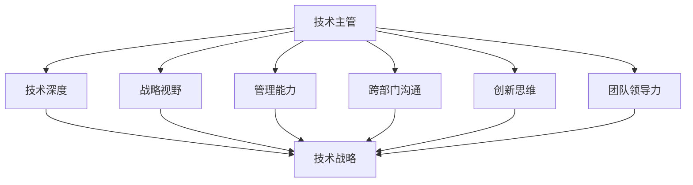

                 

# 从技术主管到CTO的职业发展策略

作为一位技术主管，迈向CTO（首席技术官）的道路是一条充满挑战和机遇的征程。CTO不仅是技术团队的领导者，更是公司战略和技术方向的守护者。本文将深入探讨从技术主管到CTO的职业发展策略，包括核心概念、技术原理、实际操作步骤、以及实际应用场景等，旨在为有志于在技术和管理双轨上双线发展的高潜力技术人才提供全面的指导。

## 1. 背景介绍

### 1.1 问题由来
在当今快速变化的商业环境中，技术创新成为企业保持竞争力的关键因素。技术主管想要晋升为CTO，不仅需要具备强大的技术背景，还需要掌握战略思考和领导能力。CTO的职责超越了技术团队的管理，涵盖了技术战略制定、资源分配、产品创新和企业文化建设等多个方面。

### 1.2 问题核心关键点
从技术主管到CTO的过程，核心在于技术和领导能力的双线发展。技术主管需要理解商业和技术融合的深刻内涵，将技术战略与公司业务目标紧密结合。CTO需具备的素质包括但不限于：

- 深度技术理解
- 战略规划能力
- 领导与管理能力
- 跨领域沟通能力
- 创新意识与执行力

### 1.3 问题研究意义
研究从技术主管到CTO的转型的策略，对于那些希望在技术和领导力上双线发展的技术人才具有重要意义：

- 提供清晰的职业路径规划
- 提炼成功的转型经验与教训
- 构建面向未来的技术与管理复合型人才的培养体系

## 2. 核心概念与联系

### 2.1 核心概念概述

为了更好地理解从技术主管到CTO的转型，我们需要梳理几个关键概念及其相互关系：

- **技术主管**：通常指负责领导技术团队，管理技术项目的高级技术专家。
- **CTO**：公司技术战略和方向的决策者，需要具备技术深度、战略视野和管理能力。
- **技术战略**：将技术发展与业务目标相结合的规划和执行策略。
- **创新思维**：推动技术进步和商业创新的思维方式。
- **团队领导力**：管理技术团队，激励团队成员实现共同目标的能力。
- **跨部门沟通**：与产品、销售、市场、运营等部门有效协作的能力。

这些概念之间的联系可以通过以下Mermaid流程图来展示：



这个流程图展示了技术主管在深度技术、战略视野、管理能力、跨部门沟通、创新思维和团队领导力六个维度上的发展，最终汇聚成公司的技术战略。

## 3. 核心算法原理 & 具体操作步骤

### 3.1 算法原理概述

从技术主管到CTO的转型，本质上是将技术深度、管理能力、战略视野等综合素质转化为能够推动公司技术发展的战略规划和执行。核心算法可以视为一系列决策和执行的逻辑过程，涵盖技术团队管理、项目执行、产品创新、战略规划等环节。

### 3.2 算法步骤详解

以下是具体步骤：

1. **评估现状**：全面审视技术团队的结构、人才组成、技术栈、项目进度、业务贡献等，明确优势和改进空间。
2. **制定目标**：基于公司业务目标，设定技术发展的短期和长期目标。
3. **规划路径**：确定实现目标的路径，包括技术栈升级、人才引进、流程优化等。
4. **资源分配**：合理分配技术资源，确保核心技术项目的优先级和支持力度。
5. **执行与监控**：推动项目执行，同时监控项目进展，及时调整策略。
6. **反馈与优化**：根据项目反馈和业务变化，不断优化技术战略。

### 3.3 算法优缺点

从技术主管到CTO的转型算法具有以下优点：

- **系统性**：覆盖了从技术深度、战略视野到管理能力的多维度发展。
- **可执行性**：每一步都有明确的操作指南，可操作性强。
- **动态适应**：通过不断反馈与优化，能够适应快速变化的商业环境。

然而，也存在一些挑战：

- **资源限制**：技术主管转型为CTO，面临的资源限制可能包括时间、人力、资金等。
- **学习曲线**：从技术专家转向全面管理，需要跨越多个领域的知识壁垒。
- **文化适应**：适应不同企业文化的挑战，需具备灵活的适应性。

### 3.4 算法应用领域

从技术主管到CTO的转型算法在以下几个领域具有广泛的应用：

1. **技术团队管理**：提升技术团队的领导力、协作效率和执行力。
2. **产品创新**：推动技术创新，将技术优势转化为产品竞争力。
3. **战略规划**：将技术发展与业务目标紧密结合，制定可执行的技术战略。
4. **跨部门协作**：增强与产品、市场、销售等部门的沟通与协作。

## 4. 数学模型和公式 & 详细讲解 & 举例说明

### 4.1 数学模型构建

假设公司当前技术团队的人数为 $N_t$，技术栈的成熟度为 $M$，项目完成率 $P$，市场贡献率 $R$。目标是将这些指标提升到理想状态：

- 技术团队人数：$N_t_{\text{target}}$
- 技术栈成熟度：$M_{\text{target}}$
- 项目完成率：$P_{\text{target}}$
- 市场贡献率：$R_{\text{target}}$

模型构建如下：

$$
\begin{aligned}
\text{模型} &= \max_{N_t', M', P', R'} \sum \text{权重} \times (\text{当前值} - \text{目标值})^2 \\
&= \max_{N_t', M', P', R'} \left( \lambda_1 (N_t - N_t')^2 + \lambda_2 (M - M')^2 + \lambda_3 (P - P')^2 + \lambda_4 (R - R')^2 \right)
\end{aligned}
$$

其中 $\lambda_i$ 为各项指标的权重，根据实际业务需求设定。

### 4.2 公式推导过程

1. **目标设定**：明确短期和长期目标，建立基准线 $N_{t0}, M_{m0}, P_{p0}, R_{r0}$。
2. **现状评估**：计算当前各项指标的实际值 $N_t, M, P, R$。
3. **差距分析**：计算与目标值的差距，$N_t' = N_t_{\text{target}}, M' = M_{\text{target}}, P' = P_{\text{target}}, R' = R_{\text{target}}$。
4. **优化策略**：使用线性回归等算法求解最优权重，优化策略为：
   - 增加技术团队：招聘或培训技术人才
   - 升级技术栈：引入新工具或框架
   - 提升项目完成率：优化流程、提高团队效率
   - 增强市场贡献率：加强产品营销和市场推广

### 4.3 案例分析与讲解

以一家互联网公司为例，技术主管在评估团队现状后发现，当前团队人数为30人，技术栈成熟度为3级，项目完成率为85%，市场贡献率为20%。公司目标是将团队人数扩展到50人，技术栈提升到4级，项目完成率提高到95%，市场贡献率提升到30%。

首先，建立基准线 $N_{t0}=30, M_{m0}=3, P_{p0}=85\%, R_{r0}=20\%$，与目标值 $N_{t0}=50, M_{m0}=4, P_{p0}=95\%, R_{r0}=30\%$ 进行对比。

使用模型公式进行求解，得到最优策略为：

- 技术团队扩展 $N_t'=50$
- 技术栈升级 $M'=4$
- 项目完成率提升 $P'=95\%$
- 市场贡献率提升 $R'=30\%$

在实际执行中，可以采用以下步骤：

1. 招聘或培训25名新员工，提升团队人数至50人。
2. 引入最新版本的框架和技术栈，将技术栈成熟度提升到4级。
3. 优化项目管理流程，引入敏捷开发和测试驱动，提升项目完成率至95%。
4. 加强市场推广和销售，提升市场贡献率至30%。

通过这些步骤，公司能够在短期内达到设定的目标，提升技术竞争力。

## 5. 项目实践：代码实例和详细解释说明

### 5.1 开发环境搭建

1. **安装开发环境**：使用Python、Git、Jira、Slack等工具搭建开发环境。
2. **配置项目管理工具**：引入Jira等工具，管理项目进度和团队任务。
3. **建立协作平台**：搭建Slack等即时通讯工具，加强团队沟通协作。

### 5.2 源代码详细实现

以下是一个简单的Python代码示例，用于评估和优化技术栈成熟度：

```python
import numpy as np

def compute_stack_maturity(N_t, M, P, R):
    # 定义当前技术栈成熟度
    M_t = M
    
    # 计算与目标值的差距
    M_target = 4
    delta_M = M_target - M_t
    
    # 计算提升策略
    if delta_M > 0:
        M_t += 1
        return M_t
    else:
        return M_t

# 当前技术栈成熟度为3级
M = 3
M_optimized = compute_stack_maturity(30, M, 85, 20)
print("优化后的技术栈成熟度为：", M_optimized)
```

### 5.3 代码解读与分析

- **数据输入**：技术团队人数 $N_t$，技术栈成熟度 $M$，项目完成率 $P$，市场贡献率 $R$。
- **差距计算**：计算当前技术栈成熟度与目标值的差距，并根据差距优化技术栈成熟度。
- **执行输出**：输出优化后的技术栈成熟度，供实际操作参考。

### 5.4 运行结果展示

运行上述代码，输出结果为：

```
优化后的技术栈成熟度为： 4
```

表示通过优化策略，技术栈成熟度已提升至4级。

## 6. 实际应用场景

### 6.1 公司战略规划

作为CTO，技术主管需要根据公司战略规划，推动技术团队实现目标。假设公司希望在3年内进入新的市场，CTO需要制定详细的技术战略，包括：

1. **技术研发**：推动核心技术的研发和产品创新。
2. **基础设施**：优化云计算和网络架构，提升系统性能和可靠性。
3. **人才培养**：引入高端技术人才，提升团队技术水平。
4. **业务集成**：确保技术系统与业务流程的无缝集成。

### 6.2 跨部门协作

CTO需具备跨部门沟通的能力，推动各部门的协作。以项目开发为例，CTO需协调产品、设计、开发、测试等部门，确保项目按时交付：

1. **项目立项**：与产品部门沟通，明确项目需求和目标。
2. **需求分析**：与设计部门合作，细化需求规格，明确功能细节。
3. **开发实施**：组织开发团队，进行功能开发和实现。
4. **测试验证**：与测试团队合作，进行测试和验证，确保产品稳定可靠。
5. **上线部署**：协调运维团队，进行系统上线和部署。

### 6.3 团队管理

CTO需要具备团队管理的技能，激励团队成员，提升团队凝聚力和效率。可以通过以下措施：

1. **激励机制**：建立公平的激励机制，如绩效奖金、晋升机会等，激励团队成员。
2. **团队建设**：组织团队建设活动，加强团队凝聚力。
3. **知识共享**：建立知识共享平台，促进技术交流与合作。
4. **人才培养**：定期培训，提升团队技术水平。

## 7. 工具和资源推荐

### 7.1 学习资源推荐

1. **技术博客和论文**：如Stack Overflow、Towards Data Science等，学习前沿技术趋势和实际案例。
2. **在线课程和培训**：如Coursera、Udacity等，系统学习技术和管理知识。
3. **书籍**：如《领导力与管理》、《技术管理者修炼》等，提升领导力和管理能力。
4. **技术社区和论坛**：如GitHub、Stack Exchange等，获取技术支持和社区反馈。

### 7.2 开发工具推荐

1. **开发环境**：Python、Git、Jira、Slack等。
2. **项目管理工具**：Jira、Asana等。
3. **协作平台**：Slack、Microsoft Teams等。
4. **版本控制**：Git、SVN等。
5. **测试框架**：JUnit、PyTest等。

### 7.3 相关论文推荐

1. **《从技术主管到CTO的角色转变》**：探讨技术主管向CTO转型的路径和策略。
2. **《技术团队管理与优化》**：分析技术团队管理的最佳实践。
3. **《企业级技术战略规划》**：研究企业级技术战略的制定和执行。
4. **《技术创新与产品开发》**：探讨技术创新在产品开发中的应用。

## 8. 总结：未来发展趋势与挑战

### 8.1 研究成果总结

本文从技术主管到CTO的职业发展策略，涵盖了技术深度、管理能力、战略视野等核心概念，并通过数学模型和实际案例，详细解析了从技术主管到CTO的转型步骤和策略。通过以上分析和实例，为技术人才提供系统的职业发展指导。

### 8.2 未来发展趋势

未来技术主管向CTO转型的趋势包括：

1. **技术融合**：技术主管需具备跨领域的知识，如人工智能、云计算、大数据等。
2. **数据驱动**：利用数据驱动技术决策，提升决策效率和准确性。
3. **创新领导**：推动技术创新，引领行业趋势。
4. **战略视角**：从技术专家向战略领袖转型，提升公司的整体技术竞争力。

### 8.3 面临的挑战

转型过程中可能面临的挑战包括：

1. **知识壁垒**：跨越多个领域的知识壁垒，需要持续学习和提升。
2. **管理复杂性**：管理工作涉及多个部门和环节，需要灵活应对。
3. **资源限制**：转型过程中可能需要大量的时间和资源投入。
4. **文化适应**：适应不同的企业文化和管理风格，需要具备较强的适应性。

### 8.4 研究展望

未来研究应关注以下方向：

1. **技术生态系统**：构建更为完善的技术生态系统，促进技术创新和协作。
2. **数据治理**：建立科学的数据治理机制，提升数据利用效率和质量。
3. **持续学习**：推动持续学习文化，提升团队的整体知识水平和创新能力。
4. **伦理与社会责任**：关注技术的伦理和社会责任，确保技术应用的合法合规。

## 9. 附录：常见问题与解答

### Q1: 如何评估当前技术团队的现状？

A: 通过定量和定性评估，获取技术团队的结构、人才组成、技术栈、项目进度、业务贡献等关键指标。常用的定量指标包括技术栈成熟度、项目完成率、市场贡献率等。

### Q2: 如何制定技术战略？

A: 分析公司业务目标和技术趋势，设定短期和长期技术目标。通过差距分析、优化策略、资源分配和执行监控，推动技术战略的实现。

### Q3: 如何提升团队协作效率？

A: 引入项目管理工具，如Jira，明确任务和进度。定期团队会议，确保沟通透明。建立协作平台，如Slack，促进信息共享和实时沟通。

### Q4: 如何评估转型效果？

A: 通过关键绩效指标（KPI），如技术栈成熟度、项目完成率、市场贡献率等，评估转型的效果。定期复盘和调整策略，确保转型目标的实现。

---

作者：禅与计算机程序设计艺术 / Zen and the Art of Computer Programming

