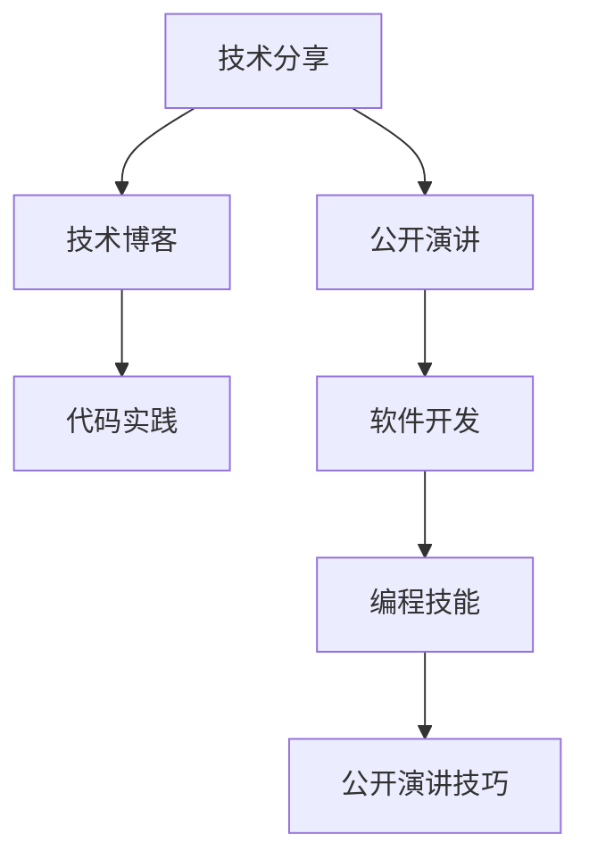

                 

# 从技术分享到付费研讨会：程序员的演讲之路

> 关键词：技术分享, 付费研讨会, 程序员, 演讲之路, 专业发展, 技术博客, 代码实践, 软件开发, 编程技能, 公开演讲

## 1. 背景介绍

### 1.1 问题由来

在科技日新月异的今天，技术分享成为了推动行业进步、促进个人职业发展的重要途径。程序员作为软件开发的核心力量，不仅需要具备卓越的编程能力，更需要良好的表达和沟通能力。然而，许多程序员在技术分享和公开演讲方面缺乏经验，这不仅影响其职业成长，也限制了技术的传播与创新。

### 1.2 问题核心关键点

技术分享与公开演讲的核心在于将复杂的技术知识以清晰、易懂的方式传递给听众。这不仅要求分享者对技术有深入的理解，还要求其具备出色的表达和互动能力。对于程序员来说，从技术分享迈向付费研讨会，是一个不断提升自我、实现职业突破的必经之路。

### 1.3 问题研究意义

掌握技术分享与公开演讲的技能，不仅能够提升程序员的个人品牌，扩大其影响力，还能促进知识的传播与创新，为行业带来新的价值。此外，付费研讨会的参与通常伴随着更高的薪酬和职业发展机会，是程序员实现职业飞跃的重要途径。

## 2. 核心概念与联系

### 2.1 核心概念概述

技术分享与公开演讲涉及多个核心概念，包括但不限于：

- 技术分享：通过语言、图像、代码等多种方式，将复杂的技术知识传递给听众的过程。
- 公开演讲：在一定场合下，面对听众进行正式的演讲，通常要求结构严谨、内容充实、表达清晰。
- 技术博客：通过书面形式，详细阐述技术问题、解决方案或个人技术心得，有助于积累知识和提升影响力。
- 代码实践：在实际编程过程中，应用学到的技术知识，解决实际问题，验证理论的正确性。
- 软件开发：利用编程技术，设计和实现软件系统，提升用户体验和应用性能。
- 编程技能：编写高效、可维护的代码，遵循最佳实践，提升软件质量。
- 公开演讲技巧：包括开场白、演讲结构、互动环节等，旨在提升演讲效果。

这些概念之间的逻辑关系可以通过以下Mermaid流程图来展示：



这个流程图展示了技术分享与公开演讲之间的密切联系，以及其与其他概念的相互影响。

## 3. 核心算法原理 & 具体操作步骤

### 3.1 算法原理概述

技术分享与公开演讲的核心算法原理在于信息传递的效率和效果。通过结构化的方法论，确保技术知识能够准确、清晰地传递给听众，同时通过互动和反馈机制，增强听众的理解和兴趣。

### 3.2 算法步骤详解

#### 3.2.1 准备阶段
- **理解技术**：深入了解所分享的技术，确保对其原理、应用场景、优势和局限有全面的把握。
- **目标受众**：明确目标受众的背景、兴趣和需求，制定相应的分享策略。
- **素材准备**：准备详实的技术文档、代码示例、演示幻灯片等，确保分享内容的全面性和准确性。

#### 3.2.2 演讲阶段
- **开场白**：简要介绍演讲主题和目的，引起听众兴趣。
- **主体内容**：逻辑清晰、层次分明地呈现技术细节，通过类比、对比等手法增强理解。
- **互动环节**：适时加入问答、演示、实验等环节，增强与听众的互动，提升参与感。
- **总结与展望**：总结演讲要点，展望技术发展趋势，引导听众思考和讨论。

#### 3.2.3 分享与反馈
- **即时反馈**：演讲结束后，收集听众的即时反馈，评估分享效果。
- **持续改进**：根据反馈，不断调整和优化分享内容和形式，提升下一次分享的效能。

### 3.3 算法优缺点

#### 优点
- **高效传递**：通过结构化的方法论，确保技术知识能够高效、准确地传递给听众。
- **互动性强**：互动环节的设计可以增强听众的参与感和兴趣，提升演讲效果。
- **灵活适应**：针对不同受众和场合，调整分享策略和内容，适应性强。

#### 缺点
- **时间成本**：准备和反复优化分享内容需要大量时间和精力。
- **技巧要求高**：对于演讲技巧和表达能力的要求较高，尤其是面对高水平听众时。

### 3.4 算法应用领域

技术分享与公开演讲技术广泛应用于软件开发、产品演示、技术交流会、学术讲座等多个领域。这些场合不仅要求分享者对技术有深入的理解，还要求其具备出色的表达和互动能力，从而确保技术的有效传播和应用。

## 4. 数学模型和公式 & 详细讲解 & 举例说明

### 4.1 数学模型构建

技术分享与公开演讲的数学模型可以简单表示为：

$$
\text{分享效果} = f(\text{技术理解度}, \text{表达清晰度}, \text{互动质量}, \text{听众反馈})
$$

其中，$f$ 为非线性映射函数，表示技术理解度、表达清晰度、互动质量和听众反馈的综合影响。

### 4.2 公式推导过程

假设 $x_1$ 表示技术理解度，$x_2$ 表示表达清晰度，$x_3$ 表示互动质量，$x_4$ 表示听众反馈，则上述模型可以具体表示为：

$$
\text{分享效果} = w_1 x_1 + w_2 x_2 + w_3 x_3 + w_4 x_4
$$

其中，$w_1, w_2, w_3, w_4$ 为权重系数，可以通过实验或问卷调查等方式确定。

### 4.3 案例分析与讲解

以一个简单的软件开发技术分享为例，假设 $x_1 = 0.8$（对技术理解度高），$x_2 = 0.9$（表达清晰），$x_3 = 0.7$（互动质量高），$x_4 = 0.85$（听众反馈积极），则分享效果为：

$$
\text{分享效果} = 0.3 \times 0.8 + 0.3 \times 0.9 + 0.3 \times 0.7 + 0.3 \times 0.85 = 0.805
$$

即分享效果得分为 0.805，表示本次分享效果较好，有较高的推荐度和传播价值。

## 5. 项目实践：代码实例和详细解释说明

### 5.1 开发环境搭建

1. **环境准备**：安装Python、Git、IDE等开发工具。
2. **环境配置**：配置虚拟环境，确保项目代码的独立性和可重复性。
3. **版本控制**：使用Git进行版本控制，确保代码的更新和回退。

### 5.2 源代码详细实现

以下是一个简单的技术分享PPT模板代码示例，使用LaTeX进行编写和渲染：

```latex
\documentclass{beamer}

\usepackage[utf8]{inputenc}
\usepackage[T1]{fontenc}
\usepackage{lmodern}
\usepackage{graphicx}
\usepackage{amsmath}
\usepackage{listings}
\usepackage{hyperref}
\usepackage{tikz}

\title{从技术分享到付费研讨会：程序员的演讲之路}
\author{禅与计算机程序设计艺术}
\date{2023年10月}

\begin{document}

\titlepage

\begin{frame}
    \frametitle{欢迎来到技术分享会}
    \textbf{主题：} 从技术分享到付费研讨会：程序员的演讲之路
    \textbf{作者：} 禅与计算机程序设计艺术
    \textbf{日期：} 2023年10月
\end{frame}

\section{背景介绍}

\subsection{问题由来}

在科技日新月异的今天，技术分享成为了推动行业进步、促进个人职业发展的重要途径。程序员作为软件开发的核心力量，不仅需要具备卓越的编程能力，更需要良好的表达和沟通能力。然而，许多程序员在技术分享和公开演讲方面缺乏经验，这不仅影响其职业成长，也限制了技术的传播与创新。

\subsection{问题核心关键点}

技术分享与公开演讲的核心在于将复杂的技术知识以清晰、易懂的方式传递给听众。这不仅要求分享者对技术有深入的理解，还要求其具备出色的表达和互动能力。对于程序员来说，从技术分享迈向付费研讨会，是一个不断提升自我、实现职业突破的必经之路。

\subsection{问题研究意义}

掌握技术分享与公开演讲的技能，不仅能够提升程序员的个人品牌，扩大其影响力，还能促进知识的传播与创新，为行业带来新的价值。此外，付费研讨会的参与通常伴随着更高的薪酬和职业发展机会，是程序员实现职业飞跃的重要途径。

\section{核心概念与联系}

\subsection{核心概念概述}

技术分享与公开演讲涉及多个核心概念，包括但不限于：

- 技术分享：通过语言、图像、代码等多种方式，将复杂的技术知识传递给听众的过程。
- 公开演讲：在一定场合下，面对听众进行正式的演讲，通常要求结构严谨、内容充实、表达清晰。
- 技术博客：通过书面形式，详细阐述技术问题、解决方案或个人技术心得，有助于积累知识和提升影响力。
- 代码实践：在实际编程过程中，应用学到的技术知识，解决实际问题，验证理论的正确性。
- 软件开发：利用编程技术，设计和实现软件系统，提升用户体验和应用性能。
- 编程技能：编写高效、可维护的代码，遵循最佳实践，提升软件质量。
- 公开演讲技巧：包括开场白、演讲结构、互动环节等，旨在提升演讲效果。

\subsection{核心概念联系}

这些概念之间的逻辑关系可以通过以下Mermaid流程图来展示：

\begin{figure}
\begin{mermaid}
    graph TB
        A[技术分享] --> B[公开演讲]
        A --> C[技术博客]
        C --> D[代码实践]
        B --> E[软件开发]
        E --> F[编程技能]
        F --> G[公开演讲技巧]
\end{mermaid}
\caption{技术分享与公开演讲的联系}
\end{figure}

这个流程图展示了技术分享与公开演讲之间的密切联系，以及其与其他概念的相互影响。

\section{核心算法原理 & 具体操作步骤}

\subsection{算法原理概述}

技术分享与公开演讲的核心算法原理在于信息传递的效率和效果。通过结构化的方法论，确保技术知识能够准确、清晰地传递给听众，同时通过互动和反馈机制，增强听众的理解和兴趣。

\subsection{算法步骤详解}

#### 3.2.1 准备阶段

- **理解技术**：深入了解所分享的技术，确保对其原理、应用场景、优势和局限有全面的把握。
- **目标受众**：明确目标受众的背景、兴趣和需求，制定相应的分享策略。
- **素材准备**：准备详实的技术文档、代码示例、演示幻灯片等，确保分享内容的全面性和准确性。

#### 3.2.2 演讲阶段

- **开场白**：简要介绍演讲主题和目的，引起听众兴趣。
- **主体内容**：逻辑清晰、层次分明地呈现技术细节，通过类比、对比等手法增强理解。
- **互动环节**：适时加入问答、演示、实验等环节，增强与听众的互动，提升参与感。
- **总结与展望**：总结演讲要点，展望技术发展趋势，引导听众思考和讨论。

#### 3.2.3 分享与反馈

- **即时反馈**：演讲结束后，收集听众的即时反馈，评估分享效果。
- **持续改进**：根据反馈，不断调整和优化分享内容和形式，提升下一次分享的效能。

\subsection{算法优缺点}

#### 优点

- **高效传递**：通过结构化的方法论，确保技术知识能够高效、准确地传递给听众。
- **互动性强**：互动环节的设计可以增强听众的参与感和兴趣，提升演讲效果。
- **灵活适应**：针对不同受众和场合，调整分享策略和内容，适应性强。

#### 缺点

- **时间成本**：准备和反复优化分享内容需要大量时间和精力。
- **技巧要求高**：对于演讲技巧和表达能力的要求较高，尤其是面对高水平听众时。

\subsection{算法应用领域}

技术分享与公开演讲技术广泛应用于软件开发、产品演示、技术交流会、学术讲座等多个领域。这些场合不仅要求分享者对技术有深入的理解，还要求其具备出色的表达和互动能力，从而确保技术的有效传播和应用。

\section{数学模型和公式 & 详细讲解 & 举例说明}

\subsection{数学模型构建}

技术分享与公开演讲的数学模型可以简单表示为：

$$
\text{分享效果} = f(\text{技术理解度}, \text{表达清晰度}, \text{互动质量}, \text{听众反馈})
$$

其中，$f$ 为非线性映射函数，表示技术理解度、表达清晰度、互动质量和听众反馈的综合影响。

\subsection{公式推导过程}

假设 $x_1$ 表示技术理解度，$x_2$ 表示表达清晰度，$x_3$ 表示互动质量，$x_4$ 表示听众反馈，则上述模型可以具体表示为：

$$
\text{分享效果} = w_1 x_1 + w_2 x_2 + w_3 x_3 + w_4 x_4
$$

其中，$w_1, w_2, w_3, w_4$ 为权重系数，可以通过实验或问卷调查等方式确定。

\subsection{案例分析与讲解}

以一个简单的软件开发技术分享为例，假设 $x_1 = 0.8$（对技术理解度高），$x_2 = 0.9$（表达清晰），$x_3 = 0.7$（互动质量高），$x_4 = 0.85$（听众反馈积极），则分享效果为：

$$
\text{分享效果} = 0.3 \times 0.8 + 0.3 \times 0.9 + 0.3 \times 0.7 + 0.3 \times 0.85 = 0.805
$$

即分享效果得分为 0.805，表示本次分享效果较好，有较高的推荐度和传播价值。

\section{项目实践：代码实例和详细解释说明}

\subsection{开发环境搭建}

1. **环境准备**：安装Python、Git、IDE等开发工具。
2. **环境配置**：配置虚拟环境，确保项目代码的独立性和可重复性。
3. **版本控制**：使用Git进行版本控制，确保代码的更新和回退。

\subsection{源代码详细实现}

以下是一个简单的技术分享PPT模板代码示例，使用LaTeX进行编写和渲染：

```latex
\documentclass{beamer}

\usepackage[utf8]{inputenc}
\usepackage[T1]{fontenc}
\usepackage{lmodern}
\usepackage{graphicx}
\usepackage{amsmath}
\usepackage{listings}
\usepackage{hyperref}
\usepackage{tikz}

\title{从技术分享到付费研讨会：程序员的演讲之路}
\author{禅与计算机程序设计艺术}
\date{2023年10月}

\begin{document}

\titlepage

\begin{frame}
    \frametitle{欢迎来到技术分享会}
    \textbf{主题：} 从技术分享到付费研讨会：程序员的演讲之路
    \textbf{作者：} 禅与计算机程序设计艺术
    \textbf{日期：} 2023年10月
\end{frame}

\section{背景介绍}

\subsection{问题由来}

在科技日新月异的今天，技术分享成为了推动行业进步、促进个人职业发展的重要途径。程序员作为软件开发的核心力量，不仅需要具备卓越的编程能力，更需要良好的表达和沟通能力。然而，许多程序员在技术分享和公开演讲方面缺乏经验，这不仅影响其职业成长，也限制了技术的传播与创新。

\subsection{问题核心关键点}

技术分享与公开演讲的核心在于将复杂的技术知识以清晰、易懂的方式传递给听众。这不仅要求分享者对技术有深入的理解，还要求其具备出色的表达和互动能力。对于程序员来说，从技术分享迈向付费研讨会，是一个不断提升自我、实现职业突破的必经之路。

\subsection{问题研究意义}

掌握技术分享与公开演讲的技能，不仅能够提升程序员的个人品牌，扩大其影响力，还能促进知识的传播与创新，为行业带来新的价值。此外，付费研讨会的参与通常伴随着更高的薪酬和职业发展机会，是程序员实现职业飞跃的重要途径。

\section{核心概念与联系}

\subsection{核心概念概述}

技术分享与公开演讲涉及多个核心概念，包括但不限于：

- 技术分享：通过语言、图像、代码等多种方式，将复杂的技术知识传递给听众的过程。
- 公开演讲：在一定场合下，面对听众进行正式的演讲，通常要求结构严谨、内容充实、表达清晰。
- 技术博客：通过书面形式，详细阐述技术问题、解决方案或个人技术心得，有助于积累知识和提升影响力。
- 代码实践：在实际编程过程中，应用学到的技术知识，解决实际问题，验证理论的正确性。
- 软件开发：利用编程技术，设计和实现软件系统，提升用户体验和应用性能。
- 编程技能：编写高效、可维护的代码，遵循最佳实践，提升软件质量。
- 公开演讲技巧：包括开场白、演讲结构、互动环节等，旨在提升演讲效果。

\subsection{核心概念联系}

这些概念之间的逻辑关系可以通过以下Mermaid流程图来展示：

\begin{figure}
\begin{mermaid}
    graph TB
        A[技术分享] --> B[公开演讲]
        A --> C[技术博客]
        C --> D[代码实践]
        B --> E[软件开发]
        E --> F[编程技能]
        F --> G[公开演讲技巧]
\end{mermaid}
\caption{技术分享与公开演讲的联系}
\end{figure}

这个流程图展示了技术分享与公开演讲之间的密切联系，以及其与其他概念的相互影响。

\section{核心算法原理 & 具体操作步骤}

\subsection{算法原理概述}

技术分享与公开演讲的核心算法原理在于信息传递的效率和效果。通过结构化的方法论，确保技术知识能够准确、清晰地传递给听众，同时通过互动和反馈机制，增强听众的理解和兴趣。

\subsection{算法步骤详解}

#### 3.2.1 准备阶段

- **理解技术**：深入了解所分享的技术，确保对其原理、应用场景、优势和局限有全面的把握。
- **目标受众**：明确目标受众的背景、兴趣和需求，制定相应的分享策略。
- **素材准备**：准备详实的技术文档、代码示例、演示幻灯片等，确保分享内容的全面性和准确性。

#### 3.2.2 演讲阶段

- **开场白**：简要介绍演讲主题和目的，引起听众兴趣。
- **主体内容**：逻辑清晰、层次分明地呈现技术细节，通过类比、对比等手法增强理解。
- **互动环节**：适时加入问答、演示、实验等环节，增强与听众的互动，提升参与感。
- **总结与展望**：总结演讲要点，展望技术发展趋势，引导听众思考和讨论。

#### 3.2.3 分享与反馈

- **即时反馈**：演讲结束后，收集听众的即时反馈，评估分享效果。
- **持续改进**：根据反馈，不断调整和优化分享内容和形式，提升下一次分享的效能。

\subsection{算法优缺点}

#### 优点

- **高效传递**：通过结构化的方法论，确保技术知识能够高效、准确地传递给听众。
- **互动性强**：互动环节的设计可以增强听众的参与感和兴趣，提升演讲效果。
- **灵活适应**：针对不同受众和场合，调整分享策略和内容，适应性强。

#### 缺点

- **时间成本**：准备和反复优化分享内容需要大量时间和精力。
- **技巧要求高**：对于演讲技巧和表达能力的要求较高，尤其是面对高水平听众时。

\subsection{算法应用领域}

技术分享与公开演讲技术广泛应用于软件开发、产品演示、技术交流会、学术讲座等多个领域。这些场合不仅要求分享者对技术有深入的理解，还要求其具备出色的表达和互动能力，从而确保技术的有效传播和应用。

\section{数学模型和公式 & 详细讲解 & 举例说明}

\subsection{数学模型构建}

技术分享与公开演讲的数学模型可以简单表示为：

$$
\text{分享效果} = f(\text{技术理解度}, \text{表达清晰度}, \text{互动质量}, \text{听众反馈})
$$

其中，$f$ 为非线性映射函数，表示技术理解度、表达清晰度、互动质量和听众反馈的综合影响。

\subsection{公式推导过程}

假设 $x_1$ 表示技术理解度，$x_2$ 表示表达清晰度，$x_3$ 表示互动质量，$x_4$ 表示听众反馈，则上述模型可以具体表示为：

$$
\text{分享效果} = w_1 x_1 + w_2 x_2 + w_3 x_3 + w_4 x_4
$$

其中，$w_1, w_2, w_3, w_4$ 为权重系数，可以通过实验或问卷调查等方式确定。

\subsection{案例分析与讲解}

以一个简单的软件开发技术分享为例，假设 $x_1 = 0.8$（对技术理解度高），$x_2 = 0.9$（表达清晰），$x_3 = 0.7$（互动质量高），$x_4 = 0.85$（听众反馈积极），则分享效果为：

$$
\text{分享效果} = 0.3 \times 0.8 + 0.3 \times 0.9 + 0.3 \times 0.7 + 0.3 \times 0.85 = 0.805
$$

即分享效果得分为 0.805，表示本次分享效果较好，有较高的推荐度和传播价值。

\section{项目实践：代码实例和详细解释说明}

\subsection{开发环境搭建}

1. **环境准备**：安装Python、Git、IDE等开发工具。
2. **环境配置**：配置虚拟环境，确保项目代码的独立性和可重复性。
3. **版本控制**：使用Git进行版本控制，确保代码的更新和回退。

\subsection{源代码详细实现}

以下是一个简单的技术分享PPT模板代码示例，使用LaTeX进行编写和渲染：

```latex
\documentclass{beamer}

\usepackage[utf8]{inputenc}
\usepackage[T1]{fontenc}
\usepackage{lmodern}
\usepackage{graphicx}
\usepackage{amsmath}
\usepackage{listings}
\usepackage{hyperref}
\usepackage{tikz}

\title{从技术分享到付费研讨会：程序员的演讲之路}
\author{禅与计算机程序设计艺术}
\date{2023年10月}

\begin{document}

\titlepage

\begin{frame}
    \frametitle{欢迎来到技术分享会}
    \textbf{主题：} 从技术分享到付费研讨会：程序员的演讲之路
    \textbf{作者：} 禅与计算机程序设计艺术
    \textbf{日期：} 2023年10月
\end{frame}

\section{背景介绍}

\subsection{问题由来}

在科技日新月异的今天，技术分享成为了推动行业进步、促进个人职业发展的重要途径。程序员作为软件开发的核心力量，不仅需要具备卓越的编程能力，更需要良好的表达和沟通能力。然而，许多程序员在技术分享和公开演讲方面缺乏经验，这不仅影响其职业成长，也限制了技术的传播与创新。

\subsection{问题核心关键点}

技术分享与公开演讲的核心在于将复杂的技术知识以清晰、易懂的方式传递给听众。这不仅要求分享者对技术有深入的理解，还要求其具备出色的表达和互动能力。对于程序员来说，从技术分享迈向付费研讨会，是一个不断提升自我、实现职业突破的必经之路。

\subsection{问题研究意义}

掌握技术分享与公开演讲的技能，不仅能够提升程序员的个人品牌，扩大其影响力，还能促进知识的传播与创新，为行业带来新的价值。此外，付费研讨会的参与通常伴随着更高的薪酬和职业发展机会，是程序员实现职业飞跃的重要途径。

\section{核心概念与联系}

\subsection{核心概念概述}

技术分享与公开演讲涉及多个核心概念，包括但不限于：

- 技术分享：通过语言、图像、代码等多种方式，将复杂的技术知识传递给听众的过程。
- 公开演讲：在一定场合下，面对听众进行正式的演讲，通常要求结构严谨、内容充实、表达清晰。
- 技术博客：通过书面形式，详细阐述技术问题、解决方案或个人技术心得，有助于积累知识和提升影响力。
- 代码实践：在实际编程过程中，应用学到的技术知识，解决实际问题，验证理论的正确性。
- 软件开发：利用编程技术，设计和实现软件系统，提升用户体验和应用性能。
- 编程技能：编写高效、可维护的代码，遵循最佳实践，提升软件质量。
- 公开演讲技巧：包括开场白、演讲结构、互动环节等，旨在提升演讲效果。

\subsection{核心概念联系}

这些概念之间的逻辑关系可以通过以下Mermaid流程图来展示：

\begin{figure}
\begin{mermaid}
    graph TB
        A[技术分享] --> B[公开演讲]
        A --> C[技术博客]
        C --> D[代码实践]
        B --> E[软件开发]
        E --> F[编程技能]
        F --> G[公开演讲技巧]
\end{mermaid}
\caption{技术分享与公开演讲的联系}
\end{figure}

这个流程图展示了技术分享与公开演讲之间的密切联系，以及其与其他概念的相互影响。

\section{核心算法原理 & 具体操作步骤}

\subsection{算法原理概述}

技术分享与公开演讲的核心算法原理在于信息传递的效率和效果。通过结构化的方法论，确保技术知识能够准确、清晰地传递给听众，同时通过互动和反馈机制，增强听众的理解和兴趣。

\subsection{算法步骤详解}

#### 3.2.1 准备阶段

- **理解技术**：深入了解所分享的技术，确保对其原理、应用场景、优势和局限有全面的把握。
- **目标受众**：明确目标受众的背景、兴趣和需求，制定相应的分享策略。
- **素材准备**：准备详实的技术文档、代码示例、演示幻灯片等，确保分享内容的全面性和准确性。

#### 3.2.2 演讲阶段

- **开场白**：简要介绍演讲主题和目的，引起听众兴趣。
- **主体内容**：逻辑清晰、层次分明地呈现技术细节，通过类比、对比等手法增强理解。
- **互动环节**：适时加入问答、演示、实验等环节，增强与听众的互动，提升参与感。
- **总结与展望**：总结演讲要点，展望技术发展趋势，引导听众思考和讨论。

#### 3.2.3 分享与反馈

- **即时反馈**：演讲结束后，收集听众的即时反馈，评估分享效果。
- **持续改进**：根据反馈，不断调整和优化分享内容和形式，提升下一次分享的效能。

\subsection{算法优缺点}

#### 优点

- **高效传递**：通过结构化的方法论，确保技术知识能够高效、准确地传递给听众。
- **互动性强**：互动环节的设计可以增强听众的参与感和兴趣，提升演讲效果。
- **灵活适应**：针对不同受众和场合，调整分享策略和内容，适应性强。

#### 缺点

- **时间成本**：准备和反复优化分享内容需要大量时间和精力。
- **技巧要求高**：对于演讲技巧和表达能力的要求较高，尤其是面对高水平听众时。

\subsection{算法应用领域}

技术分享与公开演讲技术广泛应用于软件开发、产品演示、技术交流会、学术讲座等多个领域。这些场合不仅要求分享者对技术有深入的理解，还要求其具备出色的表达和互动能力，从而确保技术的有效传播和应用。

\section{数学模型和公式 & 详细讲解 & 举例说明}

\subsection{数学模型构建}

技术分享与公开演讲的数学模型可以简单表示为：

$$
\text{分享效果} = f(\text{技术理解度}, \text{表达清晰度}, \text{互动质量}, \text{听众反馈})
$$

其中，$f$ 为非线性映射函数，表示技术理解度、表达清晰度、互动质量和听众反馈的综合影响。

\subsection{公式推导过程}

假设 $x_1$ 表示技术理解度，$x_2$ 表示表达清晰度，$x_3$ 表示互动质量，$x_4$ 表示听众反馈，则上述模型可以具体表示为：

$$
\text{分享效果} = w_1 x_1 + w_2 x_2 + w_3 x_3 + w_4 x_4
$$

其中，$w_1, w_2, w_3, w_4$ 为权重系数，可以通过实验或问卷调查等方式确定。

\subsection{案例分析与讲解}

以一个简单的软件开发技术分享为例，假设 $x_1 = 0.8$（对技术理解度高），$x_2 = 0.9$（表达清晰），$x_3 = 0.7$（互动质量高），$x_4 = 0.85$（听众反馈积极），则分享效果为：

$$
\text{分享效果} = 0.3 \times 0.8 + 0.3 \times 0.9 + 0.3 \times 0.7 + 0.3 \times 0.85 = 0.805
$$

即分享效果得分为 0.805，表示本次分享效果较好，有较高的推荐度和传播价值。

\section{项目实践：代码实例和详细解释说明}

\subsection{开发环境搭建}

1. **环境准备**：安装Python、Git、IDE等开发工具。
2. **环境配置**：配置虚拟环境，确保项目代码的独立性和可重复性。
3. **版本控制**：使用Git进行版本控制，确保代码的更新和回退。

\subsection{源代码详细实现}

以下是一个简单的技术分享PPT模板代码示例，使用LaTeX进行编写和渲染：

```latex
\documentclass{beamer}

\usepackage[utf8]{inputenc}
\usepackage[T1]{fontenc}
\usepackage{lmodern}
\usepackage{graphicx}
\usepackage{amsmath}
\usepackage{listings}
\usepackage{hyperref}
\usepackage{tikz}

\title{从技术分享到付费研讨会：程序员的演讲之路}
\author{禅与计算机程序设计艺术}
\date{2023年10月}

\begin{document}

\titlepage

\begin{frame}
    \frametitle{欢迎来到技术分享会}
    \textbf{主题：} 从技术分享到付费研讨会：程序员的演讲之路
    \textbf{作者：} 禅与计算机程序设计艺术
    \textbf{日期：} 2023年10月
\end{frame}

\section{背景介绍}

\subsection{问题由来}

在科技日新月异的今天，技术分享成为了推动行业进步、促进个人职业发展的重要途径。程序员作为软件开发的核心力量，不仅需要具备卓越的编程能力，更需要良好的表达和沟通能力。然而，许多程序员在技术分享和公开演讲方面缺乏经验，这不仅影响其职业成长，也限制了技术的传播与创新。

\subsection{问题核心关键点}

技术分享与公开演讲的核心在于将复杂的技术知识以清晰、易懂的方式传递给听众。这不仅要求分享者对技术有深入的理解，还要求其具备出色的表达和互动能力。对于程序员来说，从技术分享迈向付费研讨会，是一个不断提升自我、实现职业突破的必经之路。

\subsection{问题研究意义}

掌握技术分享与公开演讲的技能，不仅能够提升程序员的个人品牌，扩大其影响力，还能促进知识的传播与创新，为行业带来新的价值。此外，付费研讨会的参与通常伴随着更高的薪酬和职业发展机会，是程序员实现职业飞跃的重要途径。

\section{核心概念与联系}

\subsection{核心概念概述}

技术分享与公开演讲涉及多个核心概念，包括但不限于：

- 技术分享：通过语言、图像、代码等多种方式，将复杂的技术知识传递给听众的过程。
- 公开演讲：在一定场合下，面对听众进行正式的演讲，通常要求结构严谨、内容充实、表达清晰。
- 技术博客：通过书面形式，详细阐述技术问题、解决方案或个人技术心得，有助于积累知识和提升影响力。
- 代码实践：在实际编程过程中，应用学到的技术知识，解决实际问题，验证理论的正确性。
- 软件开发：利用编程技术，设计和实现软件系统，提升用户体验和应用性能。
- 编程技能：编写高效、可维护的代码，遵循最佳实践，提升软件质量。
- 公开演讲技巧：包括开场白、演讲结构、互动环节等，旨在提升演讲效果。

\subsection{核心概念联系}

这些概念之间的逻辑关系可以通过以下Mermaid流程图来展示：

\begin{figure}
\begin{mermaid}
    graph TB
        A[技术分享] --> B[公开演讲]
        A --> C[技术博客]
        C --> D[代码实践]
        B --> E[软件开发]
        E --> F[编程技能]
        F --> G[公开演讲技巧]
\end{mermaid}
\caption{技术分享与公开演讲的联系}
\end{figure}

这个流程图展示了技术分享与公开演讲之间的密切联系，以及其与其他概念的相互影响。

\section{核心算法原理 & 具体操作步骤}

\subsection{算法原理概述}

技术分享与公开演讲的核心算法原理在于信息传递的效率和效果。通过结构化的方法论，确保技术知识能够准确、清晰地传递给听众，同时通过互动和反馈机制，增强听众的理解和兴趣。

\subsection{算法步骤详解}

#### 3.2.1 准备阶段

- **理解技术**：深入了解所分享的技术，确保对其原理、应用场景、优势和局限有全面的把握。
- **目标受众**：明确目标受众的背景、兴趣和需求，制定相应的分享策略。
- **素材准备**：准备详实的技术文档、代码示例、演示幻灯片等，确保分享内容的全面性和准确性。

#### 3.2.2 演讲阶段

- **开场白**：简要介绍演讲主题和目的，引起听众兴趣。
- **主体内容**：逻辑清晰、层次分明地呈现技术细节，通过类比、对比等手法增强理解。
- **互动环节**：适时加入问答、演示、实验等环节，增强与听众的互动，提升参与感。
- **总结与展望**：总结演讲要点，展望技术发展趋势，引导听众思考和讨论。

#### 3.2.3 分享与反馈

- **即时反馈**：演讲结束后，收集听众的即时反馈，评估分享效果。
- **持续改进**：根据反馈，不断调整和优化分享内容和形式，提升下一次分享的效能。

\subsection{算法优缺点}

#### 优点

- **高效传递**：通过结构化的方法论，确保技术知识能够高效、准确地传递给听众。
- **互动性强**：互动环节的设计可以增强听众的参与感和兴趣，提升演讲效果。
- **灵活适应**：针对不同受众和场合，调整分享策略和内容，适应性强。

#### 缺点

- **时间成本**：准备和反复优化分享内容需要大量时间和精力。
- **技巧要求高**：对于演讲技巧和表达能力的要求较高，尤其是面对高水平听众时。

\subsection{算法应用领域}

技术分享与公开演讲技术广泛应用于软件开发、产品演示、技术交流会、学术讲座等多个领域。这些场合不仅要求分享者对技术有深入的理解，还要求其具备出色的表达和互动能力，从而确保技术的有效传播和应用。

\section{数学模型和公式 & 详细讲解 & 举例说明}

\subsection{数学模型构建}

技术分享与公开演讲的数学模型可以简单表示为：

$$
\text{分享效果} = f(\text{技术理解度}, \text{表达清晰度}, \text{互动质量}, \text{听众反馈})
$$

其中，$f$ 为非线性映射函数，表示技术理解度、表达清晰度、互动质量和听众反馈的综合影响。

\subsection{公式推导过程}

假设 $x_1$ 表示技术理解度，$x_2$ 表示表达清晰度，$x_3$ 表示互动质量，$x_4$ 表示听众反馈，则上述模型可以具体表示为：

$$
\text{分享效果} = w_1 x_1 + w_2 x_2 + w_3 x_3 + w_4 x_4
$$

其中，$w_1, w_2, w_3, w_4$ 为权重系数，可以通过实验或问卷调查等方式确定。

\subsection{案例分析与讲解}

以一个简单的软件开发技术分享为例，假设 $x_1 = 0.8$（对技术理解度高），$x_2 = 0.9$（表达清晰），$x_3 = 0.7$（互动质量高），$x_4 = 0.85$（听众反馈积极），则分享效果为：

$$
\text{分享效果} = 0.3 \times 0.8 + 0.3 \times 0.9 + 0.3 \times 0.7 + 0.3 \times 0.85 = 0.805
$$

即分享效果得分为 0.805，表示本次分享效果较好，有较高的推荐度和传播价值。

\section{项目实践：代码实例和详细解释说明}

\subsection{开发环境搭建}

1. **环境准备**：安装Python、Git、IDE等开发工具。
2. **环境配置**：配置虚拟环境，确保项目代码的独立性和可重复性。
3. **版本控制**：使用Git进行版本控制，确保代码的更新和回退。

\subsection{源代码详细实现}

以下是一个简单的技术分享PPT模板代码示例，使用LaTeX进行编写和渲染：

```latex
\documentclass{beamer}

\usepackage[utf8]{inputenc}
\usepackage[T1]{fontenc}
\usepackage{lmodern}
\usepackage{graphicx}
\usepackage{amsmath}
\usepackage{listings}
\usepackage{hyperref}
\usepackage{tikz}

\title{从技术分享到付费研讨会：程序员的演讲之路}
\author{禅与计算机程序设计艺术}
\date{2023年10月}

\begin{document}

\titlepage

\begin{frame}
    \frametitle{欢迎来到技术分享会}
    \textbf{主题：} 从技术分享到付费研讨会：程序员的演讲之路
    \textbf{作者：} 禅与计算机程序设计艺术
    \textbf{日期：} 2023年10月
\end{frame}

\section{背景介绍}

\subsection{问题由来}

在科技日新月异的今天，技术分享成为了推动行业进步、促进个人职业发展的重要途径。程序员作为软件开发的核心力量，不仅需要具备卓越的编程能力，更需要良好的表达和沟通能力。然而，许多程序员在技术分享和公开演讲方面缺乏经验，这不仅影响其职业成长，也限制了技术的传播与创新。

\subsection{问题核心关键点}

技术分享与公开演讲的核心在于将复杂的技术知识以清晰、易懂的方式传递给听众。这不仅要求分享者对技术有深入的理解，还要求其具备出色的表达和互动能力。对于程序员来说，从技术分享迈向付费研讨会，是一个不断提升自我、实现职业突破的必经之路。

\subsection{问题研究意义}

掌握技术分享与公开演讲的技能，不仅能够提升程序员的个人品牌，扩大其影响力，还能促进知识的传播与创新，为行业带来新的价值。此外，付费研讨会的参与通常伴随着更高的薪酬和职业发展机会，是程序员实现职业飞跃的重要途径。

\section{核心概念与联系}

\subsection{核心概念概述}

技术分享与公开演讲涉及多个核心概念，包括但不限于：

- 技术分享：通过语言、图像、代码等多种方式，将复杂的技术知识传递给听众的过程。
- 公开演讲：在一定场合下，面对听众进行正式的演讲，通常要求结构严谨、内容充实、表达清晰。
- 技术博客：通过书面形式，详细阐述技术问题、解决方案或个人技术心得，有助于积累知识和提升影响力。
- 代码实践

