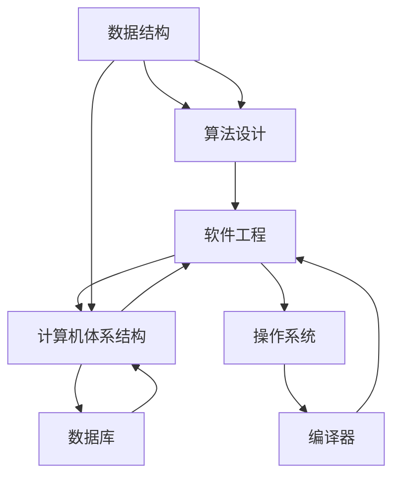

                 

# 从经典开始：奠定基础认知

> 关键词：计算机科学,基础理论,算法设计,软件开发,技术实战

## 1. 背景介绍

### 1.1 问题由来

计算机科学是一门充满创新和挑战的学科。从早期的电子管到现代的量子计算机，从简单的机器语言到复杂的高级语言，计算机技术的进步从未停歇。然而，所有这些技术进步都是建立在基础理论之上的。没有坚实的理论基础，技术创新和应用实践只能是空中楼阁。因此，理解计算机科学的基础理论，对于技术研究和开发有着至关重要的作用。

### 1.2 问题核心关键点

计算机科学的基础理论包括数据结构、算法设计、软件工程和计算机体系结构等多个方面。理解这些理论，不仅有助于开发高效的软件，还能帮助解决复杂的技术问题。

- **数据结构**：是计算机科学的基础，研究数据的存储、组织和访问方式。常用的数据结构包括数组、链表、树和图等。
- **算法设计**：研究如何在有限的时间和空间资源内，通过编程解决问题。常见的算法包括排序、搜索、图论和动态规划等。
- **软件工程**：研究软件生命周期管理、软件架构设计、代码优化和测试等方面，旨在提高软件的质量和可维护性。
- **计算机体系结构**：研究计算机硬件和软件的交互方式，包括处理器设计、内存管理、I/O系统和并行计算等。

这些理论为计算机技术的发展奠定了坚实的基础，而理解这些理论的基本原理和实际应用，则是成为一名优秀程序员和软件架构师的重要前提。

## 2. 核心概念与联系

### 2.1 核心概念概述

为了更好地理解计算机科学的基础理论，本节将介绍几个关键的核心概念：

- **数据结构**：用于组织和存储数据，常用的数据结构包括数组、链表、栈、队列、树和图等。
- **算法设计**：解决特定问题的步骤，包括时间复杂度、空间复杂度、排序、搜索、图论和动态规划等。
- **软件工程**：软件开发和维护的实践，包括需求分析、设计、编码、测试和部署等。
- **计算机体系结构**：计算机硬件和软件的交互方式，包括处理器、内存、I/O和并行计算等。

这些概念之间具有紧密的联系，形成了一个完整的计算机科学理论体系。理解这些概念的原理和应用，能够帮助开发者更好地设计和实现高效的软件系统。

### 2.2 核心概念原理和架构的 Mermaid 流程图



这个流程图展示了数据结构、算法设计、软件工程和计算机体系结构之间的联系。数据结构和算法设计是软件工程的基础，而软件工程和计算机体系结构则构成了计算机系统的核心。

## 3. 核心算法原理 & 具体操作步骤

### 3.1 算法原理概述

计算机科学的核心之一是算法设计。算法是解决特定问题的步骤集合，其设计需要考虑时间复杂度、空间复杂度和实际应用的可行性。

- **时间复杂度**：指算法执行所需的时间与输入规模之间的关系。常见的时间复杂度包括$O(1)$、$O(n)$、$O(n\log n)$、$O(n^2)$等。
- **空间复杂度**：指算法执行所需的内存空间与输入规模之间的关系。常见的空间复杂度包括$O(1)$、$O(n)$、$O(n^2)$等。
- **实际应用**：考虑算法的实用性、可维护性和可扩展性。

### 3.2 算法步骤详解

算法设计的步骤通常包括以下几个方面：

1. **需求分析**：理解问题的本质，确定需要解决的问题。
2. **算法设计**：选择合适的算法，设计算法的步骤。
3. **算法实现**：将算法步骤转化为具体的代码实现。
4. **测试和优化**：通过测试和优化，提高算法的性能和稳定性。

### 3.3 算法优缺点

算法设计需要权衡时间复杂度、空间复杂度和实际应用的需求。不同的算法具有不同的优缺点，选择合适的算法是算法设计成功的关键。

- **优点**：
  - 时间复杂度低，效率高。
  - 空间复杂度低，内存占用少。
  - 可扩展性强，适用于大规模数据处理。

- **缺点**：
  - 实现复杂，需要较高的编程技能。
  - 算法设计需要深入理解问题本质，难度较大。
  - 部分算法可能需要较高的硬件支持。

### 3.4 算法应用领域

算法设计广泛应用于各个领域，包括软件开发、数据处理、网络通信、人工智能等。

- **软件开发**：用于解决程序中的各种问题，如排序、搜索、图论等。
- **数据处理**：用于处理大规模数据，如排序、去重、统计等。
- **网络通信**：用于优化网络协议，提高通信效率。
- **人工智能**：用于解决机器学习、深度学习中的各种问题。

## 4. 数学模型和公式 & 详细讲解 & 举例说明

### 4.1 数学模型构建

数学模型是计算机科学中的重要工具，用于描述和分析问题的本质。常用的数学模型包括线性模型、逻辑模型和概率模型等。

- **线性模型**：用于描述线性关系，如线性回归、线性规划等。
- **逻辑模型**：用于描述逻辑关系，如布尔代数、逻辑电路等。
- **概率模型**：用于描述概率关系，如贝叶斯网络、马尔可夫模型等。

### 4.2 公式推导过程

以线性回归为例，展示数学模型的构建和推导过程。

假设有一个线性模型$y = wx + b$，其中$y$是输出变量，$x$是输入变量，$w$是权重，$b$是偏置。

根据最小二乘法，求解$w$和$b$的最优值，使得预测值与实际值之间的差异最小。

设训练集为$(x_i, y_i)$，$i=1,2,\ldots,N$。则最小二乘法的目标函数为：

$$
\min_{w,b} \frac{1}{2}\sum_{i=1}^N (y_i - wx_i - b)^2
$$

对目标函数求导，并令导数为0，得到：

$$
\begin{cases}
\frac{\partial}{\partial w} \frac{1}{2}\sum_{i=1}^N (y_i - wx_i - b)^2 = 0 \\
\frac{\partial}{\partial b} \frac{1}{2}\sum_{i=1}^N (y_i - wx_i - b)^2 = 0
\end{cases}
$$

解得：

$$
w = \frac{1}{N}\sum_{i=1}^N x_iy_i - \frac{1}{N}\sum_{i=1}^N x_i\bar{y}
$$

$$
b = \bar{y} - wx
$$

其中$\bar{y} = \frac{1}{N}\sum_{i=1}^N y_i$。

### 4.3 案例分析与讲解

以二分查找算法为例，展示算法设计和数学模型的应用。

二分查找算法用于在有序数组中查找特定值。其时间复杂度为$O(\log N)$，效率较高。

算法步骤：
1. 确定查找区间，设为$[l, r]$。
2. 计算中间位置$mid = \lfloor \frac{l+r}{2} \rfloor$。
3. 比较中间位置的值与目标值$x$。
   - 若$x = A[mid]$，则返回$mid$。
   - 若$x < A[mid]$，则将查找区间缩小为$[l, mid-1]$。
   - 若$x > A[mid]$，则将查找区间缩小为$[mid+1, r]$。
4. 重复步骤2-3，直到查找区间为空。

## 5. 项目实践：代码实例和详细解释说明

### 5.1 开发环境搭建

在进行算法实践前，我们需要准备好开发环境。以下是使用Python进行项目开发的常用环境配置流程：

1. 安装Anaconda：从官网下载并安装Anaconda，用于创建独立的Python环境。

2. 创建并激活虚拟环境：
```bash
conda create -n myenv python=3.8 
conda activate myenv
```

3. 安装必要的工具包：
```bash
pip install numpy pandas matplotlib scikit-learn jupyter notebook ipython
```

4. 安装编程工具：
```bash
pip install vscode
```

5. 配置开发环境：
```bash
vscode . --extension pack.jupyter
```

### 5.2 源代码详细实现

以二分查找算法为例，给出Python代码实现。

```python
def binary_search(arr, target):
    l, r = 0, len(arr) - 1
    while l <= r:
        mid = (l + r) // 2
        if arr[mid] == target:
            return mid
        elif arr[mid] < target:
            l = mid + 1
        else:
            r = mid - 1
    return -1
```

### 5.3 代码解读与分析

代码实现的关键在于二分查找算法的设计和应用。算法通过不断缩小查找区间，逐步逼近目标值，最终找到目标值在数组中的位置。

## 6. 实际应用场景

### 6.1 搜索算法

搜索算法在计算机科学中具有广泛的应用。

- **排序算法**：如冒泡排序、插入排序、快速排序等。
- **图论算法**：如深度优先搜索、广度优先搜索、Dijkstra算法等。
- **数据结构**：如哈希表、二叉搜索树、AVL树等。

### 6.2 图形算法

图形算法在计算机科学中具有重要的地位。

- **图遍历算法**：如深度优先搜索、广度优先搜索等。
- **图优化算法**：如Prim算法、Kruskal算法、Dijkstra算法等。

### 6.3 算法在实际应用中的应用

算法设计在实际应用中有着广泛的应用。

- **数据处理**：如排序、去重、统计等。
- **网络通信**：如路由算法、流量控制等。
- **人工智能**：如机器学习、深度学习等。

## 7. 工具和资源推荐

### 7.1 学习资源推荐

为了帮助开发者系统掌握计算机科学的基础理论，这里推荐一些优质的学习资源：

1. 《算法导论》：经典的算法教材，涵盖了算法设计和分析的基础知识。
2. 《数据结构与算法分析》：涵盖数据结构和算法设计的经典教材，适合初学者和进阶者。
3. 《计算机体系结构：量化研究方法》：介绍计算机体系结构的经典教材，涵盖了处理器、内存和I/O系统的设计与实现。
4. 《编程珠玑》：介绍常见算法和数据结构的设计与实现，适合提高编程技能。
5. 《操作系统概念》：介绍操作系统原理和设计的经典教材，适合深入理解操作系统。

### 7.2 开发工具推荐

高效的开发离不开优秀的工具支持。以下是几款常用的开发工具：

1. Visual Studio Code：功能强大的代码编辑器，支持多语言编程和调试。
2. Jupyter Notebook：交互式编程环境，适合数据处理和算法设计。
3. Git：版本控制系统，适合团队协作开发。
4. Docker：容器化技术，适合部署和管理软件系统。
5. TensorFlow：深度学习框架，适合人工智能应用开发。

### 7.3 相关论文推荐

计算机科学的发展离不开学术界的持续研究。以下是几篇奠基性的相关论文，推荐阅读：

1. Knuth, D. E. (1969). The art of computer programming. Addison-Wesley.
2. Hoare, C. A. R. (1962). "Axiomatic Design of Algorithms". Communications of the ACM.
3. Thomsen, M. L. (1993). Data structures: a case study approach.
4. Aho, A. V., Sethi, R., & Ullman, J. D. (1974). The design and analysis of computer algorithms.
5. Hennessy, J. L., & Patterson, D. A. (2017). Computer architecture: a quantative approach.

## 8. 总结：未来发展趋势与挑战

### 8.1 总结

本文对计算机科学的基础理论进行了全面系统的介绍。首先阐述了数据结构、算法设计、软件工程和计算机体系结构等核心概念，明确了这些概念之间的联系和应用场景。其次，从原理到实践，详细讲解了算法设计和数学模型的构建，提供了完整的代码实现和案例分析。最后，探讨了算法和数学模型在实际应用中的广泛应用。

通过本文的系统梳理，可以看到，计算机科学的基础理论是技术研究和开发的基础，理解这些理论的基本原理和实际应用，是成为一名优秀程序员和软件架构师的重要前提。

### 8.2 未来发展趋势

展望未来，计算机科学的基础理论将呈现以下几个发展趋势：

1. **数据结构**：数据结构的研究将更注重高效、可扩展性和并发处理，满足大规模数据处理的需求。
2. **算法设计**：算法设计将更注重时间和空间复杂度的优化，提高算法的执行效率和稳定性。
3. **软件工程**：软件工程将更注重自动化和智能化，提高软件的开发效率和质量。
4. **计算机体系结构**：计算机体系结构将更注重异构计算和量子计算，提高计算系统的性能和可扩展性。

以上趋势凸显了计算机科学基础理论的广阔前景。这些方向的探索发展，必将推动计算机技术不断进步，为未来科技发展提供坚实的理论基础。

### 8.3 面临的挑战

尽管计算机科学的基础理论已经取得了丰硕的成果，但在迈向更加智能化、普适化应用的过程中，它仍面临着诸多挑战：

1. **资源消耗**：大规模数据处理和并行计算需要高昂的硬件和软件资源，如何降低资源消耗，提高计算效率，仍然是一个重大挑战。
2. **算法复杂度**：算法设计需要深入理解问题本质，设计复杂的算法，如何在保证算法效率的同时，提高算法设计的自动化和智能化，是一个重要的研究方向。
3. **软件开发**：软件系统的设计和实现需要考虑诸多因素，如可扩展性、可维护性和性能优化等，如何在保证软件质量的同时，提高软件开发效率，是一个长期的挑战。
4. **算法公平性**：算法设计和应用需要考虑算法的公平性，避免算法偏见和歧视，是一个重要的研究方向。

### 8.4 研究展望

面向未来，计算机科学的基础理论需要不断探索和创新，以适应新的技术需求和应用场景。以下是几个研究方向：

1. **自动化算法设计**：通过人工智能和机器学习技术，自动化设计高效的算法，提高算法设计的效率和智能化。
2. **异构计算和量子计算**：探索异构计算和量子计算的实现方法，提高计算系统的性能和可扩展性。
3. **分布式系统设计**：探索分布式系统的高效设计和优化方法，提高系统的并发处理能力和可靠性。
4. **算法公平性**：研究算法的公平性和透明性，避免算法偏见和歧视，提高算法的可解释性和可信度。

这些研究方向将为计算机科学的基础理论带来新的突破，推动计算机技术不断进步，为未来科技发展提供更坚实的理论基础。

## 9. 附录：常见问题与解答

**Q1：如何理解数据结构、算法设计和软件工程之间的关系？**

A: 数据结构、算法设计和软件工程是计算机科学的基础理论，三者之间有着紧密的联系。数据结构是算法的实现基础，算法设计是解决特定问题的步骤集合，软件工程则是将算法应用于实际问题的过程。理解和掌握这三者，可以帮助开发者更好地设计和实现高效的软件系统。

**Q2：如何在实际应用中选择合适的算法？**

A: 选择合适的算法需要考虑以下几个因素：
1. 问题类型：根据问题类型选择合适的算法。
2. 数据规模：根据数据规模选择合适的算法。
3. 性能需求：根据性能需求选择合适的算法。
4. 实现难度：根据实现难度选择合适的算法。

**Q3：如何理解计算机体系结构的基础知识？**

A: 计算机体系结构是计算机硬件和软件之间的交互方式，涵盖了处理器、内存、I/O系统和并行计算等方面。理解计算机体系结构的基础知识，可以帮助开发者更好地设计和实现高效的软件系统，优化系统性能和资源利用率。

**Q4：如何提高算法的执行效率？**

A: 提高算法执行效率需要考虑以下几个方面：
1. 优化算法设计：通过优化算法设计，降低算法的时间复杂度和空间复杂度。
2. 优化数据结构：选择合适的数据结构，提高数据访问效率。
3. 优化算法实现：优化算法的代码实现，减少资源消耗和运行时间。
4. 优化算法并行化：利用并行计算技术，提高算法的执行效率。

**Q5：如何理解计算机科学基础理论的实际应用？**

A: 计算机科学基础理论的实际应用非常广泛，包括软件开发、数据处理、网络通信、人工智能等。理解和掌握这些理论，可以帮助开发者更好地设计和实现高效的软件系统，解决实际问题。

---

作者：禅与计算机程序设计艺术 / Zen and the Art of Computer Programming

