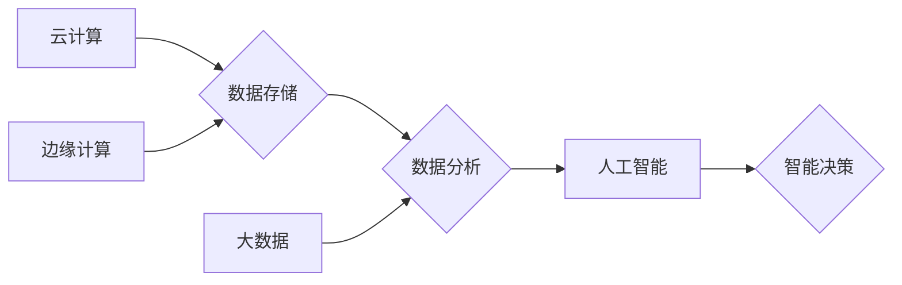

> 计算产业、技术栈、人工智能、云计算、大数据、机器学习、深度学习、区块链、边缘计算

## 1. 背景介绍

近年来，计算产业经历了前所未有的变革，技术栈也随之发生了重大变化。从传统的以硬件为核心的计算模式，逐渐向以软件和算法为核心的智能计算模式转变。这一转变不仅改变了计算产业的结构和生态，也对各行各业产生了深远的影响。

### 1.1 计算模式的演变

传统的计算模式以中心化数据中心为核心，数据和计算资源集中在少数大型服务器上。随着互联网和移动互联网的普及，数据量呈指数级增长，传统的计算模式面临着瓶颈。

新兴的计算模式，例如云计算、边缘计算和分布式计算，逐渐成为主流。云计算提供弹性、可扩展的计算资源，边缘计算将计算能力部署到靠近数据源的位置，分布式计算将任务分解到多个节点上并行处理。

### 1.2 技术栈的重构

随着计算模式的演变，技术栈也发生了重大变化。

* **人工智能 (AI) 和机器学习 (ML) 的崛起:** AI 和 ML 成为计算产业的核心技术，应用于各个领域，例如图像识别、自然语言处理、推荐系统等。

* **大数据和数据分析:** 大数据技术的快速发展，使得数据分析成为重要的决策工具。

* **云原生技术:** 云原生技术，例如容器化和微服务架构，帮助企业构建更加灵活、可扩展的应用程序。

* **区块链技术的应用:** 区块链技术提供了一种去中心化的、安全的交易和数据存储方式，应用于金融、供应链管理等领域。

## 2. 核心概念与联系

### 2.1 云计算

云计算是一种按需提供的计算资源，包括计算、存储、网络等。用户可以根据需要随时随地访问和使用这些资源，无需购买和维护昂贵的硬件设备。

### 2.2 大数据

大数据是指海量、高速度、高多样性的数据。大数据分析技术可以帮助企业从海量数据中挖掘价值，发现隐藏的模式和趋势。

### 2.3 人工智能

人工智能是指模拟人类智能的计算机系统。人工智能技术包括机器学习、深度学习、自然语言处理等。

### 2.4 边缘计算

边缘计算是指将计算能力部署到靠近数据源的位置，例如物联网设备、传感器等。边缘计算可以降低数据传输延迟，提高计算效率。

**Mermaid 流程图**



## 3. 核心算法原理 & 具体操作步骤

### 3.1 算法原理概述

机器学习算法是一种能够从数据中学习并不断改进的算法。常见的机器学习算法包括：

* **监督学习:** 利用标记数据训练模型，预测未知数据。例如，图像分类、文本分类等。
* **无监督学习:** 从未标记数据中发现模式和结构。例如，聚类、降维等。
* **强化学习:** 通过试错学习，在环境中获得最大奖励。例如，游戏 AI、机器人控制等。

### 3.2 算法步骤详解

以监督学习为例，其基本步骤如下：

1. **数据收集和预处理:** 收集相关数据，并进行清洗、转换、特征工程等预处理操作。
2. **模型选择:** 根据任务需求选择合适的机器学习模型。
3. **模型训练:** 利用标记数据训练模型，调整模型参数，使模型能够准确预测未知数据。
4. **模型评估:** 使用测试数据评估模型的性能，例如准确率、召回率、F1-score等。
5. **模型部署:** 将训练好的模型部署到实际应用场景中。

### 3.3 算法优缺点

**优点:**

* 自动学习，无需人工编程。
* 能够处理复杂的数据模式。
* 性能不断提升。

**缺点:**

* 需要大量的数据进行训练。
* 模型解释性较差。
* 容易受到数据偏差的影响。

### 3.4 算法应用领域

机器学习算法广泛应用于各个领域，例如：

* **图像识别:** 人脸识别、物体检测、图像分类等。
* **自然语言处理:** 文本分类、情感分析、机器翻译等。
* **推荐系统:** 商品推荐、内容推荐、用户画像等。
* **金融领域:** 欺诈检测、风险评估、信用评分等。
* **医疗领域:** 疾病诊断、药物研发、医疗影像分析等。

## 4. 数学模型和公式 & 详细讲解 & 举例说明

### 4.1 数学模型构建

机器学习算法通常基于数学模型，例如线性回归、逻辑回归、支持向量机等。这些模型通过数学公式来描述数据之间的关系。

### 4.2 公式推导过程

例如，线性回归模型的数学公式如下：

$$
y = \theta_0 + \theta_1 x_1 + \theta_2 x_2 + ... + \theta_n x_n
$$

其中：

* $y$ 是预测值。
* $\theta_0, \theta_1, ..., \theta_n$ 是模型参数。
* $x_1, x_2, ..., x_n$ 是输入特征。

通过最小化模型预测值与真实值的误差，可以求解出模型参数。

### 4.3 案例分析与讲解

例如，假设我们想要预测房屋价格，输入特征包括房屋面积、房间数量、地理位置等。我们可以使用线性回归模型来构建预测模型。

通过训练模型，我们可以得到模型参数，例如：

* $\theta_0 = 100000$
* $\theta_1 = 500$
* $\theta_2 = 10000$

这意味着，房屋面积每增加1平方米，价格会增加500元；房间数量每增加1个，价格会增加10000元。

## 5. 项目实践：代码实例和详细解释说明

### 5.1 开发环境搭建

* Python 3.x
* TensorFlow 或 PyTorch
* Jupyter Notebook

### 5.2 源代码详细实现

```python
import tensorflow as tf

# 定义模型
model = tf.keras.models.Sequential([
    tf.keras.layers.Dense(64, activation='relu', input_shape=(4,)),
    tf.keras.layers.Dense(1)
])

# 编译模型
model.compile(optimizer='adam', loss='mse')

# 训练模型
model.fit(X_train, y_train, epochs=10)

# 评估模型
loss = model.evaluate(X_test, y_test)
print('Loss:', loss)
```

### 5.3 代码解读与分析

* 首先，我们定义了一个简单的线性回归模型，包含两个全连接层。
* 然后，我们使用 Adam 优化器和均方误差损失函数对模型进行编译。
* 接着，我们使用训练数据训练模型，设置训练轮数为 10。
* 最后，我们使用测试数据评估模型的性能，并打印损失值。

### 5.4 运行结果展示

运行结果会显示模型在测试数据上的损失值，可以用来评估模型的性能。

## 6. 实际应用场景

### 6.1 云计算平台

云计算平台可以利用机器学习算法提供智能化服务，例如：

* **资源调度:** 根据用户需求动态分配计算资源。
* **安全防护:** 检测和防御网络攻击。
* **性能优化:** 监控系统性能，并自动调整配置。

### 6.2 大数据分析平台

大数据分析平台可以利用机器学习算法进行数据挖掘和分析，例如：

* **客户画像:** 分析客户行为，构建客户画像。
* **市场预测:** 预测市场趋势，辅助决策。
* **异常检测:** 检测数据异常，进行预警。

### 6.3 智能家居

智能家居可以利用机器学习算法实现智能控制，例如：

* **语音识别:** 识别用户的语音指令。
* **场景联动:** 根据用户的行为自动控制家电设备。
* **个性化推荐:** 推荐用户喜欢的音乐、视频等内容。

### 6.4 未来应用展望

随着计算产业技术栈的不断发展，机器学习算法将在更多领域得到应用，例如：

* **自动驾驶:** 帮助车辆感知周围环境，做出决策。
* **医疗诊断:** 辅助医生诊断疾病，提高诊断准确率。
* **个性化教育:** 根据学生的学习情况提供个性化学习方案。

## 7. 工具和资源推荐

### 7.1 学习资源推荐

* **在线课程:** Coursera, edX, Udacity
* **书籍:** 《深入理解机器学习》、《Python机器学习实战》
* **博客:** Towards Data Science, Machine Learning Mastery

### 7.2 开发工具推荐

* **Python:** 广泛使用的编程语言，用于机器学习开发。
* **TensorFlow:** 开源机器学习框架，提供丰富的算法和工具。
* **PyTorch:** 开源机器学习框架，以其灵活性和易用性而闻名。

### 7.3 相关论文推荐

* **《ImageNet Classification with Deep Convolutional Neural Networks》**
* **《Attention Is All You Need》**
* **《BERT: Pre-training of Deep Bidirectional Transformers for Language Understanding》**

## 8. 总结：未来发展趋势与挑战

### 8.1 研究成果总结

近年来，计算产业技术栈发生了重大变化，人工智能、云计算、大数据等技术取得了显著进展。机器学习算法在各个领域得到了广泛应用，为社会带来了巨大价值。

### 8.2 未来发展趋势

* **模型规模和复杂度不断提升:** 随着计算能力的增强，模型规模和复杂度将不断提升，模型性能将进一步提高。
* **边缘计算和联邦学习的兴起:** 边缘计算和联邦学习将成为未来机器学习的重要发展方向，能够解决数据隐私和计算资源限制的问题。
* **跨模态学习的应用:** 跨模态学习能够处理不同类型的数据，例如文本、图像、音频等，将为机器学习带来新的突破。

### 8.3 面临的挑战

* **数据安全和隐私保护:** 机器学习算法依赖于大量数据，数据安全和隐私保护是一个重要的挑战。
* **模型解释性和可信度:** 许多机器学习模型是黑箱模型，难以解释其决策过程，这降低了模型的可信度。
* **算法公平性和可控性:** 机器学习算法可能存在偏见，导致不公平的结果，需要研究算法公平性和可控性问题。

### 8.4 研究展望

未来，计算产业技术栈将继续发展，机器学习算法将发挥越来越重要的作用。我们需要加强对机器学习算法的理论研究，解决算法的挑战，并将其应用于更多领域，为人类社会带来更多福祉。

## 9. 附录：常见问题与解答

### 9.1 什么是机器学习？

机器学习是一种人工智能技术，它通过算法从数据中学习，并能够根据学习到的知识对新数据进行预测或分类。

### 9.2 机器学习算法有哪些？

常见的机器学习算法包括监督学习、无监督学习和强化学习。

### 9.3 如何选择合适的机器学习算法？

选择合适的机器学习算法需要根据具体任务需求和数据特点进行选择。

### 9.4 如何评估机器学习模型的性能？

常用的机器学习模型性能评估指标包括准确率、召回率、F1-score等。

### 9.5 机器学习算法有哪些应用场景？

机器学习算法广泛应用于各个领域，例如图像识别、自然语言处理、推荐系统、金融领域、医疗领域等。


作者：禅与计算机程序设计艺术 / Zen and the Art of Computer Programming 
<end_of_turn>