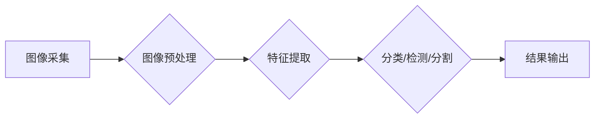

> 计算机视觉、图像处理、深度学习、卷积神经网络、目标检测、图像分类、图像分割

## 1. 背景介绍

计算机视觉 (Computer Vision) 作为人工智能 (AI) 的重要分支，致力于赋予计算机“看”的能力，使其能够理解和解释图像和视频信息。近年来，随着深度学习技术的飞速发展，计算机视觉取得了令人瞩目的进展，在各个领域得到了广泛应用，例如：

* **自动驾驶:**  识别道路标志、车辆、行人等，实现自动驾驶功能。
* **医疗诊断:**  辅助医生诊断疾病，例如识别肿瘤、分析X光片等。
* **安防监控:**  识别嫌疑人、检测异常行为，提高安全保障。
* **零售业:**  自动识别商品、分析顾客行为，优化商品陈列和营销策略。
* **机器人技术:**  帮助机器人感知周围环境，进行导航和操作。

## 2. 核心概念与联系

计算机视觉的核心概念包括图像处理、特征提取、图像分类、目标检测、图像分割等。这些概念相互关联，共同构成了计算机视觉的完整体系。

**Mermaid 流程图:**



## 3. 核心算法原理 & 具体操作步骤

### 3.1  算法原理概述

深度学习算法是计算机视觉领域的核心算法，其中卷积神经网络 (CNN) 是最常用的算法之一。CNN 能够自动学习图像特征，并进行图像分类、目标检测、图像分割等任务。

### 3.2  算法步骤详解

1. **数据预处理:** 将原始图像转换为适合 CNN 训练的格式，例如调整图像大小、归一化像素值等。
2. **网络结构设计:** 设计 CNN 的网络结构，包括卷积层、池化层、全连接层等。
3. **参数初始化:** 为网络参数进行随机初始化。
4. **前向传播:** 将图像输入网络，计算输出结果。
5. **反向传播:** 计算损失函数，并根据梯度下降算法更新网络参数。
6. **训练与验证:** 使用训练数据训练网络，并使用验证数据评估网络性能。
7. **测试:** 使用测试数据评估网络的最终性能。

### 3.3  算法优缺点

**优点:**

* 自动学习图像特征，无需人工特征工程。
* 性能优异，能够达到人类水平甚至超越人类水平。
* 可应用于多种计算机视觉任务。

**缺点:**

* 训练数据量大，需要大量 labeled 数据。
* 计算资源消耗大，训练时间长。
* 对超参数设置敏感，需要进行大量的调参。

### 3.4  算法应用领域

CNN 算法广泛应用于图像分类、目标检测、图像分割、人脸识别、物体跟踪等计算机视觉任务。

## 4. 数学模型和公式 & 详细讲解 & 举例说明

### 4.1  数学模型构建

CNN 的数学模型主要基于卷积运算、池化运算和激活函数。

* **卷积运算:**  使用卷积核对图像进行卷积，提取图像特征。

* **池化运算:**  对卷积层的输出进行池化，降低特征图的维度，提高计算效率。

* **激活函数:**  引入非线性激活函数，使网络能够学习更复杂的特征。

### 4.2  公式推导过程

**卷积运算公式:**

$$
y(i,j) = \sum_{m=0}^{M-1} \sum_{n=0}^{N-1} x(i+m,j+n) * w(m,n)
$$

其中:

* $y(i,j)$ 是卷积输出的像素值。
* $x(i+m,j+n)$ 是输入图像的像素值。
* $w(m,n)$ 是卷积核的权值。
* $M$ 和 $N$ 是卷积核的大小。

**池化运算公式:**

$$
y(i,j) = \max(x(i,j), x(i+1,j), x(i,j+1), x(i+1,j+1))
$$

其中:

* $y(i,j)$ 是池化输出的像素值。
* $x(i,j)$ 是输入特征图的像素值。

### 4.3  案例分析与讲解

**举例说明:**

假设输入图像大小为 3x3，卷积核大小为 2x2，卷积核权值为:

$$
w = \begin{bmatrix}
1 & 2 \\
3 & 4
\end{bmatrix}
$$

则卷积运算结果为:

$$
y = \begin{bmatrix}
6 & 12 \\
18 & 24
\end{bmatrix}
$$

## 5. 项目实践：代码实例和详细解释说明

### 5.1  开发环境搭建

使用 Python 语言和 TensorFlow 或 PyTorch 深度学习框架进行开发。

### 5.2  源代码详细实现

```python
import tensorflow as tf

# 定义 CNN 网络结构
model = tf.keras.models.Sequential([
    tf.keras.layers.Conv2D(32, (3, 3), activation='relu', input_shape=(28, 28, 1)),
    tf.keras.layers.MaxPooling2D((2, 2)),
    tf.keras.layers.Conv2D(64, (3, 3), activation='relu'),
    tf.keras.layers.MaxPooling2D((2, 2)),
    tf.keras.layers.Flatten(),
    tf.keras.layers.Dense(10, activation='softmax')
])

# 编译模型
model.compile(optimizer='adam',
              loss='sparse_categorical_crossentropy',
              metrics=['accuracy'])

# 训练模型
model.fit(x_train, y_train, epochs=10)

# 评估模型
loss, accuracy = model.evaluate(x_test, y_test)
print('Test loss:', loss)
print('Test accuracy:', accuracy)
```

### 5.3  代码解读与分析

* **定义 CNN 网络结构:** 使用 TensorFlow 的 Keras API 定义 CNN 网络结构，包括卷积层、池化层和全连接层。
* **编译模型:** 使用 Adam 优化器、交叉熵损失函数和准确率指标编译模型。
* **训练模型:** 使用训练数据训练模型，设置训练轮数为 10。
* **评估模型:** 使用测试数据评估模型的性能，输出测试损失和准确率。

### 5.4  运行结果展示

训练完成后，可以将模型应用于新的图像数据进行预测。

## 6. 实际应用场景

### 6.1  自动驾驶

* **目标检测:** 检测道路上的车辆、行人、交通标志等物体。
* **图像分类:** 分类道路类型、天气状况等信息。
* **场景理解:** 理解道路场景，例如判断交通灯状态、识别交叉路口等。

### 6.2  医疗诊断

* **肿瘤检测:** 从医学图像中识别肿瘤区域。
* **疾病诊断:** 根据患者的影像数据辅助医生诊断疾病。
* **手术辅助:** 提供手术导航和辅助信息。

### 6.3  安防监控

* **人脸识别:** 识别嫌疑人、验证身份。
* **异常行为检测:** 检测异常行为，例如入侵、暴动等。
* **视频分析:** 分析视频内容，例如识别事件、追踪目标等。

### 6.4  未来应用展望

随着计算机视觉技术的不断发展，未来将有更多新的应用场景出现，例如：

* **虚拟现实 (VR) 和增强现实 (AR):** 为 VR 和 AR 应用提供更逼真的视觉体验。
* **机器人技术:** 帮助机器人更好地感知周围环境，进行更复杂的交互。
* **个性化服务:** 提供个性化的商品推荐、广告投放等服务。

## 7. 工具和资源推荐

### 7.1  学习资源推荐

* **书籍:**
    * 《深度学习》
    * 《计算机视觉:算法与应用》
* **在线课程:**
    * Coursera: 深度学习
    * Udacity: 计算机视觉
* **博客和网站:**
    * OpenCV
    * PyTorch
    * TensorFlow

### 7.2  开发工具推荐

* **OpenCV:**  开源计算机视觉库，提供图像处理、特征提取、目标检测等功能。
* **PyTorch:**  开源深度学习框架，支持 GPU 加速，易于使用。
* **TensorFlow:**  开源深度学习框架，提供丰富的 API 和工具。

### 7.3  相关论文推荐

* **AlexNet:**  ImageNet Large Scale Visual Recognition Challenge 2012 冠军论文。
* **VGGNet:**  ImageNet Large Scale Visual Recognition Challenge 2014 冠军论文。
* **ResNet:**  深度残差网络，解决深度网络训练中的梯度消失问题。

## 8. 总结：未来发展趋势与挑战

### 8.1  研究成果总结

计算机视觉领域取得了显著的进展，深度学习算法在图像分类、目标检测、图像分割等任务上取得了优异的性能。

### 8.2  未来发展趋势

* **更强大的模型:**  研究更深、更复杂的深度学习模型，提高模型性能。
* **更少的数据:**  研究更有效的训练方法，减少对训练数据的依赖。
* **更强的解释性:**  研究更可解释的深度学习模型，提高模型的透明度和可信度。
* **更广泛的应用:**  将计算机视觉技术应用于更多领域，例如医疗、教育、金融等。

### 8.3  面临的挑战

* **数据标注:**  深度学习模型需要大量的 labeled 数据，数据标注成本高昂。
* **计算资源:**  训练大型深度学习模型需要大量的计算资源，成本高昂。
* **模型安全性:**  深度学习模型容易受到攻击，需要提高模型的安全性。

### 8.4  研究展望

未来，计算机视觉领域将继续朝着更强大、更智能、更安全的方向发展。


## 9. 附录：常见问题与解答

**常见问题:**

* **什么是计算机视觉？**

计算机视觉是人工智能的一个分支，旨在赋予计算机“看”的能力，使其能够理解和解释图像和视频信息。

* **计算机视觉有哪些应用场景？**

计算机视觉的应用场景非常广泛，例如自动驾驶、医疗诊断、安防监控、零售业、机器人技术等。

* **如何学习计算机视觉？**

可以学习相关书籍、在线课程、博客和网站，并通过实践项目来加深理解。

**解答:**

* **什么是深度学习？**

深度学习是一种机器学习的子领域，它使用多层神经网络来学习数据特征。

* **什么是卷积神经网络 (CNN)？**

卷积神经网络是一种专门用于处理图像数据的深度学习模型，它能够自动学习图像特征。

* **如何训练一个 CNN 模型？**

需要准备 labeled 数据，使用深度学习框架 (例如 TensorFlow 或 PyTorch) 定义 CNN 网络结构，并使用训练数据训练模型。


作者：禅与计算机程序设计艺术 / Zen and the Art of Computer Programming 
<end_of_turn>