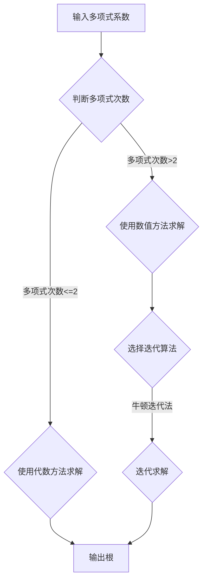

> 多项式方程、求解算法、牛顿迭代法、数学模型、编程实现、应用场景

## 1. 背景介绍

在数字时代，计算能力是推动科技进步的基石。从简单的加减乘除到复杂的科学计算，求解多项式方程作为一种基础的数学运算，在工程、物理、金融等领域有着广泛的应用。

多项式方程是指形如  $a_nx^n + a_{n-1}x^{n-1} + ... + a_1x + a_0 = 0$ 的方程，其中 $a_i$ 是系数，$x$ 是未知数，$n$ 是多项式的次数。求解多项式方程意味着找到使方程成立的 $x$ 值。

历史上，人类对多项式方程的求解方法经历了漫长的探索过程。从代数方法到数值方法，从简单的根式求解到复杂的迭代算法，每一次进步都推动了数学和计算的发展。

## 2. 核心概念与联系

求解多项式方程的核心在于找到方程的根，即使方程成立的 $x$ 值。

**核心概念：**

* **多项式:**  由多项式系数和变量的幂次相加构成的表达式。
* **根:** 使多项式等于零的变量值。
* **迭代算法:**  通过重复执行一系列步骤，逐步逼近目标值的方法。

**Mermaid 流程图：**



## 3. 核心算法原理 & 具体操作步骤

### 3.1  算法原理概述

数值方法是求解高次多项式方程的主要手段。其中，牛顿迭代法是一种常用的迭代算法，其原理基于函数的切线逼近。

**牛顿迭代法的原理：**

1. 选择一个初始值 $x_0$ 作为迭代起点。
2. 计算函数 $f(x)$ 在 $x_0$ 处的导数 $f'(x_0)$。
3. 计算新的迭代值 $x_1$：$x_1 = x_0 - \frac{f(x_0)}{f'(x_0)}$。
4. 重复步骤 2 和 3，直到迭代值收敛到满足精度要求的根。

### 3.2  算法步骤详解

**牛顿迭代法求解多项式方程的步骤：**

1. 将多项式方程转化为 $f(x) = 0$ 的形式。
2. 计算 $f'(x)$，即多项式的导数。
3. 选择一个初始值 $x_0$。
4. 计算 $x_1 = x_0 - \frac{f(x_0)}{f'(x_0)}$。
5. 判断 $x_1$ 与 $x_0$ 的差值是否小于预设的精度要求。
    * 如果满足，则 $x_1$ 为根，迭代结束。
    * 如果不满足，则将 $x_1$ 作为新的 $x_0$，重复步骤 4。

### 3.3  算法优缺点

**优点：**

* 收敛速度快，能够快速逼近根。
* 适用于多种类型的多项式方程。

**缺点：**

* 需要计算导数，对于高次多项式，计算导数可能比较复杂。
* 初始值的选择对收敛结果有影响，选择不合适的初始值可能导致迭代不收敛或收敛到错误的根。

### 3.4  算法应用领域

牛顿迭代法广泛应用于以下领域：

* **工程学:** 求解结构分析、控制系统等问题。
* **物理学:** 求解力学、电磁学等问题。
* **金融学:** 求解利率、风险等问题。
* **计算机科学:** 求解数值积分、优化问题等。

## 4. 数学模型和公式 & 详细讲解 & 举例说明

### 4.1  数学模型构建

多项式方程的数学模型可以表示为：

$$f(x) = a_nx^n + a_{n-1}x^{n-1} + ... + a_1x + a_0 = 0$$

其中，$a_i$ 是多项式的系数，$x$ 是未知数，$n$ 是多项式的次数。

### 4.2  公式推导过程

牛顿迭代法的迭代公式可以推导如下：

1. 将 $f(x) = 0$ 写成 $x = g(x)$ 的形式，其中 $g(x)$ 是一个函数。
2. 使用泰勒级数展开 $g(x)$ 在 $x_0$ 处的近似表达式：

$$g(x) \approx g(x_0) + g'(x_0)(x - x_0)$$

3. 将 $x = x_1$ 代入上式，并解出 $x_1$：

$$x_1 = x_0 - \frac{f(x_0)}{f'(x_0)}$$

### 4.3  案例分析与讲解

**例题：** 求解方程 $x^3 - 2x - 5 = 0$ 的根。

**解题步骤：**

1. 将方程转化为 $f(x) = x^3 - 2x - 5 = 0$。
2. 计算 $f'(x) = 3x^2 - 2$。
3. 选择初始值 $x_0 = 2$。
4. 计算 $x_1 = 2 - \frac{2^3 - 2(2) - 5}{3(2^2) - 2} = 2.0833$。
5. 重复步骤 4，直到迭代结果收敛。

## 5. 项目实践：代码实例和详细解释说明

### 5.1  开发环境搭建

本项目使用 Python 语言进行开发，所需的库包括 NumPy 和 Matplotlib。

**安装依赖:**

```bash
pip install numpy matplotlib
```

### 5.2  源代码详细实现

```python
import numpy as np
import matplotlib.pyplot as plt

def newton_method(f, df, x0, tol=1e-6, max_iter=100):
    """
    使用牛顿迭代法求解方程 f(x) = 0 的根。

    Args:
        f: 多项式函数
        df: 多项式函数的导数
        x0: 初始值
        tol: 精度要求
        max_iter: 最大迭代次数

    Returns:
        根的近似值
    """
    x = x0
    for i in range(max_iter):
        x_new = x - f(x) / df(x)
        if abs(x_new - x) < tol:
            return x_new
        x = x_new
    raise Exception("迭代次数超过限制，无法收敛")

# 定义多项式函数
def f(x):
    return x**3 - 2*x - 5

# 定义多项式函数的导数
def df(x):
    return 3*x**2 - 2

# 选择初始值
x0 = 2

# 使用牛顿迭代法求解根
root = newton_method(f, df, x0)

# 打印结果
print(f"方程的根为：{root}")

# 绘制函数图像
x = np.linspace(-3, 3, 100)
y = f(x)
plt.plot(x, y)
plt.xlabel("x")
plt.ylabel("f(x)")
plt.title("多项式函数图像")
plt.grid(True)
plt.show()
```

### 5.3  代码解读与分析

* **函数定义:** 代码首先定义了多项式函数 $f(x)$ 和其导数 $df(x)$。
* **牛顿迭代法:** `newton_method()` 函数实现了牛顿迭代法的核心逻辑，包括迭代公式、精度要求和最大迭代次数的设置。
* **初始值选择:**  `x0` 变量指定了牛顿迭代法的初始值。
* **求解根:** 代码调用 `newton_method()` 函数求解方程的根。
* **结果输出:** 代码打印了求解出的根的近似值。
* **函数图像绘制:** 代码使用 Matplotlib 库绘制了多项式函数的图像，方便观察根的分布。

### 5.4  运行结果展示

运行代码后，将输出方程的根的近似值，并绘制出多项式函数的图像。图像上将显示根对应的 x 坐标。

## 6. 实际应用场景

求解多项式方程在各个领域都有广泛的应用场景：

### 6.1  工程学

* **结构分析:** 求解梁、桁架等结构的弯矩、剪力等参数。
* **控制系统设计:** 求解控制系统的稳定性、响应时间等指标。

### 6.2  物理学

* **力学:** 求解运动轨迹、速度、加速度等物理量。
* **电磁学:** 求解电场、磁场、电磁波等物理现象。

### 6.3  金融学

* **利率计算:** 求解不同期限的利率。
* **风险管理:** 计算投资组合的风险水平。

### 6.4  计算机科学

* **数值积分:** 求解函数的定积分。
* **优化问题:** 求解函数的极值点。

## 7. 工具和资源推荐

### 7.1  学习资源推荐

* **书籍:**
    * 《数值分析》 -  Gerald, J. F. & Wheatley, P. E.
    * 《数值方法》 -  王建国
* **在线课程:**
    * Coursera: Numerical Analysis
    * edX: Introduction to Numerical Analysis

### 7.2  开发工具推荐

* **Python:** 广泛应用于数值计算和科学计算。
* **NumPy:** Python 的科学计算库，提供高效的数组运算和数学函数。
* **SciPy:** Python 的科学计算库，提供更高级的数值分析工具。
* **Matplotlib:** Python 的绘图库，用于绘制函数图像和数据可视化。

### 7.3  相关论文推荐

* **Newton's Method for Finding Roots of Equations:** https://www.jstor.org/stable/2686977
* **Numerical Methods for Solving Polynomial Equations:** https://www.sciencedirect.com/science/article/pii/S0022036X1630037X

## 8. 总结：未来发展趋势与挑战

### 8.1  研究成果总结

牛顿迭代法作为一种经典的数值方法，在求解多项式方程方面取得了显著的成果。其收敛速度快、应用广泛的特点使其成为解决实际问题的重要工具。

### 8.2  未来发展趋势

* **更高效的迭代算法:** 研究更快速、更鲁棒的迭代算法，例如二分法、割线法等。
* **并行计算:** 利用并行计算技术加速迭代过程，提高求解效率。
* **机器学习:** 将机器学习技术应用于迭代算法的优化和加速。

### 8.3  面临的挑战

* **高次多项式求解:** 高次多项式方程的求解难度较大，需要更复杂的算法和