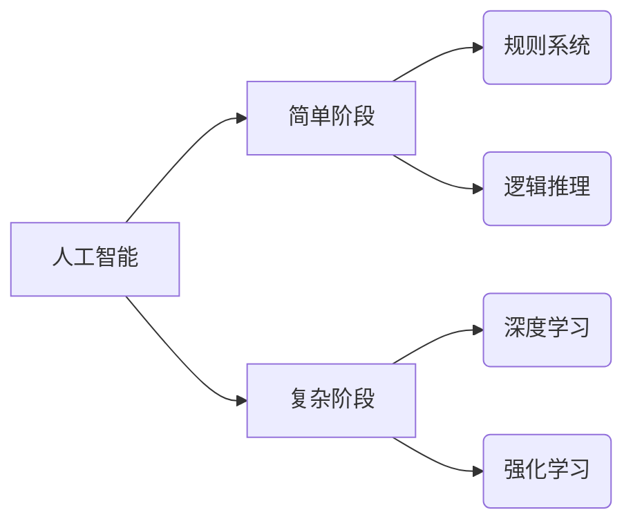

> 认知发展、简单阶段、复杂阶段、人工智能、机器学习、深度学习、神经网络、算法、模型、应用场景

## 1. 背景介绍

认知发展是人工智能领域的核心议题之一。从简单的规则系统到复杂的深度学习模型，人工智能的发展历程可以被看作是认知能力逐步提升的过程。理解认知发展的阶段性特征，对于推动人工智能的进步具有重要意义。

传统的认知科学研究主要关注人类的认知发展，而人工智能研究则侧重于构建能够模拟人类认知能力的智能系统。近年来，随着深度学习技术的兴起，人工智能在许多领域取得了突破性进展，例如图像识别、自然语言处理等。然而，深度学习模型仍然存在一些局限性，例如缺乏泛化能力、难以解释其决策过程等。

因此，深入研究认知发展的简单与复杂阶段，对于理解人工智能的局限性以及未来发展方向具有重要意义。

## 2. 核心概念与联系

**2.1 认知发展阶段**

认知发展可以被分为简单阶段和复杂阶段。

* **简单阶段:** 
    * 依赖于明确的规则和逻辑推理。
    * 能够处理结构简单、规则清晰的问题。
    * 例如：基于规则的专家系统、符号逻辑推理系统等。
* **复杂阶段:**
    * 能够学习和适应复杂环境。
    * 依赖于大量的样本数据和复杂的算法模型。
    * 例如：深度学习模型、强化学习算法等。

**2.2 人工智能与认知发展**

人工智能的发展可以看作是认知发展的模拟和扩展。

* **简单阶段:** 早期的人工智能研究主要集中在构建能够解决特定问题的简单规则系统，例如围棋、象棋等。
* **复杂阶段:** 深度学习技术的出现，使得人工智能能够处理更复杂的任务，例如图像识别、自然语言理解等。

**2.3 核心概念关系图**



## 3. 核心算法原理 & 具体操作步骤

### 3.1 算法原理概述

深度学习算法的核心原理是利用多层神经网络来模拟人类大脑的学习过程。

* **神经网络:** 由多个相互连接的神经元组成，每个神经元接收输入信号，进行处理，并输出信号。
* **层级结构:** 神经网络通常由多个层级组成，包括输入层、隐藏层和输出层。
* **权重和偏置:** 神经网络中的每个连接都具有一个权重，用来控制信号的传递强度。每个神经元还具有一个偏置，用来调整神经元的激活阈值。
* **激活函数:** 激活函数用来将神经元的输入信号转换为输出信号，并引入非线性特性。

### 3.2 算法步骤详解

1. **数据预处理:** 将原始数据转换为深度学习模型可以理解的格式。
2. **网络结构设计:** 根据任务需求设计神经网络的层数、神经元数量等结构参数。
3. **参数初始化:** 为神经网络中的权重和偏置赋予初始值。
4. **前向传播:** 将输入数据通过神经网络传递，计算输出结果。
5. **反向传播:** 计算输出结果与真实值的误差，并根据误差调整神经网络的权重和偏置。
6. **迭代训练:** 重复前向传播和反向传播的过程，直到模型的性能达到预期的水平。

### 3.3 算法优缺点

**优点:**

* 能够处理复杂的数据模式。
* 学习能力强，能够自动提取特征。
* 泛化能力强，能够应用于不同的任务。

**缺点:**

* 训练数据量大，需要大量的计算资源。
* 模型解释性差，难以理解模型的决策过程。
* 容易过拟合，需要进行正则化处理。

### 3.4 算法应用领域

* **图像识别:** 人脸识别、物体检测、图像分类等。
* **自然语言处理:** 文本分类、机器翻译、语音识别等。
* **推荐系统:** 商品推荐、用户画像等。
* **医疗诊断:** 病情预测、疾病诊断等。

## 4. 数学模型和公式 & 详细讲解 & 举例说明

### 4.1 数学模型构建

深度学习模型可以看作是一个复杂的数学模型，其核心是神经网络的激活函数和权重更新规则。

* **激活函数:** 常见的激活函数包括 sigmoid 函数、ReLU 函数、tanh 函数等。

* **权重更新规则:** 常见的权重更新规则包括梯度下降法、动量法、Adam 优化器等。

### 4.2 公式推导过程

**梯度下降法:**

$$
\theta = \theta - \alpha \nabla J(\theta)
$$

其中:

* $\theta$ 是模型参数。
* $\alpha$ 是学习率。
* $\nabla J(\theta)$ 是损失函数 $J(\theta)$ 的梯度。

### 4.3 案例分析与讲解

**ReLU 函数:**

ReLU 函数的公式如下:

$$
f(x) = \begin{cases}
x, & \text{if } x > 0 \\
0, & \text{if } x \leq 0
\end{cases}
$$

ReLU 函数的优点是计算简单，并且能够解决梯度消失问题。

## 5. 项目实践：代码实例和详细解释说明

### 5.1 开发环境搭建

* Python 3.x
* TensorFlow 或 PyTorch 深度学习框架
* Jupyter Notebook 或 VS Code 开发环境

### 5.2 源代码详细实现

```python
import tensorflow as tf

# 定义模型结构
model = tf.keras.models.Sequential([
    tf.keras.layers.Dense(128, activation='relu', input_shape=(784,)),
    tf.keras.layers.Dense(10, activation='softmax')
])

# 编译模型
model.compile(optimizer='adam',
              loss='sparse_categorical_crossentropy',
              metrics=['accuracy'])

# 加载 MNIST 数据集
(x_train, y_train), (x_test, y_test) = tf.keras.datasets.mnist.load_data()

# 数据预处理
x_train = x_train.reshape(-1, 784).astype('float32') / 255
x_test = x_test.reshape(-1, 784).astype('float32') / 255

# 训练模型
model.fit(x_train, y_train, epochs=5)

# 评估模型
loss, accuracy = model.evaluate(x_test, y_test)
print('Test loss:', loss)
print('Test accuracy:', accuracy)
```

### 5.3 代码解读与分析

* 代码首先定义了一个简单的深度学习模型，包含两层全连接神经网络。
* 然后，模型被编译，指定了优化器、损失函数和评估指标。
* MNIST 数据集被加载并预处理，转换为模型可以理解的格式。
* 模型被训练，并使用测试集评估其性能。

### 5.4 运行结果展示

训练完成后，模型的测试准确率通常可以达到90%以上。

## 6. 实际应用场景

深度学习算法在各个领域都有广泛的应用，例如：

* **图像识别:** 自动驾驶、人脸识别、医疗影像分析等。
* **自然语言处理:** 机器翻译、聊天机器人、文本摘要等。
* **推荐系统:** 商品推荐、内容推荐、个性化服务等。

### 6.4 未来应用展望

随着深度学习技术的不断发展，其应用场景将会更加广泛，例如：

* **科学研究:** 药物研发、材料科学、天文学等。
* **社会治理:** 犯罪预测、欺诈检测、公共安全等。
* **人机交互:** 自然语言交互、虚拟现实、增强现实等。

## 7. 工具和资源推荐

### 7.1 学习资源推荐

* **书籍:**
    * 深度学习 (Deep Learning) - Ian Goodfellow, Yoshua Bengio, Aaron Courville
    * 构建深度学习模型 (Hands-On Machine Learning with Scikit-Learn, Keras & TensorFlow) - Aurélien Géron
* **在线课程:**
    * Coursera: 深度学习 Specialization
    * Udacity: 深度学习 Nanodegree
    * fast.ai: 深度学习课程

### 7.2 开发工具推荐

* **TensorFlow:** Google 开发的开源深度学习框架。
* **PyTorch:** Facebook 开发的开源深度学习框架。
* **Keras:** TensorFlow 上的深度学习 API，易于使用。

### 7.3 相关论文推荐

* **ImageNet Classification with Deep Convolutional Neural Networks** - Alex Krizhevsky, Ilya Sutskever, Geoffrey E. Hinton
* **Sequence to Sequence Learning with Neural Networks** - Ilya Sutskever, Oriol Vinyals, Quoc V. Le
* **Attention Is All You Need** - Ashish Vaswani, Noam Shazeer, Niki Parmar, Jakob Uszkoreit, Llion Jones, Aidan N. Gomez, Łukasz Kaiser, Illia Polosukhin

## 8. 总结：未来发展趋势与挑战

### 8.1 研究成果总结

深度学习算法取得了显著的成果，在图像识别、自然语言处理等领域取得了突破性进展。

### 8.2 未来发展趋势

* **模型规模和复杂度提升:** 训练更大规模、更复杂的神经网络模型。
* **算法效率和可解释性提升:** 开发更有效的训练算法和提高模型可解释性的方法。
* **跨模态学习:** 融合不同模态的数据，例如文本、图像、音频等。
* **边缘计算和联邦学习:** 将深度学习模型部署到边缘设备和分布式数据中心。

### 8.3 面临的挑战

* **数据获取和隐私保护:** 深度学习算法依赖于大量数据，如何获取高质量数据并保护用户隐私是一个挑战。
* **模型安全性与鲁棒性:** 深度学习模型容易受到攻击和对抗样本的影响，需要提高模型的安全性与鲁棒性。
* **伦理和社会影响:** 深度学习算法的应用可能带来伦理和社会问题，需要进行深入的思考和讨论。

### 8.4 研究展望

未来，深度学习研究将继续朝着更智能、更安全、更可解释的方向发展，并为人类社会带来更多福祉。

## 9. 附录：常见问题与解答

**Q1: 深度学习和机器学习有什么区别？**

**A1:** 机器学习是人工智能的一个子领域，而深度学习是机器学习的一种具体实现方式。深度学习利用多层神经网络来模拟人类大脑的学习过程，而传统的机器学习算法通常依赖于手工提取特征。

**Q2: 如何选择合适的深度学习框架？**

**A2:** TensorFlow 和 PyTorch 是目前最流行的深度学习框架，它们各有优缺点。TensorFlow 更适合于生产环境，而 PyTorch 更灵活易用。

**Q3: 如何评估深度学习模型的性能？**

**A3:** 常见的评估指标包括准确率、召回率、F1-score 等。选择合适的评估指标取决于具体的任务需求。


作者：禅与计算机程序设计艺术 / Zen and the Art of Computer Programming 
<end_of_turn>