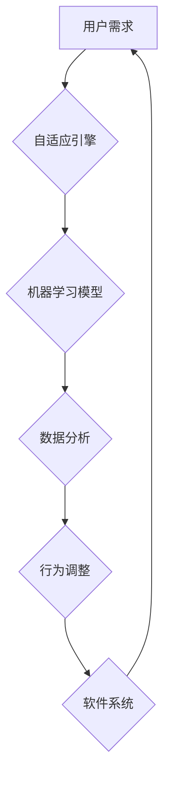

> 软件 2.0, 自适应系统, 机器学习, 深度学习, 自然语言处理, 人机交互, 认知计算, 智慧城市

## 1. 背景介绍

软件已经深刻地改变了我们的生活，从智能手机到云计算，从社交网络到自动驾驶，软件无处不在。然而，传统的软件开发模式面临着越来越多的挑战。随着技术的不断发展，人们对软件的需求也越来越高，需要软件更加智能、更加适应环境变化，更加人性化。

软件 2.0 应运而生，它代表着软件开发模式的重大变革。软件 2.0 强调智能化、自适应性和协同性，旨在构建更加灵活、高效、智能的软件系统。

## 2. 核心概念与联系

软件 2.0 的核心概念包括：

* **自适应系统:**  能够根据环境变化和用户需求自动调整自身行为的系统。
* **机器学习:**  通过数据分析和模式识别，使软件能够学习和改进自身性能的算法。
* **深度学习:**  一种更高级的机器学习方法，能够处理更复杂的数据和任务。
* **自然语言处理:**  使软件能够理解和处理人类语言的算法。
* **人机交互:**  设计更加自然、直观、人性化的用户界面和交互方式。
* **认知计算:**  模拟人类认知过程的算法，使软件能够进行更高级的推理和决策。

**软件 2.0 架构**



## 3. 核心算法原理 & 具体操作步骤

### 3.1  算法原理概述

软件 2.0 的核心算法原理主要基于机器学习和深度学习。

* **机器学习:**  通过训练模型，使软件能够从数据中学习规律，并根据这些规律进行预测或决策。
* **深度学习:**  通过多层神经网络，能够处理更复杂的数据和任务，例如图像识别、语音识别和自然语言理解。

### 3.2  算法步骤详解

**机器学习算法步骤:**

1. **数据收集:**  收集与目标任务相关的训练数据。
2. **数据预处理:**  对数据进行清洗、转换和特征提取。
3. **模型选择:**  选择合适的机器学习模型，例如线性回归、逻辑回归、决策树、支持向量机等。
4. **模型训练:**  使用训练数据训练模型，调整模型参数，使模型能够准确地预测或决策。
5. **模型评估:**  使用测试数据评估模型的性能，例如准确率、召回率、F1-score等。
6. **模型部署:**  将训练好的模型部署到实际应用场景中。

**深度学习算法步骤:**

1. **数据收集:**  收集与目标任务相关的训练数据。
2. **数据预处理:**  对数据进行清洗、转换和特征提取。
3. **网络结构设计:**  设计多层神经网络结构，例如卷积神经网络、循环神经网络等。
4. **模型训练:**  使用训练数据训练模型，调整模型参数，使模型能够准确地预测或决策。
5. **模型评估:**  使用测试数据评估模型的性能，例如准确率、召回率、F1-score等。
6. **模型部署:**  将训练好的模型部署到实际应用场景中。

### 3.3  算法优缺点

**机器学习算法:**

* **优点:**  能够从数据中学习规律，自动进行预测或决策，适应性强。
* **缺点:**  需要大量的训练数据，模型训练时间长，解释性差。

**深度学习算法:**

* **优点:**  能够处理更复杂的数据和任务，性能优于传统机器学习算法。
* **缺点:**  需要更多的计算资源和训练数据，模型训练时间更长，解释性更差。

### 3.4  算法应用领域

* **图像识别:**  自动识别图像中的物体、场景和人物。
* **语音识别:**  将语音转换为文本。
* **自然语言处理:**  理解和处理人类语言，例如机器翻译、文本摘要和问答系统。
* **推荐系统:**  根据用户的历史行为和偏好，推荐相关的商品、服务或内容。
* **医疗诊断:**  辅助医生进行疾病诊断和治疗方案制定。

## 4. 数学模型和公式 & 详细讲解 & 举例说明

### 4.1  数学模型构建

机器学习算法通常使用数学模型来表示数据之间的关系。例如，线性回归模型使用以下公式来预测目标变量：

$$y = w_0 + w_1x_1 + w_2x_2 + ... + w_nx_n$$

其中：

* $y$ 是目标变量
* $w_0, w_1, w_2, ..., w_n$ 是模型参数
* $x_1, x_2, ..., x_n$ 是输入特征

### 4.2  公式推导过程

模型参数的学习过程通常使用梯度下降算法。梯度下降算法的目标是找到使损失函数最小化的模型参数。损失函数衡量模型预测结果与真实结果之间的误差。

梯度下降算法的迭代公式如下：

$$w_i = w_i - \alpha \frac{\partial Loss}{\partial w_i}$$

其中：

* $w_i$ 是模型参数
* $\alpha$ 是学习率
* $\frac{\partial Loss}{\partial w_i}$ 是损失函数对模型参数 $w_i$ 的梯度

### 4.3  案例分析与讲解

例如，在图像识别任务中，可以使用卷积神经网络模型来识别图像中的物体。卷积神经网络模型使用卷积层和池化层来提取图像特征，并使用全连接层来进行分类。

## 5. 项目实践：代码实例和详细解释说明

### 5.1  开发环境搭建

* **操作系统:**  Linux 或 macOS
* **编程语言:**  Python
* **深度学习框架:**  TensorFlow 或 PyTorch
* **其他工具:**  Git、Jupyter Notebook

### 5.2  源代码详细实现

```python
import tensorflow as tf

# 定义模型结构
model = tf.keras.models.Sequential([
    tf.keras.layers.Conv2D(32, (3, 3), activation='relu', input_shape=(28, 28, 1)),
    tf.keras.layers.MaxPooling2D((2, 2)),
    tf.keras.layers.Conv2D(64, (3, 3), activation='relu'),
    tf.keras.layers.MaxPooling2D((2, 2)),
    tf.keras.layers.Flatten(),
    tf.keras.layers.Dense(10, activation='softmax')
])

# 编译模型
model.compile(optimizer='adam',
              loss='sparse_categorical_crossentropy',
              metrics=['accuracy'])

# 训练模型
model.fit(x_train, y_train, epochs=5)

# 评估模型
loss, accuracy = model.evaluate(x_test, y_test)
print('Test loss:', loss)
print('Test accuracy:', accuracy)
```

### 5.3  代码解读与分析

* **模型结构:**  该代码定义了一个简单的卷积神经网络模型，用于识别手写数字。模型包含两层卷积层、两层池化层、一层扁平化层和一层全连接层。
* **模型编译:**  使用 Adam 优化器、交叉熵损失函数和准确率指标来编译模型。
* **模型训练:**  使用训练数据训练模型，训练 5 个 epochs。
* **模型评估:**  使用测试数据评估模型的性能，打印测试损失和准确率。

### 5.4  运行结果展示

运行代码后，会输出测试损失和准确率。

## 6. 实际应用场景

软件 2.0 的应用场景非常广泛，例如：

* **智慧城市:**  利用传感器数据和机器学习算法，实现城市交通管理、环境监测、公共安全等方面的智能化。
* **智能医疗:**  利用深度学习算法，辅助医生进行疾病诊断、个性化治疗方案制定和药物研发。
* **个性化教育:**  根据学生的学习情况和需求，提供个性化的学习内容和教学方式。
* **智能制造:**  利用机器学习算法，实现生产过程的自动化、优化和智能化。

### 6.4  未来应用展望

随着人工智能技术的不断发展，软件 2.0 的应用场景将更加广泛，例如：

* **通用人工智能:**  开发能够像人类一样思考、学习和解决问题的通用人工智能系统。
* **人机融合:**  将人工智能技术与人类智能融合，创造更加高效、智能的协作模式。
* **数字孪生:**  构建数字孪生系统，模拟现实世界，用于预测、优化和控制。

## 7. 工具和资源推荐

### 7.1  学习资源推荐

* **在线课程:**  Coursera、edX、Udacity 等平台提供丰富的机器学习和深度学习课程。
* **书籍:**  《深度学习》、《机器学习实战》等书籍是学习机器学习和深度学习的经典教材。
* **开源项目:**  TensorFlow、PyTorch 等开源深度学习框架提供了丰富的学习资源和示例代码。

### 7.2  开发工具推荐

* **编程语言:**  Python 是机器学习和深度学习开发的常用语言。
* **深度学习框架:**  TensorFlow、PyTorch、Keras 等深度学习框架提供了高效的机器学习模型开发工具。
* **数据处理工具:**  Pandas、NumPy 等数据处理工具可以帮助处理和分析数据。

### 7.3  相关论文推荐

* **《ImageNet Classification with Deep Convolutional Neural Networks》**
* **《Attention Is All You Need》**
* **《BERT: Pre-training of Deep Bidirectional Transformers for Language Understanding》**

## 8. 总结：未来发展趋势与挑战

### 8.1  研究成果总结

软件 2.0 的研究取得了显著成果，例如：

* **机器学习算法的不断发展:**  新的机器学习算法不断涌现，性能不断提升。
* **深度学习模型的突破:**  深度学习模型在图像识别、语音识别、自然语言处理等领域取得了突破性进展。
* **人工智能技术的广泛应用:**  人工智能技术已应用于各个领域，例如医疗、金融、交通等。

### 8.2  未来发展趋势

* **通用人工智能:**  开发能够像人类一样思考、学习和解决问题的通用人工智能系统。
* **人机融合:**  将人工智能技术与人类智能融合，创造更加高效、智能的协作模式。
* **边缘计算:**  将人工智能算法部署到边缘设备，实现更快速的响应和更低的延迟。

### 8.3  面临的挑战

* **数据安全和隐私保护:**  人工智能算法依赖于大量数据，如何保证数据安全和隐私保护是一个重要挑战。
* **算法解释性和可信度:**  许多人工智能算法是黑箱模型，难以解释其决策过程，如何提高算法的解释性和可信度是一个重要挑战。
* **伦理问题:**  人工智能技术的快速发展引发了伦理问题，例如算法偏见、工作岗位替代等，需要认真思考和解决。

### 8.4  研究展望

未来，软件 2.0 的研究将继续深入，探索人工智能技术的更广阔应用场景，并解决人工智能技术带来的挑战，为人类社会带来更多福祉。

## 9. 附录：常见问题与解答

**常见问题:**

* **什么是软件 2.0?**

软件 2.0 是一种新的软件开发模式，强调智能化、自适应性和协同性，旨在构建更加灵活、高效、智能的软件系统。

* **软件 2.0 的核心技术是什么?**

软件 2.0 的核心技术包括机器学习、深度学习、自然语言处理、人机交互等。

* **软件 2.0 的应用场景有哪些?**

软件 2.0 的应用