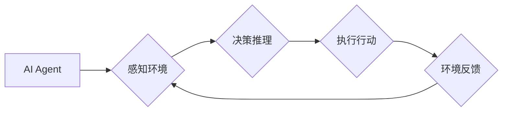

> AI Agent, 具身智能, 强化学习, 决策推理, 嵌入式系统, 计算机视觉

## 1. 背景介绍

人工智能（AI）技术近年来取得了飞速发展，从语音识别、图像识别到自然语言处理等领域取得了突破性进展。然而，传统的AI模型大多局限于数字空间，缺乏与物理世界直接交互的能力。随着技术的进步，**具身智能（Embodied Intelligence）** 成为AI发展的新方向，它赋予AI实体形态，使其能够感知、理解和交互于物理世界。

具身智能的核心概念是将AI代理（AI Agent）嵌入到物理环境中，使其能够通过传感器感知环境信息，并通过执行器与环境进行交互。这种嵌入式设计使得AI代理能够更深入地理解世界，并做出更有效的决策。

## 2. 核心概念与联系

**AI Agent** 是一个能够感知环境、做出决策并执行行动的智能体。它是一个独立的系统，能够自主学习和适应环境变化。

**具身智能** 则将AI Agent 与物理世界紧密结合，使其能够感知环境、理解环境信息并与环境进行交互。

**核心概念联系：**



## 3. 核心算法原理 & 具体操作步骤

### 3.1  算法原理概述

具身智能的核心算法主要包括强化学习（Reinforcement Learning）、决策推理（Decision Making）和计算机视觉（Computer Vision）。

* **强化学习:**  AI代理通过与环境交互，学习最佳的行为策略，以最大化奖励。
* **决策推理:**  AI代理根据感知到的环境信息和自身的知识库，做出最优的决策。
* **计算机视觉:**  AI代理通过摄像头等传感器获取环境图像信息，并利用计算机视觉算法进行图像识别、物体检测等操作。

### 3.2  算法步骤详解

1. **环境感知:** AI代理通过传感器收集环境信息，例如图像、声音、距离等。
2. **信息处理:** AI代理利用计算机视觉、自然语言处理等算法对收集到的信息进行处理和分析。
3. **决策推理:** AI代理根据处理后的信息和自身的知识库，利用决策树、逻辑推理等算法做出决策。
4. **行动执行:** AI代理通过执行器与环境进行交互，例如移动、抓取、说话等。
5. **反馈接收:** AI代理接收环境的反馈信息，例如奖励、惩罚等。
6. **学习更新:** AI代理根据反馈信息更新自身的策略，以提高未来的决策效果。

### 3.3  算法优缺点

**优点:**

* 能够更好地理解和交互于物理世界。
* 能够自主学习和适应环境变化。
* 能够解决传统AI模型难以解决的实际问题。

**缺点:**

* 算法复杂度高，需要大量的计算资源。
* 数据收集和标注成本高。
* 安全性和可靠性需要进一步提高。

### 3.4  算法应用领域

* **机器人:**  赋予机器人更强的感知、决策和执行能力，使其能够完成更复杂的任务。
* **自动驾驶:**  帮助自动驾驶汽车感知周围环境、做出决策并安全行驶。
* **医疗保健:**  辅助医生进行诊断、治疗和康复。
* **教育:**  提供个性化的学习体验，帮助学生更好地理解和掌握知识。

## 4. 数学模型和公式 & 详细讲解 & 举例说明

### 4.1  数学模型构建

强化学习的核心是**马尔可夫决策过程（MDP）**模型。MDP模型描述了一个智能体与环境交互的过程，其中智能体在不同的状态下采取不同的行动，并获得相应的奖励。

**MDP模型的组成部分:**

* **状态空间 (S):** 所有可能的系统状态的集合。
* **动作空间 (A):** 智能体在每个状态下可以采取的所有动作的集合。
* **转移概率 (P):** 从一个状态到另一个状态的概率，取决于采取的动作。
* **奖励函数 (R):** 智能体在每个状态下采取每个动作获得的奖励。

### 4.2  公式推导过程

**目标:** 找到一个策略 π，使得智能体在与环境交互的过程中获得最大的总奖励。

**Bellman方程:**

$$
V^{\pi}(s) = \max_a \left[ R(s,a) + \gamma \sum_{s'} P(s'|s,a) V^{\pi}(s') \right]
$$

其中:

* $V^{\pi}(s)$ 是策略 π 下状态 s 的价值函数。
* $R(s,a)$ 是状态 s 下采取动作 a 获得的奖励。
* $\gamma$ 是折扣因子，控制未来奖励的权重。
* $P(s'|s,a)$ 是从状态 s 采取动作 a 到状态 $s'$ 的转移概率。

### 4.3  案例分析与讲解

**例子:**

一个机器人需要在迷宫中找到出口。迷宫的状态空间是所有可能的机器人位置，动作空间是向上、向下、向左、向右四个方向。奖励函数是到达出口时获得最大奖励，迷宫中其他位置获得零奖励。

利用 Bellman方程，我们可以迭代地计算每个状态的价值函数，最终找到一个策略，使得机器人能够找到出口并获得最大奖励。

## 5. 项目实践：代码实例和详细解释说明

### 5.1  开发环境搭建

* 操作系统: Ubuntu 20.04
* Python 版本: 3.8
* 必要的库: TensorFlow, PyTorch, OpenCV, NumPy

### 5.2  源代码详细实现

```python
# 导入必要的库
import tensorflow as tf
from tensorflow.keras.models import Sequential
from tensorflow.keras.layers import Dense, Conv2D, MaxPooling2D, Flatten

# 定义模型结构
model = Sequential()
model.add(Conv2D(32, (3, 3), activation='relu', input_shape=(64, 64, 3)))
model.add(MaxPooling2D((2, 2)))
model.add(Conv2D(64, (3, 3), activation='relu'))
model.add(MaxPooling2D((2, 2)))
model.add(Flatten())
model.add(Dense(10, activation='softmax'))

# 编译模型
model.compile(optimizer='adam',
              loss='sparse_categorical_crossentropy',
              metrics=['accuracy'])

# 训练模型
model.fit(x_train, y_train, epochs=10)

# 评估模型
loss, accuracy = model.evaluate(x_test, y_test)
print('Loss:', loss)
print('Accuracy:', accuracy)
```

### 5.3  代码解读与分析

* 代码首先导入必要的库，包括 TensorFlow 和 OpenCV。
* 然后定义了一个卷积神经网络模型，用于图像分类。
* 模型包含两个卷积层、两个池化层和一个全连接层。
* 模型使用 Adam 优化器、交叉熵损失函数和准确率指标进行训练。
* 最后，代码训练了模型，并评估了模型的性能。

### 5.4  运行结果展示

训练完成后，模型能够识别图像中的物体，并输出相应的类别。

## 6. 实际应用场景

### 6.1  机器人导航

具身智能可以帮助机器人更好地感知周围环境，并规划最优的导航路径。

### 6.2  智能家居

具身智能可以赋予智能家居设备更强的交互能力，例如语音控制、图像识别等。

### 6.3  医疗辅助

具身智能可以辅助医生进行诊断、治疗和康复，例如机器人手术、智能诊断系统等。

### 6.4  未来应用展望

* **更智能的机器人:** 具身智能将使机器人更加智能、灵活和自主，能够完成更复杂的任务。
* **更人性化的交互:** 具身智能将使人与机器之间的交互更加自然和人性化。
* **更广泛的应用场景:** 具身智能将应用于更多领域，例如教育、娱乐、交通等。

## 7. 工具和资源推荐

### 7.1  学习资源推荐

* **书籍:**
    * 《Reinforcement Learning: An Introduction》 by Richard S. Sutton and Andrew G. Barto
    * 《Deep Learning》 by Ian Goodfellow, Yoshua Bengio, and Aaron Courville
* **在线课程:**
    * Coursera: Reinforcement Learning Specialization
    * Udacity: Deep Learning Nanodegree

### 7.2  开发工具推荐

* **TensorFlow:** 开源深度学习框架
* **PyTorch:** 开源深度学习框架
* **OpenCV:** 图像处理库

### 7.3  相关论文推荐

* **Deep Reinforcement Learning with Double Q-learning**
* **Proximal Policy Optimization Algorithms**
* **Attention Is All You Need**

## 8. 总结：未来发展趋势与挑战

### 8.1  研究成果总结

具身智能是一个新兴的领域，近年来取得了显著进展。强化学习、决策推理和计算机视觉等算法为具身智能的发展提供了理论基础和技术支撑。

### 8.2  未来发展趋势

* **更强大的计算能力:** 随着计算能力的提升，具身智能模型能够变得更加复杂和强大。
* **更丰富的传感器数据:** 随着传感器技术的进步，具身智能代理能够获取更丰富和准确的环境信息。
* **更有效的学习算法:** 研究人员将继续开发更有效的学习算法，使具身智能代理能够更快、更有效地学习。

### 8.3  面临的挑战

* **数据收集和标注:** 

具身智能的训练需要大量的真实世界数据，而收集和标注这些数据成本很高。
* **安全性和可靠性:** 具身智能代理需要在现实世界中安全可靠地运行，这需要解决许多技术挑战。
* **伦理问题:** 具身智能的应用可能会引发一些伦理问题，例如隐私保护、责任归属等。

### 8.4  研究展望

未来，具身智能将继续朝着更智能、更安全、更可靠的方向发展，并应用于更多领域，改变我们的生活方式。

## 9. 附录：常见问题与解答

**Q1: 具身智能与传统AI有什么区别？**

**A1:** 传统AI主要局限于数字空间，而具身智能则将AI代理嵌入到物理世界中，使其能够感知、理解和交互于物理环境。

**Q2: 具身智能的应用场景有哪些？**

**A2:** 具身智能的应用场景非常广泛，例如机器人导航、智能家居、医疗辅助等。

**Q3: 具身智能面临哪些挑战？**

**A3:** 具身智能面临的数据收集和标注成本高、安全性和可靠性需要提高、伦理问题等挑战。


作者：禅与计算机程序设计艺术 / Zen and the Art of Computer Programming 
<end_of_turn>