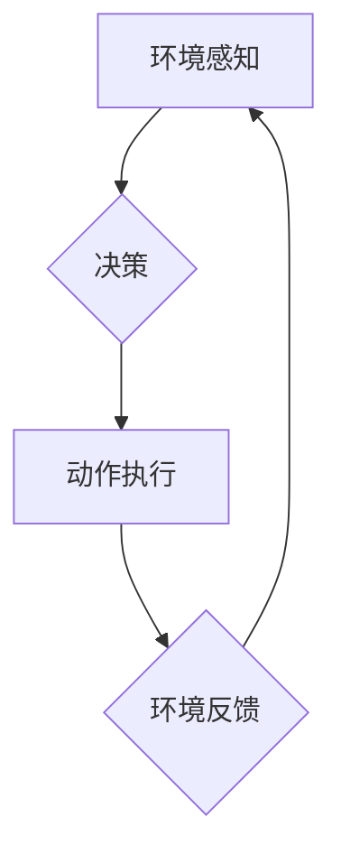

> 多智能体系统，AI Agent，分布式人工智能，协作学习，强化学习，机器学习，智能体交互

## 1. 背景介绍

人工智能（AI）技术近年来取得了飞速发展，从语音识别、图像识别到自然语言处理，AI已经渗透到我们生活的方方面面。然而，传统的单智能体AI模型在面对复杂、动态环境时往往表现力不足。随着技术的进步，多智能体系统（Multi-Agent System，MAS）逐渐成为AI领域的新兴热点，被认为是AI发展的下一个风口。

多智能体系统由多个智能体组成，每个智能体都具有自主决策能力和行为能力，它们通过相互交互和协作来完成共同目标。与单智能体系统相比，多智能体系统具有以下优势：

* **鲁棒性强:** 多个智能体协同工作，即使部分智能体出现故障，系统仍然能够保持正常运行。
* **适应性强:** 多智能体系统能够根据环境变化动态调整策略，更好地适应复杂环境。
* **解复杂问题能力强:** 多个智能体可以分工合作，协同解决复杂问题，超越单个智能体的能力。

## 2. 核心概念与联系

**2.1 多智能体系统 (MAS)**

多智能体系统是由多个独立的智能体组成，每个智能体都具有感知环境、做出决策和执行动作的能力。智能体之间可以通过通信和合作来实现共同目标。

**2.2 AI Agent**

AI Agent是多智能体系统中的核心组成部分，它是一个能够感知环境、做出决策并执行动作的软件实体。AI Agent通常具有以下特征：

* **自主性:** AI Agent能够独立地感知环境、做出决策并执行动作。
* **学习能力:** AI Agent能够通过经验学习，不断改进自己的决策策略。
* **交互性:** AI Agent能够与其他智能体进行通信和合作。

**2.3 智能体交互**

智能体交互是多智能体系统中至关重要的环节，它指智能体之间通过信息交换和行为协调来实现合作和竞争。常见的智能体交互方式包括：

* **直接通信:** 智能体通过直接发送消息的方式进行交互。
* **间接通信:** 智能体通过共享环境信息或公共资源进行交互。
* **竞争:** 智能体为了获取资源或完成目标而相互竞争。

**2.4 协作学习**

协作学习是指多个智能体共同学习，通过共享知识和经验来提高整体性能。常见的协作学习方法包括：

* **联邦学习:** 智能体在本地训练模型，然后将模型参数共享到中央服务器进行聚合。
* **群体智能:** 智能体模仿自然界群体行为，通过相互协作和竞争来解决问题。

**2.5 强化学习**

强化学习是一种机器学习方法，它通过奖励和惩罚机制来训练智能体，使其在特定环境中获得最大奖励。强化学习在多智能体系统中被广泛应用于智能体决策和策略优化。

**2.6 Mermaid 流程图**



## 3. 核心算法原理 & 具体操作步骤

### 3.1  算法原理概述

多智能体系统中的核心算法通常涉及智能体决策、交互和协作等方面。常见的算法包括：

* **Q-学习:** 一种强化学习算法，用于训练智能体选择最优动作以获得最大奖励。
* **Deep Q-Network (DQN):** 基于深度神经网络的强化学习算法，能够处理更复杂的环境和任务。
* **Game Theory:** 博弈论提供了一种分析智能体交互和竞争的框架，可以帮助设计智能体策略。
* **Consensus Algorithm:** 协商算法用于使多个智能体达成一致，例如在分布式决策中。

### 3.2  算法步骤详解

以Q-学习为例，其算法步骤如下：

1. **初始化Q表:** 创建一个Q表，用于存储每个状态下每个动作的价值估计。
2. **环境感知:** 智能体感知当前环境状态。
3. **选择动作:** 根据Q表选择一个动作，可以选择贪婪策略（选择价值最高的动作）或探索策略（随机选择动作）。
4. **执行动作:** 智能体执行选择的动作，并观察环境反馈。
5. **更新Q表:** 根据环境反馈和奖励，更新Q表中的价值估计。
6. **重复步骤2-5:** 直到智能体达到预设的目标或训练结束。

### 3.3  算法优缺点

**优点:**

* 能够学习复杂的决策策略。
* 适用于各种环境和任务。

**缺点:**

* 训练时间长，需要大量数据。
* 容易陷入局部最优解。

### 3.4  算法应用领域

Q-学习和DQN算法广泛应用于以下领域：

* **机器人控制:** 训练机器人自主导航、抓取物体等行为。
* **游戏AI:** 训练游戏中的AI对手，使其能够与人类玩家进行对抗。
* **金融交易:** 训练智能交易系统，自动进行股票交易。

## 4. 数学模型和公式 & 详细讲解 & 举例说明

### 4.1  数学模型构建

在强化学习中，多智能体系统可以建模为马尔可夫决策过程 (MDP)。MDP由以下要素组成：

* **状态空间 S:** 所有可能的系统状态的集合。
* **动作空间 A:** 在每个状态下智能体可以执行的动作的集合。
* **转移概率 P(s', r | s, a):** 从状态 s 执行动作 a 到状态 s' 的概率，以及获得奖励 r 的概率。
* **奖励函数 R(s, a):** 在状态 s 执行动作 a 时获得的奖励。

### 4.2  公式推导过程

Q-学习算法的目标是学习一个价值函数 Q(s, a)，该函数估计在状态 s 执行动作 a 的长期奖励。Q-学习算法的更新规则如下：

$$Q(s, a) \leftarrow Q(s, a) + \alpha [r + \gamma \max_{a'} Q(s', a') - Q(s, a)]$$

其中：

* $\alpha$ 是学习率，控制着学习速度。
* $\gamma$ 是折扣因子，控制着未来奖励的权重。
* $r$ 是当前状态下获得的奖励。
* $s'$ 是执行动作 a 后到达的状态。
* $a'$ 是在状态 $s'$ 中选择的最优动作。

### 4.3  案例分析与讲解

假设有一个智能体在迷宫中寻找出口，迷宫的状态空间是所有可能的房间，动作空间是上下左右四个方向。智能体在每个房间获得奖励，到达出口获得最大奖励。

使用Q-学习算法，智能体可以学习到每个房间执行每个动作的价值，并选择最优动作以到达出口。

## 5. 项目实践：代码实例和详细解释说明

### 5.1  开发环境搭建

* Python 3.x
* TensorFlow 或 PyTorch 深度学习框架
* OpenAI Gym 或其他强化学习环境

### 5.2  源代码详细实现

```python
import gym
import numpy as np
from tensorflow.keras.models import Sequential
from tensorflow.keras.layers import Dense

# 定义环境
env = gym.make('CartPole-v1')

# 定义神经网络模型
model = Sequential()
model.add(Dense(128, activation='relu', input_shape=(env.observation_space.shape[0],)))
model.add(Dense(64, activation='relu'))
model.add(Dense(env.action_space.n))

# 定义Q-学习算法
def q_learning(model, env, alpha=0.1, gamma=0.99, episodes=1000):
    for episode in range(episodes):
        state = env.reset()
        done = False
        while not done:
            # 选择动作
            action = np.argmax(model.predict(state[None, :]))
            # 执行动作
            next_state, reward, done, _ = env.step(action)
            # 更新Q值
            target = reward + gamma * np.max(model.predict(next_state[None, :]))
            target_f = model.predict(state[None, :])
            target_f[0][action] = target
            model.fit(state[None, :], target_f, epochs=1, verbose=0)
            state = next_state

# 训练模型
q_learning(model, env)

# 测试模型
state = env.reset()
while True:
    action = np.argmax(model.predict(state[None, :]))
    state, reward, done, _ = env.step(action)
    env.render()
    if done:
        break
env.close()
```

### 5.3  代码解读与分析

* 代码首先定义了环境和神经网络模型。
* 然后定义了Q-学习算法，包括选择动作、执行动作、更新Q值等步骤。
* 训练模型后，可以测试模型在环境中的表现。

### 5.4  运行结果展示

运行代码后，可以观察到智能体在环境中学习并最终完成任务。

## 6. 实际应用场景

### 6.1  智能交通系统

多智能体系统可以用于优化交通流量，协调车辆行驶，减少拥堵。

### 6.2  无人机协同控制

多个无人机可以协同工作，完成任务，例如搜索和救援、监控和巡逻。

### 6.3  机器人协作

多个机器人可以协同工作，完成复杂的任务，例如组装、搬运、清洁。

### 6.4  未来应用展望

多智能体系统在未来将有更广泛的应用，例如：

* **自动驾驶:** 多个车辆可以协同驾驶，提高安全性。
* **医疗保健:** 多个机器人可以协同工作，辅助医生进行手术和护理。
* **教育:** 多个智能体可以与学生互动，提供个性化的学习体验。

## 7. 工具和资源推荐

### 7.1  学习资源推荐

* **书籍:**
    * Multi-Agent Systems: A Modern Approach
    * Reinforcement Learning: An Introduction
* **在线课程:**
    * Coursera: Reinforcement Learning Specialization
    * Udacity: Intro to Artificial Intelligence

### 7.2  开发工具推荐

* **Python:** 广泛用于多智能体系统开发。
* **TensorFlow/PyTorch:** 深度学习框架，用于训练智能体模型。
* **OpenAI Gym:** 强化学习环境，用于测试智能体算法。

### 7.3  相关论文推荐

* **Multi-Agent Reinforcement Learning: A Survey**
* **Deep Reinforcement Learning for Multi-Agent Systems**

## 8. 总结：未来发展趋势与挑战

### 8.1  研究成果总结

多智能体系统研究取得了显著进展，在算法、模型、应用等方面取得了突破。

### 8.2  未来发展趋势

* **更复杂的智能体模型:** 研究更复杂的智能体模型，例如具有自适应能力、学习能力和社会化能力的智能体。
* **更强大的协作算法:** 研究更强大的协作算法，使智能体能够更有效地合作完成任务。
* **更广泛的应用场景:** 将多智能体系统应用于更多领域，例如自动驾驶、医疗保健、教育等。

### 8.3  面临的挑战

* **可解释性:** 多智能体系统的决策过程往往难以解释，这限制了其在安全关键领域中的应用。
* **鲁棒性:** 多智能体系统容易受到环境变化和攻击的影响，需要提高其鲁棒性。
* **效率:** 多智能体系统的训练和推理过程往往非常耗时，需要提高其效率。

### 8.4  研究展望

未来，多智能体系统研究将继续朝着更智能、更协作、更安全的方向发展，为人类社会带来更多福祉。

## 9.