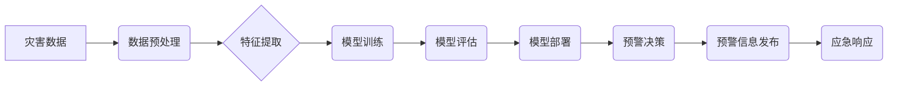

> AI、灾害预警、应急管理、机器学习、深度学习、数据分析、预警系统、智能化

## 1. 背景介绍

自然灾害是人类社会面临的重大挑战之一，其带来的巨大损失和威胁着人类生命财产安全。传统灾害预警系统往往依赖于人工监测和经验判断，反应速度慢、预警精度低，难以应对突发性灾害。随着人工智能技术的快速发展，特别是深度学习算法的突破，为灾害预警与应急管理提供了新的思路和技术手段。

智能化灾害预警系统利用人工智能技术，对海量灾害相关数据进行分析和预测，能够更准确、更快速地预警灾害发生，为灾害应对提供决策支持。

## 2. 核心概念与联系

**2.1 灾害预警与应急管理**

灾害预警是指在灾害发生前，通过监测、分析和预测，及时向相关人员和机构发出预警信息，以便采取相应的防灾减灾措施。应急管理是指在灾害发生时，组织和协调各方力量，采取有效措施，减少灾害造成的损失，恢复社会秩序。

**2.2 人工智能技术在灾害预警中的应用**

人工智能技术在灾害预警中的应用主要包括以下几个方面：

* **数据分析与挖掘:** 利用机器学习算法对海量灾害相关数据进行分析和挖掘，识别灾害的潜在特征和模式。
* **预警模型构建:** 基于数据分析结果，构建灾害预警模型，预测灾害的发生时间、地点和强度。
* **预警信息发布:** 通过多种渠道，及时向相关人员和机构发布预警信息，提高灾害预警的覆盖范围和及时性。
* **应急决策支持:** 为灾害应急决策提供数据支撑和分析建议，提高应急决策的科学性和有效性。

**2.3 AI 基础设施**

AI 基础设施是指支撑人工智能应用运行的硬件、软件和数据资源。它包括：

* **计算资源:** 高性能计算集群、GPU加速器等，为人工智能算法训练和推理提供强大的计算能力。
* **存储资源:** 海量数据存储系统，存储海量灾害相关数据，并提供快速访问能力。
* **网络资源:** 高速网络连接，保证数据传输的快速性和可靠性。
* **软件平台:** AI 开发平台、数据分析平台等，提供人工智能算法开发、训练、部署和管理的工具和环境。

**2.4 架构图**



## 3. 核心算法原理 & 具体操作步骤

**3.1 算法原理概述**

智能化灾害预警系统通常采用机器学习算法，例如支持向量机、决策树、随机森林、神经网络等，对灾害相关数据进行分析和预测。这些算法能够从数据中学习灾害发生的模式和特征，并根据新的数据预测灾害的发生可能性和强度。

**3.2 算法步骤详解**

1. **数据收集:** 收集各种灾害相关数据，例如气象数据、地质数据、遥感数据、社会经济数据等。
2. **数据预处理:** 对收集到的数据进行清洗、转换、归一化等处理，使其适合机器学习算法的训练。
3. **特征提取:** 从预处理后的数据中提取具有代表性的特征，例如温度、湿度、风速、降雨量、地壳活动等。
4. **模型训练:** 选择合适的机器学习算法，对提取的特征进行训练，建立灾害预警模型。
5. **模型评估:** 使用测试数据对训练好的模型进行评估，评估模型的预测精度和可靠性。
6. **模型部署:** 将训练好的模型部署到生产环境中，用于实时预测灾害发生。
7. **预警信息发布:** 根据模型预测结果，向相关人员和机构发布预警信息，并提供相应的防灾减灾建议。

**3.3 算法优缺点**

* **优点:**
    * 能够从海量数据中发现隐藏的模式和特征，提高预警精度。
    * 能够实时预测灾害发生，提高预警的及时性。
    * 能够为灾害应急决策提供数据支撑，提高决策的科学性和有效性。
* **缺点:**
    * 需要大量的训练数据，数据质量直接影响模型的性能。
    * 模型的训练和部署需要一定的技术门槛。
    * 模型的预测结果存在一定的误差，需要结合其他信息进行判断。

**3.4 算法应用领域**

* **气象灾害预警:** 预警暴雨、洪水、干旱、台风等气象灾害。
* **地震灾害预警:** 预警地震发生时间、地点和震级。
* **山体滑坡预警:** 预警山体滑坡发生时间、地点和滑坡范围。
* **火灾预警:** 预警森林火灾、城市火灾等火灾发生。

## 4. 数学模型和公式 & 详细讲解 & 举例说明

**4.1 数学模型构建**

灾害预警模型通常采用回归模型或分类模型。

* **回归模型:** 用于预测灾害的发生强度，例如洪水深度、地震震级等。常用的回归模型包括线性回归、多项式回归、支持向量回归等。
* **分类模型:** 用于预测灾害的发生概率，例如是否发生洪水、是否发生地震等。常用的分类模型包括逻辑回归、支持向量机、决策树、随机森林等。

**4.2 公式推导过程**

例如，使用线性回归模型预测洪水深度，模型的公式如下：

$$
y = \beta_0 + \beta_1 x_1 + \beta_2 x_2 + ... + \beta_n x_n + \epsilon
$$

其中：

* $y$ 是洪水深度
* $x_1, x_2, ..., x_n$ 是预测变量，例如降雨量、河流流量等
* $\beta_0, \beta_1, ..., \beta_n$ 是模型参数
* $\epsilon$ 是误差项

模型参数可以通过最小二乘法估计。

**4.3 案例分析与讲解**

假设我们想要预测某地区的洪水深度，收集了降雨量、河流流量等数据，并使用线性回归模型进行训练。训练结果表明，降雨量和河流流量对洪水深度有显著影响，模型的预测精度较高。

## 5. 项目实践：代码实例和详细解释说明

**5.1 开发环境搭建**

* 操作系统: Ubuntu 20.04
* Python 版本: 3.8
* 必要的库: pandas, numpy, scikit-learn, matplotlib

**5.2 源代码详细实现**

```python
import pandas as pd
from sklearn.model_selection import train_test_split
from sklearn.linear_model import LinearRegression
from sklearn.metrics import mean_squared_error

# 加载数据
data = pd.read_csv('flood_data.csv')

# 选择特征和目标变量
X = data[['rainfall', 'river_flow']]
y = data['flood_depth']

# 将数据划分为训练集和测试集
X_train, X_test, y_train, y_test = train_test_split(X, y, test_size=0.2, random_state=42)

# 创建线性回归模型
model = LinearRegression()

# 训练模型
model.fit(X_train, y_train)

# 预测测试集数据
y_pred = model.predict(X_test)

# 计算模型的均方误差
mse = mean_squared_error(y_test, y_pred)
print(f'Mean Squared Error: {mse}')

# 可视化预测结果
import matplotlib.pyplot as plt
plt.scatter(y_test, y_pred)
plt.xlabel('Actual Flood Depth')
plt.ylabel('Predicted Flood Depth')
plt.title('Flood Depth Prediction')
plt.show()
```

**5.3 代码解读与分析**

* 代码首先加载数据，选择特征和目标变量。
* 然后将数据划分为训练集和测试集，用于训练和评估模型。
* 创建线性回归模型，并使用训练集数据进行训练。
* 使用训练好的模型预测测试集数据，并计算模型的均方误差。
* 最后，使用 matplotlib 库可视化预测结果。

**5.4 运行结果展示**

运行代码后，会输出模型的均方误差值，以及预测结果的可视化图。

## 6. 实际应用场景

**6.1 气象灾害预警**

智能化气象灾害预警系统可以利用气象数据、遥感数据等，预测暴雨、洪水、干旱、台风等气象灾害的发生时间、地点和强度，为灾害应对提供决策支持。

**6.2 地震灾害预警**

智能化地震灾害预警系统可以利用地壳活动数据、地震历史数据等，预测地震发生时间、地点和震级，为地震灾害应急响应提供预警信息。

**6.3 山体滑坡预警**

智能化山体滑坡预警系统可以利用地质数据、遥感数据等，预测山体滑坡发生时间、地点和滑坡范围，为山体滑坡灾害应急响应提供预警信息。

**6.4 火灾预警**

智能化火灾预警系统可以利用火灾历史数据、气象数据、遥感数据等，预测森林火灾、城市火灾等火灾发生时间、地点和火势强度，为火灾灾害应急响应提供预警信息。

**6.5 未来应用展望**

随着人工智能技术的不断发展，智能化灾害预警系统将更加智能化、精准化、实时化。未来，智能化灾害预警系统将能够：

* 更准确地预测灾害发生时间、地点和强度。
* 提供更个性化的预警信息，针对不同人群和地区的灾害风险提供定制化的预警方案。
* 与其他应急管理系统进行集成，实现灾害应急管理的协同化。

## 7. 工具和资源推荐

**7.1 学习资源推荐**

* **书籍:**
    * 《深度学习》
    * 《机器学习》
    * 《人工智能基础》
* **在线课程:**
    * Coursera: 深度学习
    * edX: 机器学习
    * Udacity: 人工智能工程师

**7.2 开发工具推荐**

* **Python:** 广泛应用于人工智能开发，拥有丰富的库和工具。
* **TensorFlow:** 开源深度学习框架，支持多种硬件平台。
* **PyTorch:** 开源深度学习框架，以其灵活性和易用性而闻名。
* **Jupyter Notebook:** 用于交互式编程和数据分析的工具。

**7.3 相关论文推荐**

* **自然语言处理:**
    * Attention Is All You Need
    * BERT: Pre-training of Deep Bidirectional Transformers for Language Understanding
* **计算机视觉:**
    * ImageNet Classification with Deep Convolutional Neural Networks
    * Mask R-CNN

## 8. 总结：未来发展趋势与挑战

**8.1 研究成果总结**

近年来，人工智能技术在灾害预警领域取得了显著进展，智能化灾害预警系统能够更准确、更快速地预警灾害发生，为灾害应对提供决策支持。

**8.2 未来发展趋势**

* **模型精度提升:** 探索更先进的机器学习算法和深度学习模型，提高灾害预警的精度和可靠性。
* **数据融合:** 将多种类型的数据融合在一起，例如气象数据、地质数据、遥感数据、社会