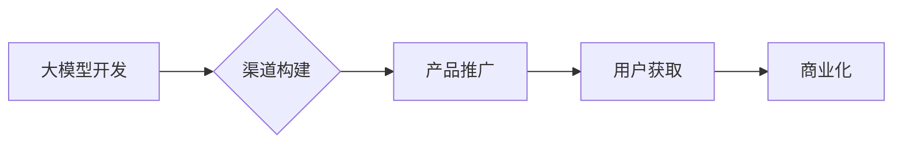

> AI大模型，创业，渠道优势，商业化，应用场景，技术落地

## 1. 背景介绍

近年来，人工智能（AI）技术取得了飞速发展，特别是大模型的涌现，为各行各业带来了前所未有的机遇。大模型，是指参数规模庞大、训练数据海量的人工智能模型，具备强大的泛化能力和学习能力，能够在自然语言处理、计算机视觉、语音识别等领域取得突破性进展。

然而，大模型的开发和应用并非易事，其训练成本高昂、部署难度大、安全风险等问题也需要认真对待。对于创业者而言，如何利用大模型的优势，并将其转化为商业价值，成为一个关键问题。

## 2. 核心概念与联系

**2.1 大模型的定义和特点**

大模型是指参数规模庞大、训练数据海量的人工智能模型。其特点包括：

* **参数规模巨大:** 大模型通常拥有数十亿甚至数千亿个参数，这使得它们能够学习到更复杂的模式和关系。
* **训练数据海量:** 大模型的训练需要大量的文本、图像、音频等数据，这些数据通常来自互联网、数据库等公开或私有来源。
* **泛化能力强:** 由于参数规模庞大，大模型能够更好地泛化到从未见过的数据上，表现出更强的预测和生成能力。

**2.2 渠道优势的定义和作用**

渠道优势是指企业在产品或服务的销售和推广过程中，拥有比竞争对手更强的渠道网络、资源和影响力。

对于AI大模型创业公司而言，渠道优势可以帮助其：

* **快速推广产品:** 通过现有渠道网络，快速将大模型产品推向目标用户。
* **获取用户反馈:** 通过渠道网络收集用户反馈，不断改进产品功能和服务质量。
* **建立品牌影响力:** 通过渠道合作，提升品牌知名度和美誉度。

**2.3 大模型与渠道优势的联系**

大模型本身具有强大的技术优势，但其商业化需要依靠渠道优势来实现。

* 大模型可以为渠道合作伙伴提供个性化服务、数据分析等增值服务，提升合作伙伴的竞争力。
* 大模型可以帮助渠道合作伙伴更好地了解用户需求，提供更精准的营销和销售服务。
* 大模型可以帮助渠道合作伙伴提高运营效率，降低成本。

**2.4 渠道优势的构建**

构建渠道优势需要企业进行多方面的努力，包括：

* **建立完善的渠道网络:** 与行业内各环节的合作伙伴建立合作关系，形成完整的渠道网络。
* **开发优质的产品和服务:** 提供具有竞争力的产品和服务，满足合作伙伴和用户的需求。
* **提供有效的支持和培训:** 为合作伙伴提供技术支持、培训和营销资源，帮助他们更好地推广和销售产品。

**2.5 Mermaid 流程图**



## 3. 核心算法原理 & 具体操作步骤

### 3.1  算法原理概述

大模型的训练主要基于深度学习算法，其中Transformer模型是目前最流行的架构之一。Transformer模型利用注意力机制，能够捕捉文本序列中长距离依赖关系，从而实现更准确的理解和生成。

### 3.2  算法步骤详解

大模型的训练过程可以概括为以下步骤：

1. **数据预处理:** 将原始数据进行清洗、格式化和编码，使其能够被模型理解。
2. **模型构建:** 根据预定的模型架构，搭建模型结构，并初始化模型参数。
3. **模型训练:** 使用训练数据，通过反向传播算法，不断调整模型参数，使其能够更好地预测或生成目标输出。
4. **模型评估:** 使用测试数据，评估模型的性能，并根据评估结果进行模型调优。
5. **模型部署:** 将训练好的模型部署到生产环境中，用于实际应用。

### 3.3  算法优缺点

**优点:**

* 强大的泛化能力
* 能够处理复杂的任务
* 持续学习和改进

**缺点:**

* 训练成本高昂
* 部署难度大
* 安全风险

### 3.4  算法应用领域

大模型在各个领域都有广泛的应用，例如：

* **自然语言处理:** 文本生成、机器翻译、问答系统、情感分析等
* **计算机视觉:** 图像识别、物体检测、图像生成等
* **语音识别:** 语音转文本、语音合成等
* **推荐系统:** 商品推荐、内容推荐等

## 4. 数学模型和公式 & 详细讲解 & 举例说明

### 4.1  数学模型构建

大模型的训练过程可以看作是一个优化问题，目标是找到最优的参数值，使得模型的预测或生成结果与真实值之间的误差最小。

常用的损失函数包括均方误差（MSE）、交叉熵损失（Cross-Entropy Loss）等。

### 4.2  公式推导过程

**均方误差 (MSE):**

$$MSE = \frac{1}{n} \sum_{i=1}^{n} (y_i - \hat{y}_i)^2$$

其中：

* $y_i$ 是真实值
* $\hat{y}_i$ 是模型预测值
* $n$ 是样本数量

**交叉熵损失 (Cross-Entropy Loss):**

$$Cross-Entropy Loss = -\sum_{i=1}^{n} y_i \log(\hat{y}_i)$$

其中：

* $y_i$ 是真实值（one-hot编码）
* $\hat{y}_i$ 是模型预测值（概率分布）

### 4.3  案例分析与讲解

假设我们训练一个图像分类模型，目标是将图像分类为猫或狗。

我们可以使用交叉熵损失函数来衡量模型的性能。

如果模型预测图像为猫的概率为0.8，而真实标签为猫，则损失值为：

$$Cross-Entropy Loss = -0.8 \log(0.8) \approx 0.22$$

## 5. 项目实践：代码实例和详细解释说明

### 5.1  开发环境搭建

* Python 3.7+
* TensorFlow/PyTorch
* CUDA/cuDNN

### 5.2  源代码详细实现

```python
# 使用 TensorFlow 构建一个简单的图像分类模型

import tensorflow as tf

# 定义模型结构
model = tf.keras.models.Sequential([
    tf.keras.layers.Conv2D(32, (3, 3), activation='relu', input_shape=(28, 28, 1)),
    tf.keras.layers.MaxPooling2D((2, 2)),
    tf.keras.layers.Conv2D(64, (3, 3), activation='relu'),
    tf.keras.layers.MaxPooling2D((2, 2)),
    tf.keras.layers.Flatten(),
    tf.keras.layers.Dense(10, activation='softmax')
])

# 编译模型
model.compile(optimizer='adam',
              loss='sparse_categorical_crossentropy',
              metrics=['accuracy'])

# 训练模型
model.fit(x_train, y_train, epochs=10)

# 评估模型
loss, accuracy = model.evaluate(x_test, y_test)
print('Test loss:', loss)
print('Test accuracy:', accuracy)
```

### 5.3  代码解读与分析

* 代码首先定义了一个简单的卷积神经网络模型，用于图像分类。
* 模型包含两个卷积层、两个池化层、一个全连接层和一个输出层。
* 模型使用Adam优化器、交叉熵损失函数和准确率作为评估指标。
* 代码使用训练数据和测试数据训练和评估模型。

### 5.4  运行结果展示

训练完成后，可以查看模型的训练和测试准确率，以及损失函数的变化趋势。

## 6. 实际应用场景

### 6.1  智能客服

大模型可以用于构建智能客服系统，自动回答用户常见问题，提高客户服务效率。

### 6.2  个性化推荐

大模型可以分析用户的行为数据，提供个性化的商品或内容推荐，提升用户体验。

### 6.3  内容创作

大模型可以辅助内容创作，例如生成文章、诗歌、剧本等，提高创作效率。

### 6.4  未来应用展望

大模型的应用场景还在不断扩展，未来将应用于更多领域，例如：

* **医疗诊断:** 辅助医生诊断疾病，提高诊断准确率。
* **教育教学:** 个性化学习辅导，提高学习效率。
* **科学研究:** 加速科学研究，发现新的知识。

## 7. 工具和资源推荐

### 7.1  学习资源推荐

* **课程:** Coursera、edX、Udacity 等平台提供深度学习相关的课程。
* **书籍:** 《深度学习》、《动手学深度学习》等书籍。
* **博客:** TensorFlow、PyTorch 官方博客、AI 相关的技术博客。

### 7.2  开发工具推荐

* **TensorFlow:** Google 开发的开源深度学习框架。
* **PyTorch:** Facebook 开发的开源深度学习框架。
* **HuggingFace:** 提供预训练模型和工具的平台。

### 7.3  相关论文推荐

* **Attention Is All You Need:** https://arxiv.org/abs/1706.03762
* **BERT: Pre-training of Deep Bidirectional Transformers for Language Understanding:** https://arxiv.org/abs/1810.04805

## 8. 总结：未来发展趋势与挑战

### 8.1  研究成果总结

近年来，大模型在各个领域取得了显著的进展，展现出强大的应用潜力。

### 8.2  未来发展趋势

* **模型规模继续扩大:** 模型参数规模将继续增长，从而提升模型的性能。
* **多模态学习:** 大模型将能够处理多种数据类型，例如文本、图像、音频等。
* **可解释性增强:** 研究人员将致力于提高大模型的可解释性，使其决策过程更加透明。

### 8.3  面临的挑战

* **训练成本高昂:** 大模型的训练需要大量的计算资源和时间。
* **安全风险:** 大模型可能被用于恶意目的，例如生成虚假信息、进行网络攻击等。
* **伦理问题:** 大模型的应用可能引发伦理问题，例如数据隐私、算法偏见等。

### 8.4  研究展望

未来，大模型的研究将继续深入，探索其更广泛的应用场景，并解决其面临的挑战。

## 9. 附录：常见问题与解答

**Q1: 如何选择合适的深度学习框架？**

**A1:** TensorFlow 和 PyTorch 是目前最流行的深度学习框架， TensorFlow 更适合于生产环境，PyTorch 更适合于研究和开发。

**Q2: 如何降低大模型的训练成本？**

**A2:** 可以使用分布式训练、模型压缩等技术来降低大模型的训练成本。

**Q3: 如何解决大模型的安全风险？**

**A3:** 可以使用安全训练方法、模型沙盒等技术来降低大模型的安全风险。


作者：禅与计算机程序设计艺术 / Zen and the Art of Computer Programming 
<end_of_turn>