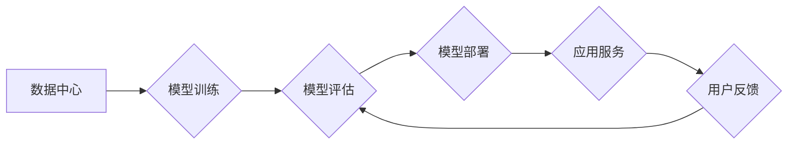

> AI大模型、数据中心、质量管理、模型训练、模型部署、数据质量、模型评估、监控与维护

## 1. 背景介绍

近年来，人工智能（AI）技术蓬勃发展，大规模语言模型（LLM）的出现更是掀起了AI应用的热潮。从ChatGPT的爆火到各种AI辅助工具的广泛应用，AI已经深刻地改变着我们的生活和工作方式。

然而，AI大模型的应用并非一帆风顺。其训练和部署都面临着诸多挑战，其中质量管理尤为重要。一个高质量的AI大模型不仅需要强大的计算能力和海量数据，更需要严格的质量控制流程，以确保模型的准确性、可靠性和安全性。

随着AI大模型应用的日益广泛，其应用数据中心的质量管理也日益受到重视。本文将深入探讨AI大模型应用数据中心的质量管理体系，涵盖模型训练、模型部署、数据质量、模型评估、监控与维护等关键环节，并提出相应的解决方案和建议。

## 2. 核心概念与联系

**2.1 核心概念**

* **AI大模型:** 指训练规模庞大、参数数量众多的深度学习模型，能够处理复杂的任务，例如文本生成、图像识别、机器翻译等。
* **数据中心:** 指集成的硬件和软件系统，用于存储、处理和管理海量数据，是AI大模型训练和部署的基础设施。
* **质量管理:** 指通过一系列流程和措施，确保产品或服务的质量符合预期标准。

**2.2 联系**

AI大模型的训练和部署都依赖于数据中心提供的计算资源和数据存储服务。数据中心的质量直接影响AI大模型的训练效率、模型性能和应用稳定性。因此，建立完善的AI大模型应用数据中心的质量管理体系至关重要。

**2.3 架构图**



## 3. 核心算法原理 & 具体操作步骤

**3.1 算法原理概述**

AI大模型的训练通常采用深度学习算法，例如反向传播算法。该算法通过不断调整模型参数，使模型的预测结果与真实值之间的误差最小化。

**3.2 算法步骤详解**

1. **数据预处理:** 将原始数据清洗、转换和格式化，使其适合模型训练。
2. **模型构建:** 根据任务需求选择合适的模型架构，并初始化模型参数。
3. **模型训练:** 使用训练数据训练模型，通过反向传播算法不断调整模型参数，降低模型误差。
4. **模型评估:** 使用测试数据评估模型的性能，例如准确率、召回率、F1-score等。
5. **模型调优:** 根据评估结果，调整模型超参数，例如学习率、批处理大小等，进一步提高模型性能。
6. **模型部署:** 将训练好的模型部署到生产环境，用于实际应用。

**3.3 算法优缺点**

* **优点:** 深度学习算法能够学习复杂的数据模式，并取得优异的性能。
* **缺点:** 深度学习算法需要大量的训练数据和计算资源，训练时间较长。

**3.4 算法应用领域**

深度学习算法广泛应用于图像识别、自然语言处理、语音识别、机器翻译等领域。

## 4. 数学模型和公式 & 详细讲解 & 举例说明

**4.1 数学模型构建**

深度学习模型通常采用多层神经网络结构，每个神经元接收多个输入信号，并通过激活函数进行处理，输出一个信号。

**4.2 公式推导过程**

反向传播算法的核心是利用链式法则计算梯度，并根据梯度更新模型参数。

**损失函数:**

$$L = \frac{1}{N} \sum_{i=1}^{N} (y_i - \hat{y}_i)^2$$

其中：

* $L$ 为损失函数
* $N$ 为样本数量
* $y_i$ 为真实值
* $\hat{y}_i$ 为预测值

**梯度:**

$$\frac{\partial L}{\partial w} = \frac{1}{N} \sum_{i=1}^{N} 2(y_i - \hat{y}_i) \frac{\partial \hat{y}_i}{\partial w}$$

其中：

* $w$ 为模型参数

**参数更新:**

$$w = w - \eta \frac{\partial L}{\partial w}$$

其中：

* $\eta$ 为学习率

**4.3 案例分析与讲解**

假设我们训练一个图像分类模型，目标是识别猫和狗的图片。我们可以使用损失函数计算模型预测结果与真实标签之间的误差，并利用梯度下降算法更新模型参数，最终使模型能够准确识别猫和狗。

## 5. 项目实践：代码实例和详细解释说明

**5.1 开发环境搭建**

* 操作系统: Ubuntu 20.04
* 编程语言: Python 3.8
* 深度学习框架: TensorFlow 2.x
* GPU: NVIDIA GeForce RTX 3090

**5.2 源代码详细实现**

```python
import tensorflow as tf

# 定义模型架构
model = tf.keras.models.Sequential([
    tf.keras.layers.Conv2D(32, (3, 3), activation='relu', input_shape=(224, 224, 3)),
    tf.keras.layers.MaxPooling2D((2, 2)),
    tf.keras.layers.Conv2D(64, (3, 3), activation='relu'),
    tf.keras.layers.MaxPooling2D((2, 2)),
    tf.keras.layers.Flatten(),
    tf.keras.layers.Dense(10, activation='softmax')
])

# 编译模型
model.compile(optimizer='adam',
              loss='sparse_categorical_crossentropy',
              metrics=['accuracy'])

# 训练模型
model.fit(x_train, y_train, epochs=10)

# 评估模型
loss, accuracy = model.evaluate(x_test, y_test)
print('Test loss:', loss)
print('Test accuracy:', accuracy)
```

**5.3 代码解读与分析**

这段代码定义了一个简单的卷积神经网络模型，用于图像分类任务。模型包含卷积层、池化层、全连接层和softmax层。

* 卷积层和池化层用于提取图像特征。
* 全连接层用于将特征映射到类别输出。
* softmax层用于将输出概率归一化。

**5.4 运行结果展示**

训练完成后，我们可以使用测试数据评估模型的性能。

## 6. 实际应用场景

**6.1 图像识别**

AI大模型可以用于识别各种物体、场景和人物，应用于安防监控、医疗诊断、自动驾驶等领域。

**6.2 自然语言处理**

AI大模型可以理解和生成人类语言，应用于机器翻译、文本摘要、聊天机器人等领域。

**6.3 语音识别**

AI大模型可以将语音转换为文本，应用于语音助手、语音搜索、听力辅助等领域。

**6.4 未来应用展望**

随着AI技术的不断发展，AI大模型的应用场景将更加广泛，例如个性化教育、精准医疗、智能制造等。

## 7. 工具和资源推荐

**7.1 学习资源推荐**

* TensorFlow 官方文档: https://www.tensorflow.org/
* PyTorch 官方文档: https://pytorch.org/
* deeplearning.ai: https://www.deeplearning.ai/

**7.2 开发工具推荐**

* Jupyter Notebook: https://jupyter.org/
* Google Colab: https://colab.research.google.com/

**7.3 相关论文推荐**

* Attention Is All You Need: https://arxiv.org/abs/1706.03762
* BERT: Pre-training of Deep Bidirectional Transformers for Language Understanding: https://arxiv.org/abs/1810.04805

## 8. 总结：未来发展趋势与挑战

**8.1 研究成果总结**

近年来，AI大模型取得了显著的进展，在多个领域取得了突破性成果。

**8.2 未来发展趋势**

* 模型规模和能力将继续提升。
* 模型训练效率和成本将得到降低。
* 模型的解释性和可解释性将得到加强。

**8.3 面临的挑战**

* 数据安全和隐私保护。
* 模型偏见和公平性。
* 模型的可靠性和安全性。

**8.4 研究展望**

未来，AI大模型研究将更加注重模型的鲁棒性、可解释性和安全性，并探索更有效的训练方法和应用场景。

## 9. 附录：常见问题与解答

**9.1 如何选择合适的AI大模型？**

选择合适的AI大模型需要根据具体的应用场景和需求进行评估，考虑模型的性能、规模、训练成本等因素。

**9.2 如何保证AI大模型的安全性？**

确保AI大模型的安全性需要从多个方面入手，例如数据安全、模型训练过程的监控、模型部署环境的安全防护等。

**9.3 如何评估AI大模型的性能？**

AI大模型的性能可以通过多种指标进行评估，例如准确率、召回率、F1-score等，需要根据具体的应用场景选择合适的评估指标。


作者：禅与计算机程序设计艺术 / Zen and the Art of Computer Programming 
<end_of_turn>