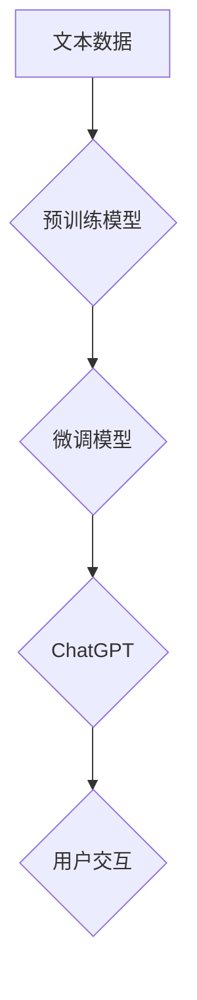

> AIGC, ChatGPT, 语言模型, 自然语言处理, 深度学习, Transformer, 训练数据, 应用场景

## 1. 背景介绍

近年来，人工智能（AI）技术飞速发展，特别是深度学习的突破，使得人工智能在各个领域取得了令人瞩目的成就。其中，生成式人工智能（AIGC）作为人工智能的一个重要分支，以其强大的文本生成能力，引发了广泛的关注和研究。

ChatGPT作为一款基于Transformer架构的强大语言模型，由OpenAI公司开发，其出色的文本生成能力和广泛的应用场景，使其成为AIGC领域最热门的代表之一。

## 2. 核心概念与联系

**2.1 语言模型**

语言模型是机器学习领域的一个重要分支，旨在学习和理解人类语言的结构和规律。它通过统计语言数据，建立语言之间的概率关系，从而能够预测下一个词语、生成文本、翻译语言等。

**2.2 自然语言处理 (NLP)**

自然语言处理 (NLP) 是人工智能的一个子领域，致力于使计算机能够理解、处理和生成人类语言。NLP技术涵盖了文本分析、情感分析、机器翻译、问答系统等多个方面。

**2.3 深度学习**

深度学习是机器学习的一种高级形式，它利用多层神经网络来模拟人类大脑的学习过程。深度学习算法能够从海量数据中自动提取特征，从而实现更准确的预测和识别。

**2.4 Transformer**

Transformer是一种新型的神经网络架构，它通过自注意力机制，能够有效地捕捉文本中的长距离依赖关系。Transformer架构在机器翻译、文本摘要、问答系统等领域取得了显著的成果，并成为当前主流的语言模型架构。

**2.5 ChatGPT**

ChatGPT是一个基于Transformer架构的开源语言模型，由OpenAI公司开发。它经过了大量的文本数据训练，能够进行对话、生成文本、翻译语言、编写代码等多种任务。

**2.6 Mermaid 流程图**

## 3. 核心算法原理 & 具体操作步骤

**3.1 算法原理概述**

ChatGPT的核心算法原理是基于Transformer架构的深度学习模型。它通过大量的文本数据进行预训练，学习语言的语法和语义规则。然后，通过微调模型，使其能够适应特定的任务，例如对话生成、文本摘要等。

**3.2 算法步骤详解**

1. **数据预处理:** 将文本数据进行清洗、分词、标记等预处理操作，使其能够被模型理解。
2. **模型训练:** 使用预训练的Transformer模型，对预处理后的文本数据进行训练，学习语言的语法和语义规则。
3. **模型微调:** 根据具体的应用场景，对预训练的模型进行微调，使其能够更好地完成特定的任务。
4. **文本生成:** 将用户输入的文本作为模型的输入，模型根据训练得到的知识和规则，生成相应的文本输出。

**3.3 算法优缺点**

**优点:**

* 强大的文本生成能力
* 能够理解和生成自然语言
* 可适应多种应用场景

**缺点:**

* 训练数据量大，计算资源消耗高
* 可能产生偏差或错误的文本输出
* 缺乏对真实世界的理解和常识

**3.4 算法应用领域**

* **对话系统:** 开发聊天机器人、虚拟助手等对话系统。
* **文本生成:** 生成新闻文章、小说、诗歌等文本内容。
* **机器翻译:** 将文本从一种语言翻译成另一种语言。
* **问答系统:** 回答用户提出的问题。
* **代码生成:** 生成代码片段。

## 4. 数学模型和公式 & 详细讲解 & 举例说明

**4.1 数学模型构建**

ChatGPT的核心数学模型是基于Transformer架构的深度神经网络。Transformer模型由多个编码器和解码器层组成，每个层包含多个子层，例如多头自注意力层、前馈神经网络层等。

**4.2 公式推导过程**

Transformer模型的数学公式推导过程比较复杂，涉及到线性变换、激活函数、注意力机制等多个方面。

**4.3 案例分析与讲解**

例如，在多头自注意力层中，每个头会计算输入序列中每个词与其他词之间的注意力权重，然后将这些权重加权平均，得到每个词的上下文表示。

$$
Attention(Q, K, V) = softmax(\frac{QK^T}{\sqrt{d_k}})V
$$

其中，Q、K、V分别代表查询矩阵、键矩阵和值矩阵，$d_k$代表键向量的维度。

## 5. 项目实践：代码实例和详细解释说明

**5.1 开发环境搭建**

ChatGPT的开发环境需要安装Python、PyTorch或TensorFlow等深度学习框架，以及一些必要的库，例如transformers、torchtext等。

**5.2 源代码详细实现**

ChatGPT的源代码开源，可以在GitHub上找到。

**5.3 代码解读与分析**

ChatGPT的源代码主要包含模型架构定义、数据加载、模型训练、模型评估等部分。

**5.4 运行结果展示**

运行ChatGPT的代码，可以生成文本、进行对话、翻译语言等。

## 6. 实际应用场景

**6.1 对话机器人**

ChatGPT可以用于开发聊天机器人，例如客服机器人、虚拟助手等，能够与用户进行自然语言对话，回答问题、提供服务。

**6.2 文本生成**

ChatGPT可以用于生成各种文本内容，例如新闻文章、小说、诗歌、剧本等，可以帮助作家、记者、文案等提高工作效率。

**6.3 机器翻译**

ChatGPT可以用于机器翻译，将文本从一种语言翻译成另一种语言，可以帮助人们跨越语言障碍进行交流。

**6.4 其他应用场景**

ChatGPT还可以应用于其他领域，例如问答系统、代码生成、文本摘要等。

**6.5 未来应用展望**

随着人工智能技术的不断发展，ChatGPT的应用场景将会更加广泛，例如：

* 更智能的虚拟助手
* 个性化的教育系统
* 更逼真的游戏体验
* 更高效的创作工具

## 7. 工具和资源推荐

**7.1 学习资源推荐**

* **书籍:**《深度学习》、《自然语言处理》
* **在线课程:** Coursera、edX、Udacity等平台上的深度学习和自然语言处理课程
* **博客和论坛:** HuggingFace、OpenAI等平台上的博客和论坛

**7.2 开发工具推荐**

* **Python:** 作为深度学习的常用编程语言
* **PyTorch/TensorFlow:** 深度学习框架
* **transformers:** 预训练语言模型库

**7.3 相关论文推荐**

* **Attention Is All You Need:** https://arxiv.org/abs/1706.03762
* **BERT: Pre-training of Deep Bidirectional Transformers for Language Understanding:** https://arxiv.org/abs/1810.04805

## 8. 总结：未来发展趋势与挑战

**8.1 研究成果总结**

ChatGPT的出现标志着AIGC领域取得了新的突破，其强大的文本生成能力和广泛的应用场景，为人工智能的未来发展指明了方向。

**8.2 未来发展趋势**

* **模型规模和能力的提升:** 未来，AIGC模型的规模和能力将会进一步提升，能够生成更复杂、更具创造性的文本内容。
* **多模态AIGC:** 未来，AIGC将会融合多模态数据，例如文本、图像、音频等，能够生成更丰富、更具沉浸感的体验。
* **个性化AIGC:** 未来，AIGC将会更加个性化，能够根据用户的需求和喜好生成定制化的内容。

**8.3 面临的挑战**

* **数据安全和隐私保护:** AIGC模型的训练需要大量的文本数据，如何保证数据安全和隐私保护是一个重要的挑战。
* **模型可解释性和信任度:** AIGC模型的决策过程比较复杂，如何提高模型的可解释性和信任度是一个重要的研究方向。
* **伦理和社会影响:** AIGC技术的发展可能会带来一些伦理和社会问题，例如信息操纵、就业替代等，需要引起社会的关注和讨论。

**8.4 研究展望**

未来，AIGC领域的研究将会更加深入，将会探索更强大的模型架构、更有效的训练方法、更广泛的应用场景，为人类社会带来更多福祉。

## 9. 附录：常见问题与解答

**9.1 如何训练自己的ChatGPT模型？**

训练自己的ChatGPT模型需要大量的计算资源和数据。可以参考OpenAI的开源代码和文档，进行模型训练。

**9.2 ChatGPT可以生成什么样的文本内容？**

ChatGPT可以生成各种文本内容，例如故事、诗歌、文章、代码等。

**9.3 ChatGPT的安全性如何？**

ChatGPT的安全性由其训练数据和模型架构决定。OpenAI一直在努力提高模型的安全性，并发布了相关的安全指南。

**9.4 ChatGPT的未来发展趋势是什么？**

ChatGPT的未来发展趋势是模型规模和能力的提升、多模态AIGC、个性化AIGC等。

作者：禅与计算机程序设计艺术 / Zen and the Art of Computer Programming

<end_of_turn>