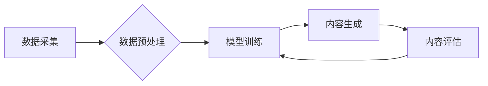

> AIGC, 生成式AI, 自然语言处理, 深度学习, Transformer, 文本生成, 图像生成, 算法原理, 应用场景, 未来趋势

## 1. 背景介绍

人工智能（AI）技术近年来发展迅速，特别是生成式AI的兴起，正在深刻地改变着我们与世界交互的方式。生成式AI，顾名思义，是指能够生成新内容的AI模型，例如文本、图像、音频、视频等。其中，AIGC（AI-Generated Content）作为生成式AI的一个重要分支，指的是由人工智能技术生成的各种内容，包括文字、代码、音乐、艺术作品等。

AIGC技术的出现，标志着人工智能从模仿人类到创造人类内容的重大跨越。它为我们提供了全新的创作工具和可能性，同时也带来了许多挑战和机遇。

## 2. 核心概念与联系

**2.1  生成式AI的本质**

生成式AI的核心是学习数据中的模式和规律，并利用这些模式生成新的、类似于训练数据的内容。它不同于传统的AI模型，例如分类或预测模型，它不仅能够识别和理解数据，还能创造新的数据。

**2.2  AIGC与其他AI技术的联系**

AIGC技术是基于深度学习和自然语言处理（NLP）等人工智能技术的成果。

* **深度学习:** 深度学习算法能够从海量数据中学习复杂的模式和关系，为生成式AI提供了强大的学习能力。
* **自然语言处理（NLP）:** NLP技术能够理解和处理人类语言，是AIGC生成文本内容的关键技术。

**2.3  AIGC的架构**

AIGC系统的架构通常包括以下几个部分：

* **数据采集和预处理:** 收集和清洗训练数据，并将其转换为模型可理解的格式。
* **模型训练:** 使用深度学习算法训练生成式AI模型，使其能够学习数据中的模式和规律。
* **内容生成:** 将输入信息输入到训练好的模型中，模型会根据学习到的模式生成新的内容。
* **内容评估和反馈:** 对生成的內容进行评估，并根据评估结果进行模型调整和优化。

**Mermaid 流程图**



## 3. 核心算法原理 & 具体操作步骤

**3.1  算法原理概述**

生成式AI模型的核心算法是**变分自编码器（VAE）**和**生成对抗网络（GAN）**。

* **变分自编码器（VAE）:** VAE是一种无监督学习算法，它通过学习数据的潜在表示来生成新的数据。VAE将输入数据编码成一个低维的潜在空间表示，然后解码成新的数据。

* **生成对抗网络（GAN）:** GAN由两个神经网络组成：生成器和鉴别器。生成器试图生成逼真的数据，而鉴别器试图区分真实数据和生成数据。这两个网络在对抗游戏中相互竞争，最终生成器能够生成逼真的数据。

**3.2  算法步骤详解**

**VAE算法步骤:**

1. **编码器:** 将输入数据编码成一个低维的潜在空间表示。
2. **解码器:** 将潜在空间表示解码成新的数据。
3. **损失函数:** 使用重构损失函数和KL散度来训练模型，使生成的數據与原始数据尽可能相似。

**GAN算法步骤:**

1. **生成器:** 从随机噪声中生成新的数据。
2. **鉴别器:** 判别输入数据是真实数据还是生成数据。
3. **损失函数:** 使用二分类交叉熵损失函数来训练模型，使鉴别器能够准确区分真实数据和生成数据。

**3.3  算法优缺点**

**VAE:**

* **优点:** 可以生成高质量的数据，并且能够控制生成的數據的分布。
* **缺点:** 生成的数据可能缺乏多样性。

**GAN:**

* **优点:** 可以生成非常逼真的数据，并且能够生成多样化的數據。
* **缺点:** 训练过程比较复杂，容易出现模式崩溃问题。

**3.4  算法应用领域**

* **文本生成:** 写作、翻译、对话系统等。
* **图像生成:** 图像合成、图像修复、图像风格迁移等。
* **音频生成:** 音乐创作、语音合成等。
* **视频生成:** 视频合成、视频特效等。

## 4. 数学模型和公式 & 详细讲解 & 举例说明

**4.1  数学模型构建**

**VAE模型:**

* **编码器:** 使用多层神经网络将输入数据编码成一个低维的潜在空间表示。
* **解码器:** 使用多层神经网络将潜在空间表示解码成新的数据。

**GAN模型:**

* **生成器:** 使用多层神经网络将随机噪声生成新的数据。
* **鉴别器:** 使用多层神经网络判别输入数据是真实数据还是生成数据。

**4.2  公式推导过程**

**VAE损失函数:**

```latex
L(x, z) = D_KL(q(z|x) || p(z)) + D_reconstruction(x, x')
```

其中:

* $x$ 是输入数据
* $z$ 是潜在空间表示
* $x'$ 是解码器生成的數據
* $D_KL$ 是KL散度
* $D_reconstruction$ 是重构损失函数

**GAN损失函数:**

```latex
L_D(x, G(z)) = log(D(x)) + log(1 - D(G(z)))
L_G(z, D) = log(D(G(z)))
```

其中:

* $x$ 是真实数据
* $G(z)$ 是生成器生成的數據
* $D$ 是鉴别器

**4.3  案例分析与讲解**

**VAE应用案例:**

* **图像压缩:** 使用VAE将图像编码成低维表示，然后解码成压缩后的图像。

**GAN应用案例:**

* **图像生成:** 使用GAN生成逼真的图像，例如人脸图像、风景图像等。

## 5. 项目实践：代码实例和详细解释说明

**5.1  开发环境搭建**

* Python 3.x
* TensorFlow 或 PyTorch
* CUDA 和 cuDNN

**5.2  源代码详细实现**

```python
# VAE模型代码示例
import tensorflow as tf

# 定义编码器
encoder = tf.keras.Sequential([
    tf.keras.layers.Input(shape=(28, 28, 1)),
    tf.keras.layers.Conv2D(32, (3, 3), activation='relu'),
    tf.keras.layers.MaxPooling2D((2, 2)),
    tf.keras.layers.Flatten(),
    tf.keras.layers.Dense(128, activation='relu'),
    tf.keras.layers.Dense(latent_dim)
])

# 定义解码器
decoder = tf.keras.Sequential([
    tf.keras.layers.Input(shape=(latent_dim,)),
    tf.keras.layers.Dense(7 * 7 * 128, activation='relu'),
    tf.keras.layers.Reshape((7, 7, 128)),
    tf.keras.layers.Conv2DTranspose(32, (3, 3), strides=(2, 2), activation='relu'),
    tf.keras.layers.Conv2DTranspose(1, (3, 3), activation='sigmoid')
])

# 定义VAE模型
vae = tf.keras.Model(inputs=encoder.input, outputs=decoder(encoder.output))

# 训练VAE模型
vae.compile(optimizer='adam', loss='binary_crossentropy')
vae.fit(x_train, x_train, epochs=10)

# 生成新的图像
z = tf.random.normal(shape=(10, latent_dim))
generated_images = decoder(z)
```

**5.3  代码解读与分析**

* **编码器:** 将输入图像编码成一个低维的潜在空间表示。
* **解码器:** 将潜在空间表示解码成新的图像。
* **VAE模型:** 将编码器和解码器组合成一个完整的模型。
* **训练过程:** 使用重构损失函数和KL散度来训练模型。
* **生成过程:** 使用随机噪声生成新的潜在空间表示，然后将其解码成新的图像。

**5.4  运行结果展示**

运行代码后，可以生成新的图像，这些图像与训练数据具有相似性。

## 6. 实际应用场景

**6.1  文本生成**

* **内容创作:** 自动生成新闻报道、博客文章、小说等。
* **机器翻译:** 将文本从一种语言翻译成另一种语言。
* **对话系统:** 创建更自然、更人性化的聊天机器人。

**6.2  图像生成**

* **图像合成:** 生成新的图像，例如人脸图像、风景图像等。
* **图像修复:** 修复损坏的图像，例如去除噪点、修复缺失的部分。
* **图像风格迁移:** 将图像的风格迁移到其他图像。

**6.3  音频生成**

* **音乐创作:** 生成新的音乐作品。
* **语音合成:** 将文本转换为语音。
* **音频特效:** 生成各种音频特效，例如音效、背景音乐等。

**6.4  未来应用展望**

AIGC技术在未来将有更广泛的应用场景，例如：

* **个性化教育:** 根据学生的学习情况生成个性化的学习内容。
* **医疗诊断:** 利用AIGC技术辅助医生进行诊断。
* **艺术创作:** 人工智能与人类艺术家合作创作新的艺术作品。

## 7. 工具和资源推荐

**7.1  学习资源推荐**

* **书籍:**
    * 《Deep Learning》 by Ian Goodfellow, Yoshua Bengio, and Aaron Courville
    * 《Generative Deep Learning》 by David Foster
* **在线课程:**
    * Coursera: Deep Learning Specialization
    * Udacity: Deep Learning Nanodegree

**7.2  开发工具推荐**

* **TensorFlow:** 开源深度学习框架。
* **PyTorch:** 开源深度学习框架。
* **Hugging Face Transformers:** 提供预训练的Transformer模型。

**7.3  相关论文推荐**

* **Generative Adversarial Networks** by Ian Goodfellow et al. (2014)
* **Variational Autoencoders for Generation** by Diederik P. Kingma and Max Welling (2013)
* **Attention Is All You Need** by Ashish Vaswani et al. (2017)

## 8. 总结：未来发展趋势与挑战

**8.1  研究成果总结**

AIGC技术近年来取得了显著的进展，能够生成高质量的文本、图像、音频等内容。

**8.2  未来发展趋势**

* **模型能力提升:** 模型将更加强大，能够生成更加逼真、更加多样化的内容。
* **应用场景拓展:** AIGC技术将应用于更多领域，例如教育、医疗、艺术等。
* **伦理与安全问题:** 需要解决AIGC技术带来的伦理和安全问题，例如内容虚假、版权问题等。

**8.3  面临的挑战**

* **数据获取和标注:** AIGC模型需要大量的训练数据，数据获取和标注成本较高。
* **模型训练效率:** 训练大型AIGC模型需要大量的计算资源和时间。
* **模型解释性和可控性:** AIGC模型的决策过程难以解释，缺乏可控性。

**8.4  研究展望**

* 研究更有效的训练方法，提高模型训练效率。
* 研究更强大的模型架构，提升模型生成能力。
* 研究AIGC模型的解释性和可控性，解决伦理和安全问题。

## 9. 附录：常见问题与解答

**9.1  AIGC与传统AI的区别是什么？**

传统AI模型主要