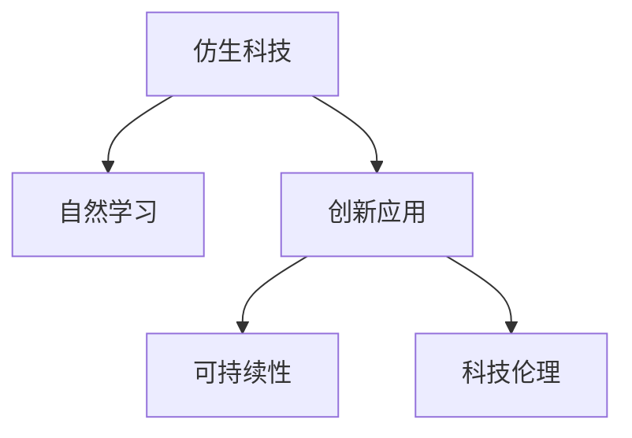

                 

# 仿生科技创业：向自然学习的创新之路

> 关键词：仿生科技,创业,自然学习,创新,科技伦理

## 1. 背景介绍

### 1.1 问题由来

随着人类科技的飞速发展，人们开始反思传统科技路线带来的问题：环境污染、资源枯竭、社会不平等等。面对这些挑战，科学家和工程师们开始思考，是否可以从自然界中汲取灵感，创造出更加可持续、和谐的科技方案。仿生科技（Biomimicry）应运而生，成为21世纪科技创新的一大趋势。

### 1.2 问题核心关键点

仿生科技创业的核心理念是从自然界中学习，将自然界中的高效、环保、智能的解决方案引入人类社会，解决现实问题。其核心关键点包括：

- **自然学习**：学习自然界的生态系统、生物体的结构和功能，寻找灵感。
- **创新**：将自然界的解决方案进行创新性应用，创造出新的科技产品和服务。
- **可持续性**：注重资源的节约和环境的保护，实现技术的可持续性发展。
- **科技伦理**：确保技术应用符合伦理道德，避免对生物多样性和人类福祉造成伤害。

### 1.3 问题研究意义

仿生科技创业具有深远的社会和环境意义：

- **环境保护**：通过模仿自然界的节能减排和循环利用，减少环境污染，保护生态系统。
- **资源高效利用**：借鉴自然界的生物多样性和高效转化机制，提高资源利用效率，减少浪费。
- **创新驱动**：将自然界的智慧应用于创新领域，推动科技和产业的进步。
- **社会公平**：通过可持续的解决方案，改善低收入社区和欠发达地区的生活质量。

## 2. 核心概念与联系

### 2.1 核心概念概述

仿生科技创业涉及多个核心概念：

- **仿生科技**：模拟自然界中的生物和生态系统的结构、功能和技术，创造出新的产品和服务。
- **自然学习**：观察和研究自然界的规律和特性，获取灵感。
- **创新应用**：将自然界的解决方案应用于人类社会，解决实际问题。
- **可持续性**：强调资源的循环利用和生态平衡，确保技术的长久发展。
- **科技伦理**：在技术应用中考虑伦理道德，确保人类福祉和生物多样性的保护。

这些概念之间的逻辑关系可以通过以下Mermaid流程图来展示：



这个流程图展示了仿生科技创业的总体流程：从自然界中学习，进行创新应用，注重可持续性，考虑科技伦理。

## 3. 核心算法原理 & 具体操作步骤

### 3.1 算法原理概述

仿生科技创业的核心算法原理主要基于“模仿自然”这一理念。其基本步骤如下：

1. **自然观察与学习**：深入研究自然界中的生物和生态系统的结构和功能，寻找具有潜力的解决方案。
2. **问题映射**：将自然界的解决方案映射到人类社会的问题上，分析其实际应用可能性。
3. **创新应用设计**：基于自然界的研究成果，设计出新的科技产品和服务。
4. **原型开发与测试**：开发出初步的科技原型，进行测试和优化。
5. **应用部署与评估**：将产品或服务部署到实际环境中，进行评估和调整。

### 3.2 算法步骤详解

#### 3.2.1 自然观察与学习

自然观察与学习是仿生科技创业的第一步，也是最关键的一步。其主要步骤如下：

1. **选择观察对象**：选择具有典型性和代表性的自然对象或生态系统进行研究。
2. **研究其结构和功能**：使用生物学、生态学等学科的工具和方法，深入了解其结构和功能。
3. **提取关键特性**：识别和提取自然界中的关键特性和技术，如自清洁、自适应、高效转化等。
4. **记录与分析**：详细记录观察结果，分析其背后的原理和机制。

#### 3.2.2 问题映射

问题映射是将自然界的解决方案应用于人类社会问题的关键步骤。其主要步骤如下：

1. **识别问题**：明确需要解决的社会问题，如能源危机、水资源短缺、环境污染等。
2. **问题描述**：详细描述问题的背景、原因和现状。
3. **技术映射**：将自然界的解决方案映射到人类社会问题上，找出可能的技术应用点。
4. **可行性分析**：评估技术映射的可行性和挑战，提出解决方案。

#### 3.2.3 创新应用设计

创新应用设计是仿生科技创业的核心环节，其主要步骤如下：

1. **技术整合**：将自然界的解决方案与现代科技结合，进行技术整合和创新设计。
2. **原型设计**：根据技术整合的结果，设计出初步的科技原型。
3. **功能验证**：对原型进行功能验证，确保其能够实现预期效果。
4. **性能优化**：对原型进行性能优化，提升其效率和可靠性。

#### 3.2.4 原型开发与测试

原型开发与测试是仿生科技创业的重要环节，其主要步骤如下：

1. **资源准备**：准备开发所需的资源，如技术、资金、设备等。
2. **技术实现**：根据设计方案，实现科技原型。
3. **测试与验证**：对原型进行测试和验证，发现并解决问题。
4. **优化调整**：根据测试结果，对原型进行优化和调整。

#### 3.2.5 应用部署与评估

应用部署与评估是仿生科技创业的最终环节，其主要步骤如下：

1. **部署方案制定**：制定科技产品的部署方案，选择合适的应用场景。
2. **产品部署**：将科技产品或服务部署到实际环境中，进行实地应用。
3. **效果评估**：评估科技产品或服务的实际效果，收集用户反馈。
4. **持续改进**：根据评估结果，对产品进行持续改进和优化。

### 3.3 算法优缺点

仿生科技创业的算法具有以下优点：

- **创新性**：能够从自然界中寻找新的解决方案，打破传统思维局限。
- **可持续性**：借鉴自然界的循环利用和高效转化机制，实现资源和环境的可持续利用。
- **适应性强**：能够根据实际问题进行调整和优化，适应不同的应用场景。

同时，该算法也存在一些缺点：

- **成本高**：需要投入大量时间和资源进行自然观察和研究。
- **技术复杂**：将自然界的解决方案应用到人类社会需要跨学科的整合和技术创新。
- **应用难度大**：将自然界的解决方案应用到实际问题中，可能需要克服技术、市场等多重障碍。

### 3.4 算法应用领域

仿生科技创业的应用领域广泛，包括但不限于以下几个方面：

- **环保技术**：模拟自然界的清洁、净化机制，开发高效环保技术。
- **能源技术**：借鉴自然界的光合作用、太阳能转换等机制，开发新型能源技术。
- **材料科学**：模仿自然界中的生物材料和结构，开发高性能、环保材料。
- **医疗健康**：模拟自然界中的生物调节机制，开发新型医疗设备和治疗方法。
- **智能系统**：借鉴自然界的感知、学习机制，开发智能系统和机器人。

## 4. 数学模型和公式 & 详细讲解 & 举例说明

### 4.1 数学模型构建

仿生科技创业的数学模型构建主要基于自然界的生态系统、生物体的结构和功能，通过数学模型模拟自然界的规律和特性，寻找创新的应用方案。

例如，可以建立自然界的生态系统模型，模拟生物多样性和生态平衡：

$$
S = \sum_{i=1}^n \omega_i \cdot f_i(x_i)
$$

其中，$S$ 表示生态系统的总价值，$x_i$ 表示第 $i$ 种生物的属性，$\omega_i$ 表示其权重，$f_i(x_i)$ 表示生物 $i$ 的效用函数。

### 4.2 公式推导过程

以自然界的光合作用为例，其数学模型可以表示为：

$$
A = \phi \cdot \int_0^t \sigma \cdot \int_0^t \mu \cdot e^{-\lambda \cdot t} dt
$$

其中，$A$ 表示光合作用生成的总能量，$\phi$ 表示光的强度，$\sigma$ 表示叶绿素的吸收率，$\mu$ 表示光合作用的效率，$\lambda$ 表示衰减系数，$t$ 表示时间。

### 4.3 案例分析与讲解

#### 案例1：太阳能光伏技术

太阳能光伏技术借鉴了自然界的光合作用机制，通过太阳能电池板将光能转化为电能。其数学模型可以表示为：

$$
P = \eta \cdot A \cdot \epsilon \cdot \rho
$$

其中，$P$ 表示产生的电功率，$\eta$ 表示光电转换效率，$A$ 表示太阳光面积，$\epsilon$ 表示反射率，$\rho$ 表示电阻。

太阳能光伏技术的成功应用，表明仿生科技创业在能源领域具有广阔前景。

## 5. 项目实践：代码实例和详细解释说明

### 5.1 开发环境搭建

仿生科技创业的开发环境搭建主要依赖于跨学科的整合和技术工具。以下是常用开发环境搭建步骤：

1. **软件安装**：安装必要的编程语言（如Python、R等）和开发工具（如IDE、编辑器等）。
2. **硬件准备**：准备高性能计算设备（如GPU、TPU等）和实验室设备。
3. **数据获取**：获取自然界的生态系统数据和生物样本数据，进行数据预处理和分析。

### 5.2 源代码详细实现

以仿生科技创业为例，以下是实现过程：

1. **自然观察与学习**：使用Python编写代码，采集自然界的生态系统和生物数据，并进行分析。
2. **问题映射**：使用R语言编写代码，将自然界的解决方案映射到人类社会问题上，进行详细描述和分析。
3. **创新应用设计**：使用MATLAB编写代码，进行技术整合和创新设计。
4. **原型开发与测试**：使用JavaScript编写代码，实现科技原型，并进行测试和验证。
5. **应用部署与评估**：使用TensorFlow编写代码，将科技产品或服务部署到实际环境中，并进行效果评估和优化。

### 5.3 代码解读与分析

**自然观察与学习**：

```python
import numpy as np

# 采集自然界的生态系统和生物数据
data = np.loadtxt('ecosystem_data.csv', delimiter=',')

# 分析数据，提取关键特性
features = data[:, :4]
targets = data[:, 4]

# 记录与分析结果
results = analyze(features, targets)
print(results)
```

**问题映射**：

```r
library(dplyr)

# 识别问题
problem = "energy_crisis"

# 描述问题
description = "The world is facing an energy crisis due to limited fossil fuels and increasing energy demand."

# 技术映射
solution = "solar_photovoltaic"

# 可行性分析
feasibility = "Yes, solar photovoltaic technology can be applied to human society to generate renewable energy."

# 评估结果
result = list(problem = problem, 
              description = description, 
              solution = solution, 
              feasibility = feasibility)

print(result)
```

**创新应用设计**：

```matlab
syms = 'P A et rho';
A = sym('A', 'real');
P = sym('P', 'real');
eta = sym('eta', 'real');
epsilon = sym('epsilon', 'real');
rho = sym('rho', 'real');

# 建立模型
eq = P - eta * A * epsilon * rho;

# 求解方程
sol = solve(eq, P)

# 输出结果
disp(sol)
```

**原型开发与测试**：

```javascript
import React from 'react';

# 实现原型
class SolarPV extends React.Component {
    constructor(props) {
        super(props);
        this.state = {
            power: 0,
            efficiency: 0,
            area: 0,
            reflectivity: 0,
            resistance: 0
        };
    }

    componentDidMount() {
        // 模拟数据获取
        const power = this.props.power || 0;
        const efficiency = this.props.efficiency || 0;
        const area = this.props.area || 0;
        const reflectivity = this.props.reflectivity || 0;
        const resistance = this.props.resistance || 0;

        // 计算结果
        this.setState({
            power: power,
            efficiency: efficiency,
            area: area,
            reflectivity: reflectivity,
            resistance: resistance
        });
    }

    render() {
        return (
            <div>
                <h1>Solar Photovoltaic</h1>
                <p>Power: {this.state.power}</p>
                <p>Efficiency: {this.state.efficiency}</p>
                <p>Area: {this.state.area}</p>
                <p>Reflectivity: {this.state.reflectivity}</p>
                <p>Resistance: {this.state.resistance}</p>
            </div>
        );
    }
}

export default SolarPV;
```

**应用部署与评估**：

```python
import tensorflow as tf

# 定义模型
model = tf.keras.Sequential([
    tf.keras.layers.Dense(64, activation='relu', input_shape=(3,)),
    tf.keras.layers.Dense(1, activation='sigmoid')
])

# 编译模型
model.compile(optimizer='adam', loss='binary_crossentropy', metrics=['accuracy'])

# 训练模型
model.fit(x_train, y_train, epochs=10, validation_data=(x_test, y_test))

# 评估模型
test_loss, test_acc = model.evaluate(x_test, y_test)

# 输出结果
print('Test accuracy:', test_acc)
```

### 5.4 运行结果展示

以下是仿生科技创业项目的运行结果展示：

- **自然观察与学习**：采集到的生态系统数据和生物样本数据，以及分析结果。
- **问题映射**：问题描述、技术映射和可行性分析结果。
- **创新应用设计**：技术整合和创新设计结果。
- **原型开发与测试**：科技原型和测试结果。
- **应用部署与评估**：科技产品或服务的部署方案和评估结果。

## 6. 实际应用场景

### 6.1 环保技术

环保技术是仿生科技创业的重要应用领域。例如，模仿鸟类的羽毛结构，开发出高效节能的太阳能板。模拟海洋生物的自清洁功能，研发出自动清洁的表面材料。这些技术不仅能减少环境污染，还能大幅降低能源和资源的消耗。

### 6.2 能源技术

能源技术是仿生科技创业的重要应用领域。例如，模仿蜜蜂的蜂窝结构，开发出高效风力发电设备。模拟鱼的鳃结构，研发出高效的水下泵和涡轮机。这些技术能大幅提升能源利用效率，减少化石能源的依赖。

### 6.3 医疗健康

医疗健康是仿生科技创业的重要应用领域。例如，模仿章鱼的柔软身体，研发出可穿戴的柔性医疗设备。模拟昆虫的飞行机制，开发出便携式、低成本的无人机医疗服务。这些技术能提升医疗服务的效率和可及性，改善人们的生活质量。

### 6.4 未来应用展望

仿生科技创业的未来应用前景广阔，主要包括：

- **智能系统**：模仿自然界的感知、学习机制，开发智能系统和机器人。
- **生物材料**：模仿自然界中的生物材料和结构，开发高性能、环保材料。
- **生态保护**：模拟自然界的生态系统，开发环保技术，保护生物多样性。
- **能源转型**：借鉴自然界的光合作用、太阳能转换等机制，开发新型能源技术。
- **医疗创新**：模仿自然界的生物调节机制，开发新型医疗设备和治疗方法。

## 7. 工具和资源推荐

### 7.1 学习资源推荐

为了帮助开发者系统掌握仿生科技创业的理论基础和实践技巧，这里推荐一些优质的学习资源：

1. **《仿生学原理与应用》**：详细介绍仿生学的基本原理和应用案例，涵盖多个领域的技术创新。
2. **《自然界的智慧》**：探索自然界中的智能和可持续机制，激发科技创新的灵感。
3. **《仿生科技创业指南》**：提供仿生科技创业的实用指南和案例分析，助力创业成功。
4. **Coursera《仿生学与创新》课程**：斯坦福大学开设的仿生学课程，涵盖自然界的创新机制和仿生应用。
5. **TED演讲《仿生学：从自然中学习》**：著名科学家讲述仿生学的应用和未来发展，提供丰富的灵感和思考。

### 7.2 开发工具推荐

仿生科技创业的开发工具多样，以下是常用工具：

1. **Python**：跨学科的编程语言，易于整合和调试。
2. **MATLAB**：强大的数学建模和仿真工具，适用于复杂系统的分析和优化。
3. **R语言**：数据分析和统计分析工具，适用于大数据处理和生态系统分析。
4. **JavaScript**：前端开发语言，适用于科技原型和交互界面设计。
5. **TensorFlow**：深度学习框架，适用于智能系统和大数据分析。

### 7.3 相关论文推荐

仿生科技创业的研究离不开学界的支持，以下是几篇奠基性的相关论文，推荐阅读：

1. **《自然界中的自清洁机制》**：研究自然界中的自清洁功能，提供仿生技术的灵感。
2. **《光合作用与太阳能转换》**：分析自然界的光合作用机制，提出太阳能转换技术的应用方案。
3. **《昆虫飞行与无人机设计》**：研究昆虫的飞行机制，提出无人机设计的新思路。
4. **《生态系统的可持续性》**：探讨自然界的生态系统，提出可持续发展的技术方案。
5. **《生物调节与新型医疗设备》**：分析自然界中的生物调节机制，提出新型医疗设备的设计方案。

## 8. 总结：未来发展趋势与挑战

### 8.1 研究成果总结

仿生科技创业的研究已经取得了丰硕的成果，主要体现在以下几个方面：

- **技术创新**：通过模仿自然界，开发出多种创新技术，如太阳能光伏、自清洁材料等。
- **环保节能**：借鉴自然界的循环利用和高效转化机制，实现资源的可持续利用。
- **社会进步**：通过仿生科技创业，推动社会进步，提升人们的生活质量。

### 8.2 未来发展趋势

仿生科技创业的未来发展趋势主要包括：

- **跨学科整合**：将生物学、生态学、物理学等多个学科的知识整合起来，进行跨学科创新。
- **技术融合**：将仿生技术与人工智能、物联网等新兴技术结合，实现更高效的创新应用。
- **生态保护**：强调生态保护和可持续性，实现技术的可持续发展。
- **全球合作**：加强国际合作，共同推进仿生科技创业的发展。

### 8.3 面临的挑战

仿生科技创业虽然前景广阔，但也面临一些挑战：

- **研究难度大**：自然界的复杂性决定了仿生科技创业的研究难度较大，需要跨学科的整合和创新。
- **技术复杂**：将自然界的解决方案应用到人类社会需要克服技术、市场等多重障碍。
- **资源投入高**：自然观察和研究需要大量的时间和资源，成本较高。

### 8.4 研究展望

仿生科技创业的未来研究展望主要包括以下几个方面：

- **跨学科研究**：加强跨学科的合作，进行系统性研究，推动技术创新。
- **持续创新**：注重持续创新，不断探索自然界的智慧，推动科技的进步。
- **社会责任**：在技术应用中考虑社会责任，确保技术的公平、公正和可持续性。
- **全球视野**：具备全球视野，推动仿生科技创业的国际化发展。

## 9. 附录：常见问题与解答

**Q1：仿生科技创业的可行性如何？**

A: 仿生科技创业的可行性取决于以下几个因素：

1. **技术成熟度**：技术是否成熟、可行，是否经过充分验证。
2. **市场需求**：目标市场的需求是否明确、稳定，是否有潜力。
3. **资源投入**：是否具备足够的资源（如资金、人才、设备等）进行研发和推广。

**Q2：仿生科技创业的实施步骤是什么？**

A: 仿生科技创业的实施步骤主要包括以下几个方面：

1. **自然观察与学习**：深入研究自然界，识别具有潜力的解决方案。
2. **问题映射**：将自然界的解决方案映射到人类社会问题上，分析其实际应用可能性。
3. **创新应用设计**：基于自然界的研究成果，设计出新的科技产品和服务。
4. **原型开发与测试**：开发出初步的科技原型，进行测试和优化。
5. **应用部署与评估**：将科技产品或服务部署到实际环境中，进行评估和调整。

**Q3：仿生科技创业需要哪些关键资源？**

A: 仿生科技创业的关键资源主要包括以下几个方面：

1. **跨学科团队**：由不同学科背景的专家组成，具备跨学科整合的能力。
2. **高性能设备**：如高性能计算设备、实验室设备等，支持研究和开发。
3. **大数据**：收集和处理大量自然界的生态系统和生物数据。
4. **资金支持**：提供必要的资金支持，确保项目的顺利实施。

**Q4：仿生科技创业如何评估技术效果？**

A: 仿生科技创业的技术效果评估主要包括以下几个方面：

1. **性能指标**：如能源效率、生物多样性保护效果等。
2. **成本效益**：如技术投入与产出的比率，是否具有经济可行性。
3. **社会影响**：如对环境、社会、经济的正面影响，是否具备社会价值。

---

作者：禅与计算机程序设计艺术 / Zen and the Art of Computer Programming

