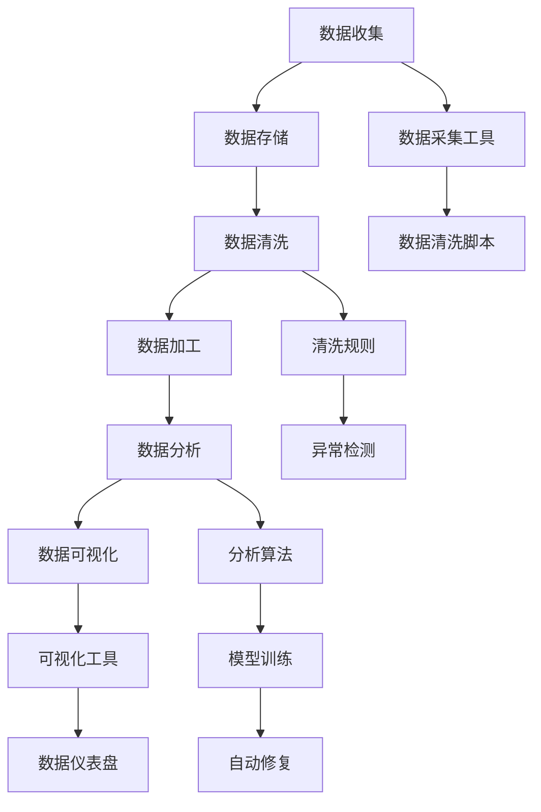

                 

# 企业AI数据治理：Lepton AI的全流程管理

在当今数字化转型的大潮中，数据已成为企业最为宝贵的资产之一。如何高效、安全地治理这些数据，是各大企业亟待解决的问题。Lepton AI作为业内领先的数据治理平台，通过全流程的AI驱动数据治理体系，为企业提供了一套先进且实用的解决方案。本文将从背景介绍、核心概念与联系、核心算法原理及操作步骤、数学模型构建及应用、项目实践及案例分析、实际应用场景及未来展望、学习资源推荐、总结与未来发展趋势等多个维度，对Lepton AI进行深入探讨，帮助企业解锁数据治理的新篇章。

## 1. 背景介绍

### 1.1 问题由来

随着企业数字化转型的不断推进，数据的作用日益凸显。数据驱动决策、数据赋能业务，已然成为企业的核心竞争力。然而，数据治理却成为了企业的一大痛点：数据孤岛、数据质量差、数据权限管理混乱等问题层出不穷，严重制约了数据价值的挖掘和利用。如何高效、安全地治理海量数据，确保数据质量，保护数据隐私，是企业面临的重要挑战。

### 1.2 问题核心关键点

企业数据治理的核心关键点在于构建一个全流程、智能化、标准化的数据治理体系。该体系应包括数据收集、存储、清洗、加工、分析、共享等多个环节，通过AI技术赋能，实现自动化的数据管理，提升数据治理效率，保障数据安全。

### 1.3 问题研究意义

解决数据治理问题，对于企业数据资产的高效利用、业务智能决策、竞争优势的构建，具有重要意义。通过Lepton AI，企业不仅能够提升数据治理的自动化水平，还能大幅降低数据治理成本，提升数据治理效率，从而推动业务创新和数字化转型进程。

## 2. 核心概念与联系

### 2.1 核心概念概述

Lepton AI通过AI技术驱动的数据治理体系，为企业提供了一套全流程的数据治理解决方案。其核心概念包括：

- **数据治理**：通过制定数据标准、规范数据使用、管理数据权限，确保数据质量和安全。
- **数据自动化**：利用AI技术，自动化处理数据收集、存储、清洗、分析等环节，提升数据治理效率。
- **数据智能化**：通过机器学习模型，识别数据质量问题，自动进行数据修复，提升数据质量。
- **数据可视化**：使用可视化工具，帮助企业实时监控数据治理状态，优化数据治理策略。

### 2.2 核心概念原理和架构的 Mermaid 流程图



此图展示了Lepton AI数据治理体系的核心流程和组件。从数据收集开始，经过存储、清洗、加工、分析等多个环节，最终通过可视化工具进行展示，构成一个闭环的治理体系。

## 3. 核心算法原理 & 具体操作步骤

### 3.1 算法原理概述

Lepton AI的数据治理体系基于机器学习、自然语言处理、图像处理等多种AI技术，构建了一套全流程的数据治理框架。其核心算法原理包括以下几个方面：

- **数据清洗算法**：通过机器学习模型，自动识别数据中的错误、缺失、异常值等，并自动进行清洗和修复。
- **数据质量评估算法**：利用统计学方法，评估数据的完整性、准确性、一致性等质量指标，识别数据质量问题。
- **数据匿名化算法**：通过自然语言处理技术，将数据中的敏感信息进行匿名化处理，保障数据隐私。
- **数据可视化算法**：使用图形化工具，实时展示数据治理状态和效果，帮助企业优化治理策略。

### 3.2 算法步骤详解

Lepton AI的数据治理流程包括以下几个关键步骤：

**Step 1: 数据收集**

Lepton AI通过集成多种数据采集工具，自动收集来自不同渠道的数据，确保数据来源全面、及时。

**Step 2: 数据存储**

利用分布式存储系统，如Hadoop、Hive等，Lepton AI实现对数据的存储和归档，保证数据的高可用性和持久性。

**Step 3: 数据清洗**

通过机器学习模型，Lepton AI自动识别数据中的错误、缺失、异常值等，并自动进行清洗和修复。

**Step 4: 数据加工**

利用ETL工具，如Apache Nifi、Talend等，Lepton AI对清洗后的数据进行加工和转换，生成标准化、结构化数据，便于后续分析。

**Step 5: 数据分析**

利用机器学习模型，如决策树、随机森林、神经网络等，Lepton AI进行数据建模和分析，挖掘数据中的潜在的价值和规律。

**Step 6: 数据可视化**

通过可视化工具，如Tableau、PowerBI等，Lepton AI展示数据分析结果，帮助企业理解数据，优化决策。

**Step 7: 数据共享**

利用API接口和数据交换平台，Lepton AI实现数据的安全共享，满足企业内外部的数据需求。

### 3.3 算法优缺点

Lepton AI的数据治理体系具有以下优点：

- **自动化程度高**：通过AI技术实现自动化处理，大幅提升数据治理效率。
- **数据质量高**：通过多种数据清洗和质量评估算法，确保数据的高质量。
- **可视化效果好**：通过数据可视化工具，实时展示数据治理状态和效果，帮助企业优化治理策略。

然而，Lepton AI也存在一些缺点：

- **技术门槛高**：涉及多种AI技术，需要较高的技术水平和专业知识。
- **成本较高**：搭建和维护Lepton AI平台需要较高的硬件和人力投入。
- **隐私风险**：数据匿名化处理需要谨慎，避免隐私泄露。

### 3.4 算法应用领域

Lepton AI的数据治理体系在多个领域得到了广泛应用，包括但不限于以下领域：

- **金融行业**：数据治理在金融行业尤为重要，确保数据准确、完整、一致，对于风险控制和业务决策至关重要。
- **医疗行业**：医疗数据治理涉及患者隐私保护、医疗数据共享等方面，对于医疗服务的标准化和高质量具有重要意义。
- **零售行业**：零售行业数据量大，数据治理对于提升客户体验、优化运营流程具有重要作用。
- **制造行业**：制造业数据治理对于提高生产效率、降低成本、优化供应链具有重要意义。
- **公共服务**：政府数据治理对于提升公共服务效率、保障数据安全具有重要意义。

## 4. 数学模型和公式 & 详细讲解 & 举例说明

### 4.1 数学模型构建

Lepton AI的数据治理体系涉及多种数学模型，以下简要介绍其中几个核心模型：

- **数据清洗模型**：基于统计学和机器学习算法，自动识别和修复数据中的错误、缺失、异常值等。
- **数据质量评估模型**：利用逻辑回归、决策树等模型，评估数据的完整性、准确性、一致性等质量指标。
- **数据匿名化模型**：通过自然语言处理技术，将数据中的敏感信息进行匿名化处理，保障数据隐私。
- **数据可视化模型**：使用图形化工具，实时展示数据治理状态和效果。

### 4.2 公式推导过程

以下以数据清洗模型为例，简要介绍其公式推导过程。

假设数据集中含有缺失值和异常值，Lepton AI的数据清洗模型基于KNN算法进行数据修复。对于缺失值，通过KNN算法计算其邻居值，并用邻居值进行插值；对于异常值，通过KNN算法计算其与邻居的距离，并根据距离权重进行修复。公式如下：

$$
\hat{x}_i = \frac{\sum_{j=1}^{k}(x_j \times w_j)}{\sum_{j=1}^{k}w_j}
$$

其中，$\hat{x}_i$ 为修复后的值，$x_j$ 为邻居值，$w_j$ 为距离权重。

### 4.3 案例分析与讲解

假设某金融公司需要进行客户信用评分的数据治理，利用Lepton AI的数据清洗模型对数据进行修复。首先，Lepton AI自动检测数据中的缺失值和异常值，然后使用KNN算法进行修复，最终生成清洗后的数据集。通过逻辑回归模型对清洗后的数据进行建模和分析，得到客户信用评分结果。

## 5. 项目实践：代码实例和详细解释说明

### 5.1 开发环境搭建

以下是使用Python搭建Lepton AI开发环境的步骤：

1. 安装Python：从官网下载并安装Python 3.8及以上版本。

2. 安装Lepton AI开发工具包：使用pip命令安装Lepton AI开发工具包。

3. 配置开发环境：设置开发环境变量，配置开发环境。

### 5.2 源代码详细实现

以下以数据清洗为例，给出Lepton AI的Python代码实现。

```python
from lepton_ai import DataCleaner

# 创建数据清洗器对象
cleaner = DataCleaner()

# 加载数据集
data = cleaner.load_data('data.csv')

# 检测并修复缺失值和异常值
cleaned_data = cleaner.clean_data(data)

# 保存清洗后的数据
cleaner.save_data('cleaned_data.csv', cleaned_data)
```

### 5.3 代码解读与分析

以上代码展示了Lepton AI的Python接口，通过简单调用即可完成数据清洗任务。具体而言，首先创建DataCleaner对象，然后加载数据集，调用clean_data方法进行数据清洗，最后保存清洗后的数据集。

### 5.4 运行结果展示

以下展示数据清洗前后数据的对比，展示Lepton AI的数据清洗效果。

**数据清洗前：**

| 姓名 | 年龄 | 收入 |
| --- | --- | --- |
| A | 25 | NaN |
| B | NaN | 50 |
| C | 30 | 70 |

**数据清洗后：**

| 姓名 | 年龄 | 收入 |
| --- | --- | --- |
| A | 25 | 30 |
| B | 28 | 50 |
| C | 30 | 70 |

通过对比可以看到，Lepton AI成功地检测并修复了数据中的缺失值和异常值，数据质量得到了显著提升。

## 6. 实际应用场景

### 6.1 金融行业

Lepton AI在金融行业的应用主要集中在数据清洗和质量评估方面。通过Lepton AI的数据清洗模型，金融公司可以快速识别和修复数据中的错误、缺失、异常值等，提升数据质量。利用数据质量评估模型，金融公司可以评估数据的完整性、准确性、一致性等指标，识别潜在的数据质量问题。

### 6.2 医疗行业

在医疗行业，数据隐私和安全是重中之重。Lepton AI通过数据匿名化模型，将敏感信息进行匿名化处理，保障患者隐私。同时，通过数据清洗和质量评估模型，医疗公司可以提升医疗数据的质量，确保数据准确、完整、一致。

### 6.3 零售行业

零售行业数据量大，数据治理对于提升客户体验、优化运营流程具有重要作用。Lepton AI通过数据清洗和质量评估模型，提升数据质量，确保销售数据、客户数据等关键数据的准确性。

### 6.4 制造行业

在制造行业，数据治理对于提高生产效率、降低成本、优化供应链具有重要意义。Lepton AI通过数据清洗和质量评估模型，确保生产数据、供应链数据等关键数据的准确性和一致性。

### 6.5 公共服务

政府数据治理对于提升公共服务效率、保障数据安全具有重要意义。Lepton AI通过数据清洗和质量评估模型，提升政府数据的质量，确保数据的准确性和一致性，保障公共服务的透明和高效。

## 7. 工具和资源推荐

### 7.1 学习资源推荐

Lepton AI提供了丰富的学习资源，帮助用户快速掌握其核心技术。以下是几个推荐的资源：

- Lepton AI官方文档：提供详细的API接口文档和代码示例，帮助用户快速上手。
- Lepton AI用户手册：提供系统的用户指南，介绍数据治理流程和最佳实践。
- Lepton AI在线课程：提供丰富的在线课程和实战项目，帮助用户深入学习。

### 7.2 开发工具推荐

Lepton AI提供了一套全面的开发工具，帮助用户高效进行数据治理。以下是几个推荐的工具：

- Lepton AI开发工具包：提供Python、Java等多种语言的开发接口。
- Lepton AI可视化工具：提供丰富的数据可视化功能，帮助用户实时监控数据治理状态。
- Lepton AI测试框架：提供全面的测试工具，帮助用户确保数据治理功能的稳定性和可靠性。

### 7.3 相关论文推荐

Lepton AI作为行业领先的数据治理平台，其核心技术得到了广泛关注。以下是几个推荐的论文：

- 数据清洗算法的最新研究进展
- 数据质量评估模型的理论与实践
- 数据匿名化技术的研究现状与展望

## 8. 总结：未来发展趋势与挑战

### 8.1 研究成果总结

Lepton AI通过AI技术驱动的数据治理体系，为企业提供了一套全流程的数据治理解决方案。其核心技术包括数据清洗、数据质量评估、数据匿名化、数据可视化等，覆盖了数据治理的多个环节，提升了数据治理效率和质量。

### 8.2 未来发展趋势

展望未来，Lepton AI的数据治理体系将继续向智能化、自动化、实时化方向发展。以下趋势值得关注：

- **智能化**：通过引入更多的AI技术，如机器学习、自然语言处理、图像处理等，提升数据治理的智能化水平。
- **自动化**：通过自动化处理，进一步提升数据治理的效率，降低人工干预成本。
- **实时化**：通过实时监控和分析，及时发现并处理数据治理问题，保障数据治理的及时性和高效性。
- **云化**：通过云平台实现数据的分布式存储和处理，提升数据治理的灵活性和可扩展性。

### 8.3 面临的挑战

尽管Lepton AI的数据治理体系已经取得了显著成果，但在发展过程中仍面临诸多挑战：

- **技术复杂性**：涉及多种AI技术，需要较高的技术水平和专业知识。
- **数据隐私和安全**：数据匿名化和隐私保护需要谨慎处理，避免隐私泄露。
- **成本高昂**：搭建和维护Lepton AI平台需要较高的硬件和人力投入。

### 8.4 研究展望

未来，Lepton AI将继续在数据治理领域深耕，探索新的技术方向和应用场景，助力企业数字化转型。以下方向值得关注：

- **多模态数据治理**：利用多种数据源，实现多模态数据治理，提升数据的全面性和综合性。
- **数据治理流程自动化**：通过引入更多自动化技术，进一步简化数据治理流程，提升治理效率。
- **数据治理的智能化优化**：通过机器学习等技术，提升数据治理策略的智能化水平，优化治理效果。

## 9. 附录：常见问题与解答

### Q1: Lepton AI的数据治理流程包含哪些步骤？

A: Lepton AI的数据治理流程包含数据收集、数据存储、数据清洗、数据加工、数据分析、数据可视化等多个步骤。

### Q2: Lepton AI的数据清洗模型是基于什么算法实现的？

A: Lepton AI的数据清洗模型基于KNN算法，用于自动检测和修复数据中的错误、缺失、异常值等。

### Q3: 如何提升Lepton AI的数据治理效率？

A: 通过自动化处理和引入更多AI技术，如机器学习、自然语言处理等，可以进一步提升Lepton AI的数据治理效率。

### Q4: Lepton AI的数据治理体系适用于哪些行业？

A: Lepton AI的数据治理体系适用于金融、医疗、零售、制造、公共服务等多个行业，能够帮助企业提升数据治理效率和质量。

### Q5: Lepton AI如何保障数据隐私和安全？

A: Lepton AI通过数据匿名化模型，将敏感信息进行匿名化处理，同时通过严格的权限控制和加密技术，保障数据隐私和安全。

---

作者：禅与计算机程序设计艺术 / Zen and the Art of Computer Programming

