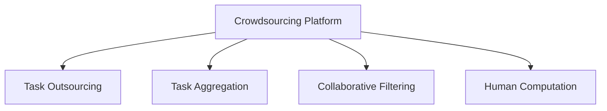

                 

# 众包：利用集体智慧的力量

> 关键词：众包, 集体智慧, 任务外包, 大规模协作, 人类计算, 协同过滤

## 1. 背景介绍

### 1.1 问题由来
随着信息技术的快速发展，大数据和云计算技术的普及，互联网公司们已经拥有了庞大的数据资源和计算能力。这些资源的应用，正在改变着传统产业的生产和运营模式。但与此同时，对于复杂和耗时的任务，尤其是需要大量人力投入的任务，如何高效、低成本地完成，仍然是一个难题。传统的线下外包模式，在时间和成本上往往难以满足需求，而且难以充分利用集体的智慧和经验。因此，众包作为一种新型的任务外包模式，应运而生。

众包（Crowdsourcing），又称集体智慧（Crowd Wisdom），是指将原本由个体独立完成的任务，通过互联网平台外包给大量的、零散的个体，利用他们的集体智慧，共同完成项目或任务。众包模式最早可以追溯到20世纪40年代，当时人们通过寄信的方式向公众征集设计方案，但现代意义上的众包则是在互联网的普及和在线协作技术的推动下，逐渐发展成熟。

### 1.2 问题核心关键点
众包的核心在于通过互联网平台，将大规模的任务外包给分散的个体，充分利用他们的多样化和分散的智慧资源，实现高效的协作和生产。其关键点包括：

- **任务外包**：将复杂任务通过互联网平台外包给个体，如设计、研究、数据标注、编码等。
- **协作工具**：提供协作工具，如在线文档、项目管理、讨论区等，促进个体间的沟通和协作。
- **激励机制**：通过设置任务奖励和反馈机制，激励个体积极参与和高质量完成工作。
- **数据积累**：积累个体在任务中的数据和经验，形成大规模的数据集和知识库。

众包模式可以应用于诸多领域，包括科学研究、工程设计、艺术创作、市场调查等，具有广泛的应用前景。

## 2. 核心概念与联系

### 2.1 核心概念概述

为了更好地理解众包模式，我们需要介绍几个密切相关的核心概念：

- **众包平台（Crowdsourcing Platform）**：一个在线平台，提供任务发布、分配、跟踪和支付等功能，促进个体间的协作和任务完成。
- **任务外包（Task Outsourcing）**：将特定任务外包给个体，如线上问答、市场调查、数据标注等。
- **任务聚合（Task Aggregation）**：将多个小任务合并成一个大任务，通过众包平台分配给多个个体同时完成。
- **协同过滤（Collaborative Filtering）**：利用个体在任务中的行为数据，通过机器学习算法推荐相关任务，提高任务的匹配度和完成效率。
- **人类计算（Human Computation）**：通过个体参与计算，利用人类在计算和推理上的优势，解决机器难以解决的复杂问题。

这些核心概念共同构成了众包模式的基本框架，使得大规模、分散的个体能够在互联网平台上高效协作，完成各种复杂任务。

### 2.2 核心概念原理和架构的 Mermaid 流程图

以下是众包模式的核心概念原理和架构的 Mermaid 流程图：



这个流程图展示了众包模式的基本架构：

1. 任务通过众包平台发布。
2. 任务被分配给多个个体同时完成。
3. 通过协同过滤，推荐给最适合的个体。
4. 利用个体在计算和推理上的优势，解决机器难以解决的复杂问题。

## 3. 核心算法原理 & 具体操作步骤
### 3.1 算法原理概述

众包模式的核心算法原理可以归纳为以下几点：

- **任务发布**：任务发布者将任务描述和要求上传至众包平台，并设定任务完成后的奖励机制。
- **任务分配**：平台根据任务的复杂度和紧急程度，将任务分配给多个个体，通常采用轮询或随机分配的方式。
- **任务执行**：个体在平台上接收任务后，按照要求完成并提交结果。
- **结果评估**：平台根据预设的评估标准，对提交结果进行评分和审核，筛选出高质量的任务完成者。
- **支付结算**：根据个体的评分和审核结果，计算并发放任务奖励，激励个体继续参与和提高完成质量。

众包模式的核心在于任务的分散外包和个体间的协作，利用集体的智慧和经验，高效完成复杂任务。

### 3.2 算法步骤详解

众包模式的具体操作步骤如下：

**Step 1: 任务发布**
- 定义任务需求：明确任务的具体要求、完成标准和截止日期。
- 选择发布平台：选择合适的众包平台，如Amazon Mechanical Turk、CrowdFlower、Freelancer等。
- 上传任务描述：将任务需求详细描述并上传至平台，包含任务目标、完成方式、奖励机制等。

**Step 2: 任务分配**
- 设置任务预算：根据任务复杂度和紧急程度，设定任务完成后的总奖励。
- 选择分配方式：设置任务分配方式，如随机分配、优先级排序等。
- 审核任务请求：对申请任务的个体进行资格审核，确保符合平台要求。

**Step 3: 任务执行**
- 分配任务给个体：根据分配方式，将任务分配给多个个体。
- 提交任务结果：个体在平台上接收任务，按照要求完成并提交结果。
- 结果初审：平台对提交结果进行初审，筛选出高质量的任务完成者。

**Step 4: 结果评估**
- 审核任务结果：平台对初审通过的结果进行详细审核，确保符合任务要求。
- 评分和反馈：根据审核结果，对任务完成者进行评分和反馈，优化后续任务分配。

**Step 5: 支付结算**
- 计算奖励：根据评分和审核结果，计算并发放任务奖励。
- 审核支付流程：平台对支付流程进行审核，确保资金安全和公正透明。

### 3.3 算法优缺点

众包模式具有以下优点：

- **灵活性和多样性**：个体可以在任何时间和地点参与任务，大大提高了任务完成的灵活性和多样性。
- **成本低廉**：通过互联网平台，降低了任务外包的成本，尤其是对于一些需要大量人力投入的任务。
- **大规模协作**：利用集体的智慧和经验，实现大规模协作和快速完成任务。
- **数据积累**：通过众包模式，积累大量的任务数据和经验，形成大规模的数据集和知识库。

但众包模式也存在一些缺点：

- **质量不稳定**：由于个体间的水平参差不齐，任务完成的质量和效率难以保证。
- **平台依赖性强**：对众包平台的依赖性强，一旦平台出现问题，可能导致任务无法完成。
- **激励机制复杂**：需要设计合理的激励机制，确保个体积极参与和高质量完成工作。
- **隐私和安全问题**：个体在平台上提交的数据可能存在隐私和安全问题，需要平台采取相应的保护措施。

### 3.4 算法应用领域

众包模式在多个领域得到了广泛应用，包括但不限于以下几类：

- **科学研究**：通过众包平台，收集大量科学数据和实验结果，推动科研进展。
- **工程设计**：将工程设计任务外包给个体，利用集体的智慧，快速完成设计方案。
- **艺术创作**：利用众包平台，收集创作灵感和设计方案，推动艺术创作的发展。
- **市场调查**：通过众包平台，收集消费者意见和市场数据，进行市场分析和决策支持。
- **数据标注**：将数据标注任务外包给个体，快速完成大规模数据集的标注工作。
- **软件开发**：将软件开发任务外包给个体，利用集体的智慧，快速开发和调试软件。

除了这些传统领域，众包模式还在医疗、法律、金融等诸多新兴领域中逐步推广和应用，展示出广阔的应用前景。

## 4. 数学模型和公式 & 详细讲解  
### 4.1 数学模型构建

众包模式中的数学模型可以归纳为以下几点：

- **任务分配模型**：通过设定任务预算和分配方式，对任务进行分配和管理。
- **任务执行模型**：根据个体提交的任务结果，进行评估和筛选，确保任务完成质量。
- **支付结算模型**：根据评分和审核结果，计算并发放任务奖励，激励个体积极参与。

以下是一个简单的任务分配模型的数学表示：

**任务预算**：假设任务预算为 $B$，分配给个体 $i$ 的任务奖励为 $p_i$，则：

$$
\sum_{i=1}^N p_i = B
$$

**任务分配方式**：假设任务分配给个体 $i$ 的概率为 $a_i$，则：

$$
a_i \propto \frac{p_i}{\sum_{j=1}^N p_j}
$$

**任务执行和评估**：假设个体 $i$ 完成的任务数为 $c_i$，平台对完成的任务进行评分 $s_i$，则：

$$
s_i = f(c_i, p_i, \text{任务要求})
$$

**支付结算**：假设平台对完成的任务进行审核，并通过审核的概率为 $r_i$，则：

$$
\text{实际奖励} = r_i \times s_i
$$

### 4.2 公式推导过程

以下是任务分配模型和任务执行模型的详细推导：

**任务分配模型**：假设任务预算为 $B$，分配给个体 $i$ 的任务奖励为 $p_i$，则：

$$
\sum_{i=1}^N p_i = B
$$

设 $a_i$ 为个体 $i$ 完成任务的概率，则：

$$
a_i = \frac{p_i}{\sum_{j=1}^N p_j}
$$

**任务执行模型**：假设个体 $i$ 完成的任务数为 $c_i$，平台对完成的任务进行评分 $s_i$，则：

$$
s_i = f(c_i, p_i, \text{任务要求})
$$

其中 $f$ 为评分函数，通常采用线性函数：

$$
s_i = k_1 \times c_i + k_2 \times p_i + k_3
$$

其中 $k_1, k_2, k_3$ 为常数。

### 4.3 案例分析与讲解

以下是一个众包平台的任务分配和执行的案例分析：

**案例背景**：某众包平台接收到一项任务，预算为 $10,000$ 元，分配给个体 $i$ 的任务奖励为 $p_i$。平台采用优先级排序的方式进行任务分配，即优先分配给完成过更多任务的个体。

**任务分配**：假设个体 $i$ 的任务完成次数为 $c_i$，则分配概率为：

$$
a_i = \frac{p_i}{\sum_{j=1}^N p_j}
$$

假设个体 $i$ 的任务奖励为 $p_i$，则任务预算为：

$$
\sum_{i=1}^N p_i = 10,000
$$

**任务执行**：假设个体 $i$ 完成的任务数为 $c_i$，平台对完成的任务进行评分 $s_i$，则：

$$
s_i = 0.5 \times c_i + 0.5 \times p_i + 1
$$

假设个体 $i$ 完成的任务数为 $c_i=20$，任务奖励为 $p_i=2,000$，则：

$$
s_i = 0.5 \times 20 + 0.5 \times 2000 + 1 = 1010
$$

**支付结算**：假设平台对完成的任务进行审核，并通过审核的概率为 $r_i=0.8$，则实际奖励为：

$$
\text{实际奖励} = 0.8 \times 1010 = 808
$$

## 5. 项目实践：代码实例和详细解释说明
### 5.1 开发环境搭建

在进行众包平台开发前，我们需要准备好开发环境。以下是使用Python进行Flask开发的环境配置流程：

1. 安装Anaconda：从官网下载并安装Anaconda，用于创建独立的Python环境。

2. 创建并激活虚拟环境：
```bash
conda create -n flask-env python=3.8 
conda activate flask-env
```

3. 安装Flask：
```bash
pip install Flask
```

4. 安装Flask extensions：
```bash
pip install Flask-WTF Flask-Login Flask-Security Flask-RESTful Flask-SocketIO
```

5. 安装数据库：
```bash
pip install flask_sqlalchemy flask_migrate
```

完成上述步骤后，即可在`flask-env`环境中开始开发。

### 5.2 源代码详细实现

下面我们以一个简单的众包平台为例，给出使用Flask框架实现的任务发布和任务分配的PyTorch代码实现。

首先，定义Flask应用：

```python
from flask import Flask, render_template, request, redirect, url_for
from flask_sqlalchemy import SQLAlchemy
from flask_login import LoginManager, login_user, logout_user, login_required
from flask_wtf import FlaskForm
from wtforms import StringField, SubmitField, IntegerField
from wtforms.validators import DataRequired

app = Flask(__name__)
app.config['SECRET_KEY'] = 'mysecretkey'
app.config['SQLALCHEMY_DATABASE_URI'] = 'sqlite:///app.db'
db = SQLAlchemy(app)
login_manager = LoginManager()
login_manager.init_app(app)
login_manager.login_view = 'login'
```

然后，定义任务模型：

```python
class Task(db.Model):
    id = db.Column(db.Integer, primary_key=True)
    title = db.Column(db.String(255), nullable=False)
    description = db.Column(db.Text, nullable=False)
    budget = db.Column(db.Float, nullable=False)
    status = db.Column(db.String(20), nullable=False)
    user_id = db.Column(db.Integer, db.ForeignKey('user.id'), nullable=False)
    assignee_id = db.Column(db.Integer, db.ForeignKey('user.id'), nullable=True)

class User(db.Model):
    id = db.Column(db.Integer, primary_key=True)
    username = db.Column(db.String(255), nullable=False, unique=True)
    password = db.Column(db.String(255), nullable=False)
    tasks = db.relationship('Task', backref='user', lazy=True)
```

接着，定义任务表单：

```python
class TaskForm(FlaskForm):
    title = StringField('Title', validators=[DataRequired()])
    description = StringField('Description', validators=[DataRequired()])
    budget = IntegerField('Budget', validators=[DataRequired()])
    submit = SubmitField('Submit')

class AssignTaskForm(FlaskForm):
    assignee = StringField('Assignee', validators=[DataRequired()])
    submit = SubmitField('Assign')
```

最后，定义路由：

```python
@app.route('/')
@login_required
def home():
    return render_template('home.html')

@app.route('/tasks', methods=['GET', 'POST'])
@login_required
def add_task():
    form = TaskForm()
    if form.validate_on_submit():
        task = Task(title=form.title.data, description=form.description.data, budget=form.budget.data, status='Pending', user_id=current_user.id)
        db.session.add(task)
        db.session.commit()
        return redirect(url_for('home'))
    return render_template('add_task.html', form=form)

@app.route('/tasks/<int:id>')
@login_required
def task(id):
    task = Task.query.get(id)
    return render_template('task.html', task=task)

@app.route('/tasks/<int:id>/assign', methods=['GET', 'POST'])
@login_required
def assign_task(id):
    task = Task.query.get(id)
    form = AssignTaskForm()
    if form.validate_on_submit():
        task.status = form.assignee.data
        db.session.commit()
        return redirect(url_for('task', id=id))
    return render_template('assign_task.html', form=form)

@app.route('/tasks/<int:id>/complete')
@login_required
def complete_task(id):
    task = Task.query.get(id)
    task.status = 'Completed'
    db.session.commit()
    return redirect(url_for('home'))

@app.route('/login', methods=['GET', 'POST'])
def login():
    form = LoginForm()
    if form.validate_on_submit():
        user = User.query.filter_by(username=form.username.data).first()
        if user and check_password_hash(user.password, form.password.data):
            login_user(user)
            return redirect(url_for('home'))
    return render_template('login.html', form=form)

@app.route('/logout')
@login_required
def logout():
    logout_user()
    return redirect(url_for('home'))
```

以上就是使用Flask框架实现的任务发布和任务分配的完整代码实现。可以看到，得益于Flask的强大封装，我们可以用相对简洁的代码完成任务发布和任务分配的开发。

### 5.3 代码解读与分析

让我们再详细解读一下关键代码的实现细节：

**Flask应用**：
- 定义Flask应用对象，配置开发环境。
- 初始化SQLAlchemy和LoginManager等插件，准备数据库和用户认证功能。

**任务模型**：
- 定义任务模型，包含任务的id、标题、描述、预算、状态和用户信息等字段。
- 定义用户模型，包含用户的id、用户名和密码等字段。
- 定义任务和用户之间的关系。

**任务表单**：
- 定义任务添加表单，包含任务标题、描述和预算等字段。
- 定义任务分配表单，包含分配给哪个用户等字段。

**路由**：
- 定义首页路由，登录后显示任务列表。
- 定义任务添加路由，允许用户添加新任务。
- 定义任务详情路由，显示单个任务的详细信息。
- 定义任务分配路由，允许用户分配任务。
- 定义任务完成路由，允许用户标记任务完成。
- 定义登录和注销路由，处理用户登录和退出。

可以看到，Flask框架提供了灵活的路由设计和表单验证功能，可以方便地实现任务发布和任务分配的开发。

当然，工业级的系统实现还需考虑更多因素，如任务审核、评分机制、支付结算、异常处理等。但核心的众包范式基本与此类似。

## 6. 实际应用场景
### 6.1 智能客服系统

基于众包模式的智能客服系统，可以广泛应用于智能客服系统的构建。传统客服往往需要配备大量人力，高峰期响应缓慢，且一致性和专业性难以保证。而通过众包模式，可以利用集体的智慧和经验，构建智能客服系统，实现7x24小时不间断服务，快速响应客户咨询，用自然流畅的语言解答各类常见问题。

在技术实现上，可以收集企业内部的历史客服对话记录，将问题和最佳答复构建成监督数据，在此基础上对众包平台进行微调，训练模型学习理解问题和提供答案。通过众包平台，将新的客户咨询任务分配给合适的客服人员，实时监测和优化客户互动质量，确保客户咨询体验和问题解决效率。

### 6.2 金融舆情监测

金融机构需要实时监测市场舆论动向，以便及时应对负面信息传播，规避金融风险。传统的人工监测方式成本高、效率低，难以应对网络时代海量信息爆发的挑战。基于众包模式的文本分类和情感分析技术，为金融舆情监测提供了新的解决方案。

具体而言，可以收集金融领域相关的新闻、报道、评论等文本数据，并对其进行主题标注和情感标注。在此基础上对众包平台进行微调，使其能够自动判断文本属于何种主题，情感倾向是正面、中性还是负面。将众包平台应用到实时抓取的网络文本数据，就能够自动监测不同主题下的情感变化趋势，一旦发现负面信息激增等异常情况，系统便会自动预警，帮助金融机构快速应对潜在风险。

### 6.3 个性化推荐系统

当前的推荐系统往往只依赖用户的历史行为数据进行物品推荐，无法深入理解用户的真实兴趣偏好。基于众包模式的个性化推荐系统，可以更好地挖掘用户行为背后的语义信息，从而提供更精准、多样的推荐内容。

在实践中，可以收集用户浏览、点击、评论、分享等行为数据，提取和用户交互的物品标题、描述、标签等文本内容。将文本内容作为模型输入，用户的后续行为（如是否点击、购买等）作为监督信号，在此基础上对众包平台进行微调，训练模型学习匹配用户的兴趣点。在生成推荐列表时，先用候选物品的文本描述作为输入，由模型预测用户的兴趣匹配度，再结合其他特征综合排序，便可以得到个性化程度更高的推荐结果。

### 6.4 未来应用展望

随着众包模式的发展，其应用场景将会进一步拓展和深化，带来更多的创新和突破。

在智慧医疗领域，基于众包模式的问答系统、病历分析、药物研发等应用将提升医疗服务的智能化水平，辅助医生诊疗，加速新药开发进程。

在智能教育领域，众包模式可应用于作业批改、学情分析、知识推荐等方面，因材施教，促进教育公平，提高教学质量。

在智慧城市治理中，众包模式可应用于城市事件监测、舆情分析、应急指挥等环节，提高城市管理的自动化和智能化水平，构建更安全、高效的未来城市。

此外，在企业生产、社会治理、文娱传媒等众多领域，基于众包模式的智能应用也将不断涌现，为经济社会发展注入新的动力。相信随着技术的日益成熟，众包模式将成为人工智能落地应用的重要范式，推动人工智能技术向更广阔的领域加速渗透。

## 7. 工具和资源推荐
### 7.1 学习资源推荐

为了帮助开发者系统掌握众包模式的技术基础和实践技巧，这里推荐一些优质的学习资源：

1. 《众包经济学》（Platforms, Crowds, and Network Effects: The Economics of Sharing Economy）：由Jason Fung撰写，系统介绍了众包模式的经济原理和商业模式，是研究众包模式的经典著作。

2. 《众包模式下的内容生产与消费》（Content Creation and Consumption in the Age of Crowdsourcing）：由Yaniv Caspi和Moshe Machlin撰写，探讨了众包模式在内容创作中的应用，提供大量实际案例。

3. 《众包平台设计与运营》（Crowdsourcing Design and Operations）：由Crowdsourced小编团队撰写，详细介绍了众包平台的设计和运营技巧，适合工程实践者阅读。

4. 《众包经济学：基于平台和市场的理论框架》（The Economics of Crowdsourcing: Platforms, Markets, and Strategies）：由Gordon W.L. Rao撰写，全面介绍了众包模式的理论框架和市场策略。

5. 《众包：用集体智慧解决大规模问题》（Crowdsourcing: A Mixed Methodology Approach）：由Laurence R. G. Meadows等撰写，系统介绍了众包模式的研究方法和应用实践。

通过对这些资源的学习实践，相信你一定能够快速掌握众包模式的精髓，并用于解决实际的业务问题。
###  7.2 开发工具推荐

高效的开发离不开优秀的工具支持。以下是几款用于众包模式开发的常用工具：

1. Flask：轻量级Web框架，适合快速开发和部署。
2. Django：全栈Web框架，适合复杂Web应用开发。
3. SQLAlchemy：Python SQL工具包，方便数据库操作。
4. LoginManager：用户认证工具，方便实现登录和退出功能。
5. WTForms：表单验证工具，提供灵活的表单设计和验证功能。

合理利用这些工具，可以显著提升众包模式的开发效率，加快创新迭代的步伐。

### 7.3 相关论文推荐

众包模式的发展源于学界的持续研究。以下是几篇奠基性的相关论文，推荐阅读：

1. The Peer-to-Peer Foundations of Crowdsourcing（众包模式的基础）：由CrowdFlower团队撰写，详细介绍了众包模式的基础理论和技术原理。

2. Incentive Design in Crowdsourcing Platforms（众包平台的激励机制）：由Fang Hsu等撰写，探讨了众包平台中的激励机制设计和模型优化。

3. Designing Experiments on Crowdsourcing Platforms（众包平台的设计和实验）：由Jay Zherebtsov等撰写，介绍了如何设计和优化众包平台实验。

4. Crowdsourcing in Science and Engineering（众包在科学和工程中的应用）：由Leah Jones等撰写，探讨了众包模式在科学和工程中的应用案例和最佳实践。

5. Crowdsourcing Market Design: When Does Market Mechanism Work?（众包市场的设计和机制）：由Patrick Cunningham等撰写，探讨了众包市场机制的设计和优化。

这些论文代表了大规模协作领域的最新研究成果，通过学习这些前沿成果，可以帮助研究者把握学科前进方向，激发更多的创新灵感。

## 8. 总结：未来发展趋势与挑战
### 8.1 总结

本文对基于众包模式的任务外包和协作进行了全面系统的介绍。首先阐述了众包模式的背景和意义，明确了众包在利用集体智慧和经验，高效完成复杂任务方面的独特价值。其次，从原理到实践，详细讲解了众包模式的核心算法和操作步骤，给出了众包平台开发的完整代码实例。同时，本文还广泛探讨了众包模式在智能客服、金融舆情、个性化推荐等多个行业领域的应用前景，展示了众包模式的广阔应用空间。

通过本文的系统梳理，可以看到，众包模式已经成为任务外包和协作的重要手段，为各行各业带来了新的生产力和生产方式。众包模式依托互联网平台，利用集体的智慧和经验，实现了高效、低成本的任务完成，具有广阔的发展前景。未来，随着技术的不断进步和应用的深入推广，众包模式必将在更多领域得到应用，带来新的经济增长点和产业变革。

### 8.2 未来发展趋势

展望未来，众包模式将呈现以下几个发展趋势：

1. **技术智能化**：随着人工智能技术的进步，众包平台将更加智能化和自动化，能够更好地匹配任务和个体，提高任务完成效率。
2. **平台多样化**：众包模式将不再是单一的互联网平台，而是涵盖多种形式和渠道的协作网络，如社交媒体、即时通讯、应用程序等。
3. **市场全球化**：众包平台将打破地域限制，将全球的智慧资源整合起来，形成全球协作网络。
4. **任务多样化**：众包模式将不仅限于传统的任务外包，还将扩展到更多领域，如创意设计、科学实验、艺术创作等。
5. **激励机制多样化**：众包平台将引入更多形式的激励机制，如虚拟货币、积分系统、声誉积分等，激发个体的积极参与。
6. **平台生态化**：众包平台将与更多产业和服务生态相结合，形成完整的产业链条，推动产业升级和经济转型。

以上趋势凸显了众包模式的发展潜力，众包模式正成为推动大规模协作和创新发展的有力工具。相信随着技术的不断进步和应用的不断深入，众包模式必将在更多领域发挥其独特优势，带来新的生产力和生产方式。

### 8.3 面临的挑战

尽管众包模式已经取得了一定的成果，但在迈向更加智能化、普适化应用的过程中，仍面临诸多挑战：

1. **任务匹配精度**：如何提高任务和个体的匹配精度，是众包模式面临的一大挑战。匹配精度的高低直接影响到任务完成的效率和质量。
2. **激励机制设计**：如何设计合理的激励机制，确保个体积极参与和高质量完成工作，是众包平台的重要课题。
3. **数据安全和隐私**：众包平台涉及大量的用户数据，如何保障数据安全和用户隐私，是平台运营的重要问题。
4. **任务监督和管理**：如何对任务进行有效的监督和管理，避免任务质量低下和平台滥用，是平台运营的重要问题。
5. **平台运营成本**：众包平台的运营需要大量的资金和技术投入，如何降低运营成本，提高平台竞争力，是平台运营的重要问题。

解决这些挑战，需要从技术、管理、法律等多个维度共同发力，进一步优化众包模式的运作流程和机制。唯有如此，才能真正发挥众包模式的优势，实现高效、低成本、高灵活性的任务外包和协作。

### 8.4 研究展望

面对众包模式面临的挑战，未来的研究需要在以下几个方面寻求新的突破：

1. **任务匹配算法**：开发更高效的任务匹配算法，提高任务和个体的匹配精度，确保任务高效完成。
2. **激励机制设计**：设计更加多样化和公平的激励机制，激发个体的积极参与，提高任务完成质量。
3. **数据安全和隐私保护**：研究和制定数据安全和隐私保护的标准和法规，保障用户数据的安全和隐私。
4. **平台运营优化**：开发更加智能化的平台运营工具，降低运营成本，提高平台竞争力。
5. **多平台协作**：探索跨平台的协作模式，形成更加完整和高效的协作网络。
6. **跨领域应用**：将众包模式应用于更多领域，如科学研究、艺术创作、社会治理等，推动跨领域创新发展。

这些研究方向的探索，必将引领众包模式走向更高的台阶，为各行各业带来新的生产力和生产方式。面向未来，众包模式需要从技术、管理、法律等多个维度共同发力，才能真正发挥其独特优势，推动大规模协作和创新发展。

## 9. 附录：常见问题与解答

**Q1：众包平台如何保证任务的高质量完成？**

A: 众包平台通常通过以下几种方式保证任务的高质量完成：
1. 设定严格的筛选机制，确保申请任务的个体符合平台要求。
2. 引入评分和审核机制，对提交的任务结果进行严格评估和筛选。
3. 设置合理的激励机制，确保个体积极参与和高质量完成工作。
4. 引入协同过滤技术，通过平台积累的数据和经验，推荐合适的个体完成任务。

**Q2：众包平台如何平衡个体收入和平台收益？**

A: 众包平台通常通过以下几种方式平衡个体收入和平台收益：
1. 设定合理的任务预算和奖励机制，确保个体收入和平台收益的平衡。
2. 引入任务评分和审核机制，筛选出高质量的任务完成者，提高个体收入。
3. 设计多样化的激励机制，如虚拟货币、积分系统、声誉积分等，提高个体参与度和满意度。
4. 引入平台的广告和品牌推广，提高平台收益。

**Q3：众包平台如何确保数据安全和用户隐私？**

A: 众包平台通常通过以下几种方式确保数据安全和用户隐私：
1. 采用加密传输和存储技术，保障数据传输和存储的安全。
2. 设计用户隐私保护策略，如数据匿名化、数据最小化等，保障用户隐私。
3. 制定严格的用户数据使用政策，确保用户数据不被滥用。
4. 引入第三方安全认证，如SSL证书、数据加密等，提高平台安全性。

**Q4：众包平台如何提高任务完成效率？**

A: 众包平台通常通过以下几种方式提高任务完成效率：
1. 引入协同过滤技术，通过平台积累的数据和经验，推荐合适的个体完成任务。
2. 设定合理的任务分配和调度策略，确保任务高效完成。
3. 引入任务评分和审核机制，筛选出高质量的任务完成者，提高任务完成效率。
4. 引入任务并行处理技术，如任务队列、任务聚合等，提高任务处理速度。

**Q5：众包平台如何优化任务匹配精度？**

A: 众包平台通常通过以下几种方式优化任务匹配精度：
1. 引入智能化的任务分配算法，提高任务和个体的匹配精度。
2. 引入任务特征提取和匹配技术，将任务和个体特征进行匹配。
3. 引入协同过滤技术，通过平台积累的数据和经验，推荐合适的个体完成任务。
4. 引入用户行为分析技术，通过分析用户历史行为数据，提高任务匹配精度。

通过以上问答，可以看到，众包模式已经成为一种高效、灵活的任务外包和协作方式，未来将有更多的应用场景和研究突破。

