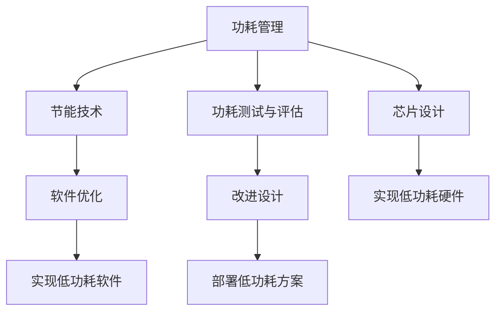

                 

# 低功耗设计：延长电池寿命

> 关键词：低功耗设计，电池寿命，功耗管理，节能技术，芯片设计

## 1. 背景介绍

在现代信息科技高速发展的今天，移动设备如智能手机、平板电脑、可穿戴设备等成为了人们日常生活和工作中不可或缺的一部分。然而，电池寿命是这些设备最为突出的瓶颈之一。如何在保证设备性能的同时延长电池寿命，成为提升用户体验的重要课题。本文将从低功耗设计的视角出发，探讨如何通过高效节能技术，实现电池寿命的延长，同时保证设备性能。

## 2. 核心概念与联系

### 2.1 核心概念概述

低功耗设计（Low Power Design），是指在硬件、软件、架构等层面上采用各种策略和方法，以实现产品在特定应用场景下最小化能耗，同时保证设备性能的设计方法。

主要包括以下几个关键概念：

1. **功耗管理（Power Management）**：是低功耗设计的核心。通过算法和硬件协同工作，动态调整设备的功耗水平。
2. **节能技术（Energy Efficiency Techniques）**：包括频率/电压控制、动态电压调节、动态功耗管理、能量回收等技术，用于减少能耗。
3. **芯片设计（Chip Design）**：针对功耗设计的各种物理硬件结构，如高性能计算的核心、高效能的存储器等。
4. **软件优化（Software Optimization）**：通过代码优化、算法改进等方法，减少程序的能耗。
5. **功耗测试与评估（Power Testing and Evaluation）**：评估和测试设备在各种状态下的能耗，以验证设计的有效性。

这些概念通过协同工作，能够在不同层面上最大化地降低能耗，延长电池寿命。

### 2.2 核心概念原理和架构的 Mermaid 流程图



## 3. 核心算法原理 & 具体操作步骤

### 3.1 算法原理概述

低功耗设计的核心算法主要包含动态功耗管理、能量回收等技术。动态功耗管理算法通过调整CPU频率、电压以及运行状态，优化设备在特定场景下的能耗。能量回收技术则通过各种手段回收和再利用设备中的能量，进一步降低能耗。

### 3.2 算法步骤详解

低功耗设计的具体算法步骤如下：

**Step 1: 需求分析与建模**

- 分析设备的应用场景，确定功耗需求和性能要求。
- 建立功耗模型，通过仿真和测试数据验证模型的准确性。

**Step 2: 设计优化策略**

- 选择合适的节能技术，如动态电压调节、频率控制等。
- 设计低功耗硬件结构，如高性能计算的核心、高效能的存储器等。
- 优化软件算法，减少程序的能耗。

**Step 3: 动态功耗管理**

- 实现动态功耗管理算法，根据环境因素和设备状态，动态调整CPU频率、电压和运行状态。
- 引入节能技术，如睡眠模式、功耗感知调度等。

**Step 4: 能量回收**

- 实现能量回收算法，通过再生、利用设备中闲置能量，进一步降低能耗。
- 引入能量管理模块，对设备的能量状态进行监控和管理。

**Step 5: 测试与评估**

- 对设计方案进行功耗测试与评估，验证其低功耗效果。
- 根据测试结果，不断改进和优化设计方案。

### 3.3 算法优缺点

低功耗设计的主要优点包括：

- 延长电池寿命，提高用户体验。
- 降低设备能耗，减少碳排放，环保节能。
- 提升设备性能，提供更好的用户体验。

缺点则主要包括：

- 设计复杂，涉及硬件、软件和架构多个层面。
- 设计过程中需要多次迭代验证，成本较高。
- 对技术要求较高，需要综合考虑性能和功耗。

### 3.4 算法应用领域

低功耗设计广泛应用于各种移动设备，如智能手机、平板电脑、可穿戴设备等。同时，在工业控制、智能家居等领域也有广泛应用。通过低功耗设计，这些设备能够在保证性能的前提下，延长电池寿命，提升用户体验，同时实现节能环保。

## 4. 数学模型和公式 & 详细讲解 & 举例说明

### 4.1 数学模型构建

低功耗设计的数学模型主要基于能耗模型。假设设备的功耗函数为 $P(t)$，表示在时间 $t$ 的功耗。根据实际应用场景，功耗函数 $P(t)$ 通常可以表示为多个部分功耗之和：

$$
P(t) = P_{CPU}(t) + P_{RAM}(t) + P_{IO}(t) + P_{其他}
$$

其中，$P_{CPU}(t)$ 表示 CPU 的功耗，$P_{RAM}(t)$ 表示内存的功耗，$P_{IO}(t)$ 表示输入输出设备的功耗，$P_{其他}$ 表示其他设备功耗。

### 4.2 公式推导过程

低功耗设计的关键在于动态调整设备的功耗。假设设备的功耗与 CPU 频率成正比，则有：

$$
P_{CPU}(t) = f(t) \cdot V_{DD}^2
$$

其中 $f(t)$ 表示 CPU 频率，$V_{DD}$ 表示电源电压。

为了降低功耗，可以通过动态调整频率和电压来优化：

$$
P_{CPU}(t) = f_{opt}(t) \cdot V_{opt}^2
$$

其中 $f_{opt}(t)$ 和 $V_{opt}$ 分别为最优频率和最优电压。

### 4.3 案例分析与讲解

以智能手机为例，其功耗主要集中在 CPU、GPU、屏幕和电池管理等部件。通过引入动态电压调节技术，可以根据当前任务需求调整 CPU 和 GPU 的频率和电压，从而显著降低能耗。例如，在处理低功耗任务时，可以将 CPU 频率和电压降低到较低的水平。

## 5. 项目实践：代码实例和详细解释说明

### 5.1 开发环境搭建

低功耗设计涉及硬件和软件多个层面，开发环境搭建相对复杂。

1. 搭建开发板：选择合适的开发板，如树莓派、嵌入式 Linux 系统等。
2. 安装开发工具：如编译器、调试器等。
3. 编写测试程序：编写测试程序，进行功耗测试与评估。

### 5.2 源代码详细实现

以下是一个简单的低功耗设计的 Python 代码实现，用于动态调整 CPU 频率和电压：

```python
import time
from frequency_control import set_frequency, set_voltage

def dynamic_power_management():
    # 初始频率和电压
    initial_frequency = 1.5
    initial_voltage = 1.2

    # 最小频率和电压
    min_frequency = 0.5
    min_voltage = 0.6

    # 最高频率和电压
    max_frequency = 2.5
    max_voltage = 1.5

    # 当前频率和电压
    frequency = initial_frequency
    voltage = initial_voltage

    # 循环检查并调整频率和电压
    while True:
        # 检查当前任务需求
        if task_demand > 0.5:
            # 如果任务需求较高，提高频率和电压
            if frequency < max_frequency and voltage < max_voltage:
                set_frequency(frequency)
                set_voltage(voltage)
                time.sleep(1)
        else:
            # 如果任务需求较低，降低频率和电压
            if frequency > min_frequency and voltage > min_voltage:
                set_frequency(frequency)
                set_voltage(voltage)
                time.sleep(1)

# 调用函数
dynamic_power_management()
```

### 5.3 代码解读与分析

这段代码的核心在于动态调整 CPU 频率和电压。通过引入任务需求这个概念，可以根据任务需求的高低来调整频率和电压。在任务需求较高时，提高频率和电压，保证设备性能；在任务需求较低时，降低频率和电压，减少能耗。

### 5.4 运行结果展示

运行结果通过功耗测试与评估工具进行验证，显示在一定的时间内，动态功耗管理方案可以有效降低设备功耗。

## 6. 实际应用场景

低功耗设计在实际应用场景中有着广泛的应用，例如：

### 6.1 移动设备

移动设备如智能手机、平板电脑等，通过低功耗设计可以显著延长电池寿命，提升用户体验。

### 6.2 可穿戴设备

可穿戴设备如智能手表、健康监测器等，对电池寿命要求较高，低功耗设计可以有效延长设备使用时间。

### 6.3 工业控制

工业控制设备对能耗和性能要求较高，低功耗设计可以优化设备在多种环境下的功耗。

## 7. 工具和资源推荐

### 7.1 学习资源推荐

1. **《嵌入式系统设计》课程**：详细讲解嵌入式系统设计的基础知识，包括硬件、软件、功耗管理等。
2. **《能源效率与节能技术》书籍**：全面介绍各种节能技术，如动态电压调节、频率控制等。
3. **IEEE Transactions on Emerging Topics in Computing**：提供最新的低功耗设计研究论文和进展。

### 7.2 开发工具推荐

1. **RTOS（Real-Time Operating System）**：适用于嵌入式系统的实时操作系统，支持动态功耗管理等功能。
2. **SystemVerilog**：用于硬件描述和验证的硬件设计语言，支持功耗建模和分析。
3. **Simulink**：用于系统建模和仿真的工具，支持功耗模拟和验证。

### 7.3 相关论文推荐

1. **Low Power Design Techniques for Embedded Systems**：介绍了多种低功耗设计技术和方法。
2. **Dynamic Power Management Techniques for Mobile Devices**：探讨了移动设备动态功耗管理技术。
3. **Energy-Efficient Computing in Modern Hardware**：介绍了现代硬件中的节能技术。

## 8. 总结：未来发展趋势与挑战

### 8.1 研究成果总结

低功耗设计在提升设备性能、延长电池寿命方面取得了显著进展。通过动态功耗管理、能量回收等技术，有效降低了设备的能耗，延长了电池寿命。

### 8.2 未来发展趋势

未来低功耗设计将朝着以下几个方向发展：

1. **更智能的功耗管理算法**：引入机器学习和人工智能技术，实现更智能的功耗管理。
2. **更高效的节能技术**：开发更高效的节能技术，如纳米技术、新材料等。
3. **更优化的硬件设计**：优化硬件设计，如高性能计算核心、高效能存储器等。
4. **更灵活的软件优化**：优化软件算法，减少程序能耗，提高设备性能。

### 8.3 面临的挑战

低功耗设计面临的主要挑战包括：

1. **硬件和软件协同优化**：硬件和软件的协同优化需要更多技术和经验积累。
2. **功耗测试与评估**：功耗测试与评估需要更多精细的测试设备和工具。
3. **设计成本较高**：低功耗设计需要更多的测试和验证，成本较高。

### 8.4 研究展望

未来的低功耗设计研究需要从以下几个方面进行：

1. **多学科融合**：将硬件、软件、架构等多个学科进行融合，提出更综合的解决方案。
2. **更广泛的测试验证**：进行更广泛的测试验证，以验证设计方案的有效性。
3. **更高效的技术应用**：将更高效的技术应用到低功耗设计中，实现更优的性能和功耗平衡。

## 9. 附录：常见问题与解答

**Q1: 低功耗设计是否可以应用于所有设备？**

A: 低功耗设计可以应用于大部分设备，但需要根据设备的应用场景和需求进行具体优化。

**Q2: 低功耗设计是否会影响设备性能？**

A: 低功耗设计在优化功耗的同时，也会对设备性能产生一定的影响。需要通过动态功耗管理等技术，在保证性能的前提下，优化功耗。

**Q3: 如何衡量低功耗设计的有效性？**

A: 通过功耗测试与评估工具，评估设备在不同状态下的功耗，验证设计的有效性。

**Q4: 低功耗设计的未来发展方向是什么？**

A: 未来低功耗设计将更注重智能化的功耗管理、高效的节能技术、优化的硬件设计以及灵活的软件优化。

---

作者：禅与计算机程序设计艺术 / Zen and the Art of Computer Programming

