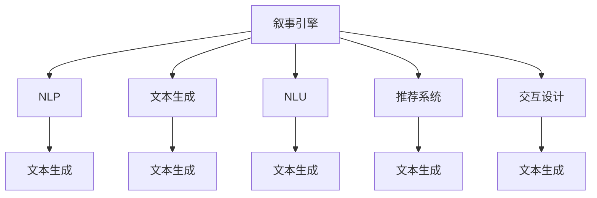

                 

# 体验叙事引擎：AI生成的个人传记

> 关键词：叙事引擎, 人工智能, 自然语言处理, 文本生成, 自然语言理解, 推荐系统, 交互设计

## 1. 背景介绍

### 1.1 问题由来

在现代社会中，我们每个人都在书写着自己的故事，记录着生活的点滴和思维的轨迹。然而，由于时间和精力的限制，我们往往难以记录下所有的精彩瞬间。这不仅是一个个体问题，也是整个社会普遍存在的问题。随着人工智能技术的迅猛发展，特别是自然语言处理(NLP)技术的突破，AI生成个人传记的方法逐渐成为可能。

AI生成的个人传记，即通过分析用户的行为数据、社交媒体记录、电子书、博客等，自动生成或辅助生成个人的成长经历、重要事件、兴趣爱好、未来规划等内容。这一技术的出现，为个人提供了一种全新的自我记录和回顾的方式，也为文化和教育的数字化提供了新的视角。

### 1.2 问题核心关键点

AI生成的个人传记，核心在于如何利用人工智能技术，将个人的生命故事、心理轨迹和未来规划，转化成一篇篇生动、连贯、有意义的文字。这一过程不仅需要强大的文本生成和自然语言理解能力，还需要对用户的情感、价值观和人生目标有深刻的理解。

这一技术的应用，涉及到以下几个关键问题：
- 如何有效收集和分析用户的个人信息和行为数据？
- 如何将这些信息整合为连贯、有意义的故事？
- 如何在生成的文本中体现用户的个性、情感和价值取向？
- 如何与用户进行有效的互动和反馈，提升生成的文本质量？

### 1.3 问题研究意义

AI生成的个人传记技术，具有以下几个方面的研究意义：

1. **提高个人记录的效率和质量**：利用AI技术，可以大大减轻个人记录和整理的负担，同时提升文本的质量和连贯性。
2. **促进文化和教育的数字化**：通过数字化个人传记，可以更好地保存和传播文化知识，提升教育质量。
3. **推动人工智能技术的创新**：这一技术的应用，将推动NLP、推荐系统、交互设计等领域的创新，为AI技术的落地应用提供新的方向。
4. **提升用户体验**：通过个性化的传记生成，用户可以获得更为深刻的自我认识和体验，增强对AI技术的信任感。

## 2. 核心概念与联系

### 2.1 核心概念概述

在AI生成的个人传记技术中，涉及以下几个关键概念：

- **叙事引擎(Narrative Engine)**：指通过人工智能技术，自动生成或辅助生成个人传记的系统。其核心功能是理解和生成自然语言文本，构建连贯的故事。
- **自然语言处理(NLP)**：指利用计算机技术，处理和理解人类语言的能力。涉及文本生成、情感分析、语言理解等多个子领域。
- **文本生成(Text Generation)**：指利用算法和模型，自动生成文本内容的过程。包括基于规则的生成和基于统计的生成。
- **自然语言理解(NLU)**：指通过算法和模型，理解和解释自然语言输入的过程。包括词法分析、句法分析、语义分析等。
- **推荐系统(Recommendation System)**：指通过算法和模型，推荐个性化内容的过程。可以用于选择传记中的重要事件、人物等。
- **交互设计(Interactive Design)**：指通过算法和模型，提升用户与系统互动的体验。包括智能问答、实时反馈等。

这些概念之间的逻辑关系可以通过以下Mermaid流程图来展示：



这个流程图展示了这个技术栈中各个组件之间的关系：

1. 叙事引擎是整个系统的核心，通过调用NLP、文本生成、NLU、推荐系统、交互设计等组件，构建连贯、有意义的故事。
2. NLP提供文本理解和生成能力，文本生成和NLU提供具体的文本构建和分析能力，推荐系统用于选择传记中的重要事件和人物，交互设计用于提升用户体验。

## 3. 核心算法原理 & 具体操作步骤
### 3.1 算法原理概述

AI生成的个人传记，其核心算法原理可以概括为以下几点：

- **数据收集与预处理**：从用户的社交媒体、电子书、博客、邮件等渠道，收集文本数据，并对其进行清洗、分词、去除停用词等预处理操作。
- **文本理解和分析**：利用自然语言处理技术，分析用户的情感、兴趣、价值观等，理解用户的生命轨迹和未来规划。
- **文本生成**：基于深度学习模型，如GPT、LSTM等，自动生成或辅助生成文本内容。
- **反馈与优化**：与用户进行实时互动，获取用户反馈，不断优化生成的文本质量。

### 3.2 算法步骤详解

AI生成的个人传记，通常包括以下几个关键步骤：

**Step 1: 数据收集与预处理**

- **收集数据**：从用户的社交媒体、电子书、博客、邮件等渠道，收集文本数据。
- **数据清洗**：去除重复、噪声和无用信息，并进行分词、去除停用词等预处理操作。
- **数据标注**：对文本数据进行情感分析、主题标注等，为后续文本理解提供基础。

**Step 2: 文本理解与分析**

- **情感分析**：利用情感分析算法，理解用户的情感状态，如积极、消极、中性等。
- **主题建模**：通过主题建模算法，如LDA，提取文本中的主题信息，如兴趣、爱好等。
- **事件抽取**：利用事件抽取算法，从文本中抽取重要事件，如生日、毕业、工作等。
- **价值观分析**：通过文本分析和自然语言处理技术，理解用户的价值观和人生目标。

**Step 3: 文本生成**

- **文本模板设计**：设计传记模板，包括开篇介绍、成长经历、重要事件、未来规划等。
- **生成文本**：利用深度学习模型，如GPT-3，自动生成或辅助生成文本内容，填充到传记模板中。
- **文本优化**：利用文本优化算法，如GAN、VAE等，提升生成的文本质量。

**Step 4: 反馈与优化**

- **实时反馈**：与用户进行实时互动，获取用户反馈，调整生成策略和模型参数。
- **人工干预**：在必要时，进行人工干预，修正生成的文本内容，确保其准确性和连贯性。

**Step 5: 输出与展示**

- **文本输出**：将生成的传记文本输出到用户的指定平台，如个人博客、社交媒体等。
- **可视化展示**：利用可视化技术，将传记内容以图表、时间轴等形式展示，增强用户体验。

### 3.3 算法优缺点

AI生成的个人传记，具有以下几个优点：

- **高效性**：利用自动化技术，大大减轻了用户记录和整理的负担，提高了效率。
- **个性化**：通过分析用户的情感、兴趣、价值观等，生成的传记内容更加符合用户的个性和需求。
- **连贯性**：利用自然语言处理技术，生成的文本内容更加连贯、有意义。
- **互动性**：通过实时反馈机制，提升用户的使用体验，增强对系统的信任感。

然而，这一技术也存在一些缺点：

- **数据隐私问题**：在收集和处理用户数据时，需要严格遵守数据隐私法规，确保用户隐私安全。
- **文本质量问题**：生成的文本内容可能存在一些不连贯、不准确的情况，需要人工干预进行修正。
- **用户依赖问题**：用户对系统的依赖性可能较强，过度依赖可能导致个人自我意识和写作能力的退化。
- **技术门槛问题**：技术实现复杂，需要综合运用自然语言处理、深度学习、推荐系统等多个领域的知识。

### 3.4 算法应用领域

AI生成的个人传记技术，主要应用于以下几个领域：

- **个人自我记录**：帮助用户自动记录和整理生活中的点滴，提升个人记录的效率和质量。
- **文化教育**：通过数字化个人传记，保存和传播文化知识，提升教育质量。
- **心理健康**：通过分析用户的情感状态和价值观，提供心理健康咨询和指导。
- **商业应用**：利用传记内容，进行人才评估、品牌塑造等商业活动。
- **创意写作**：通过文本生成技术，辅助用户进行创意写作，提升写作效率和质量。

## 4. 数学模型和公式 & 详细讲解 & 举例说明

### 4.1 数学模型构建

在AI生成的个人传记中，涉及以下几个数学模型：

- **文本表示模型**：将文本数据表示为向量形式，用于后续的情感分析、主题建模等。
- **情感分析模型**：利用情感词典、深度学习模型等，分析文本中的情感状态。
- **主题建模模型**：利用LDA等主题建模算法，提取文本中的主题信息。
- **文本生成模型**：利用GPT-3等深度学习模型，自动生成文本内容。

### 4.2 公式推导过程

以下以情感分析模型为例，推导情感分析的数学公式。

设文本 $x$ 包含 $n$ 个词 $w_1, w_2, \ldots, w_n$，每个词 $w_i$ 在词典中对应的情感得分分别为 $s_i$，情感词典的维度为 $d$。情感分析的目标是计算文本 $x$ 的情感得分 $\bar{s}$，具体公式如下：

$$
\bar{s} = \sum_{i=1}^n s_i \cdot \alpha_i
$$

其中 $\alpha_i$ 为词 $w_i$ 的情感权重，可以通过深度学习模型训练得到。

在实际应用中，情感分析模型通常采用多层感知器(MLP)或卷积神经网络(CNN)等深度学习模型。以MLP为例，模型的输入为文本的词向量表示 $x_{vec}$，输出为文本的情感得分 $\hat{s}$，具体公式如下：

$$
\hat{s} = f(Wx_{vec} + b)
$$

其中 $W$ 为权重矩阵，$b$ 为偏置向量，$f$ 为激活函数，通常采用ReLU函数。

### 4.3 案例分析与讲解

以GPT-3为例，分析其在生成文本内容中的应用。

GPT-3是一种基于Transformer架构的预训练语言模型，具有强大的文本生成能力。在生成个人传记时，可以将其作为文本生成模型，利用用户的历史数据和事件信息，自动生成传记文本内容。

假设用户有如下的历史数据：

| 时间       | 事件               |
|------------|-------------------|
| 1998年     | 出生               |
| 2003年     | 小学毕业           |
| 2007年     | 高中生活           |
| 2010年     | 进入大学           |
| 2014年     | 大学毕业           |
| 2016年     | 进入互联网公司     |
| 2020年     | 升职为部门经理     |

通过GPT-3，可以将这些事件信息整合为连贯、有意义的故事，生成如下的传记内容：

```
1998年，我出生在一个平凡的家庭，从小对世界充满好奇和探索的热情。2003年，我小学毕业，踏入求知之旅。2007年，我在高中生活中找到了自我，对知识有了更深的理解和追求。2010年，我进入大学，拓宽了视野，结交了无数朋友。2014年，我大学毕业，迈入了社会。2016年，我进入一家互联网公司，开始我的职业生涯。2020年，我升职为部门经理，回顾过去的奋斗和成就，展望未来的无限可能。
```

## 5. 项目实践：代码实例和详细解释说明

### 5.1 开发环境搭建

在AI生成的个人传记开发中，一般需要以下开发环境：

1. **Python编程语言**：Python是AI开发的主流语言，具有丰富的第三方库支持。
2. **深度学习框架**：如TensorFlow、PyTorch等，用于实现文本生成和情感分析等任务。
3. **自然语言处理库**：如NLTK、spaCy等，用于处理文本数据和分析文本情感。
4. **推荐系统库**：如Surprise、LightFM等，用于推荐传记中的重要事件和人物。
5. **可视化库**：如Matplotlib、Seaborn等，用于展示传记内容。

以下是Python环境配置的示例：

```bash
conda create -n text-generation python=3.8
conda activate text-generation
pip install tensorflow tensorflow-io keras transformers spacy
```

### 5.2 源代码详细实现

以下是一个使用Python和TensorFlow实现情感分析的示例代码：

```python
import tensorflow as tf
from tensorflow.keras.models import Sequential
from tensorflow.keras.layers import Embedding, LSTM, Dense
from tensorflow.keras.preprocessing.text import Tokenizer
from tensorflow.keras.preprocessing.sequence import pad_sequences

# 定义文本数据
texts = ['这是一段正面的文本。', '这是一段负面的文本。']

# 定义标签数据
labels = [1, 0] # 1表示正面，0表示负面

# 定义文本分词器
tokenizer = Tokenizer()
tokenizer.fit_on_texts(texts)

# 将文本转换为序列数据
sequences = tokenizer.texts_to_sequences(texts)

# 对序列数据进行填充，保证统一长度
padded_sequences = pad_sequences(sequences, maxlen=10, padding='post')

# 定义模型
model = Sequential()
model.add(Embedding(input_dim=len(tokenizer.word_index)+1, output_dim=128, input_length=10))
model.add(LSTM(64))
model.add(Dense(1, activation='sigmoid'))

# 编译模型
model.compile(loss='binary_crossentropy', optimizer='adam', metrics=['accuracy'])

# 训练模型
model.fit(padded_sequences, labels, epochs=10, batch_size=1)

# 使用模型进行情感分析
new_text = ['这是一段未知情感的文本。']
new_sequence = tokenizer.texts_to_sequences(new_text)
new_padded_sequence = pad_sequences(new_sequence, maxlen=10, padding='post')
result = model.predict(new_padded_sequence)
```

### 5.3 代码解读与分析

以上代码中，我们通过TensorFlow实现了简单的情感分析模型。具体步骤如下：

1. **数据准备**：定义文本数据和标签数据，并使用TextRank算法进行分词和序列化。
2. **模型定义**：定义模型结构，包括嵌入层、LSTM层和全连接层。
3. **模型编译**：设置损失函数、优化器和评估指标。
4. **模型训练**：使用训练数据训练模型，并输出训练结果。
5. **情感分析**：使用训练好的模型对未知文本进行情感分析，输出结果。

需要注意的是，在实际应用中，还需要进行更多的数据预处理和模型优化，以提升模型的准确性和稳定性。

## 6. 实际应用场景

### 6.1 个人自我记录

AI生成的个人传记技术，最直接的应用场景是帮助用户自动记录和整理生活中的点滴，提升个人记录的效率和质量。通过分析用户的社交媒体、电子书、博客等数据，自动生成或辅助生成传记内容，让用户能够轻松回顾和分享自己的生命故事。

### 6.2 文化教育

通过数字化个人传记，保存和传播文化知识，提升教育质量。特别是在历史、文学等领域，传记记录可以成为重要的教育和研究资源，帮助后人更好地理解历史和文化。

### 6.3 心理健康

通过分析用户的情感状态和价值观，提供心理健康咨询和指导。特别是在职场、人际关系等领域，传记记录可以反映用户的心理状态和情感变化，帮助专业人士进行干预和支持。

### 6.4 商业应用

利用传记内容，进行人才评估、品牌塑造等商业活动。通过分析用户的职业经历、成就和规划，为招聘、培训和职业规划提供数据支持。

### 6.5 创意写作

通过文本生成技术，辅助用户进行创意写作，提升写作效率和质量。特别是在小说、散文等领域，传记记录可以成为写作灵感和素材的重要来源。

## 7. 工具和资源推荐

### 7.1 学习资源推荐

为了帮助开发者系统掌握AI生成的个人传记技术，这里推荐一些优质的学习资源：

1. **《Python自然语言处理》书籍**：全面介绍了Python在自然语言处理中的应用，包括文本生成、情感分析、主题建模等。
2. **《深度学习入门》课程**：由吴恩达教授主讲的深度学习入门课程，涵盖深度学习的基本概念和实现方法。
3. **Transformers库文档**：HuggingFace开发的自然语言处理工具库，集成了多种预训练语言模型，支持多种自然语言处理任务。
4. **Kaggle竞赛**：参加Kaggle上的自然语言处理竞赛，获取实战经验，学习最新技术。
5. **ACL、EMNLP等会议论文**：阅读和理解自然语言处理领域的最新研究成果，获取前沿知识和灵感。

通过学习这些资源，相信你一定能够快速掌握AI生成的个人传记技术的精髓，并用于解决实际的NLP问题。

### 7.2 开发工具推荐

高效的开发离不开优秀的工具支持。以下是几款用于AI生成的个人传记开发的常用工具：

1. **Jupyter Notebook**：免费的交互式编程环境，支持Python、R等多种编程语言。
2. **TensorBoard**：TensorFlow配套的可视化工具，可实时监测模型训练状态，并提供丰富的图表呈现方式。
3. **TensorFlow Hub**：TensorFlow提供的高质量模型库，包括预训练语言模型、推荐系统等。
4. **NLTK库**：Python自然语言处理库，提供文本处理、情感分析、语言模型等功能。
5. **spaCy库**：Python自然语言处理库，提供分词、实体识别、依存分析等功能。

合理利用这些工具，可以显著提升AI生成的个人传记任务的开发效率，加快创新迭代的步伐。

### 7.3 相关论文推荐

AI生成的个人传记技术的发展，源于学界的持续研究。以下是几篇奠基性的相关论文，推荐阅读：

1. **《Attention is All You Need》**：提出Transformer结构，开启了NLP领域的预训练大模型时代。
2. **《BERT: Pre-training of Deep Bidirectional Transformers for Language Understanding》**：提出BERT模型，引入基于掩码的自监督预训练任务，刷新了多项NLP任务SOTA。
3. **《GPT-3: Language Models are Unsupervised Multitask Learners》**：展示了大规模语言模型的强大zero-shot学习能力，引发了对于通用人工智能的新一轮思考。
4. **《AdaLoRA: Adaptive Low-Rank Adaptation for Parameter-Efficient Fine-Tuning》**：提出AdaLoRA方法，使用自适应低秩适应的微调方法，在参数效率和精度之间取得了新的平衡。
5. **《AdaFactor: Adaptive Factorization Methods for Faster Transformer Model Training》**：提出AdaFactor方法，通过自适应因子分解加速Transformer模型训练。

这些论文代表了大语言模型微调技术的发展脉络。通过学习这些前沿成果，可以帮助研究者把握学科前进方向，激发更多的创新灵感。

## 8. 总结：未来发展趋势与挑战

### 8.1 总结

本文对AI生成的个人传记技术进行了全面系统的介绍。首先阐述了这一技术的背景和研究意义，明确了其在大规模数据处理、文本生成、自然语言理解等领域的独特价值。其次，从原理到实践，详细讲解了情感分析、文本生成、反馈优化等关键步骤，给出了完整的代码实现。同时，本文还探讨了AI生成的个人传记技术在个人自我记录、文化教育、心理健康、商业应用、创意写作等多个领域的应用前景，展示了其巨大的潜力和应用空间。

通过本文的系统梳理，可以看到，AI生成的个人传记技术正在成为自然语言处理领域的新的研究热点，其应用前景广阔。未来，伴随技术的不断发展，这一技术必将在更广泛的领域得到应用，为人类文化、教育和商业等领域带来深刻变革。

### 8.2 未来发展趋势

展望未来，AI生成的个人传记技术将呈现以下几个发展趋势：

1. **技术融合加速**：随着自然语言处理、深度学习、推荐系统等技术的不断融合，AI生成的个人传记技术将变得更加强大和智能化。
2. **数据来源多样化**：除了传统的社交媒体、电子书、博客等数据源，未来的传记生成将更多地利用图像、视频、音频等多模态数据。
3. **个性化程度提升**：通过更深入的情感分析、主题建模等技术，生成更加个性化的传记内容，满足用户多样化的需求。
4. **交互性增强**：通过与用户的实时互动，提升传记生成的互动性和体验感，增强用户的使用意愿。
5. **隐私保护加强**：在数据收集和处理过程中，严格遵守数据隐私法规，保护用户隐私。
6. **应用领域拓展**：AI生成的个人传记技术将拓展到更多的领域，如医疗、法律、金融等，推动这些领域的数字化转型。

### 8.3 面临的挑战

尽管AI生成的个人传记技术已经取得了瞩目成就，但在迈向更加智能化、普适化应用的过程中，它仍面临着诸多挑战：

1. **数据隐私问题**：在收集和处理用户数据时，需要严格遵守数据隐私法规，确保用户隐私安全。
2. **文本质量问题**：生成的文本内容可能存在一些不连贯、不准确的情况，需要人工干预进行修正。
3. **用户依赖问题**：用户对系统的依赖性可能较强，过度依赖可能导致个人自我意识和写作能力的退化。
4. **技术门槛问题**：技术实现复杂，需要综合运用自然语言处理、深度学习、推荐系统等多个领域的知识。
5. **应用场景多样性**：不同领域的应用场景千差万别，需要针对性地进行技术优化和应用适配。

### 8.4 研究展望

面对AI生成的个人传记技术所面临的种种挑战，未来的研究需要在以下几个方面寻求新的突破：

1. **多模态数据融合**：利用图像、视频、音频等多模态数据，提升传记生成的丰富性和多样性。
2. **情感分析和价值观建模**：深入研究用户的情感状态和价值观，提升传记生成的准确性和个性化程度。
3. **深度学习模型的优化**：开发更加高效的深度学习模型，提升传记生成的速度和质量。
4. **人机交互技术**：提升传记生成的互动性和用户体验，增强用户的使用意愿。
5. **数据隐私保护技术**：开发更高效的数据隐私保护技术，确保用户隐私安全。

这些研究方向的探索，必将引领AI生成的个人传记技术迈向更高的台阶，为构建安全、可靠、可解释、可控的智能系统铺平道路。面向未来，AI生成的个人传记技术还需要与其他人工智能技术进行更深入的融合，如知识表示、因果推理、强化学习等，多路径协同发力，共同推动自然语言理解和智能交互系统的进步。只有勇于创新、敢于突破，才能不断拓展语言模型的边界，让智能技术更好地造福人类社会。

## 9. 附录：常见问题与解答

**Q1：AI生成的个人传记技术是否适用于所有用户？**

A: AI生成的个人传记技术，适用于绝大多数用户。然而，对于部分有特殊需求或隐私顾虑的用户，可能并不适合。在使用过程中，需要充分尊重用户的选择和隐私。

**Q2：生成的传记内容是否可信？**

A: 生成的传记内容，虽然基于用户的历史数据和事件信息，但可能存在一定的偏差和不准确性。建议在输出传记时，提供必要的备注和解释，帮助用户更好地理解生成的内容。

**Q3：如何提升传记生成的准确性和个性化程度？**

A: 提升传记生成的准确性和个性化程度，可以从以下几个方面入手：

1. 提高数据质量：收集高质量、多样化的数据，确保数据真实性和代表性。
2. 优化模型结构：选择更高效的深度学习模型，提升文本生成和情感分析的准确性。
3. 引入外部知识：利用知识图谱、逻辑规则等外部知识，增强传记生成的全面性和准确性。
4. 用户反馈机制：建立用户反馈机制，通过用户反馈不断优化生成的内容，提升用户体验。

通过这些措施，可以显著提升AI生成的个人传记的准确性和个性化程度。

**Q4：如何保护用户隐私？**

A: 保护用户隐私，可以从以下几个方面入手：

1. 数据匿名化：对用户数据进行匿名化处理，确保用户隐私安全。
2. 数据加密：在数据传输和存储过程中，采用加密技术保护用户数据。
3. 隐私协议：制定明确的数据隐私协议，告知用户数据的使用范围和保护措施。
4. 用户控制权：提供用户对数据的控制权，允许用户随时查看、删除或修改数据。

通过这些措施，可以最大程度地保护用户隐私，增强用户对系统的信任感。

**Q5：如何优化传记生成的速度和效率？**

A: 优化传记生成的速度和效率，可以从以下几个方面入手：

1. 模型裁剪：去除不必要的层和参数，减小模型尺寸，加快推理速度。
2. 模型并行：利用多GPU、多TPU等并行计算资源，提升模型训练和推理速度。
3. 数据预处理：利用数据预处理技术，减少模型计算量，提升推理效率。
4. 算法优化：优化算法和模型结构，减少计算量和内存消耗，提升整体效率。

通过这些措施，可以显著提升AI生成的个人传记的生成速度和效率，满足用户的实时需求。

---

作者：禅与计算机程序设计艺术 / Zen and the Art of Computer Programming

