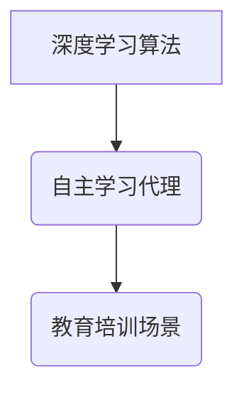

> 深度学习、自主学习、代理、教育培训、人工智能、算法

## 1. 背景介绍

随着人工智能技术的飞速发展，深度学习算法在各个领域取得了显著的成果，例如图像识别、自然语言处理、语音识别等。在教育培训领域，深度学习算法也展现出巨大的潜力，能够为个性化学习、智能辅导、自动评估等方面提供新的解决方案。

传统的教育培训模式往往是“一刀切”，难以满足不同学生个性化的学习需求。而深度学习算法能够根据学生的学习情况，动态调整学习内容和难度，提供个性化的学习路径。此外，深度学习算法还可以模拟教师的辅导作用，为学生提供智能化的学习指导和帮助。

自主学习代理是深度学习算法在教育培训领域的一种重要应用。自主学习代理是指能够自主学习和决策的智能代理，它可以根据学生的学习目标和进度，自动选择合适的学习资源和学习策略，并提供个性化的学习建议。

## 2. 核心概念与联系

**2.1  深度学习算法**

深度学习算法是一种基于多层神经网络的机器学习算法，能够从海量数据中学习复杂的特征和模式。深度学习算法的优势在于：

* **强大的学习能力:** 深度学习算法能够学习到数据中隐藏的复杂关系，并进行精准的预测和分类。
* **自动特征提取:** 深度学习算法能够自动提取数据的特征，无需人工特征工程。
* **可扩展性强:** 深度学习算法可以处理海量数据，并随着数据量的增加而提高性能。

**2.2  自主学习代理**

自主学习代理是一种能够自主学习和决策的智能代理，它可以根据环境信息和目标，制定学习策略并执行相应的行动。自主学习代理的特征在于：

* **自主学习:** 代理能够通过学习环境信息和数据，不断更新自己的知识和技能。
* **决策能力:** 代理能够根据学习到的知识和环境信息，做出自主的决策。
* **适应性强:** 代理能够根据环境变化，调整自己的学习策略和行为。

**2.3  教育培训场景**

在教育培训场景中，自主学习代理可以作为学生的学习伙伴，提供个性化的学习指导和帮助。

**2.4  核心概念联系**

深度学习算法为自主学习代理提供了强大的学习能力和决策能力。自主学习代理将深度学习算法应用于教育培训场景，能够为学生提供个性化的学习体验，提高学习效率。



## 3. 核心算法原理 & 具体操作步骤

### 3.1  算法原理概述

自主学习代理在教育培训场景中的核心算法原理是基于强化学习的。强化学习是一种机器学习方法，它通过奖励和惩罚机制，训练代理学习最优的策略。

在教育培训场景中，代理的学习目标是帮助学生提高学习成绩。代理可以根据学生的学习情况，选择合适的学习资源和学习策略，并根据学生的学习效果获得奖励或惩罚。通过不断学习和调整策略，代理最终能够找到最优的学习策略，帮助学生取得最佳的学习效果。

### 3.2  算法步骤详解

1. **环境建模:** 建立一个模拟教育培训场景的环境模型，包括学生、学习资源、学习任务等。
2. **代理初始化:** 初始化自主学习代理，赋予其初始的知识和技能。
3. **状态观测:** 代理观察当前环境状态，例如学生的学习进度、知识掌握情况等。
4. **策略选择:** 代理根据当前状态和学习目标，选择最优的学习策略，例如选择合适的学习资源、制定学习计划等。
5. **行动执行:** 代理执行选择的策略，例如引导学生学习特定内容、提供个性化辅导等。
6. **奖励反馈:** 环境根据代理的行动效果，给予相应的奖励或惩罚。
7. **策略更新:** 代理根据奖励反馈，更新自己的策略，以提高未来的学习效果。

### 3.3  算法优缺点

**优点:**

* **个性化学习:** 根据学生的学习情况，提供个性化的学习路径和学习建议。
* **智能辅导:** 模拟教师的辅导作用，为学生提供智能化的学习指导和帮助。
* **自动评估:** 自动评估学生的学习效果，及时发现学习问题并提供针对性指导。

**缺点:**

* **数据依赖:** 需要大量的学习数据来训练自主学习代理。
* **算法复杂:** 强化学习算法的训练过程比较复杂，需要专业的技术人员进行开发和维护。
* **伦理问题:** 自主学习代理在教育培训中的应用，需要考虑伦理问题，例如数据隐私保护、算法公平性等。

### 3.4  算法应用领域

自主学习代理在教育培训领域具有广泛的应用前景，例如：

* **个性化学习平台:** 为学生提供个性化的学习路径和学习建议。
* **智能辅导系统:** 为学生提供智能化的学习指导和帮助。
* **自动评估系统:** 自动评估学生的学习效果，及时发现学习问题并提供针对性指导。
* **在线教育平台:** 为在线教育平台提供智能化的学习助手。

## 4. 数学模型和公式 & 详细讲解 & 举例说明

### 4.1  数学模型构建

自主学习代理的数学模型通常基于马尔可夫决策过程 (MDP)。MDP 是一个描述决策过程的数学框架，它包含以下几个要素：

* **状态空间 (S):** 所有可能的系统状态的集合。
* **动作空间 (A):** 在每个状态下可以执行的动作的集合。
* **转移概率 (P):** 从一个状态执行一个动作后转移到另一个状态的概率。
* **奖励函数 (R):** 在每个状态执行一个动作后获得的奖励值。
* **折扣因子 (γ):** 未来奖励的折扣系数，通常取值在 0 到 1 之间。

### 4.2  公式推导过程

自主学习代理的目标是找到最优的策略，即在每个状态下选择最优的动作，以最大化累积的奖励。最优策略可以用价值函数来表示，价值函数表示从某个状态开始执行最优策略的累积奖励。

价值函数的更新公式为：

$$
V(s) = \max_a \sum_{s'} P(s'|s,a) [R(s,a,s') + \gamma V(s')]
$$

其中：

* $V(s)$ 是状态 $s$ 的价值函数。
* $a$ 是在状态 $s$ 下可以执行的动作。
* $s'$ 是从状态 $s$ 执行动作 $a$ 后转移到的下一个状态。
* $R(s,a,s')$ 是在状态 $s$ 执行动作 $a$ 后转移到状态 $s'$ 获得的奖励。
* $\gamma$ 是折扣因子。

### 4.3  案例分析与讲解

假设一个自主学习代理需要帮助学生学习数学。

* 状态空间：学生的数学知识水平。
* 动作空间：提供不同的数学学习资源，例如视频讲解、练习题、在线课程等。
* 转移概率：学生学习不同资源后，数学知识水平提升的概率。
* 奖励函数：学生学习数学知识后，获得的成绩提升值。

通过训练，自主学习代理可以学习到最优的策略，即根据学生的数学知识水平，选择最合适的数学学习资源，帮助学生提高数学成绩。

## 5. 项目实践：代码实例和详细解释说明

### 5.1  开发环境搭建

* Python 3.x
* TensorFlow 或 PyTorch 深度学习框架
* Jupyter Notebook 或 VS Code 代码编辑器

### 5.2  源代码详细实现

```python
import tensorflow as tf

# 定义神经网络模型
model = tf.keras.models.Sequential([
    tf.keras.layers.Dense(64, activation='relu', input_shape=(10,)),
    tf.keras.layers.Dense(32, activation='relu'),
    tf.keras.layers.Dense(1)
])

# 编译模型
model.compile(optimizer='adam', loss='mse')

# 训练模型
model.fit(X_train, y_train, epochs=10)

# 评估模型
loss = model.evaluate(X_test, y_test)
```

### 5.3  代码解读与分析

* 代码首先定义了一个简单的深度神经网络模型，包含三个全连接层。
* 然后，模型被编译，使用 Adam 优化器和均方误差损失函数。
* 接着，模型被训练，使用训练数据 X_train 和 y_train。
* 最后，模型被评估，使用测试数据 X_test 和 y_test。

### 5.4  运行结果展示

训练完成后，可以查看模型的训练损失和测试损失，以及模型在测试数据上的准确率等指标。

## 6. 实际应用场景

自主学习代理在教育培训领域具有广泛的应用场景，例如：

### 6.1  个性化学习平台

自主学习代理可以为学生提供个性化的学习路径和学习建议，根据学生的学习情况，选择合适的学习资源和学习策略，提高学习效率。

### 6.2  智能辅导系统

自主学习代理可以模拟教师的辅导作用，为学生提供智能化的学习指导和帮助，例如解答学生的问题、提供学习建议、跟踪学生的学习进度等。

### 6.3  自动评估系统

自主学习代理可以自动评估学生的学习效果，例如自动批改作业、自动生成测试题、自动分析学生的学习情况等，帮助教师及时发现学生的学习问题并提供针对性指导。

### 6.4  未来应用展望

随着人工智能技术的不断发展，自主学习代理在教育培训领域的应用将更加广泛和深入。未来，自主学习代理可能能够：

* 更智能地理解学生的学习需求和学习风格。
* 更精准地推荐学习资源和学习策略。
* 更有效地提供个性化的学习辅导。
* 更全面地评估学生的学习效果。

## 7. 工具和资源推荐

### 7.1  学习资源推荐

* **深度学习书籍:**
    * 深度学习 (Deep Learning) - Ian Goodfellow, Yoshua Bengio, Aaron Courville
    * 深度学习实践 (Deep Learning with Python) - Francois Chollet
* **在线课程:**
    * Coursera: 深度学习 Specialization
    * Udacity: 深度学习 Nanodegree
    * fast.ai: 深度学习课程

### 7.2  开发工具推荐

* **Python:** 
    * TensorFlow: https://www.tensorflow.org/
    * PyTorch: https://pytorch.org/
* **Jupyter Notebook:** https://jupyter.org/
* **VS Code:** https://code.visualstudio.com/

### 7.3  相关论文推荐

* **Reinforcement Learning: An Introduction** - Richard S. Sutton and Andrew G. Barto
* **Deep Reinforcement Learning** - Volodymyr Mnih et al.
* **AlphaGo: Mastering the Game of Go with Deep Neural Networks and Tree Search** - Demis Hassabis et al.

## 8. 总结：未来发展趋势与挑战

### 8.1  研究成果总结

自主学习代理在教育培训领域的应用取得了显著的成果，能够为学生提供个性化的学习体验，提高学习效率。

### 8.2  未来发展趋势

未来，自主学习代理将朝着以下方向发展：

* **更智能的学习策略:** 利用更先进的机器学习算法，开发更智能的学习策略，能够更精准地适应学生的学习需求和学习风格。
* **更丰富的学习资源:** 与更多教育资源平台进行整合，提供更丰富的学习资源，满足学生的个性化学习需求。
* **更人性化的交互:** 利用自然语言处理技术，实现更人性化的交互，让学生感觉更像是在与老师交流学习。

### 8.3  面临的挑战

自主学习代理在教育培训领域的应用也面临一些挑战：

* **数据隐私保护:** 教育数据涉及学生的个人隐私，需要采取有效的措施保护学生的隐私安全。
* **算法公平性:** 算法训练数据可能存在偏差，导致算法结果不公平，需要确保算法的公平性和公正性。
* **伦理问题:**