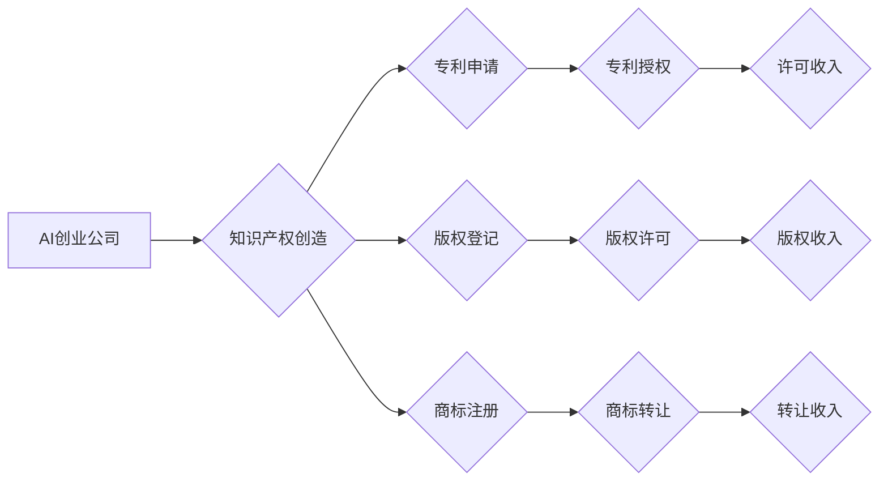

> AI创业公司,知识产权,许可,转让,维权,专利,版权,商标,商业秘密

## 1. 背景介绍

人工智能（AI）技术蓬勃发展，催生了一批AI创业公司。这些公司往往拥有独创的算法、模型和应用，其知识产权（IP）成为核心竞争力。然而，AI创业公司在知识产权运营方面面临着诸多挑战，例如如何有效保护IP，如何利用IP创造商业价值，如何应对IP纠纷等。

## 2. 核心概念与联系

**2.1 知识产权概述**

知识产权是指个人或组织对知识、创造和发明享有的专有权利。常见的知识产权类型包括：

* **专利权:**  对发明创造的独占权利，允许专利权人阻止他人制造、使用、销售其发明。
* **版权:** 对文学、艺术、音乐等作品的独占权利，允许版权人控制作品的复制、发行、表演等行为。
* **商标权:** 对商品或服务的标识享有的独占权利，允许商标权人阻止他人使用与其相似的标识。
* **商业秘密:**  企业内部的机密信息，例如配方、技术、客户名单等，通过保密措施保护其商业价值。

**2.2 AI知识产权的特点**

AI知识产权与传统知识产权存在一些显著差异：

* **算法的创造性:** AI算法的创造性难以界定，其是否构成发明创造，需要进行法律判断。
* **数据驱动:** AI模型的训练依赖于大量数据，数据本身也可能构成知识产权。
* **快速迭代:** AI技术发展迅速，算法和模型不断迭代更新，知识产权保护面临挑战。

**2.3 IP运营与商业价值**

AI创业公司可以通过知识产权运营创造商业价值：

* **许可授权:** 将IP授权给其他企业使用，获得许可费收入。
* **技术转让:** 将IP转让给其他企业，获得一次性或分期付款。
* **商业合作:** 与其他企业合作开发基于AI技术的应用，共享知识产权收益。

**2.4 IP风险与挑战**

AI创业公司在知识产权运营过程中面临着以下风险和挑战：

* **IP侵权风险:**  未经授权使用他人的IP，可能导致侵权诉讼。
* **IP无效风险:**  申请的专利或版权可能被认定无效。
* **IP价值评估风险:**  难以准确评估AI知识产权的市场价值。

**2.5 Mermaid 流程图**



## 3. 核心算法原理 & 具体操作步骤

**3.1 算法原理概述**

AI知识产权运营涉及多种算法和技术，例如：

* **文本分析算法:** 用于识别和分析文本中的知识产权信息，例如专利描述、技术文档等。
* **机器学习算法:** 用于预测知识产权的市场价值、侵权风险等。
* **自然语言处理算法:** 用于生成知识产权申请文件、合同等。

**3.2 算法步骤详解**

具体操作步骤取决于具体的算法和应用场景，例如：

* **专利申请:** 使用文本分析算法提取专利申请的关键信息，生成专利申请文件。
* **知识产权检索:** 使用机器学习算法分析专利数据库，识别与目标技术相关的专利。
* **侵权风险评估:** 使用机器学习算法分析文本数据，预测文本是否侵犯他人知识产权。

**3.3 算法优缺点**

不同的算法具有不同的优缺点，需要根据具体应用场景选择合适的算法。

* **文本分析算法:** 优点是能够快速处理大量文本数据，缺点是识别复杂知识产权信息的能力有限。
* **机器学习算法:** 优点是能够学习和改进，预测能力强，缺点是需要大量训练数据。
* **自然语言处理算法:** 优点是能够生成自然语言文本，缺点是生成文本的质量和准确性需要不断提高。

**3.4 算法应用领域**

AI算法在知识产权运营领域具有广泛的应用前景，例如：

* **专利申请和检索:** 提高专利申请效率，降低成本。
* **侵权风险评估:** 帮助企业识别和避免知识产权侵权风险。
* **知识产权交易:** 提高知识产权交易效率，降低交易成本。

## 4. 数学模型和公式 & 详细讲解 & 举例说明

**4.1 数学模型构建**

知识产权价值评估模型可以基于多种数学模型构建，例如：

* **回归模型:** 使用历史数据训练回归模型，预测知识产权的市场价值。
* **神经网络模型:** 使用深度学习技术构建神经网络模型，对知识产权进行更复杂的价值评估。

**4.2 公式推导过程**

例如，一个简单的回归模型可以采用以下公式：

$$
V = \beta_0 + \beta_1 * X_1 + \beta_2 * X_2 + ... + \beta_n * X_n + \epsilon
$$

其中：

* $V$ 是知识产权的市场价值。
* $X_1, X_2, ..., X_n$ 是影响知识产权价值的因素，例如专利数量、技术成熟度、市场需求等。
* $\beta_0, \beta_1, ..., \beta_n$ 是模型参数，需要通过训练数据进行估计。
* $\epsilon$ 是误差项。

**4.3 案例分析与讲解**

假设我们想要评估一个AI算法的市场价值，可以收集以下数据：

* 算法的专利数量
* 算法的性能指标
* 算法的应用场景
* 算法的市场需求

然后，使用回归模型训练数据，估计模型参数，最终预测算法的市场价值。

## 5. 项目实践：代码实例和详细解释说明

**5.1 开发环境搭建**

AI知识产权运营项目可以使用Python语言开发，常用的库包括：

* **NLTK:** 自然语言处理库
* **Scikit-learn:** 机器学习库
* **TensorFlow:** 深度学习库

**5.2 源代码详细实现**

以下是一个简单的Python代码示例，用于识别专利申请中的关键词：

```python
import nltk
from nltk.tokenize import word_tokenize

# 下载NLTK数据
nltk.download('punkt')

# 读取专利申请文本
text = open("patent_application.txt", "r").read()

# 使用word_tokenize函数进行分词
tokens = word_tokenize(text)

# 打印关键词
print(tokens)
```

**5.3 代码解读与分析**

这段代码首先使用NLTK库下载分词模型，然后读取专利申请文本，使用word_tokenize函数进行分词，并将分词后的关键词打印出来。

**5.4 运行结果展示**

运行这段代码后，将输出专利申请文本中的所有关键词。

## 6. 实际应用场景

**6.1  专利申请加速**

AI算法可以帮助企业快速识别专利申请的关键信息，生成专利申请文件，加速专利申请流程。

**6.2  侵权风险预警**

AI算法可以分析文本数据，识别潜在的知识产权侵权风险，帮助企业避免侵权纠纷。

**6.3  知识产权交易优化**

AI算法可以帮助企业评估知识产权的市场价值，优化知识产权交易流程。

**6.4  未来应用展望**

未来，AI技术将进一步推动知识产权运营的创新，例如：

* **自动生成知识产权申请文件:** 使用自然语言生成技术，自动生成高质量的专利申请文件、版权登记申请等。
* **智能知识产权管理平台:** 建立基于AI的知识产权管理平台，实现知识产权的自动化管理、分析和决策。
* **区块链技术与知识产权:** 利用区块链技术对知识产权进行记录和管理，提高知识产权的透明度和安全性。

## 7. 工具和资源推荐

**7.1 学习资源推荐**

* **斯坦福大学CS224N课程:** 自然语言处理课程，涵盖了文本分析、机器学习等相关知识。
* **Coursera上的机器学习课程:** 由Andrew Ng教授授课，介绍了机器学习的基本原理和应用。
* **Google AI Blog:** 谷歌人工智能博客，分享了最新的AI研究成果和应用案例。

**7.2 开发工具推荐**

* **Python:** 广泛应用于AI开发的编程语言。
* **NLTK:** 自然语言处理库。
* **Scikit-learn:** 机器学习库。
* **TensorFlow:** 深度学习库。

**7.3 相关论文推荐**

* **BERT: Pre-training of Deep Bidirectional Transformers for Language Understanding:** BERT模型论文，介绍了预训练语言模型的最新进展。
* **Attention Is All You Need:** Transformer模型论文，介绍了基于注意力机制的序列模型。
* **Deep Learning for Natural Language Processing:** 深度学习在自然语言处理领域的应用综述论文。

## 8. 总结：未来发展趋势与挑战

**8.1 研究成果总结**

AI技术在知识产权运营领域取得了显著进展，例如：

* **专利申请加速:** AI算法可以帮助企业快速识别专利申请的关键信息，生成专利申请文件，加速专利申请流程。
* **侵权风险预警:** AI算法可以分析文本数据，识别潜在的知识产权侵权风险，帮助企业避免侵权纠纷。
* **知识产权交易优化:** AI算法可以帮助企业评估知识产权的市场价值，优化知识产权交易流程。

**8.2 未来发展趋势**

未来，AI技术将进一步推动知识产权运营的创新，例如：

* **自动生成知识产权申请文件:** 使用自然语言生成技术，自动生成高质量的专利申请文件、版权登记申请等。
* **智能知识产权管理平台:** 建立基于AI的知识产权管理平台，实现知识产权的自动化管理、分析和决策。
* **区块链技术与知识产权:** 利用区块链技术对知识产权进行记录和管理，提高知识产权的透明度和安全性。

**8.3 面临的挑战**

AI技术在知识产权运营领域也面临着一些挑战，例如：

* **算法的准确性和可靠性:** AI算法的准确性和可靠性需要不断提高，才能更好地服务于知识产权运营。
* **数据安全和隐私保护:** AI算法的训练和应用需要大量数据，需要确保数据的安全性和隐私保护。
* **法律和伦理问题:** AI技术在知识产权运营领域的应用需要考虑法律和伦理问题，例如算法的公平性、透明度等。

**8.4 研究展望**

未来，需要加强对AI技术在知识产权运营领域的应用研究，探索AI技术与知识产权的融合发展路径，推动知识产权运营的创新和发展。

## 9. 附录：常见问题与解答

**9.1 如何评估AI知识产权的市场价值？**

AI知识产权的市场价值评估是一个复杂的过程，需要考虑多种因素，例如算法的性能、应用场景、市场需求等。可以使用回归模型、神经网络模型等数学模型进行评估。

**9.2 如何保护AI知识产权？**

AI知识产权的保护方式包括专利申请、版权登记、商标注册等。需要根据具体的知识产权类型选择合适的保护方式。

**9.3 如何应对AI知识产权的侵权风险？**

可以采用以下措施应对AI知识产权的侵权风险：

* 使用AI算法进行侵权风险预警。
* 完善知识产权管理制度。
* 及时采取法律措施应对侵权行为。


作者：禅与计算机程序设计艺术 / Zen and the Art of Computer Programming 
<end_of_turn>