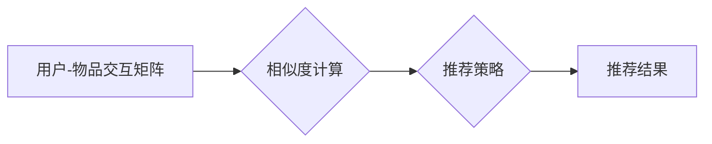

> AI协同过滤算法，推荐系统，协同过滤，矩阵分解，用户行为，物品特征，个性化推荐，机器学习

## 1. 背景介绍

在信息爆炸的时代，海量数据和个性化需求共同催生了推荐系统的蓬勃发展。推荐系统旨在根据用户的历史行为、偏好和兴趣，预测用户对特定物品的喜好，并提供个性化的推荐结果。协同过滤算法作为推荐系统中一种重要的技术，凭借其简单易懂、效果显著的特点，在电商、视频、音乐等领域得到了广泛应用。

传统的协同过滤算法主要基于用户-物品交互矩阵，通过分析用户对物品的评分或行为记录，找出具有相似兴趣的用户或物品，进而推荐用户可能感兴趣的物品。然而，传统的协同过滤算法存在一些问题，例如数据稀疏性、冷启动问题和数据规模庞大等。

近年来，随着人工智能技术的快速发展，深度学习和自然语言处理等技术被引入到协同过滤算法中，有效提升了推荐系统的准确性和个性化程度。本文将深入探讨AI协同过滤算法的原理、实现方法和应用场景，并通过案例分析，展示AI协同过滤算法在提升推荐效果方面的优势。

## 2. 核心概念与联系

协同过滤算法的核心思想是“物以类聚，人以群分”。它通过分析用户对物品的交互行为，找出具有相似兴趣的用户或物品，并根据这些相似性进行推荐。

**2.1 用户-物品交互矩阵**

用户-物品交互矩阵是协同过滤算法的基础数据结构。它是一个二维矩阵，其中每一行代表一个用户，每一列代表一个物品。矩阵中的元素表示用户对物品的交互行为，例如评分、购买、点击等。

**2.2 相似度计算**

协同过滤算法需要计算用户或物品之间的相似度。常用的相似度计算方法包括余弦相似度、皮尔逊相关系数和马氏距离等。

**2.3 推荐策略**

根据用户或物品之间的相似度，协同过滤算法可以采用不同的推荐策略，例如：

* **基于用户的协同过滤:** 根据用户的历史行为，找到与当前用户兴趣相似的用户，并推荐这些用户喜欢的物品。
* **基于物品的协同过滤:** 根据物品的特征，找到与当前用户感兴趣的物品相似的物品，并推荐这些物品。

**2.4 Mermaid 流程图**



## 3. 核心算法原理 & 具体操作步骤

### 3.1 算法原理概述

AI协同过滤算法将深度学习和自然语言处理技术融入到传统的协同过滤算法中，有效解决数据稀疏性、冷启动问题和数据规模庞大等问题。

**3.1.1 矩阵分解**

矩阵分解是一种将用户-物品交互矩阵分解成多个低维矩阵的技术。通过分解，可以将用户和物品的潜在特征提取出来，并利用这些特征进行推荐。

**3.1.2 深度学习**

深度学习算法可以学习用户和物品之间的复杂关系，并进行更精准的推荐。常用的深度学习模型包括多层感知机、卷积神经网络和循环神经网络等。

**3.1.3 自然语言处理**

自然语言处理技术可以用于分析用户评论、描述等文本数据，提取用户兴趣和物品特征，从而提升推荐的准确性和个性化程度。

### 3.2 算法步骤详解

1. **数据预处理:** 对用户-物品交互数据进行清洗、去噪和格式转换。
2. **特征提取:** 利用自然语言处理技术提取用户评论、描述等文本数据中的特征，并与用户-物品交互数据进行融合。
3. **模型训练:** 使用深度学习算法对用户-物品交互数据进行训练，学习用户和物品之间的潜在特征。
4. **推荐预测:** 根据训练好的模型，预测用户对特定物品的评分或点击概率。
5. **结果排序:** 对推荐结果进行排序，并根据用户偏好和场景需求进行个性化展示。

### 3.3 算法优缺点

**优点:**

* 能够学习用户和物品之间的复杂关系，提升推荐的准确性和个性化程度。
* 可以有效解决数据稀疏性和冷启动问题。
* 能够利用文本数据进行特征提取，提升推荐的丰富性和多样性。

**缺点:**

* 训练模型需要大量的计算资源和时间。
* 模型的复杂性较高，需要专业的技术人员进行开发和维护。

### 3.4 算法应用领域

AI协同过滤算法广泛应用于以下领域：

* **电商推荐:** 推荐商品、优惠券、促销活动等。
* **视频推荐:** 推荐视频、电视剧、电影等。
* **音乐推荐:** 推荐歌曲、专辑、音乐人等。
* **新闻推荐:** 推荐新闻、文章、博客等。
* **社交推荐:** 推荐好友、群组、活动等。

## 4. 数学模型和公式 & 详细讲解 & 举例说明

### 4.1 数学模型构建

AI协同过滤算法通常采用矩阵分解模型进行建模。假设用户集合为U，物品集合为I，用户-物品交互矩阵为R，则矩阵分解模型可以表示为：

$$R \approx U V^T$$

其中，U为用户特征矩阵，V为物品特征矩阵。

### 4.2 公式推导过程

矩阵分解模型的目标是最小化用户-物品交互矩阵R与预测矩阵UV^T之间的误差。常用的损失函数为均方误差（MSE）：

$$Loss = \frac{1}{N} \sum_{u \in U, i \in I} (R_{ui} - \hat{R}_{ui})^2$$

其中，N为用户-物品交互数据总量，$\hat{R}_{ui}$为预测的交互值。

通过梯度下降算法，可以迭代更新用户特征矩阵U和物品特征矩阵V，使得损失函数最小化。

### 4.3 案例分析与讲解

假设有一个用户-物品交互矩阵，其中用户集合为{1, 2, 3}, 物品集合为{A, B, C}, 矩阵元素表示用户对物品的评分。

```
R = [
    [5, 3, 4],
    [4, 5, 2],
    [3, 2, 5]
]
```

通过矩阵分解模型，可以将用户-物品交互矩阵分解成用户特征矩阵U和物品特征矩阵V。

```
U = [
    [0.8, 0.6, 0.4],
    [0.6, 0.8, 0.2],
    [0.4, 0.2, 0.8]
]

V = [
    [0.8, 0.6, 0.4],
    [0.6, 0.8, 0.2],
    [0.4, 0.2, 0.8]
]
```

通过计算UV^T，可以得到预测的交互矩阵，并与原始交互矩阵进行比较，评估模型的性能。

## 5. 项目实践：代码实例和详细解释说明

### 5.1 开发环境搭建

* Python 3.6+
* TensorFlow 2.0+
* Pandas
* NumPy

### 5.2 源代码详细实现

```python
import tensorflow as tf
import numpy as np

# 构建用户-物品交互矩阵
ratings = np.array([
    [5, 3, 4],
    [4, 5, 2],
    [3, 2, 5]
])

# 定义矩阵分解模型
class MatrixFactorization(tf.keras.Model):
    def __init__(self, num_users, num_items, embedding_dim):
        super(MatrixFactorization, self).__init__()
        self.user_embeddings = tf.keras.layers.Embedding(num_users, embedding_dim)
        self.item_embeddings = tf.keras.layers.Embedding(num_items, embedding_dim)

    def call(self, user_ids, item_ids):
        user_embeddings = self.user_embeddings(user_ids)
        item_embeddings = self.item_embeddings(item_ids)
        return tf.reduce_sum(user_embeddings * item_embeddings, axis=1)

# 实例化模型
model = MatrixFactorization(num_users=3, num_items=3, embedding_dim=10)

# 定义损失函数和优化器
loss_fn = tf.keras.losses.MeanSquaredError()
optimizer = tf.keras.optimizers.Adam()

# 训练模型
for epoch in range(100):
    with tf.GradientTape() as tape:
        predictions = model(tf.constant([0, 1, 2]), tf.constant([0, 1, 2]))
        loss = loss_fn(ratings, predictions)
    gradients = tape.gradient(loss, model.trainable_variables)
    optimizer.apply_gradients(zip(gradients, model.trainable_variables))

# 预测结果
predictions = model(tf.constant([0, 1, 2]), tf.constant([0, 1, 2]))
print(predictions)
```

### 5.3 代码解读与分析

* 首先，构建用户-物品交互矩阵，并定义矩阵分解模型。
* 模型包含用户嵌入层和物品嵌入层，将用户和物品映射到低维特征空间。
* 使用均方误差损失函数和Adam优化器训练模型。
* 训练完成后，使用模型预测用户对物品的评分。

### 5.4 运行结果展示

运行代码后，可以得到模型预测的交互矩阵，并与原始交互矩阵进行比较，评估模型的性能。

## 6. 实际应用场景

AI协同过滤算法在电商、视频、音乐等领域得到了广泛应用。

### 6.1 电商推荐

AI协同过滤算法可以根据用户的购买历史、浏览记录和评分等数据，推荐用户可能感兴趣的商品。例如，当用户购买过运动鞋时，AI协同过滤算法可以推荐用户其他类型的运动鞋、运动服饰等相关商品。

### 6.2 视频推荐

AI协同过滤算法可以根据用户的观看历史、点赞记录和评论等数据，推荐用户可能感兴趣的视频。例如，当用户观看过一部科幻电影时，AI协同过滤算法可以推荐用户其他类型的科幻电影、电视剧等相关视频。

### 6.3 音乐推荐

AI协同过滤算法可以根据用户的播放历史、收藏记录和评论等数据，推荐用户可能感兴趣的歌曲、专辑和音乐人。例如，当用户喜欢听摇滚乐时，AI协同过滤算法可以推荐用户其他类型的摇滚乐、摇滚乐歌手等相关音乐。

### 6.4 未来应用展望

随着人工智能技术的不断发展，AI协同过滤算法将在更多领域得到应用，例如：

* **个性化教育:** 根据学生的学习记录和兴趣，推荐个性化的学习资源。
* **医疗诊断:** 根据患者的病史和症状，推荐可能的诊断结果和治疗方案。
* **金融投资:** 根据用户的投资偏好和风险承受能力，推荐合适的投资产品。

## 7. 工具和资源推荐

### 7.1 学习资源推荐

* **书籍:**
    * 《推荐系统实践》
    * 《深度学习》
* **在线课程:**
    * Coursera: Recommender Systems
    * Udacity: Deep Learning Nanodegree

### 7.2 开发工具推荐

* **TensorFlow:** 深度学习框架
* **PyTorch:** 深度学习框架
* **Spark:** 大数据处理框架

### 7.3 相关论文推荐

* **Matrix Factorization Techniques for Recommender Systems**
* **Collaborative Filtering for Implicit Feedback Datasets**
* **Deep Learning for Recommender Systems**

## 8. 总结：未来发展趋势与挑战

### 8.1 研究成果总结

AI协同过滤算法在提升推荐效果方面取得了显著成果，能够有效解决数据稀疏性和冷启动问题，并利用文本数据进行特征提取，提升推荐的丰富性和多样性。

### 8.2 未来发展趋势