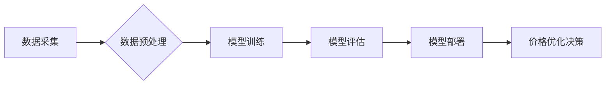

> 电商价格优化，人工智能，机器学习，深度学习，预测模型，需求预测，价格策略

## 1. 背景介绍

在当今激烈的电商市场竞争中，价格策略扮演着至关重要的角色。如何制定合理的定价策略，既能最大化利润，又能保持竞争力，是电商企业面临的重大挑战。传统定价方法往往依赖于经验和主观判断，难以适应市场变化的快速节奏。随着人工智能技术的快速发展，AI在电商价格优化领域展现出巨大的潜力，为电商企业提供了一种更加智能、高效的定价解决方案。

## 2. 核心概念与联系

**2.1 电商价格优化**

电商价格优化是指通过数据分析和算法模型，动态调整商品价格，以实现最大化利润的目标。它涉及到多个方面，包括需求预测、价格敏感度分析、竞争对手价格监测、促销活动规划等。

**2.2 人工智能 (AI)**

人工智能是指模拟人类智能行为的计算机系统。在电商价格优化领域，AI主要通过机器学习和深度学习算法，从海量数据中学习价格变化规律，并预测未来需求和价格趋势。

**2.3 机器学习 (ML)**

机器学习是人工智能的一个分支，它通过算法训练模型，使模型能够从数据中学习并做出预测。在电商价格优化中，常用的机器学习算法包括线性回归、逻辑回归、决策树、支持向量机等。

**2.4 深度学习 (DL)**

深度学习是机器学习的一个子领域，它使用多层神经网络来模拟人类大脑的学习过程。深度学习算法能够处理更复杂的数据，并取得更优的预测效果。在电商价格优化中，深度学习算法常用于需求预测和价格敏感度分析。

**2.5 核心架构**



## 3. 核心算法原理 & 具体操作步骤

**3.1 算法原理概述**

电商价格优化的核心算法原理是利用机器学习和深度学习算法，从历史销售数据、市场趋势、竞争对手价格等多方面信息中学习价格变化规律，并预测未来需求和价格趋势。

**3.2 算法步骤详解**

1. **数据采集:** 收集历史销售数据、市场趋势数据、竞争对手价格数据等相关信息。
2. **数据预处理:** 对收集到的数据进行清洗、转换、特征工程等处理，使其适合模型训练。
3. **模型选择:** 根据具体业务需求和数据特点，选择合适的机器学习或深度学习算法模型。
4. **模型训练:** 使用训练数据训练模型，并通过评估指标（如准确率、均方误差等）评估模型性能。
5. **模型部署:** 将训练好的模型部署到线上环境，用于实时价格优化决策。
6. **价格优化决策:** 根据模型预测结果，动态调整商品价格，以实现最大化利润的目标。

**3.3 算法优缺点**

**优点:**

* **数据驱动:** 基于数据分析和算法模型，决策更加客观和科学。
* **实时性:** 可以根据实时数据动态调整价格，适应市场变化。
* **效率:** 自动化价格优化流程，提高效率，降低人工成本。

**缺点:**

* **数据依赖:** 算法性能依赖于数据质量和数量。
* **模型复杂:** 需要专业的技术人员进行模型开发和维护。
* **解释性:** 一些深度学习模型的决策过程难以解释。

**3.4 算法应用领域**

* **电商平台:** 商品定价、促销活动规划、库存管理等。
* **旅游行业:** 机票、酒店、旅游套餐价格优化。
* **金融行业:** 贷款利率、保险费率等定价。
* **能源行业:** 电力、天然气价格预测和优化。

## 4. 数学模型和公式 & 详细讲解 & 举例说明

**4.1 数学模型构建**

在电商价格优化中，常用的数学模型包括线性回归模型、逻辑回归模型、支持向量机模型等。

**4.1.1 线性回归模型**

线性回归模型假设价格和销量之间存在线性关系，可以用以下公式表示：

$$
P = a + bQ
$$

其中：

* $P$ 是商品价格
* $Q$ 是商品销量
* $a$ 是截距
* $b$ 是价格系数

**4.1.2 逻辑回归模型**

逻辑回归模型用于预测商品销量是否超过某个阈值，可以用以下公式表示：

$$
P(Q > T) = \frac{1}{1 + e^{-(a + bP)}}
$$

其中：

* $P(Q > T)$ 是商品销量超过阈值 $T$ 的概率
* $a$ 和 $b$ 是模型参数
* $e$ 是自然对数的底数

**4.2 公式推导过程**

线性回归模型的系数 $a$ 和 $b$ 可以通过最小二乘法求解。逻辑回归模型的参数 $a$ 和 $b$ 可以通过最大似然估计法求解。

**4.3 案例分析与讲解**

假设一家电商平台销售一款商品，其历史销售数据如下表所示：

| 价格 (元) | 销量 (件) |
|---|---|
| 10 | 100 |
| 15 | 80 |
| 20 | 60 |
| 25 | 40 |

可以使用线性回归模型对价格和销量之间的关系进行建模。通过最小二乘法求解，得到模型参数 $a$ 和 $b$，并得到以下线性回归模型：

$$
P = 30 - 2Q
$$

该模型表明，当销量为 0 件时，价格为 30 元；当销量为 15 件时，价格为 15 元。

## 5. 项目实践：代码实例和详细解释说明

**5.1 开发环境搭建**

* 操作系统：Windows/Linux/macOS
* Python 版本：3.6+
* 必要的库：pandas, numpy, scikit-learn, matplotlib

**5.2 源代码详细实现**

```python
import pandas as pd
from sklearn.linear_model import LinearRegression

# 载入数据
data = pd.read_csv('sales_data.csv')

# 数据预处理
X = data[['Price']]
y = data['Sales']

# 创建线性回归模型
model = LinearRegression()

# 训练模型
model.fit(X, y)

# 预测销量
new_price = 20
predicted_sales = model.predict([[new_price]])

# 打印预测结果
print(f'当价格为 {new_price} 元时，预测销量为 {predicted_sales[0]} 件')
```

**5.3 代码解读与分析**

1. 导入必要的库。
2. 载入销售数据。
3. 将价格作为特征变量，销量作为目标变量。
4. 创建线性回归模型。
5. 使用训练数据训练模型。
6. 使用训练好的模型预测新的价格下的销量。
7. 打印预测结果。

**5.4 运行结果展示**

运行上述代码后，会输出预测销量结果。例如，如果数据中包含了价格为 20 元时的销量信息，那么预测结果将与实际销量相近。

## 6. 实际应用场景

**6.1 电商平台价格动态调整**

电商平台可以根据实时数据，如用户浏览量、购物车数量、竞争对手价格等，动态调整商品价格，以最大化利润。

**6.2 促销活动优化**

AI可以帮助电商平台优化促销活动，例如确定最佳促销时间、折扣力度和目标用户群体。

**6.3 个性化价格推荐**

根据用户的购买历史、浏览记录和偏好，AI可以为用户提供个性化的价格推荐，提高用户体验和转化率。

**6.4 库存管理优化**

AI可以预测未来商品需求，帮助电商平台优化库存管理，避免库存积压或缺货。

**6.5 未来应用展望**

随着人工智能技术的不断发展，AI在电商价格优化领域将有更广泛的应用场景，例如：

* **更精准的预测模型:** 利用更先进的深度学习算法，构建更精准的预测模型，提高价格优化效果。
* **更智能的决策系统:** 开发更智能的决策系统，能够自动根据市场变化和用户行为进行价格调整。
* **更个性化的价格策略:** 利用用户画像和行为分析，制定更个性化的价格策略，满足不同用户的需求。

## 7. 工具和资源推荐

**7.1 学习资源推荐**

* **书籍:**
    * 《机器学习》 - 周志华
    * 《深度学习》 - Ian Goodfellow
* **在线课程:**
    * Coursera: Machine Learning
    * Udacity: Deep Learning Nanodegree
* **博客和网站:**
    * Towards Data Science
    * Machine Learning Mastery

**7.2 开发工具推荐**

* **Python:** 广泛应用于机器学习和深度学习开发。
* **Scikit-learn:** Python机器学习库，提供多种算法模型和工具。
* **TensorFlow:** Google开发的开源深度学习框架。
* **PyTorch:** Facebook开发的开源深度学习框架。

**7.3 相关论文推荐**

* **Deep Learning for Recommender Systems**
* **Neural Collaborative Filtering**
* **Pricing Optimization with Deep Reinforcement Learning**

## 8. 总结：未来发展趋势与挑战

**8.1 研究成果总结**

AI在电商价格优化领域取得了显著的成果，能够帮助电商企业提高利润、降低成本、提升用户体验。

**8.2 未来发展趋势**

* **更精准的预测模型:** 利用更先进的深度学习算法，构建更精准的预测模型，提高价格优化效果。
* **更智能的决策系统:** 开发更智能的决策系统，能够自动根据市场变化和用户行为进行价格调整。
* **更个性化的价格策略:** 利用用户画像和行为分析，制定更个性化的价格策略，满足不同用户的需求。

**8.3 面临的挑战**

* **数据质量:** AI模型的性能依赖于数据质量，需要不断收集和清洗数据，保证数据准确性和完整性。
* **模型解释性:** 一些深度学习模型的决策过程难以解释，需要开发更可解释的模型，提高模型的透明度和可信度。
* **伦理问题:** AI价格优化可能会带来一些伦理问题，例如价格歧视和算法偏见，需要制定相应的规范和制度，确保AI技术应用的公平性和正义性。

**8.4 研究展望**

未来，AI在电商价格优化领域将继续发展，并与其他技术融合，例如自然语言处理、计算机视觉等，为电商企业提供更智能、更全面的解决方案。


## 9. 附录：常见问题与解答

**9.1 如何选择合适的机器学习算法？**

选择合适的机器学习算法取决于具体业务需求和数据特点。例如，如果数据量较大，可以使用深度学习算法；如果数据量较小，可以使用线性回归或逻辑回归算法。

**9.2 如何评估模型性能？**

常用的模型性能评估指标包括准确率、均方误差、R-squared等。

**9.3 如何处理缺失数据？**

常用的缺失数据处理方法包括删除缺失数据、用平均值或中位数填充缺失数据等。

**9.4 如何防止模型过拟合？**

常用的防止模型过拟合的方法包括正则化、交叉验证等。


作者：禅与计算机程序设计艺术 / Zen and the Art of Computer Programming 
<end_of_turn>