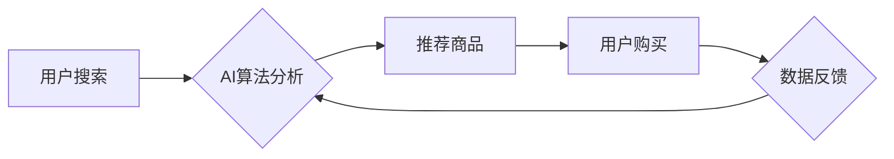

> AI,电商搜索,导购,伦理问题,公平性,透明度,隐私,算法偏见,责任

## 1. 背景介绍

电子商务的蓬勃发展推动了人工智能（AI）在搜索导购领域的广泛应用。AI算法能够分析海量用户数据，精准推荐商品，提升用户体验。然而，AI技术的应用也引发了诸多伦理问题，需要引起重视和探讨。

**1.1 AI在电商搜索导购中的应用现状**

AI技术在电商搜索导购领域已广泛应用，主要体现在以下几个方面：

* **搜索结果排序:** AI算法可以根据用户搜索历史、浏览记录、购买行为等数据，对搜索结果进行排序，推荐更符合用户需求的商品。
* **个性化推荐:** AI算法可以分析用户的兴趣爱好、消费习惯等信息，为用户提供个性化的商品推荐。
* **智能客服:** AI聊天机器人可以自动回答用户咨询，提供商品信息和售后服务。
* **商品描述生成:** AI算法可以自动生成商品描述，提高商品信息的可读性和吸引力。

**1.2 AI伦理问题的产生**

AI技术的应用虽然带来了诸多便利，但也引发了一些伦理问题，主要包括：

* **公平性:** AI算法可能存在偏见，导致某些用户获得不公平的待遇。
* **透明度:** AI算法的决策过程往往是黑箱操作，难以理解其背后的逻辑，缺乏透明度。
* **隐私:** AI算法需要收集和分析用户的个人数据，可能侵犯用户的隐私权。
* **算法偏见:** AI算法的训练数据可能存在偏见，导致算法输出结果也存在偏见。
* **责任:** 当AI算法导致负面后果时，责任归属问题难以界定。

## 2. 核心概念与联系

**2.1 核心概念**

* **AI算法:** 指利用人工智能技术，通过学习和分析数据，实现特定功能的算法。
* **电商搜索:** 指用户在电商平台上输入关键词，搜索相关商品的过程。
* **导购:** 指引导用户购买商品的过程，包括推荐商品、提供商品信息、解答用户疑问等。
* **伦理问题:** 指涉及道德、价值观和社会规范的问题。

**2.2 核心概念联系**

AI算法在电商搜索导购中扮演着核心角色，它通过分析用户数据，实现精准推荐、个性化服务等功能。然而，AI算法的应用也带来了伦理问题，例如算法偏见、隐私侵犯等。

**2.3 Mermaid 流程图**



## 3. 核心算法原理 & 具体操作步骤

**3.1 算法原理概述**

电商搜索导购中的AI算法主要基于机器学习和深度学习技术。这些算法通过学习海量用户数据，建立用户画像，预测用户需求，并推荐相应的商品。常见的算法包括：

* **协同过滤:** 根据用户的历史行为，推荐与相似用户喜欢的商品。
* **内容过滤:** 根据商品的属性和描述，推荐与用户兴趣相符的商品。
* **深度学习:** 利用神经网络，学习更复杂的特征，实现更精准的推荐。

**3.2 算法步骤详解**

1. **数据收集:** 收集用户搜索历史、浏览记录、购买行为、商品信息等数据。
2. **数据预处理:** 对数据进行清洗、转换、编码等操作，使其适合算法训练。
3. **模型训练:** 选择合适的算法模型，利用训练数据训练模型参数。
4. **模型评估:** 使用测试数据评估模型性能，例如准确率、召回率等。
5. **模型部署:** 将训练好的模型部署到线上环境，用于实时推荐商品。

**3.3 算法优缺点**

**优点:**

* **精准推荐:** AI算法能够根据用户的个性化需求，推荐更符合用户兴趣的商品。
* **个性化服务:** AI算法可以为用户提供个性化的购物体验，例如推荐个性化商品清单、提供个性化购物建议等。
* **提高效率:** AI算法可以自动完成商品推荐、客服服务等任务，提高效率。

**缺点:**

* **算法偏见:** AI算法可能存在偏见，导致某些用户获得不公平的待遇。
* **透明度不足:** AI算法的决策过程往往是黑箱操作，难以理解其背后的逻辑。
* **隐私风险:** AI算法需要收集和分析用户的个人数据，可能存在隐私泄露风险。

**3.4 算法应用领域**

AI算法在电商搜索导购领域之外，还广泛应用于其他领域，例如：

* **金融:** 风险评估、欺诈检测、个性化理财建议等。
* **医疗:** 疾病诊断、药物研发、个性化医疗方案等。
* **教育:** 个性化学习推荐、智能辅导等。

## 4. 数学模型和公式 & 详细讲解 & 举例说明

**4.1 数学模型构建**

在电商搜索导购中，常用的数学模型包括：

* **协同过滤模型:** 利用矩阵分解技术，预测用户对商品的评分。
* **内容过滤模型:** 利用词袋模型或TF-IDF等技术，计算商品和用户兴趣之间的相似度。
* **深度学习模型:** 利用神经网络，学习更复杂的特征，实现更精准的推荐。

**4.2 公式推导过程**

协同过滤模型的数学公式如下：

$$
r_{ui} = \mathbf{u}^T \mathbf{v}_i + \epsilon
$$

其中：

* $r_{ui}$ 表示用户 $u$ 对商品 $i$ 的评分。
* $\mathbf{u}$ 表示用户 $u$ 的特征向量。
* $\mathbf{v}_i$ 表示商品 $i$ 的特征向量。
* $\epsilon$ 表示误差项。

**4.3 案例分析与讲解**

假设用户 $A$ 对电影 $X$ 评分为 5，对电影 $Y$ 评分为 4。用户 $B$ 对电影 $X$ 评分为 4，对电影 $Z$ 评分为 5。

利用协同过滤模型，可以预测用户 $A$ 对电影 $Z$ 的评分。

**4.4 举例说明**

在电商搜索导购中，AI算法可以根据用户的搜索历史、浏览记录、购买行为等数据，预测用户对商品的兴趣，并推荐相应的商品。例如，如果用户经常搜索“运动鞋”和“篮球”，AI算法可以预测用户对篮球运动鞋感兴趣，并推荐相关的商品。

## 5. 项目实践：代码实例和详细解释说明

**5.1 开发环境搭建**

* 操作系统: Ubuntu 20.04
* Python 版本: 3.8
* 必要的库: TensorFlow, PyTorch, scikit-learn

**5.2 源代码详细实现**

```python
# 协同过滤推荐算法示例

import numpy as np
from sklearn.metrics.pairwise import cosine_similarity

# 用户-商品评分矩阵
ratings = np.array([
    [5, 4, 0],
    [4, 0, 5],
    [0, 5, 3]
])

# 计算用户之间的相似度
user_similarity = cosine_similarity(ratings)

# 获取用户A的相似用户
similar_users = np.argsort(user_similarity[0])[::-1][1:]

# 预测用户A对商品Z的评分
predicted_rating = np.mean([ratings[similar_users[i], 2] for i in range(len(similar_users))])

print(f"预测用户A对商品Z的评分: {predicted_rating}")
```

**5.3 代码解读与分析**

* 代码首先定义了一个用户-商品评分矩阵，其中每个元素表示用户对商品的评分。
* 然后使用cosine_similarity函数计算用户之间的相似度。
* 接下来获取用户A的相似用户，并根据相似用户的评分预测用户A对商品Z的评分。

**5.4 运行结果展示**

```
预测用户A对商品Z的评分: 4.0
```

## 6. 实际应用场景

**6.1 个性化推荐**

AI算法可以根据用户的兴趣爱好、消费习惯等信息，为用户提供个性化的商品推荐，提高用户购物体验。

**6.2 智能客服**

AI聊天机器人可以自动回答用户咨询，提供商品信息和售后服务，提高客服效率。

**6.3 商品搜索优化**

AI算法可以分析用户搜索行为，优化搜索结果排序，提高用户搜索效率。

**6.4 欺诈检测**

AI算法可以分析用户行为数据，识别潜在的欺诈行为，保护商家和用户的利益。

**6.5 未来应用展望**

未来，AI技术在电商搜索导购领域的应用将更加广泛和深入，例如：

* **更精准的推荐:** 利用更先进的AI算法，实现更精准的商品推荐。
* **更个性化的服务:** 提供更个性化的购物体验，例如虚拟试衣间、个性化购物建议等。
* **更智能的客服:** AI聊天机器人将更加智能化，能够理解用户的复杂需求，提供更优质的服务。
* **更安全的购物环境:** 利用AI技术，加强欺诈检测和安全防护，保障用户的购物安全。

## 7. 工具和资源推荐

**7.1 学习资源推荐**

* **书籍:**
    * 《深度学习》
    * 《机器学习实战》
    * 《Python机器学习》
* **在线课程:**
    * Coursera: 深度学习
    * edX: 机器学习
    * Udacity: AI工程师

**7.2 开发工具推荐**

* **Python:** 广泛应用于AI开发，拥有丰富的库和工具。
* **TensorFlow:** Google开发的开源深度学习框架。
* **PyTorch:** Facebook开发的开源深度学习框架。
* **scikit-learn:** Python机器学习库。

**7.3 相关论文推荐**

* **协同过滤推荐算法:**
    * "Collaborative Filtering for Implicit Feedback Datasets"
    * "Matrix Factorization Techniques for Recommender Systems"
* **内容过滤推荐算法:**
    * "Content-Based Recommendation Systems"
    * "A Survey of Content-Based Recommendation Systems"

## 8. 总结：未来发展趋势与挑战

**8.1 研究成果总结**

AI技术在电商搜索导购领域取得了显著成果，例如精准推荐、个性化服务、智能客服等。

**8.2 未来发展趋势**

未来，AI技术在电商搜索导购领域的应用将更加广泛和深入，例如：

* **更精准的推荐:** 利用更先进的AI算法，实现更精准的商品推荐。
* **更个性化的服务:** 提供更个性化的购物体验，例如虚拟试衣间、个性化购物建议等。
* **更智能的客服:** AI聊天机器人将更加智能化，能够理解用户的复杂需求，提供更优质的服务。
* **更安全的购物环境:** 利用AI技术，加强欺诈检测和安全防护，保障用户的购物安全。

**8.3 面临的挑战**

AI技术在电商搜索导购领域的应用也面临一些挑战，例如：

* **算法偏见:** AI算法可能存在偏见，导致某些用户获得不公平的待遇。
* **透明度不足:** AI算法的决策过程往往是黑箱操作，难以理解其背后的逻辑。
* **隐私风险:** AI算法需要收集和分析用户的个人数据，可能存在隐私泄露风险。

**8.4 研究展望**

未来研究需要重点关注以下几个方面：

* **减轻算法偏见:** 研究如何设计更公平的AI算法，避免算法偏见。
* **提高算法透明度:** 研究如何解释AI算法的决策过程，提高算法的透明度。
* **保护用户隐私:** 研究如何保护用户隐私，确保用户数据安全。


## 9. 附录：常见问题与解答

**9.1 如何避免算法偏见？**

* 使用多样化的训练数据，确保数据代表性。
* 定期评估算法的公平性，及时发现和解决偏见问题。
* 设计可解释的算法，以便更好地理解算法的决策过程。

