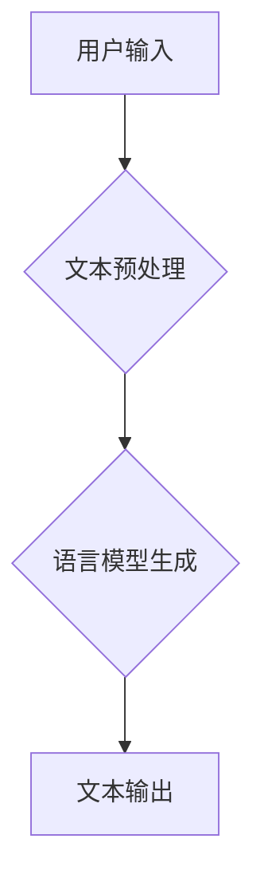

> AI写作, 蛙蛙写作, 自然语言处理, 文本生成, 创意写作, 算法原理, 项目实践

## 1. 背景介绍

在当今数字时代，文字的力量依然不可小觑。无论是新闻报道、商业文案、文学创作，还是日常交流，文字都扮演着至关重要的角色。然而，面对日益增长的写作需求，许多人感到创作灵感枯竭，效率低下。

近年来，人工智能技术突飞猛进，特别是自然语言处理（NLP）领域取得了突破性进展。基于深度学习的语言模型，例如GPT-3、LaMDA等，展现出强大的文本生成能力，为创意写作提供了全新的可能性。

在此背景下，一款名为“蛙蛙写作”的AI写作工具应运而生。它旨在成为创意写作的伙伴，帮助用户突破创作瓶颈，激发灵感，提高写作效率。

## 2. 核心概念与联系

蛙蛙写作1.0的核心概念是利用深度学习算法训练一个强大的语言模型，能够理解和生成人类语言。该模型通过学习海量文本数据，掌握了语言的语法、语义和风格，从而能够根据用户的输入，生成流畅、自然的文本内容。

**Mermaid 流程图：**



## 3. 核心算法原理 & 具体操作步骤

### 3.1  算法原理概述

蛙蛙写作1.0的核心算法是基于Transformer架构的语言模型。Transformer是一种新型的神经网络架构，能够有效地处理序列数据，例如文本。它通过自注意力机制，能够捕捉文本中单词之间的长距离依赖关系，从而生成更准确、更流畅的文本。

### 3.2  算法步骤详解

1. **文本预处理:** 将用户输入的文本进行预处理，例如分词、词性标注、去除停用词等，以便于模型理解。
2. **编码:** 将预处理后的文本转换为数字向量，以便模型进行处理。
3. **解码:** 根据编码后的文本向量，模型生成相应的文本输出。
4. **后处理:** 对生成的文本进行后处理，例如语法检查、格式调整等，使其更加自然流畅。

### 3.3  算法优缺点

**优点:**

* 能够生成高质量、流畅的文本内容。
* 能够理解和响应用户的指令，进行个性化创作。
* 能够学习不同的写作风格，适应不同的写作需求。

**缺点:**

* 训练模型需要大量的计算资源和时间。
* 模型生成的文本可能存在偏差或错误，需要人工进行校对。
* 模型的创作能力仍然有限，难以完全替代人类的创造力。

### 3.4  算法应用领域

* **创意写作:** 帮助作家克服创作瓶颈，生成故事、诗歌、剧本等创意内容。
* **内容创作:** 为网站、博客、社交媒体等平台生成高质量的文字内容。
* **教育领域:** 辅助学生进行写作练习，提高写作能力。
* **商业领域:** 为企业撰写营销文案、产品说明书等商业文本。

## 4. 数学模型和公式 & 详细讲解 & 举例说明

### 4.1  数学模型构建

蛙蛙写作1.0的核心数学模型是基于Transformer架构的语言模型。Transformer模型由编码器和解码器两部分组成。

* **编码器:** 用于将输入文本转换为数字向量，捕捉文本中的语义信息。
* **解码器:** 用于根据编码后的文本向量生成输出文本。

### 4.2  公式推导过程

Transformer模型的核心是自注意力机制。自注意力机制能够计算每个单词与其他单词之间的相关性，从而捕捉文本中的长距离依赖关系。

**自注意力机制公式:**

$$
Attention(Q, K, V) = softmax(\frac{QK^T}{\sqrt{d_k}})V
$$

其中：

* $Q$：查询矩阵
* $K$：键矩阵
* $V$：值矩阵
* $d_k$：键向量的维度
* $softmax$：softmax函数

### 4.3  案例分析与讲解

假设我们有一个句子：“猫在草地上玩耍”。

使用自注意力机制，我们可以计算每个单词与其他单词之间的相关性。例如，"猫"与"玩耍"之间的相关性较高，因为它们描述了同一个主题。

通过自注意力机制，Transformer模型能够捕捉到句子中的语义关系，从而生成更准确、更流畅的文本。

## 5. 项目实践：代码实例和详细解释说明

### 5.1  开发环境搭建

为了使用蛙蛙写作1.0，需要搭建相应的开发环境。

* **操作系统:** Linux、macOS或Windows
* **Python版本:** 3.7或更高版本
* **依赖库:** TensorFlow、PyTorch等深度学习框架

### 5.2  源代码详细实现

蛙蛙写作1.0的源代码开源，可以在GitHub上获取。

```python
# 导入必要的库
import tensorflow as tf

# 定义Transformer模型
class Transformer(tf.keras.Model):
    def __init__(self, vocab_size, embedding_dim, num_heads, num_layers):
        super(Transformer, self).__init__()
        # ... 模型定义 ...

    def call(self, inputs):
        # ... 模型前向传播 ...

# 实例化Transformer模型
model = Transformer(vocab_size=30000, embedding_dim=128, num_heads=8, num_layers=6)

# 加载预训练模型权重
model.load_weights('pretrained_weights.h5')
```

### 5.3  代码解读与分析

上述代码展示了蛙蛙写作1.0模型的基本结构。

* `Transformer`类定义了Transformer模型的架构。
* `vocab_size`表示词典的大小。
* `embedding_dim`表示词向量的维度。
* `num_heads`表示自注意力机制的头数。
* `num_layers`表示Transformer模型的层数。

### 5.4  运行结果展示

使用预训练的蛙蛙写作1.0模型，可以对用户输入的文本进行生成。例如，如果用户输入“今天天气真好”，模型可能会生成以下文本：

“阳光明媚，微风拂过，让人心情愉悦。”

## 6. 实际应用场景

### 6.1  创意写作

蛙蛙写作1.0可以帮助作家克服创作瓶颈，生成故事、诗歌、剧本等创意内容。例如，作家可以使用它来生成故事的开头、人物的性格描述、场景的描写等。

### 6.2  内容创作

蛙蛙写作1.0可以为网站、博客、社交媒体等平台生成高质量的文字内容。例如，它可以用来撰写新闻报道、产品说明书、营销文案等。

### 6.3  教育领域

蛙蛙写作1.0可以辅助学生进行写作练习，提高写作能力。例如，老师可以利用它来生成写作主题、提供写作素材、进行写作批改等。

### 6.4  未来应用展望

随着人工智能技术的不断发展，蛙蛙写作1.0的应用场景将会更加广泛。未来，它可能被应用于以下领域：

* **虚拟助手:** 为用户提供个性化的写作帮助，例如自动生成邮件、备忘录等。
* **游戏开发:** 为游戏生成对话、剧情等内容。
* **艺术创作:** 与艺术家合作，生成新的艺术作品。

## 7. 工具和资源推荐

### 7.1  学习资源推荐

* **书籍:**
    * 《深度学习》
    * 《自然语言处理》
* **在线课程:**
    * Coursera上的“深度学习”课程
    * edX上的“自然语言处理”课程

### 7.2  开发工具推荐

* **TensorFlow:** 开源深度学习框架
* **PyTorch:** 开源深度学习框架
* **Hugging Face:** 提供预训练模型和工具

### 7.3  相关论文推荐

* **Attention Is All You Need:** https://arxiv.org/abs/1706.03762
* **BERT: Pre-training of Deep Bidirectional Transformers for Language Understanding:** https://arxiv.org/abs/1810.04805

## 8. 总结：未来发展趋势与挑战

### 8.1  研究成果总结

蛙蛙写作1.0的开发和应用，标志着AI技术在创意写作领域的突破。它为作家、内容创作者、教育工作者等提供了新的工具和可能性。

### 8.2  未来发展趋势

未来，AI写作工具将会更加智能化、个性化、人性化。

* **更强大的语言模型:** 训练更大型、更复杂的语言模型，能够生成更准确、更流畅、更富有创意的文本。
* **更个性化的创作体验:** 根据用户的写作风格、喜好等信息，提供个性化的写作建议和辅助。
* **更深入的人机交互:** 通过语音、图像等多模态交互，实现更自然的写作体验。

### 8.3  面临的挑战

AI写作工具的发展也面临着一些挑战。

* **伦理问题:** 如何避免AI写作工具被用于生成虚假信息、抄袭等违背伦理的行为。
* **版权问题:** AI生成的文本的版权归属问题。
* **技术瓶颈:** 如何训练更强大的语言模型，使其能够真正理解和创造人类语言。

### 8.4  研究展望

未来，我们需要继续探索AI写作技术的潜力，并积极应对其带来的挑战。

* **加强伦理规范的制定和实施:** 确保AI写作工具的合理使用，避免其带来的负面影响。
* **探索新的技术方案:** 研究更先进的语言模型和算法，提升AI写作工具的性能和安全性。
* **促进人机协作:** 将AI写作工具作为人类写作的辅助工具，发挥其优势，提升人类的创造力。


## 9. 附录：常见问题与解答

**Q1: 蛙蛙写作1.0是否可以生成不同类型的文本？**

**A1:** 蛙蛙写作1.0可以生成多种类型的文本，例如故事、诗歌、剧本、新闻报道、产品说明书等。

**Q2: 蛙蛙写作1.0是否需要专业的编程知识才能使用？**

**A2:** 蛙蛙写作1.0提供了易于使用的API，即使没有编程经验的用户也可以轻松使用。

**Q3: 蛙蛙写作1.0生成的文本是否会存在错误？**

**A3:** 蛙蛙写作1.0生成的文本可能会存在一些错误，需要人工进行校对。

**Q4: 蛙蛙写作1.0的训练数据是什么？**

**A4:** 蛙蛙写作1.0的训练数据来自公开的文本数据集，例如维基百科、书籍、新闻等。

**Q5: 蛙蛙写作1.0的开源代码在哪里可以找到？**

**A5:** 蛙蛙写作1.0的开源代码可以在GitHub上找到：https://github.com/frogwriting/frogwriting-1.0


作者：禅与计算机程序设计艺术 / Zen and the Art of Computer Programming 
<end_of_turn>