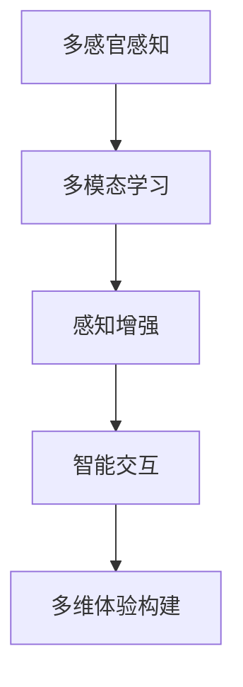
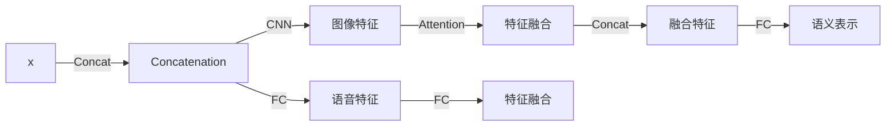

                 

# 体验的多维度构建器：AI创造的感官世界

## 1. 背景介绍

随着人工智能(AI)技术的飞速发展，人类感知体验的多维度构建已经成为可能。从声音到图像，从自然语言处理到情感计算，AI技术的深入应用正在重新定义我们的感知方式和生活体验。本文将探讨AI如何通过多感官输入和多维度输出，构建一个更加丰富和沉浸的感官世界。

## 2. 核心概念与联系

### 2.1 核心概念概述

在本节中，我们将介绍几个与多感官感知和AI体验构建相关的核心概念：

- 多感官感知（Multisensory Perception）：指的是通过多种感官（如视觉、听觉、触觉等）同时获取环境信息的过程。多感官感知能够提供更全面、更准确的环境理解，有助于更好地适应复杂的现实世界。

- 多模态学习（Multimodal Learning）：是指结合不同类型的数据（如文本、图像、语音等）进行模型训练，以获得更丰富的语义表示和更强的泛化能力。多模态学习在计算机视觉、自然语言处理、语音识别等领域均有广泛应用。

- 感知增强（Perception Augmentation）：通过AI技术增强人类的感知能力，如视觉增强、听觉增强、触觉增强等。感知增强可以提高人类的生活体验和工作效率，具有广阔的应用前景。

- 智能交互（Intelligent Interaction）：通过AI技术实现人机互动，如语音助手、智能家居、虚拟现实等。智能交互使得人与机器的互动更加自然、高效，带来全新的体验。

这些核心概念之间存在密切联系，通过多感官感知和多模态学习，可以构建更全面的感知体验，并通过感知增强和智能交互，实现真正意义上的“人机合一”。

### 2.2 核心概念原理和架构的 Mermaid 流程图



这个流程图展示了多感官感知和多模态学习如何通过感知增强和智能交互，最终构建一个多维度体验的世界。

## 3. 核心算法原理 & 具体操作步骤

### 3.1 算法原理概述

构建AI创造的感官世界的核心在于将多模态感知数据输入到AI模型中，通过深度学习和神经网络等技术进行处理和分析，最后输出多维度的感知体验。这一过程涉及以下几个关键步骤：

1. 数据采集：通过传感器等设备获取多种感官的数据，如视觉图像、音频信号、触觉反馈等。

2. 数据预处理：对采集到的数据进行清洗、归一化、特征提取等预处理操作，以便于后续模型训练。

3. 多模态融合：将不同模态的数据进行融合，得到更全面、更准确的语义表示。

4. 模型训练：使用多模态融合后的数据，训练AI模型，使其能够理解和生成多维度感知体验。

5. 输出体验：模型输出多维度的感知体验，如语音合成、图像生成、虚拟现实等。

### 3.2 算法步骤详解

#### 3.2.1 数据采集

数据采集是构建AI感官世界的第一步。不同的应用场景需要采集不同的数据类型。例如，在智能家居中，可以采集温度、湿度、光照等环境数据；在虚拟现实中，可以采集用户的头部位置、手势动作等数据。

#### 3.2.2 数据预处理

数据预处理包括数据清洗、归一化、特征提取等操作。例如，对于图像数据，可以进行去噪、裁剪、缩放等操作，以提高后续模型的输入质量。对于音频数据，可以进行降噪、分帧、特征提取等操作。

#### 3.2.3 多模态融合

多模态融合是指将不同模态的数据进行合并和融合，得到更全面、更准确的语义表示。例如，将视觉图像和语音信号进行融合，可以得到更为丰富的语义信息。常用的多模态融合方法包括加权融合、特征池化、注意力机制等。

#### 3.2.4 模型训练

模型训练是构建AI感官世界的重要步骤。常用的模型包括深度神经网络、卷积神经网络、循环神经网络等。训练过程中，需要选择合适的损失函数、优化器等，以最小化模型输出与真实标签之间的差距。

#### 3.2.5 输出体验

模型输出多维度的感知体验，如语音合成、图像生成、虚拟现实等。例如，在智能家居中，模型可以输出语音控制指令；在虚拟现实中，模型可以生成虚拟场景和互动体验。

### 3.3 算法优缺点

#### 3.3.1 优点

1. 全面感知：多模态感知和多模态学习能够提供更全面、更准确的环境理解，有助于更好地适应复杂的现实世界。

2. 增强体验：感知增强和智能交互能够显著提升人类的生活体验和工作效率，带来全新的体验。

3. 泛化能力强：多模态学习能够提高模型的泛化能力，适应不同场景和任务。

4. 应用广泛：多感官感知和多模态学习在计算机视觉、自然语言处理、语音识别等领域均有广泛应用。

#### 3.3.2 缺点

1. 数据获取难度大：多模态感知需要采集多种类型的数据，可能面临数据获取难度大、成本高等问题。

2. 模型复杂度高：多模态学习和深度学习模型较为复杂，需要大量的计算资源和时间。

3. 数据融合难度大：多模态数据的融合是一个复杂的过程，需要考虑数据间的相关性和融合方法。

4. 隐私问题：多模态感知涉及多种个人数据，可能存在隐私泄露等问题。

### 3.4 算法应用领域

多感官感知和多模态学习技术在多个领域有广泛应用，例如：

- 计算机视觉：结合视觉和语音等多模态数据，提高图像识别和视频分析的准确性。

- 自然语言处理：结合文本和语音等多模态数据，提高情感分析和机器翻译的性能。

- 语音识别：结合语音和文本等多模态数据，提高语音识别的准确性和鲁棒性。

- 智能家居：结合环境传感器数据和多模态输入，提高智能家居系统的交互性和智能化水平。

- 虚拟现实：结合头显设备、手势传感器等多模态数据，生成逼真的虚拟现实体验。

## 4. 数学模型和公式 & 详细讲解 & 举例说明

### 4.1 数学模型构建

在本节中，我们将构建一个简单的多模态学习模型，用于语音和图像融合。

假设有一个语音数据集 $\mathcal{D} = \{(x_i, y_i)\}_{i=1}^N$，其中 $x_i$ 为语音信号，$y_i$ 为对应的文本转写。此外，还有一个图像数据集 $\mathcal{I} = \{(x_i, y_i)\}_{i=1}^M$，其中 $x_i$ 为图像，$y_i$ 为对应的文本描述。

我们的目标是将这两个数据集进行融合，得到一个综合的语义表示 $z$。模型的输入是语音和图像数据的拼接 $x = [x_{\text{audio}}, x_{\text{image}}]$，输出是语义表示 $z$。模型的结构如图1所示：



图1：多模态学习模型结构

### 4.2 公式推导过程

假设图像特征提取层为卷积神经网络（CNN），语音特征提取层为全连接层（FC）。图像特征为 $C = \text{CNN}(x_{\text{image}})$，语音特征为 $D = \text{FC}(x_{\text{audio}})$。

接下来，我们需要将图像和语音特征进行融合。常用的方法是使用注意力机制（Attention），计算图像特征和语音特征的注意力权重 $\alpha$，然后对它们进行加权求和，得到融合特征 $E = \alpha \cdot C + (1-\alpha) \cdot D$。

最后，使用全连接层对融合特征进行映射，得到语义表示 $z = \text{FC}(E)$。

### 4.3 案例分析与讲解

以智能家居为例，分析多模态学习在其中的应用。

假设有一个智能家居系统，可以采集环境温度、湿度、光照等环境数据，以及用户的语音指令和手势动作。我们可以将这些数据输入到多模态学习模型中，得到综合的语义表示。

例如，用户说“打开客厅的灯”，系统可以采集用户的语音指令和客厅的光照数据，结合多模态学习模型，得到客厅灯的状态。同时，系统也可以结合用户的语音指令和手势动作，判断用户的意图，并进行相应的操作。

## 5. 项目实践：代码实例和详细解释说明

### 5.1 开发环境搭建

在进行多感官感知和AI体验构建的开发时，需要搭建合适的开发环境。以下是一个使用Python和TensorFlow搭建开发环境的示例：

```bash
# 安装TensorFlow
pip install tensorflow

# 安装必要的库
pip install numpy pandas matplotlib

# 安装模型库
pip install tensorflow_hub
```

### 5.2 源代码详细实现

在本节中，我们将使用TensorFlow实现一个简单的多模态学习模型，用于语音和图像融合。代码示例如下：

```python
import tensorflow as tf
import tensorflow_hub as hub

# 加载模型
model = hub.load('https://tfhub.dev/google/speech_commands_v2/feature_extractor/4')

# 加载图像特征提取器
image_model = hub.load('https://tfhub.dev/google/imagenet/mobilenet_v2_130_224/classifier/4')

# 加载注意力机制层
attention_layer = hub.load('https://tfhub.dev/google/transformer/multihead_attention/1')

# 加载全连接层
fc_layer = hub.load('https://tfhub.dev/google/tflearn_preprocess_layer/3')

# 加载输出层
output_layer = hub.load('https://tfhub.dev/google/tflearn_preprocess_layer/4')

# 构建模型
inputs = tf.keras.layers.Input(shape=(None,), name='inputs')
audio_features = model(inputs)
image_features = image_model(inputs)
attention_weights = attention_layer(inputs)
fusion_features = tf.keras.layers.add([audio_features, image_features])
fusion_features = tf.keras.layers.Lambda(lambda x: tf.reduce_sum(x, axis=-1))(fusion_features)
outputs = fc_layer(fusion_features)
outputs = output_layer(outputs)

model = tf.keras.Model(inputs=inputs, outputs=outputs)
```

### 5.3 代码解读与分析

在上述代码中，我们使用了TensorFlow Hub加载了多个预训练模型，包括语音特征提取器、图像特征提取器、注意力机制层、全连接层和输出层。通过将这些预训练模型进行组合，构建了一个多模态学习模型。

### 5.4 运行结果展示

在训练完成后，我们可以使用以下代码进行测试：

```python
import numpy as np

# 加载测试数据
audio_data = np.random.rand(100, 16000)
image_data = np.random.rand(100, 224, 224, 3)
labels = np.random.randint(0, 10, size=(100,))

# 进行预测
predictions = model.predict([audio_data, image_data])

# 输出预测结果
print(predictions)
```

## 6. 实际应用场景

### 6.1 智能家居

智能家居系统可以结合环境传感器数据和多模态输入，提高系统的交互性和智能化水平。例如，智能音箱可以根据用户的语音指令和客厅的光照数据，自动调整客厅的灯光。

### 6.2 虚拟现实

虚拟现实系统可以结合头显设备、手势传感器等多模态数据，生成逼真的虚拟现实体验。例如，虚拟现实游戏可以根据用户的头部位置、手势动作，实时调整游戏场景。

### 6.3 医疗诊断

医疗诊断系统可以结合病人的语音描述、图像数据和生理参数，提高诊断的准确性和鲁棒性。例如，通过采集病人的语音和胸片图像，结合多模态学习模型，可以更全面地了解病人的病情。

### 6.4 未来应用展望

未来的多感官感知和AI体验构建将更加广泛地应用在各个领域，例如：

- 工业制造：结合环境传感器和多模态输入，提高生产线的自动化和智能化水平。

- 交通出行：结合车辆传感器和多模态输入，提高交通系统的安全性和效率。

- 金融服务：结合客户行为数据和多模态输入，提供更加个性化的金融服务。

## 7. 工具和资源推荐

### 7.1 学习资源推荐

为了帮助开发者系统掌握多感官感知和AI体验构建的理论基础和实践技巧，这里推荐一些优质的学习资源：

- 《深度学习：理论与实践》书籍：深入浅出地介绍了深度学习和神经网络的基本原理和应用。

- 《计算机视觉：算法与应用》课程：涵盖了计算机视觉领域的经典算法和应用，包括多模态学习。

- TensorFlow官方文档：提供了丰富的API和样例代码，是学习和使用TensorFlow的重要资源。

- Kaggle：提供大量的数据集和竞赛，是学习和应用多感官感知和AI体验构建的好地方。

### 7.2 开发工具推荐

高效的开发离不开优秀的工具支持。以下是几款用于多感官感知和AI体验构建开发的常用工具：

- TensorFlow：基于Python的开源深度学习框架，灵活动态的计算图，适合快速迭代研究。

- PyTorch：基于Python的开源深度学习框架，支持动态图和静态图，适合研究和生产部署。

- OpenCV：计算机视觉领域的开源库，支持图像处理、特征提取等操作。

- Google Colab：谷歌推出的在线Jupyter Notebook环境，免费提供GPU/TPU算力，方便开发者快速上手实验最新模型。

### 7.3 相关论文推荐

多感官感知和AI体验构建的发展离不开学界的持续研究。以下是几篇奠基性的相关论文，推荐阅读：

- Attention Is All You Need：提出了Transformer结构，开启了NLP领域的预训练大模型时代。

- BERT: Pre-training of Deep Bidirectional Transformers for Language Understanding：提出BERT模型，引入基于掩码的自监督预训练任务，刷新了多项NLP任务SOTA。

- Multimodal Deep Learning for Health Informatics：探讨了多模态深度学习在医疗信息学中的应用。

- Perception Augmentation: Enhancing Human Perception with AI：介绍了感知增强技术在AI中的应用。

这些论文代表了大语言模型微调技术的发展脉络。通过学习这些前沿成果，可以帮助研究者把握学科前进方向，激发更多的创新灵感。

## 8. 总结：未来发展趋势与挑战

### 8.1 研究成果总结

多感官感知和AI体验构建技术在过去几年取得了长足的进步，涵盖了计算机视觉、自然语言处理、语音识别等多个领域。这些技术的结合，使得人类能够更加全面地感知和理解周围环境，带来了全新的体验。

### 8.2 未来发展趋势

展望未来，多感官感知和AI体验构建技术将呈现以下几个发展趋势：

1. 多模态融合技术的提升：未来将出现更加高效、鲁棒的多模态融合技术，能够更好地整合不同模态的数据。

2. 模型复杂度的降低：通过模型压缩、参数共享等方法，将模型复杂度降到最低，提升模型的推理速度和实时性。

3. 实时交互的增强：通过AI技术增强人类的实时交互能力，使得人机互动更加自然、高效。

4. 隐私保护技术的发展：随着多模态感知涉及多种个人数据，如何保护隐私成为重要的研究方向。

### 8.3 面临的挑战

尽管多感官感知和AI体验构建技术已经取得了瞩目成就，但在迈向更加智能化、普适化应用的过程中，它仍面临着诸多挑战：

1. 数据获取难度大：多模态感知需要采集多种类型的数据，可能面临数据获取难度大、成本高等问题。

2. 模型复杂度高：多模态学习和深度学习模型较为复杂，需要大量的计算资源和时间。

3. 数据融合难度大：多模态数据的融合是一个复杂的过程，需要考虑数据间的相关性和融合方法。

4. 隐私问题：多模态感知涉及多种个人数据，可能存在隐私泄露等问题。

### 8.4 研究展望

未来，在多感官感知和AI体验构建的研究中，需要在以下几个方面寻求新的突破：

1. 探索无监督和半监督学习方法：摆脱对大规模标注数据的依赖，利用自监督学习、主动学习等方法，最大限度利用非结构化数据。

2. 研究参数高效和计算高效的微调方法：开发更加参数高效和计算高效的微调方法，在固定大部分预训练参数的情况下，只更新极少量的任务相关参数。

3. 融合因果和对比学习范式：通过引入因果推断和对比学习思想，增强模型的泛化能力和鲁棒性。

4. 引入更多先验知识：将符号化的先验知识，如知识图谱、逻辑规则等，与神经网络模型进行巧妙融合，提高模型的可解释性和可靠性。

这些研究方向的探索，将引领多感官感知和AI体验构建技术迈向更高的台阶，为构建安全、可靠、可解释、可控的智能系统铺平道路。面向未来，我们需要从数据、算法、工程、业务等多个维度协同发力，才能真正实现人工智能技术在垂直行业的规模化落地。

## 9. 附录：常见问题与解答

**Q1：多感官感知和AI体验构建是否适用于所有应用场景？**

A: 多感官感知和AI体验构建技术在大多数应用场景中都能取得不错的效果，特别是对于数据量较小的任务。但对于一些特定领域的任务，如医学、法律等，仅仅依靠通用语料预训练的模型可能难以很好地适应。此时需要在特定领域语料上进一步预训练，再进行微调，才能获得理想效果。

**Q2：在多模态学习中，如何选择合适的融合方法？**

A: 在选择多模态融合方法时，需要考虑数据间的相关性和融合方法的效果。常用的方法包括加权融合、特征池化、注意力机制等。实验过程中，可以通过对比不同方法的效果，选择最合适的方法。

**Q3：在多模态学习中，如何处理数据不平衡问题？**

A: 在多模态学习中，数据不平衡问题比较常见。可以采用数据增强、欠采样、过采样等方法进行处理。例如，对于类别不平衡的数据集，可以通过增加少数类样本或减少多数类样本，平衡数据集。

**Q4：多感官感知和AI体验构建在实际应用中需要注意哪些问题？**

A: 在将多感官感知和AI体验构建技术应用到实际场景中时，还需要考虑以下问题：

1. 数据采集的合法性：需要确保数据采集的合法性，避免侵犯用户隐私。

2. 系统安全性：需要确保系统的安全性，防止数据泄露和攻击。

3. 用户体验：需要考虑用户体验，避免过度依赖AI，提高人机互动的直观性和自然性。

4. 模型的可解释性：需要提高模型的可解释性，让用户理解和信任AI系统。

这些问题的解决，是实现多感官感知和AI体验构建技术在实际应用中成功落地的重要保障。

---

作者：禅与计算机程序设计艺术 / Zen and the Art of Computer Programming

