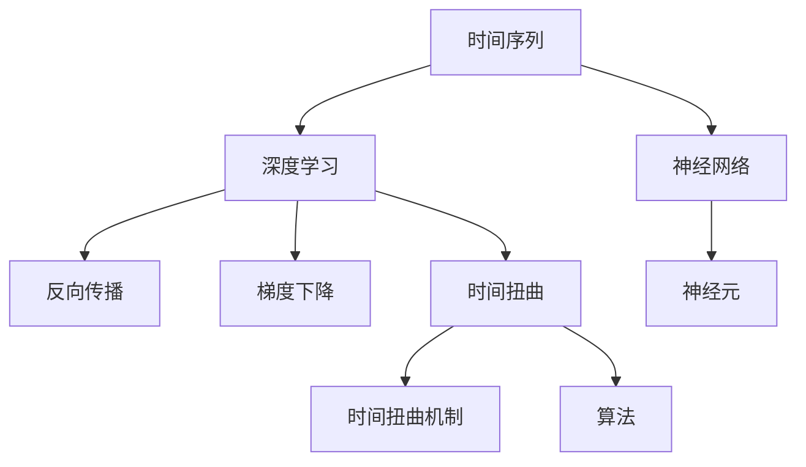

                 

# 体验的时间扭曲：AI创造的主观时间

> 关键词：人工智能,时间扭曲,主观时间,深度学习,神经网络

## 1. 背景介绍

### 1.1 问题由来

时间，既是科学也是哲学上永恒的议题。在人工智能领域，时间同样是一个复杂而独特的维度。深度学习，尤其是神经网络模型，通过反向传播算法和梯度下降等机制，似乎在模仿生物神经系统的信息处理过程，却往往忽略了时间这一维度在信息流中的作用。然而，时间不仅影响着输入数据的序列性，也塑造着输出结果的时序性，它成为连接输入和输出的关键桥梁。

### 1.2 问题核心关键点

本文将探讨在人工智能中，时间如何被理解、利用，并最终如何被扭曲，特别是在深度学习和神经网络应用中。我们将重点讨论以下几个关键点：

1. **时间序列的理解**：深度学习中如何处理时间序列数据。
2. **时间扭曲的机制**：神经网络是如何创造和扭曲时间感的。
3. **时间扭曲的应用**：时间扭曲在实际应用中的表现。
4. **时间扭曲的未来**：时间扭曲技术在人工智能发展中的潜在影响和挑战。

### 1.3 问题研究意义

研究时间扭曲在人工智能中的作用，有助于理解深度学习模型的内在机制，指导我们设计更高效、更符合时间特性的算法。这不仅能够提升模型性能，还能拓展AI技术在时间序列分析、信号处理、自动驾驶等多个领域的应用。

## 2. 核心概念与联系

### 2.1 核心概念概述

要理解时间扭曲在AI中的应用，我们需要先掌握以下几个关键概念：

1. **时间序列**：指按时间顺序排列的一系列数据点，用于描述某一现象随时间的变化情况。
2. **深度学习**：一种基于神经网络的机器学习技术，通过多层非线性变换提取数据的复杂特征。
3. **神经网络**：深度学习的基础，由多层神经元组成的计算图，用于模拟人脑神经元的工作方式。
4. **反向传播**：深度学习中常用的优化算法，通过反向传播误差来更新网络参数。
5. **梯度下降**：一种常见的优化算法，用于最小化损失函数。
6. **时间扭曲**：指在深度学习中，通过某些机制或算法，人为地改变输入数据的时间顺序，或者对时间序列进行变换和压缩。

这些概念之间的逻辑关系可以通过以下Mermaid流程图来展示：



这个流程图展示了时间序列与深度学习之间的关系，以及时间扭曲在其中的关键作用。

## 3. 核心算法原理 & 具体操作步骤
### 3.1 算法原理概述

时间扭曲的核心原理在于，通过改变数据的时间顺序或对时间序列进行变换，从而影响模型的学习过程和输出结果。这种变换可以是简单的序列截断、时间偏移，也可以是复杂的序列生成、时间压缩。时间扭曲的本质是通过人为地调整数据，来模拟不同时间点的信息输入，从而增强模型的泛化能力和鲁棒性。

### 3.2 算法步骤详解

以下是实现时间扭曲的基本步骤：

**Step 1: 准备数据**
- 收集时间序列数据，并进行预处理，如去噪、归一化等。
- 确定模型的输入和输出格式，选择合适的序列长度和步长。

**Step 2: 设计时间扭曲算法**
- 根据任务需求，设计时间扭曲的机制。如使用时间偏移、时间截断、时间扩展等方法。
- 定义损失函数和优化器，选择合适的评价指标，如均方误差、交叉熵等。

**Step 3: 模型训练**
- 将扭曲后的数据输入模型，进行前向传播计算损失。
- 反向传播更新模型参数，最小化损失函数。
- 通过梯度下降或其他优化算法迭代训练，直至模型收敛。

**Step 4: 模型评估**
- 使用测试集评估模型性能，对比微调前后的效果。
- 通过可视化、时间序列分析等手段，检查模型的时间扭曲效果。

### 3.3 算法优缺点

时间扭曲方法具有以下优点：
1. 增强泛化能力：通过变换时间序列，可以使模型更好地适应不同的时间分布，提升泛化性能。
2. 减少过拟合：时间扭曲可以引入噪声，使模型更好地学习到序列的长期依赖关系。
3. 提高鲁棒性：时间扭曲可以增加模型对输入序列的鲁棒性，减少对特定时间点的依赖。

同时，该方法也存在一些局限性：
1. 计算复杂度高：时间扭曲往往需要复杂的序列操作，增加了计算负担。
2. 依赖数据质量：时间扭曲效果依赖于数据的完备性和质量，低质量数据可能导致扭曲效果不佳。
3. 可能需要超参数调优：时间扭曲的具体实现可能涉及多个超参数，需要反复调优以获得最佳效果。

### 3.4 算法应用领域

时间扭曲在多个领域都有广泛的应用，如：

- **金融市场分析**：对历史股票价格进行时间偏移，构建基于LSTM的预测模型。
- **信号处理**：通过时间压缩和序列扩展，提升音频信号的特征提取效果。
- **自然语言处理**：对文本序列进行时间偏移或截断，构建RNN或Transformer模型。
- **推荐系统**：对用户行为序列进行时间扭曲，提升协同过滤和序列推荐的效果。
- **智能交通**：对传感器数据进行时间扭曲，提升交通流量预测的准确性。

## 4. 数学模型和公式 & 详细讲解 & 举例说明
### 4.1 数学模型构建

假设我们有一系列时间序列数据 $x_t$，其中 $t$ 表示时间。时间扭曲的目标是通过某种机制 $f$，将原始序列 $x_t$ 变换为新的序列 $y_t=f(x_t)$，然后用于深度学习模型的训练。

**数学模型**：

$$
y_t = f(x_t)
$$

### 4.2 公式推导过程

以LSTM为例，我们来看时间扭曲的具体实现。LSTM是一种常用的循环神经网络，可以处理变长的序列数据。假设我们的时间序列数据 $x_t$ 已经经过归一化，我们可以使用时间偏移来扭曲序列，具体操作如下：

**时间偏移**：

$$
y_t = x_{t-d}
$$

其中 $d$ 为偏移量。对LSTM模型，我们可以通过修改输入输出机制，使模型接受扭曲后的序列 $y_t$ 为输入。

### 4.3 案例分析与讲解

以一个简单的股票价格预测为例，说明时间扭曲如何应用于深度学习。

**数据准备**：
假设我们有一系列股票价格数据，如下：

$$
x_t = [100, 105, 110, 115, 120]
$$

**时间偏移**：
我们选择将序列向左偏移1个时间步：

$$
y_t = [90, 95, 100, 105, 110]
$$

**模型训练**：
我们使用LSTM模型进行训练，输入 $y_t$，输出 $x_{t+1}$。模型的目标是最小化预测误差。

**模型评估**：
使用测试集评估模型的预测效果，计算均方误差（Mean Squared Error, MSE）：

$$
MSE = \frac{1}{N} \sum_{i=1}^N (x_{t+1} - \hat{x}_{t+1})^2
$$

其中 $N$ 为测试集样本数，$\hat{x}_{t+1}$ 为模型的预测值。

## 5. 项目实践：代码实例和详细解释说明
### 5.1 开发环境搭建

在进行时间扭曲项目实践前，我们需要准备好开发环境。以下是使用Python进行PyTorch开发的环境配置流程：

1. 安装Anaconda：从官网下载并安装Anaconda，用于创建独立的Python环境。

2. 创建并激活虚拟环境：
```bash
conda create -n pytorch-env python=3.8 
conda activate pytorch-env
```

3. 安装PyTorch：根据CUDA版本，从官网获取对应的安装命令。例如：
```bash
conda install pytorch torchvision torchaudio cudatoolkit=11.1 -c pytorch -c conda-forge
```

4. 安装Transformers库：
```bash
pip install transformers
```

5. 安装各类工具包：
```bash
pip install numpy pandas scikit-learn matplotlib tqdm jupyter notebook ipython
```

完成上述步骤后，即可在`pytorch-env`环境中开始项目实践。

### 5.2 源代码详细实现

这里以LSTM模型为例，使用时间偏移来处理时间序列数据。

```python
import torch
import torch.nn as nn
import torch.optim as optim
from transformers import LSTM
from sklearn.metrics import mean_squared_error

# 数据准备
x_train = [100, 105, 110, 115, 120]
y_train = [90, 95, 100, 105, 110]

# 定义模型
class MyLSTM(nn.Module):
    def __init__(self, input_size, hidden_size, output_size):
        super(MyLSTM, self).__init__()
        self.lstm = LSTM(input_size, hidden_size, batch_first=True)
        self.linear = nn.Linear(hidden_size, output_size)
    
    def forward(self, x):
        h0 = torch.zeros(1, x.size(0), hidden_size).to(device)
        c0 = torch.zeros(1, x.size(0), hidden_size).to(device)
        out, _ = self.lstm(x, (h0, c0))
        out = self.linear(out[:, -1, :])
        return out

# 模型训练
model = MyLSTM(1, 50, 1)
criterion = nn.MSELoss()
optimizer = optim.Adam(model.parameters(), lr=0.01)

device = torch.device('cuda') if torch.cuda.is_available() else torch.device('cpu')
model.to(device)

for epoch in range(1000):
    optimizer.zero_grad()
    outputs = model(torch.tensor(x_train).unsqueeze(0).to(device))
    loss = criterion(outputs, torch.tensor(y_train).unsqueeze(0).to(device))
    loss.backward()
    optimizer.step()
    
    if (epoch+1) % 100 == 0:
        print(f"Epoch {epoch+1}, loss: {loss.item()}")

# 模型评估
test_data = [90, 95, 100, 105, 110]
test_pred = model(torch.tensor(test_data).unsqueeze(0).to(device))
print(f"MSE: {mean_squared_error(test_data, test_pred)}
```

以上就是使用PyTorch对LSTM进行时间扭曲处理的完整代码实现。可以看到，通过简单的数据处理和模型修改，我们就可以实现时间序列的扭曲，并用于深度学习模型的训练。

### 5.3 代码解读与分析

让我们再详细解读一下关键代码的实现细节：

**数据准备**：
- `x_train` 和 `y_train` 分别为输入序列和目标序列。

**模型定义**：
- `MyLSTM` 类继承自 `nn.Module`，定义了一个简单的LSTM模型，包含一个LSTM层和一个线性层。
- LSTM层输入维度为1（时间序列的长度），隐藏层大小为50，输出维度为1（预测结果）。

**模型训练**：
- 使用Adam优化器，设定学习率为0.01。
- 在前向传播中，使用时间偏移后的序列 `x_train` 作为输入。
- 计算均方误差损失，反向传播更新模型参数。
- 迭代训练1000次，并打印每100次迭代的损失。

**模型评估**：
- 使用测试集 `test_data` 进行预测，并计算均方误差。

## 6. 实际应用场景
### 6.1 金融市场分析

时间扭曲在金融市场分析中的应用非常广泛。通过对历史价格数据进行时间偏移，可以构建基于LSTM的预测模型，用于股票价格、货币汇率等金融数据的预测和分析。时间扭曲可以引入噪声，使模型更好地学习到序列的长期依赖关系，提升预测的准确性和鲁棒性。

### 6.2 信号处理

在信号处理领域，时间扭曲可以用来提升音频信号的特征提取效果。通过对音频数据进行时间压缩和序列扩展，可以增强模型的特征提取能力，从而提升音频识别的准确性。

### 6.3 自然语言处理

在自然语言处理中，时间扭曲可以用来处理文本序列。通过时间偏移或截断，可以构建RNN或Transformer模型，用于文本分类、情感分析、机器翻译等任务。时间扭曲可以增强模型对文本序列的理解能力，提升任务的性能。

### 6.4 推荐系统

在推荐系统中，时间扭曲可以用来处理用户行为序列。通过对用户行为进行时间扭曲，可以构建基于LSTM的推荐模型，用于协同过滤和序列推荐。时间扭曲可以增强模型对序列依赖关系的理解，提升推荐效果。

### 6.5 智能交通

在智能交通领域，时间扭曲可以用来处理传感器数据。通过对传感器数据进行时间扭曲，可以构建基于LSTM的交通流量预测模型，用于预测交通流量和优化交通控制。时间扭曲可以增强模型对交通流量的理解能力，提升预测的准确性。

## 7. 工具和资源推荐
### 7.1 学习资源推荐

为了帮助开发者系统掌握时间扭曲的理论基础和实践技巧，这里推荐一些优质的学习资源：

1. 《深度学习基础》系列书籍：由深度学习专家撰写，涵盖深度学习的基础理论和实践技巧。
2. 《LSTM网络理论与实践》：详细讲解了LSTM网络的理论背景和实际应用，是理解时间扭曲的重要参考资料。
3. 《TensorFlow实战》：TensorFlow官方文档，详细介绍了TensorFlow的使用方法和实践案例。
4. 《PyTorch深度学习编程》：PyTorch官方文档，详细介绍了PyTorch的使用方法和实践案例。
5. Kaggle竞赛：Kaggle是一个数据科学竞赛平台，提供了大量实际问题的实践机会，适合学习时间扭曲等深度学习技巧。

通过对这些资源的学习实践，相信你一定能够快速掌握时间扭曲的精髓，并用于解决实际问题。

### 7.2 开发工具推荐

高效的开发离不开优秀的工具支持。以下是几款用于时间扭曲开发的常用工具：

1. PyTorch：基于Python的开源深度学习框架，灵活动态的计算图，适合快速迭代研究。TensorFlow：由Google主导开发的开源深度学习框架，生产部署方便，适合大规模工程应用。

2. Transformers库：HuggingFace开发的NLP工具库，集成了众多SOTA语言模型，支持PyTorch和TensorFlow，是进行时间扭曲任务开发的利器。

3. Weights & Biases：模型训练的实验跟踪工具，可以记录和可视化模型训练过程中的各项指标，方便对比和调优。与主流深度学习框架无缝集成。

4. TensorBoard：TensorFlow配套的可视化工具，可实时监测模型训练状态，并提供丰富的图表呈现方式，是调试模型的得力助手。

5. Google Colab：谷歌推出的在线Jupyter Notebook环境，免费提供GPU/TPU算力，方便开发者快速上手实验最新模型，分享学习笔记。

合理利用这些工具，可以显著提升时间扭曲任务的开发效率，加快创新迭代的步伐。

### 7.3 相关论文推荐

时间扭曲在深度学习中的应用源自学界的持续研究。以下是几篇奠基性的相关论文，推荐阅读：

1. Long Short-Term Memory：提出了LSTM网络，广泛应用于序列建模。
2. WaveNet：提出了WaveNet网络，利用LSTM和卷积神经网络处理音频信号。
3. Attention Is All You Need：提出了Transformer网络，引入自注意力机制，提升了深度学习模型的效果。
4. Sequence to Sequence Learning with Neural Networks：提出了Seq2Seq模型，用于机器翻译等序列到序列任务。
5. Temporal Dynamics in the Frequency Domain：提出频域时序处理模型，用于信号处理和预测。

这些论文代表了大语言模型微调技术的发展脉络。通过学习这些前沿成果，可以帮助研究者把握学科前进方向，激发更多的创新灵感。

## 8. 总结：未来发展趋势与挑战
### 8.1 总结

本文对时间扭曲在人工智能中的应用进行了全面系统的介绍。首先阐述了时间扭曲的基本概念和原理，详细讲解了时间扭曲的数学模型和实际应用。通过系统梳理，我们看到了时间扭曲在多个领域的应用潜力，并了解了其实现流程和算法步骤。

通过本文的系统梳理，可以看到，时间扭曲在人工智能中的应用不仅仅局限于深度学习模型，还可以广泛拓展到信号处理、金融市场分析、推荐系统等多个领域，展示了其强大的应用价值和广阔的发展前景。

### 8.2 未来发展趋势

展望未来，时间扭曲技术将呈现以下几个发展趋势：

1. **多模态时间扭曲**：未来时间扭曲不仅限于单一模态数据，还会扩展到多模态数据（如音频、图像、文本等）的联合处理，实现更全面的时间序列建模。
2. **实时时间扭曲**：随着物联网和大数据的发展，实时时间扭曲将成为重要研究方向，用于动态调整模型参数，提升实时预测和控制能力。
3. **自适应时间扭曲**：通过引入自适应机制，时间扭曲可以根据数据特征自动调整，实现更高效和准确的时间序列建模。
4. **时间扭曲优化算法**：未来将出现更多时间扭曲的优化算法，如强化学习、遗传算法等，进一步提升时间扭曲的效果和效率。
5. **时间扭曲的伦理和安全问题**：时间扭曲技术将面临更多的伦理和安全问题，如隐私保护、数据偏见、算法透明性等，需要更多研究和规范。

### 8.3 面临的挑战

尽管时间扭曲技术已经取得了显著成果，但在实际应用中也面临着诸多挑战：

1. **计算资源消耗**：时间扭曲往往需要复杂的序列操作，增加了计算负担，需要更多的硬件资源支持。
2. **数据质量和完备性**：时间扭曲效果依赖于数据的完备性和质量，低质量数据可能导致扭曲效果不佳。
3. **超参数调优**：时间扭曲的具体实现可能涉及多个超参数，需要反复调优以获得最佳效果。
4. **算法复杂性**：时间扭曲算法的实现和优化相对复杂，需要更多研究和实践积累。
5. **伦理和安全问题**：时间扭曲技术将面临更多的伦理和安全问题，如隐私保护、数据偏见、算法透明性等，需要更多研究和规范。

### 8.4 研究展望

面对时间扭曲面临的种种挑战，未来的研究需要在以下几个方面寻求新的突破：

1. **多模态时间扭曲**：拓展时间扭曲的应用范围，实现多模态数据的联合处理。
2. **实时时间扭曲**：研究实时时间扭曲算法，提升实时预测和控制能力。
3. **自适应时间扭曲**：引入自适应机制，使时间扭曲根据数据特征自动调整。
4. **时间扭曲优化算法**：研究新的时间扭曲优化算法，提高时间扭曲的效果和效率。
5. **伦理和安全问题**：建立时间扭曲技术的伦理规范和安全机制，确保算法的透明性和公平性。

这些研究方向将引领时间扭曲技术迈向更高的台阶，为构建更高效、更全面、更安全的AI系统提供新的思路和方法。

## 9. 附录：常见问题与解答

**Q1: 时间扭曲技术在实际应用中是否存在局限性？**

A: 时间扭曲技术在实际应用中确实存在一些局限性，主要包括以下几点：

1. **计算资源消耗**：时间扭曲往往需要复杂的序列操作，增加了计算负担，需要更多的硬件资源支持。
2. **数据质量和完备性**：时间扭曲效果依赖于数据的完备性和质量，低质量数据可能导致扭曲效果不佳。
3. **超参数调优**：时间扭曲的具体实现可能涉及多个超参数，需要反复调优以获得最佳效果。

**Q2: 时间扭曲技术是否适用于所有时间序列数据？**

A: 时间扭曲技术虽然在很多领域表现出色，但并不适用于所有时间序列数据。以下是一些限制条件：

1. **非平稳数据**：时间扭曲技术对平稳时间序列数据效果显著，但非平稳数据（如具有趋势、季节性、噪声等）可能会导致扭曲效果不佳。
2. **数据量过小**：时间扭曲技术依赖于数据的完备性和质量，数据量过小可能导致扭曲效果不显著。
3. **数据分布不均匀**：数据分布不均匀的时间序列数据可能会引入更多的噪声，影响扭曲效果。

**Q3: 时间扭曲技术在实际应用中有哪些优势？**

A: 时间扭曲技术在实际应用中具有以下优势：

1. **增强泛化能力**：通过变换时间序列，可以使模型更好地适应不同的时间分布，提升泛化性能。
2. **减少过拟合**：时间扭曲可以引入噪声，使模型更好地学习到序列的长期依赖关系，减少过拟合风险。
3. **提高鲁棒性**：时间扭曲可以增加模型对输入序列的鲁棒性，减少对特定时间点的依赖。

**Q4: 时间扭曲技术在实际应用中需要注意哪些问题？**

A: 时间扭曲技术在实际应用中需要注意以下几个问题：

1. **计算资源消耗**：时间扭曲往往需要复杂的序列操作，增加了计算负担，需要更多的硬件资源支持。
2. **数据质量和完备性**：时间扭曲效果依赖于数据的完备性和质量，低质量数据可能导致扭曲效果不佳。
3. **超参数调优**：时间扭曲的具体实现可能涉及多个超参数，需要反复调优以获得最佳效果。
4. **算法复杂性**：时间扭曲算法的实现和优化相对复杂，需要更多研究和实践积累。
5. **伦理和安全问题**：时间扭曲技术将面临更多的伦理和安全问题，如隐私保护、数据偏见、算法透明性等，需要更多研究和规范。

通过这些常见问题的解答，希望能够帮助读者更好地理解时间扭曲技术的实际应用和注意事项，从而在实际项目中更好地利用这项技术。

---

作者：禅与计算机程序设计艺术 / Zen and the Art of Computer Programming

