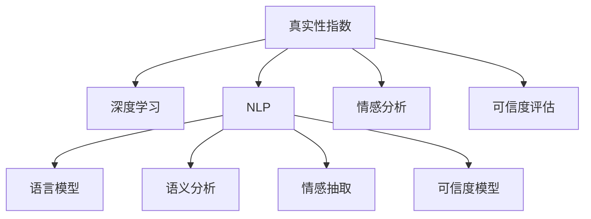

                 

# 体验真实性指数开发者：AI时代的authenticity量化专家

> 关键词：真实性指数, 人工智能, 深度学习, 数据科学, 文本分析, 自然语言处理(NLP), 情感分析, 可信度评估

## 1. 背景介绍

### 1.1 问题由来

在AI时代，特别是在互联网和社交媒体的迅猛发展下，信息的真实性和可信度变得愈发重要。虚假信息、误导性内容、网络欺诈等问题层出不穷，对社会和个人都造成了严重的负面影响。如何量化和评估信息的真实性，成为数据科学和AI领域的一个重要研究方向。

### 1.2 问题核心关键点

真实性指数（Authenticity Index）是一种量化信息真实性的指标，它通过深度学习、自然语言处理(NLP)等技术，对文本数据进行分析，评估其真实性和可信度。真实性指数的核心在于如何将自然语言中的真实性信息提取出来，并转化为可以量化的指标。

真实性指数的应用范围非常广泛，包括但不限于：

- 社交媒体内容审核
- 网络新闻和报道真实性评估
- 产品评价和用户评论的信誉度分析
- 广告和营销信息的真实性检验
- 金融交易和供应链数据的可信度评估

### 1.3 问题研究意义

真实性指数的量化评估对于构建真实可信的信息环境，保护社会公共利益和个人隐私，维护网络安全，促进互联网健康发展，具有重要意义：

1. 提高信息传播质量。真实性指数有助于识别和筛选高质量、真实可靠的信息，减少虚假信息的传播。
2. 促进人工智能技术的可信应用。构建真实性指数评价体系，为人工智能在内容生成、推荐、广告等领域提供可信度保障。
3. 支持法规和监管政策的制定。真实性指数可以作为评估信息可信度的标准，为相关法规和政策的制定提供数据支撑。
4. 提升用户体验。真实性指数帮助用户更轻松地识别可信信息，避免信息过载和误导，提高用户的信息筛选效率。
5. 推动信息科技伦理发展。真实性指数的评估和应用，可以促进科技公司和社会各界对人工智能技术伦理责任的重视和履行。

## 2. 核心概念与联系

### 2.1 核心概念概述

为更好地理解真实性指数的量化评估，我们首先介绍几个关键的概念：

- **真实性指数（Authenticity Index）**：量化评估信息真实性的指标，通常基于自然语言处理(NLP)技术，对文本内容进行深度分析。
- **深度学习（Deep Learning）**：利用多层神经网络模型，从大规模数据中学习复杂特征，进行模式识别和预测。
- **自然语言处理（NLP）**：涉及计算机科学、人工智能和语言学的交叉领域，研究如何让计算机理解和处理自然语言。
- **情感分析（Sentiment Analysis）**：对文本中的情感倾向进行分类，如积极、消极、中性等。
- **可信度评估（Trustworthiness Assessment）**：通过多维度的评估标准，量化文本的可信度和可靠性。

这些核心概念之间的逻辑关系可以通过以下Mermaid流程图来展示：



这个流程图展示真实性指数的核心概念及其之间的关系：

1. 真实性指数的构建基于深度学习。
2. 深度学习模型中通常包含语言模型、语义分析、情感抽取等子模型。
3. 情感分析用于识别文本中的情感倾向。
4. 可信度评估提供多维度标准，如事实准确性、语义一致性等。

## 3. 核心算法原理 & 具体操作步骤
### 3.1 算法原理概述

真实性指数的量化评估，本质上是利用深度学习模型对文本数据进行特征提取和情感分析，然后通过可信度评估模型进行综合打分。其核心算法流程如下：

1. **特征提取**：使用深度学习模型，如BERT、GPT等，对文本进行特征提取，生成文本的表示向量。
2. **情感分析**：对文本进行情感分类，评估文本中的情感倾向。
3. **可信度评估**：利用多维度标准，如事实准确性、语义一致性等，对文本的真实性和可信度进行打分。
4. **综合打分**：将情感分析和可信度评估的结果进行加权融合，生成最终的文本真实性指数。

### 3.2 算法步骤详解

真实性指数的量化评估主要包括以下几个步骤：

**Step 1: 数据准备**
- 收集与真实性相关的文本数据，如社交媒体帖子、新闻报道、评论等。
- 将数据划分为训练集、验证集和测试集，进行标准化处理，如分词、去除停用词等。

**Step 2: 构建深度学习模型**
- 选择合适的深度学习模型，如BERT、GPT等，进行预训练。
- 对预训练模型进行微调，使其能够适应真实性评估任务。

**Step 3: 进行特征提取**
- 将文本数据输入预训练模型，生成文本的表示向量。
- 使用语言模型、语义分析等技术，进一步提取文本中的关键特征。

**Step 4: 进行情感分析**
- 使用情感分析模型，对文本进行情感分类，评估文本中的情感倾向。
- 将情感分析结果转化为数值化的情感强度，用于后续的综合打分。

**Step 5: 进行可信度评估**
- 利用多维度标准，如事实准确性、语义一致性等，对文本的真实性和可信度进行打分。
- 将可信度评估的结果转化为数值化的可信度评分。

**Step 6: 综合打分**
- 将情感分析和可信度评估的结果进行加权融合，生成最终的文本真实性指数。
- 可以使用线性组合、加权平均等方法，根据任务需求调整权重。

**Step 7: 模型评估与优化**
- 在测试集上评估模型的性能，调整模型参数和评估标准，以提高模型的准确性和泛化能力。

### 3.3 算法优缺点

真实性指数的量化评估方法具有以下优点：
1. 量化准确。通过深度学习模型对文本进行深度分析，能够有效提取文本中的真实性信息。
2. 泛化能力强。模型可以利用大量数据进行训练，具有较强的泛化能力，可以适应不同领域的文本数据。
3. 自动评估。一旦模型训练完成，可以自动对新文本进行真实性评估，减少了人工干预的需求。

同时，该方法也存在一定的局限性：
1. 数据依赖。模型的训练和评估效果依赖于高质量的数据集，获取高质量标注数据的成本较高。
2. 模型复杂。深度学习模型复杂度高，训练和推理所需的时间和资源较多。
3. 解释性差。深度学习模型通常是黑盒模型，难以解释其内部工作机制和决策逻辑。
4. 评估标准多样。真实性评估涉及多个维度的标准，难以综合考虑，可能导致评估结果不全面。

尽管存在这些局限性，但就目前而言，真实性指数的量化评估方法仍是最主流的研究范式。未来相关研究的重点在于如何进一步降低对标注数据的依赖，提高模型的可解释性和泛化能力。

### 3.4 算法应用领域

真实性指数的量化评估方法在多个领域具有广泛的应用，包括但不限于：

- **社交媒体内容审核**：评估和过滤社交媒体上的虚假信息，保护用户免受误导。
- **网络新闻和报道真实性评估**：自动评估新闻报道的真实性和可信度，支持媒体审核和用户筛选。
- **产品评价和用户评论的信誉度分析**：识别虚假和恶意的用户评论，提升产品评价的可信度。
- **广告和营销信息的真实性检验**：评估广告和营销信息的内容真实性，避免误导消费者。
- **金融交易和供应链数据的可信度评估**：评估金融交易和供应链数据中的信息真实性，保障金融安全。

## 4. 数学模型和公式 & 详细讲解 & 举例说明

### 4.1 数学模型构建

我们以情感分析为例，构建一个简单的文本情感分析模型。假设文本数据集为 $D = \{(x_i, y_i)\}_{i=1}^N$，其中 $x_i$ 表示文本，$y_i \in \{1, -1\}$ 表示情感标签（1表示积极，-1表示消极）。

定义模型为 $f(x) = [\text{W}^1x_1 + b_1, \text{W}^2x_2 + b_2, ..., \text{W}^nx_n + b_n]$，其中 $\text{W}^i$ 和 $b_i$ 为第 $i$ 层的权重和偏置。使用Softmax函数将输出转换为概率分布，表示文本为正向情感的概率：

$$
p(y_i=1|x_i) = \frac{e^{f_i(x)}}{\sum_{j=1}^ne^{f_j(x)}}
$$

### 4.2 公式推导过程

假设文本数据集 $D = \{(x_i, y_i)\}_{i=1}^N$，其中 $x_i = (x_{i1}, x_{i2}, ..., x_{in})$ 表示文本的各个维度，$f_i(x) = \text{W}^ix_i + b_i$ 表示第 $i$ 层的输出。定义交叉熵损失函数：

$$
\mathcal{L}(f, D) = -\frac{1}{N}\sum_{i=1}^N y_i \log p(y_i=1|x_i) + (1-y_i) \log (1-p(y_i=1|x_i))
$$

模型参数 $\theta = \{\text{W}^1, \text{W}^2, ..., \text{W}^n, b_1, b_2, ..., b_n\}$ 的更新规则为：

$$
\theta \leftarrow \theta - \eta \nabla_{\theta}\mathcal{L}(f, D) - \eta\lambda\theta
$$

其中 $\eta$ 为学习率，$\lambda$ 为正则化系数。

### 4.3 案例分析与讲解

以BERT模型为例，展示其在进行情感分析任务中的应用。BERT模型是一种基于Transformer结构的深度学习模型，通过自监督学习任务预训练，可以自动学习文本的上下文语义表示。我们可以将BERT模型的最后一层输出作为情感分析的特征表示，再通过全连接层进行情感分类。

具体实现步骤如下：

1. 加载预训练的BERT模型，选择合适层的输出作为特征表示。
2. 对文本进行编码，得到文本的表示向量。
3. 将表示向量输入全连接层，输出情感分类结果。
4. 使用交叉熵损失函数进行模型训练和评估。

通过BERT模型进行情感分析，可以有效地提取文本中的情感信息，为后续的可信度评估提供基础。

## 5. 项目实践：代码实例和详细解释说明

### 5.1 开发环境搭建

在进行真实性指数的量化评估项目实践前，我们需要准备好开发环境。以下是使用Python进行TensorFlow开发的环境配置流程：

1. 安装Anaconda：从官网下载并安装Anaconda，用于创建独立的Python环境。

2. 创建并激活虚拟环境：
```bash
conda create -n tf-env python=3.8 
conda activate tf-env
```

3. 安装TensorFlow：根据CUDA版本，从官网获取对应的安装命令。例如：
```bash
conda install tensorflow -c conda-forge -c pytorch
```

4. 安装TensorFlow Addons和相关库：
```bash
conda install tensorflow-addons
pip install torch sklearn pandas numpy
```

5. 安装其他相关工具包：
```bash
pip install scikit-learn matplotlib tqdm jupyter notebook ipython
```

完成上述步骤后，即可在`tf-env`环境中开始项目实践。

### 5.2 源代码详细实现

下面以使用BERT模型进行情感分析为例，给出TensorFlow代码实现。

首先，定义情感分析模型：

```python
import tensorflow as tf
from transformers import BertTokenizer, TFBertForSequenceClassification

# 初始化BERT Tokenizer和模型
tokenizer = BertTokenizer.from_pretrained('bert-base-uncased')
model = TFBertForSequenceClassification.from_pretrained('bert-base-uncased', num_labels=2)

# 定义模型构建函数
def create_model():
    input_ids = tf.keras.layers.Input(shape=(MAX_LEN,), dtype=tf.int32)
    input_mask = tf.keras.layers.Input(shape=(MAX_LEN,), dtype=tf.int32)
    sequence_output = model(input_ids, attention_mask=input_mask)[0]
    output = tf.keras.layers.Dense(2, activation='softmax')(sequence_output)
    model = tf.keras.Model(inputs=[input_ids, input_mask], outputs=output)
    return model
```

接着，定义训练和评估函数：

```python
# 训练函数
def train_model(model, train_dataset, val_dataset, batch_size=32, epochs=3):
    steps_per_epoch = train_dataset['labels'].numpy().shape[0] // batch_size
    for epoch in range(epochs):
        for step, (data, labels) in enumerate(train_dataset):
            data = {"input_ids": data["input_ids"].numpy(), "attention_mask": data["attention_mask"].numpy()}
            with tf.GradientTape() as tape:
                predictions = model(data)
                loss = tf.keras.losses.categorical_crossentropy(labels, predictions)
            gradients = tape.gradient(loss, model.trainable_variables)
            optimizer.apply_gradients(zip(gradients, model.trainable_variables))
            if step % 100 == 0:
                print(f"Epoch {epoch+1}, Step {step+1}, Loss: {loss.numpy():.4f}")
    
    # 评估函数
def evaluate_model(model, test_dataset, batch_size=32):
    for step, (data, labels) in enumerate(test_dataset):
        data = {"input_ids": data["input_ids"].numpy(), "attention_mask": data["attention_mask"].numpy()}
        predictions = model(data)
        labels = labels.numpy()
        predictions = predictions.numpy()
        print(f"Step {step+1}, Loss: {tf.keras.losses.categorical_crossentropy(labels, predictions).numpy():.4f}")
```

最后，启动模型训练流程并在测试集上评估：

```python
# 加载数据集
train_dataset = load_train_dataset()
val_dataset = load_val_dataset()
test_dataset = load_test_dataset()

# 创建模型
model = create_model()

# 编译模型
optimizer = tf.keras.optimizers.Adam()
model.compile(optimizer=optimizer, loss='categorical_crossentropy', metrics=['accuracy'])

# 训练模型
train_model(model, train_dataset, val_dataset, batch_size=32, epochs=3)

# 评估模型
evaluate_model(model, test_dataset, batch_size=32)
```

以上就是使用TensorFlow实现BERT模型进行情感分析的完整代码实现。可以看到，通过TensorFlow框架，我们可以方便地搭建和训练深度学习模型，完成情感分析任务。

### 5.3 代码解读与分析

让我们再详细解读一下关键代码的实现细节：

**BERT Tokenizer和模型初始化**：
- 使用HuggingFace提供的BERT Tokenizer和模型，初始化输入和输出层。

**创建模型函数**：
- 定义模型输入层，包括输入ID和注意力掩码。
- 将BERT模型输出的序列表示通过全连接层输出情感分类结果。
- 定义模型结构，返回创建的模型对象。

**训练函数**：
- 循环遍历训练数据集，对每个批次进行模型前向传播和反向传播。
- 计算交叉熵损失，并使用梯度下降更新模型参数。
- 打印每个epoch和step的损失值，以便调试。

**评估函数**：
- 循环遍历测试数据集，对每个批次进行模型前向传播和评估。
- 计算交叉熵损失，并打印结果。

**训练流程**：
- 加载数据集，创建模型，并编译模型。
- 调用训练函数进行模型训练，并在测试集上调用评估函数。

可以看到，TensorFlow提供了丰富的API和工具，使得深度学习模型的搭建和训练变得简洁高效。开发者可以根据具体任务需求，灵活使用TensorFlow提供的各种组件，快速完成模型的构建和训练。

当然，实际项目中还需要考虑更多的因素，如模型裁剪、量化加速、服务化封装、模型优化等。但核心的情感分析范式基本与此类似。

## 6. 实际应用场景

### 6.1 社交媒体内容审核

社交媒体平台每天都会生成海量内容，其中不乏虚假和有害信息。通过真实性指数的量化评估，可以有效筛选出虚假信息和有害内容，保护用户免受误导和伤害。

在具体应用中，可以使用情感分析模型对社交媒体帖子进行情感分类，标记出可能含有负面情感的帖子。然后，利用可信度评估模型对标记的帖子进行进一步筛选，根据事实准确性、语义一致性等标准，判断帖子是否真实可信。对于判断为虚假或有害的帖子，可以采取删除、标记、提醒等措施，提升社交媒体内容的质量和可信度。

### 6.2 网络新闻和报道真实性评估

网络新闻和报道的真实性评估是新闻媒体行业的一个重要需求。传统的新闻审核往往依赖人工审核，效率低下且成本高昂。通过真实性指数的量化评估，可以自动对新闻报道进行真实性判断，提高审核效率和准确性。

在具体应用中，可以使用深度学习模型对新闻报道进行特征提取和情感分析。然后，利用可信度评估模型对提取的特征进行综合打分，生成新闻报道的真实性指数。根据真实性指数的高低，可以对新闻报道进行分级和筛选，确保高可信度的新闻报道得以优先传播，虚假和误导性内容被有效遏制。

### 6.3 产品评价和用户评论的信誉度分析

在电子商务平台，产品评价和用户评论的信誉度直接影响到用户的购买决策。然而，虚假和恶意的评价往往难以识别，给用户和商家带来困扰。通过真实性指数的量化评估，可以有效识别虚假和恶意的评价，提升产品评价的信誉度。

在具体应用中，可以使用情感分析模型对用户评论进行情感分类，标记出可能含有负面情感的评论。然后，利用可信度评估模型对标记的评论进行进一步筛选，根据事实准确性、语义一致性等标准，判断评论是否真实可信。对于判断为虚假或恶意的评论，可以采取删除、屏蔽等措施，保障产品评价的真实性。

### 6.4 未来应用展望

随着深度学习技术和NLP方法的不断进步，真实性指数的量化评估方法将会有更广阔的应用前景。

在智慧医疗领域，真实性指数可以帮助构建可信的医疗问答系统，提升医疗信息的准确性和可靠性，辅助医生进行诊断和治疗决策。

在智能教育领域，真实性指数可以用于评估在线教育平台的学习资源质量，识别和筛选真实可信的学习材料，保障在线教育的有效性。

在智慧城市治理中，真实性指数可以帮助构建可信的城市舆情监测系统，及时识别和处理虚假信息和谣言，维护城市安全稳定。

此外，在企业内部信息安全、金融交易风险控制、社交网络安全等领域，真实性指数都有广泛的应用前景。相信随着技术的不断发展和应用场景的不断拓展，真实性指数的量化评估方法将会在更多领域发挥重要作用，推动社会信息化和智能化进程。

## 7. 工具和资源推荐
### 7.1 学习资源推荐

为了帮助开发者系统掌握真实性指数的量化评估的理论基础和实践技巧，这里推荐一些优质的学习资源：

1. 《深度学习》系列书籍：由Ian Goodfellow等专家撰写，系统介绍了深度学习的基本原理和应用方法，适合初学者入门。
2. 《自然语言处理综论》系列书籍：由Daniel Jurafsky和James H. Martin等专家撰写，深入讲解了NLP的各个方面，适合NLP研究者和从业者参考。
3. 《Python深度学习》系列书籍：由Francois Chollet等专家撰写，详细介绍了TensorFlow和Keras等深度学习框架的使用方法，适合TensorFlow开发者。
4. CS224N《深度学习自然语言处理》课程：斯坦福大学开设的NLP明星课程，有Lecture视频和配套作业，适合深度学习NLP方向的学习者。
5. 《自然语言处理实践》在线课程：由斯坦福大学和DeepLearning.AI联合开设，涵盖NLP基础和前沿技术的系统学习。

通过对这些资源的学习实践，相信你一定能够快速掌握真实性指数的量化评估的精髓，并用于解决实际的NLP问题。
### 7.2 开发工具推荐

高效的开发离不开优秀的工具支持。以下是几款用于真实性指数量化评估开发的常用工具：

1. TensorFlow：由Google主导开发的开源深度学习框架，生产部署方便，适合大规模工程应用。提供了丰富的API和组件，支持从模型构建到训练、推理的全过程。
2. TensorFlow Addons：TensorFlow生态系统中的附加组件，提供了更多的深度学习算法和模型，适用于复杂任务的处理。
3. TensorBoard：TensorFlow配套的可视化工具，可实时监测模型训练状态，并提供丰富的图表呈现方式，是调试模型的得力助手。
4. Weights & Biases：模型训练的实验跟踪工具，可以记录和可视化模型训练过程中的各项指标，方便对比和调优。
5. Jupyter Notebook：轻量级的开发环境，支持交互式编程，适合进行数据分析和模型训练的快速迭代。

合理利用这些工具，可以显著提升真实性指数量化评估的开发效率，加快创新迭代的步伐。

### 7.3 相关论文推荐

真实性指数的量化评估方法在近年来的研究中取得了不少进展，以下是几篇代表性的论文，推荐阅读：

1. "Fact-Checking with Large Pretrained Transformers"（使用大预训练Transformer进行事实核查）：提出使用BERT等预训练模型进行事实核查的方法，并取得了良好的效果。
2. "A Multidimensional Framework for Automated Fact-Checking"（多维度自动事实核查框架）：提出多维度的事实核查标准，并利用多个指标进行综合评估。
3. "Automatic Fact-Checking using the Emotion of Text"（基于文本情感进行自动事实核查）：探索情感分析在事实核查中的应用，通过分析文本情感进行信息真实性的判断。
4. "A Scalable and Generalizable Fact-Checking Framework for News"（可扩展和通用化的新闻事实核查框架）：提出一种基于深度学习的可扩展新闻事实核查框架，提高了事实核查的效率和准确性。
5. "Real-time News Fact-Checking via Multi-Aspect Assessment"（基于多方面评估的实时新闻事实核查）：探索多方面评估在实时新闻事实核查中的应用，提高了事实核查的实时性和准确性。

这些论文代表了真实性指数量化评估技术的发展脉络。通过学习这些前沿成果，可以帮助研究者把握学科前进方向，激发更多的创新灵感。

## 8. 总结：未来发展趋势与挑战

### 8.1 研究成果总结

本文对真实性指数的量化评估方法进行了全面系统的介绍。首先阐述了真实性指数的研究背景和意义，明确了量化评估信息真实性的重要性。其次，从原理到实践，详细讲解了深度学习模型在情感分析和可信度评估中的应用，给出了具体的代码实现和模型评估流程。同时，本文还广泛探讨了真实性指数在多个领域的应用前景，展示了其在提升信息质量和保障信息安全方面的巨大潜力。最后，本文精选了相关学习资源、开发工具和论文，力求为开发者提供全方位的技术指引。

通过本文的系统梳理，可以看到，真实性指数的量化评估方法正在成为NLP领域的重要范式，极大地拓展了深度学习模型在文本信息真实性评估中的应用场景，为构建可信的信息环境提供了有力工具。相信随着深度学习技术和NLP方法的不断进步，真实性指数的量化评估方法将会在更多领域得到应用，推动社会信息化和智能化进程。

### 8.2 未来发展趋势

展望未来，真实性指数的量化评估方法将呈现以下几个发展趋势：

1. 技术不断进步。深度学习技术和NLP方法的不断进步，将推动真实性指数的量化评估方法更加精准和高效。
2. 应用场景不断拓展。真实性指数的应用将逐步拓展到更多领域，如智慧医疗、智能教育、智慧城市等，为社会各个方面提供支撑。
3. 数据驱动。更多的数据驱动方法将被引入真实性指数的量化评估中，如基于深度学习的文本特征提取和情感分析，提升评估结果的可靠性和准确性。
4. 跨模态融合。真实性指数的量化评估将更多地结合视觉、语音等多模态信息，提升对复杂信息环境的理解能力。
5. 多维度融合。真实性指数的量化评估将更多地结合专家知识、法规标准等多维度信息，形成更全面的评估体系。
6. 实时化。实时化的真实性指数评估将使得信息安全预警和处理更加及时，提升应对突发事件的能力。

以上趋势凸显了真实性指数的量化评估方法的广阔前景。这些方向的探索发展，必将进一步提升深度学习模型的应用价值，为构建可信、安全的信息环境提供有力保障。

### 8.3 面临的挑战

尽管真实性指数的量化评估方法在近年来取得了不少进展，但在迈向更加智能化、普适化应用的过程中，仍面临诸多挑战：

1. 数据质量和多样性。高质量、多样化的数据是真实性指数量化评估的基础，但数据获取和处理仍存在较大挑战。
2. 模型复杂度。深度学习模型复杂度高，训练和推理所需的时间和资源较多，需要进一步优化。
3. 评估标准不统一。真实性评估涉及多个维度的标准，如何综合考虑并统一标准，是一个重要问题。
4. 跨领域应用。真实性指数的量化评估方法在不同领域的应用效果存在差异，需要针对具体场景进行优化。
5. 伦理和隐私问题。真实性指数的量化评估涉及大量用户隐私数据的处理，需要严格遵守相关法律法规。
6. 算法偏见。深度学习模型可能存在算法偏见，需要采取措施减少模型的歧视性输出。

正视真实性指数量化评估所面临的这些挑战，积极应对并寻求突破，将是大语言模型微调走向成熟的必由之路。相信随着学界和产业界的共同努力，这些挑战终将一一被克服，真实性指数的量化评估方法将会在构建安全、可靠、可解释、可控的智能系统方面发挥更大作用。

### 8.4 研究展望

面向未来，真实性指数的量化评估方法需要在以下几个方面寻求新的突破：

1. 探索无监督和半监督学习范式。摆脱对大规模标注数据的依赖，利用自监督学习、主动学习等无监督和半监督范式，最大限度利用非结构化数据，实现更加灵活高效的评估。
2. 研究参数高效和计算高效的评估方法。开发更加参数高效的评估方法，在固定大部分预训练参数的同时，只更新极少量的任务相关参数。同时优化评估模型的计算图，减少前向传播和反向传播的资源消耗，实现更加轻量级、实时性的部署。
3. 引入更多先验知识。将符号化的先验知识，如知识图谱、逻辑规则等，与神经网络模型进行巧妙融合，引导评估过程学习更准确、合理的语言模型。同时加强不同模态数据的整合，实现视觉、语音等多模态信息与文本信息的协同建模。
4. 结合因果分析和博弈论工具。将因果分析方法引入评估模型，识别出模型决策的关键特征，增强输出解释的因果性和逻辑性。借助博弈论工具刻画人机交互过程，主动探索并规避模型的脆弱点，提高系统稳定性。
5. 纳入伦理道德约束。在评估目标中引入伦理导向的评估指标，过滤和惩罚有偏见、有害的输出倾向。同时加强人工干预和审核，建立模型行为的监管机制，确保输出符合人类价值观和伦理道德。

这些研究方向的探索，必将引领真实性指数的量化评估方法迈向更高的台阶，为构建安全、可靠、可解释、可控的智能系统铺平道路。面向未来，真实性指数的量化评估技术还需要与其他人工智能技术进行更深入的融合，如知识表示、因果推理、强化学习等，多路径协同发力，共同推动自然语言理解和智能交互系统的进步。只有勇于创新、敢于突破，才能不断拓展深度学习模型的边界，让智能技术更好地造福人类社会。

## 9. 附录：常见问题与解答

**Q1：真实性指数的评估标准有哪些？**

A: 真实性指数的评估标准通常包括以下几个方面：

1. **事实准确性**：评估文本中陈述的事实是否真实，是否与已知的知识库或数据源相符。
2. **语义一致性**：评估文本中的语言表达是否符合语义逻辑，是否存在语义矛盾或歧义。
3. **情感倾向**：评估文本中的情感倾向是否客观公正，是否存在夸大、误导等情况。
4. **来源可信度**：评估文本的来源是否可信，是否存在抄袭、伪造等情况。
5. **语言流畅度**：评估文本的语言表达是否流畅自然，是否存在语法错误或冗余等情况。

以上标准需要根据具体任务进行综合考虑，并根据实际情况进行权重调整。

**Q2：如何构建高质量的真实性指数评估数据集？**

A: 构建高质量的真实性指数评估数据集，需要遵循以下原则：

1. **多样性**：数据集应包含各种类型的文本，如新闻、评论、广告、研究报告等，以覆盖不同领域的文本特点。
2. **真实性**：数据集中的文本应尽可能真实可信，避免使用虚构或夸大的内容。
3. **标注标准**：数据集应由领域专家进行标注，确保标注结果的准确性和一致性。
4. **平衡性**：数据集应包含正面、中性、负面等多种情感倾向的文本，以确保评估模型的鲁棒性。
5. **规模**：数据集应包含足够的样本，以便模型进行充分的训练和测试。

在具体构建数据集时，可以通过爬虫工具从公开数据源中获取文本数据，并进行数据清洗和标注。同时，可以邀请领域专家对标注结果进行审核，确保数据集的质量。

**Q3：真实性指数的量化评估方法与传统的舆情分析方法有何区别？**

A: 真实性指数的量化评估方法与传统的舆情分析方法有以下几个区别：

1. **评估维度**：传统舆情分析主要关注情感倾向和舆情变化，而真实性指数的量化评估则更侧重于信息的真实性和可信度。
2. **数据来源**：传统舆情分析主要依赖社交媒体、论坛等公开数据源，而真实性指数的量化评估则可以使用更多维度的数据，如新闻报道、专家分析等。
3. **评估方法**：传统舆情分析主要依赖规则匹配和情感分类等简单方法，而真实性指数的量化评估则利用深度学习模型进行复杂特征提取和模式识别。
4. **应用场景**：传统舆情分析主要应用于社会舆情监测和舆情预警，而真实性指数的量化评估则广泛应用于信息审核、广告审核、网络安全等多个领域。

综上所述，真实性指数的量化评估方法更加全面、复杂和精细，能够更准确地评估信息的真实性和可信度，适用于更多应用场景。

**Q4：如何在实时场景中进行真实性指数的量化评估？**

A: 在实时场景中进行真实性指数的量化评估，需要构建高效的评估模型和系统架构。以下是一些实现策略：

1. **在线学习**：使用在线学习算法，如增量学习、自适应学习等，能够实时更新模型参数，适应数据分布的变化。
2. **多任务学习**：将真实性指数的量化评估与任务相关的其他指标（如情感分析、主题分类等）进行联合训练，提高模型的泛化能力。
3. **分布式计算**：利用分布式计算框架（如TensorFlow、PyTorch等），实现大规模数据的并行处理和实时计算。
4. **边缘计算**：在数据产生源头进行初步处理和评估，减少数据传输和计算延迟，提高实时性。
5. **模型优化**：通过模型裁剪、量化加速等技术，优化模型结构和推理效率，支持实时应用。

通过以上策略，可以构建高效、实时的真实性指数量化评估系统，提升信息安全预警和处理能力。

**Q5：如何提升真实性指数的量化评估模型的准确性和鲁棒性？**

A: 提升真实性指数的量化评估模型的准确性和鲁棒性，需要从以下几个方面进行改进：

1. **数据质量**：提高数据集的多样性和真实性，减少标注数据的噪声和偏差。
2. **模型优化**：优化模型结构和参数，提高模型的泛化能力和鲁棒性。
3. **多任务学习**：结合情感分析、主题分类等任务进行联合训练，提高模型的综合能力。
4. **对抗训练**：引入对抗样本，提高模型对数据扰动的鲁棒性。
5. **模型解释**：引入可解释性方法，如LIME、SHAP等，提高模型的透明性和可解释性。
6. **多维度融合**：结合多维度的评估标准（如事实准确性、语义一致性等）进行综合评估，提高评估结果的全面性和准确性。

通过以上措施，可以显著提升真实性指数的量化评估模型的准确性和鲁棒性，增强模型的可信度和应用价值。

---

作者：禅与计算机程序设计艺术 / Zen and the Art of Computer Programming

