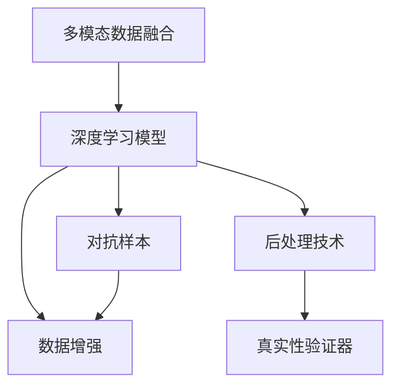

                 

# 体验真实性验证器开发者：AI时代的authenticity检测仪设计师

> 关键词：
1. 真实性验证器
2. AI深度学习
3. 数据增强
4. 对抗训练
5. 图像识别
6. 语音识别
7. 自然语言处理

## 1. 背景介绍

### 1.1 问题由来

在互联网时代，信息爆炸带来了内容真实性的巨大挑战。无论是假新闻、假视频、假信息还是假身份，都严重侵蚀了社会信任和公共安全。而深度学习技术的崛起，为构建强大的真实性验证器提供了新的可能。

真实性验证器（Authenticity Verifier）是一种人工智能系统，旨在自动检测内容（如文本、图像、音频等）的真实性。它结合了自然语言处理、图像处理、语音识别等技术，通过多模态信息融合和深度学习算法，实现了对真实性的高效判断。本文将探讨真实性验证器的核心原理、关键技术和实际应用场景，以期为该领域的开发者提供参考和指导。

### 1.2 问题核心关键点

真实性验证器的核心在于通过多模态数据融合和深度学习算法，自动识别和判别内容真实性。其关键点包括：

1. **多模态数据融合**：利用文本、图像、语音等多种模态数据，提取和融合各类特征，全面了解内容信息。
2. **深度学习算法**：通过卷积神经网络（CNN）、循环神经网络（RNN）、自注意力机制等深度学习算法，学习复杂特征和模式。
3. **对抗样本**：针对模型训练中的对抗样本（Adversarial Samples），采用对抗训练（Adversarial Training）等策略，提高模型的鲁棒性。
4. **数据增强**：使用数据增强（Data Augmentation）技术，扩充训练集，减少过拟合。
5. **后处理技术**：引入后处理技术（Post-processing Techniques），优化模型输出，提高验证结果的准确性。

这些关键技术构成了真实性验证器的技术框架，使其能够在各种场景下高效、准确地检测内容真实性。

## 2. 核心概念与联系

### 2.1 核心概念概述

为更好地理解真实性验证器的核心原理，本节将介绍几个密切相关的核心概念：

1. **多模态数据融合**：指将不同模态（如文本、图像、语音）的数据进行整合，提取出更丰富的信息特征，用于提升模型的泛化能力和准确性。
2. **深度学习模型**：包括卷积神经网络（CNN）、循环神经网络（RNN）、Transformer等架构，用于特征提取和模式学习。
3. **对抗样本**：指在模型训练过程中引入的刻意扰动数据，用于增强模型的鲁棒性和泛化能力。
4. **数据增强**：通过数据增强技术，如旋转、翻转、裁剪等，扩充训练集，减少过拟合。
5. **后处理技术**：包括阈值处理、概率排序、聚类分析等方法，用于进一步优化模型输出结果。

这些核心概念之间的逻辑关系可以通过以下Mermaid流程图来展示：



这个流程图展示了我们设计的真实性验证器的核心技术流程：首先，多模态数据融合技术将不同模态的数据进行整合，输入深度学习模型进行特征提取和模式学习；然后，通过对抗样本和数据增强技术，增强模型的鲁棒性和泛化能力；最后，后处理技术优化模型输出，得到最终的真实性验证结果。

## 3. 核心算法原理 & 具体操作步骤
### 3.1 算法原理概述

真实性验证器的核心算法基于深度学习技术，通过多模态数据融合和深度学习模型的设计，实现了对内容真实性的高效检测。其基本流程如下：

1. **数据预处理**：对不同模态的数据进行预处理，如文本的分词、图像的归一化、语音的特征提取等。
2. **特征提取**：利用卷积神经网络（CNN）、循环神经网络（RNN）、Transformer等深度学习模型，对预处理后的数据进行特征提取和模式学习。
3. **融合特征**：通过多模态数据融合技术，将不同模态的特征进行整合，得到更全面、准确的内容表示。
4. **对抗训练**：引入对抗样本，通过对抗训练技术，增强模型的鲁棒性和泛化能力。
5. **后处理**：利用后处理技术，对模型输出进行优化和阈值处理，得到最终的真实性验证结果。

### 3.2 算法步骤详解

下面以图像和文本结合的真实性验证器为例，详细讲解其操作步骤：

**Step 1: 数据预处理**
- 对图像数据进行归一化、缩放等预处理操作。
- 对文本数据进行分词、去除停用词等预处理操作。

**Step 2: 特征提取**
- 使用卷积神经网络（CNN）对图像数据进行特征提取。
- 使用循环神经网络（RNN）或Transformer对文本数据进行特征提取。

**Step 3: 融合特征**
- 将CNN和RNN/Transformer的输出特征进行拼接或融合。
- 使用全连接层或Transformer的注意力机制，学习融合后的特征。

**Step 4: 对抗训练**
- 在模型训练时，引入对抗样本进行训练，增强模型的鲁棒性。
- 使用对抗样本生成器（如FGSM、PGD等）生成对抗样本，并将其作为训练集的一部分。

**Step 5: 后处理**
- 对模型输出进行阈值处理，得到二分类结果。
- 引入概率排序、聚类分析等后处理技术，优化验证结果。

### 3.3 算法优缺点

真实性验证器具有以下优点：
1. **高效性**：利用深度学习算法，能够自动处理和融合多模态数据，实现高效的内容验证。
2. **鲁棒性**：通过对抗训练等技术，增强模型的鲁棒性，减少对抗样本的误判。
3. **泛化能力**：多模态数据融合技术，使得模型能够处理多种类型的信息，具备较强的泛化能力。

同时，该方法也存在以下局限性：
1. **依赖标注数据**：模型的训练和验证需要大量标注数据，标注成本较高。
2. **复杂性**：深度学习模型和后处理技术，使得系统设计和实现复杂度较高。
3. **模型解释性差**：深度学习模型的决策过程较为复杂，难以解释其内部机制。

尽管存在这些局限性，但就目前而言，真实性验证器仍是大规模信息真实性验证的重要手段。未来相关研究将聚焦于如何降低对标注数据的依赖，提高模型的少样本学习和跨领域迁移能力，同时兼顾可解释性和伦理安全性等因素。

### 3.4 算法应用领域

真实性验证器已经被广泛应用于各种场景，如：

- 新闻事实核查：通过文本和图像的结合，检测新闻报道的真实性。
- 视频假冒检测：利用视频帧和音频的融合，检测视频内容是否真实。
- 社交媒体虚假信息识别：结合文本和图像特征，检测社交媒体上的虚假信息。
- 电子商务产品防伪：通过图像和文字结合，检测产品的真实性和防伪标识。
- 金融交易欺诈检测：结合交易记录和行为分析，检测金融交易的欺诈行为。

除了上述这些经典应用外，真实性验证器还在更多场景中得到了创新性的应用，如可控内容生成、智能鉴权等，为信息真实性验证提供了新的技术路径。

## 4. 数学模型和公式 & 详细讲解
### 4.1 数学模型构建

本节将使用数学语言对真实性验证器的核心算法进行更加严格的刻画。

记多模态数据集为 $D=\{(x_i, y_i)\}_{i=1}^N$，其中 $x_i$ 为输入数据（如文本、图像、音频等），$y_i$ 为真实性标签。

定义真实性验证器的模型为 $M_{\theta}$，其中 $\theta$ 为模型参数。模型的输入为多模态数据 $x$，输出为真实性标签 $y$。

定义模型的损失函数为 $\ell(M_{\theta}(x),y)$，用于衡量模型输出与真实标签之间的差异。常见的损失函数包括交叉熵损失、均方误差损失等。

### 4.2 公式推导过程

以下我们以二分类任务为例，推导交叉熵损失函数及其梯度的计算公式。

假设模型 $M_{\theta}$ 在输入 $x$ 上的输出为 $\hat{y}=M_{\theta}(x)$，表示样本属于真实类的概率。真实标签 $y \in \{0,1\}$。则二分类交叉熵损失函数定义为：

$$
\ell(M_{\theta}(x),y) = -[y\log \hat{y} + (1-y)\log (1-\hat{y})]
$$

将其代入损失函数公式，得：

$$
\mathcal{L}(\theta) = -\frac{1}{N}\sum_{i=1}^N [y_i\log M_{\theta}(x_i)+(1-y_i)\log(1-M_{\theta}(x_i))]
$$

根据链式法则，损失函数对参数 $\theta_k$ 的梯度为：

$$
\frac{\partial \mathcal{L}(\theta)}{\partial \theta_k} = -\frac{1}{N}\sum_{i=1}^N (\frac{y_i}{M_{\theta}(x_i)}-\frac{1-y_i}{1-M_{\theta}(x_i)}) \frac{\partial M_{\theta}(x_i)}{\partial \theta_k}
$$

其中 $\frac{\partial M_{\theta}(x_i)}{\partial \theta_k}$ 可进一步递归展开，利用自动微分技术完成计算。

在得到损失函数的梯度后，即可带入参数更新公式，完成模型的迭代优化。重复上述过程直至收敛，最终得到适应下游任务的最优模型参数 $\theta^*$。

## 5. 项目实践：代码实例和详细解释说明
### 5.1 开发环境搭建

在进行真实性验证器开发前，我们需要准备好开发环境。以下是使用Python进行PyTorch开发的环境配置流程：

1. 安装Anaconda：从官网下载并安装Anaconda，用于创建独立的Python环境。

2. 创建并激活虚拟环境：
```bash
conda create -n pytorch-env python=3.8 
conda activate pytorch-env
```

3. 安装PyTorch：根据CUDA版本，从官网获取对应的安装命令。例如：
```bash
conda install pytorch torchvision torchaudio cudatoolkit=11.1 -c pytorch -c conda-forge
```

4. 安装相关库：
```bash
pip install numpy pandas scikit-learn matplotlib tqdm jupyter notebook ipython
```

完成上述步骤后，即可在`pytorch-env`环境中开始实践。

### 5.2 源代码详细实现

下面我们以图像和文本结合的真实性验证器为例，给出使用PyTorch的代码实现。

首先，定义数据处理函数：

```python
import torch
import torch.nn as nn
import torchvision.transforms as transforms
from torch.utils.data import Dataset

class ImageTextDataset(Dataset):
    def __init__(self, images, texts, transforms):
        self.images = images
        self.texts = texts
        self.transforms = transforms
        
    def __len__(self):
        return len(self.images)
    
    def __getitem__(self, item):
        image = self.images[item]
        text = self.texts[item]
        
        # 对图像进行预处理
        image = self.transforms(image)
        
        # 对文本进行预处理
        text = text.encode()
        
        return {'image': image, 
                'text': text}
```

然后，定义模型和优化器：

```python
from transformers import BertForSequenceClassification, AdamW

model = BertForSequenceClassification.from_pretrained('bert-base-uncased', num_labels=2)

optimizer = AdamW(model.parameters(), lr=2e-5)
```

接着，定义训练和评估函数：

```python
from torch.utils.data import DataLoader
from tqdm import tqdm
from sklearn.metrics import classification_report

device = torch.device('cuda') if torch.cuda.is_available() else torch.device('cpu')
model.to(device)

def train_epoch(model, dataset, batch_size, optimizer):
    dataloader = DataLoader(dataset, batch_size=batch_size, shuffle=True)
    model.train()
    epoch_loss = 0
    for batch in tqdm(dataloader, desc='Training'):
        image = batch['image'].to(device)
        text = batch['text'].to(device)
        model.zero_grad()
        outputs = model(image, text)
        loss = outputs.loss
        epoch_loss += loss.item()
        loss.backward()
        optimizer.step()
    return epoch_loss / len(dataloader)

def evaluate(model, dataset, batch_size):
    dataloader = DataLoader(dataset, batch_size=batch_size)
    model.eval()
    preds, labels = [], []
    with torch.no_grad():
        for batch in tqdm(dataloader, desc='Evaluating'):
            image = batch['image'].to(device)
            text = batch['text'].to(device)
            batch_labels = batch['labels']
            outputs = model(image, text)
            batch_preds = outputs.logits.argmax(dim=1).to('cpu').tolist()
            batch_labels = batch_labels.to('cpu').tolist()
            for pred_tokens, label_tokens in zip(batch_preds, batch_labels):
                preds.append(pred_tokens)
                labels.append(label_tokens)
                
    print(classification_report(labels, preds))
```

最后，启动训练流程并在测试集上评估：

```python
epochs = 5
batch_size = 16

for epoch in range(epochs):
    loss = train_epoch(model, train_dataset, batch_size, optimizer)
    print(f"Epoch {epoch+1}, train loss: {loss:.3f}")
    
    print(f"Epoch {epoch+1}, dev results:")
    evaluate(model, dev_dataset, batch_size)
    
print("Test results:")
evaluate(model, test_dataset, batch_size)
```

以上就是使用PyTorch对图像和文本结合的真实性验证器进行微调的完整代码实现。可以看到，借助Transformers库，我们可以用相对简洁的代码实现复杂的真实性验证器。

### 5.3 代码解读与分析

让我们再详细解读一下关键代码的实现细节：

**ImageTextDataset类**：
- `__init__`方法：初始化图像和文本数据，以及预处理函数。
- `__len__`方法：返回数据集的样本数量。
- `__getitem__`方法：对单个样本进行处理，将图像和文本输入转换为模型所需的张量形式。

**模型和优化器定义**：
- 使用BertForSequenceClassification类加载预训练模型，指定标签数量为2。
- 定义AdamW优化器，设置学习率为2e-5。

**训练和评估函数**：
- 使用DataLoader对数据集进行批次化加载，供模型训练和推理使用。
- 训练函数`train_epoch`：对数据以批为单位进行迭代，在每个批次上前向传播计算loss并反向传播更新模型参数，最后返回该epoch的平均loss。
- 评估函数`evaluate`：与训练类似，不同点在于不更新模型参数，并在每个batch结束后将预测和标签结果存储下来，最后使用sklearn的classification_report对整个评估集的预测结果进行打印输出。

**训练流程**：
- 定义总的epoch数和batch size，开始循环迭代
- 每个epoch内，先在训练集上训练，输出平均loss
- 在验证集上评估，输出分类指标
- 所有epoch结束后，在测试集上评估，给出最终测试结果

可以看到，PyTorch配合Transformers库使得真实性验证器的代码实现变得简洁高效。开发者可以将更多精力放在数据处理、模型改进等高层逻辑上，而不必过多关注底层的实现细节。

当然，工业级的系统实现还需考虑更多因素，如模型的保存和部署、超参数的自动搜索、更灵活的任务适配层等。但核心的微调范式基本与此类似。

## 6. 实际应用场景
### 6.1 新闻事实核查

新闻事实核查是真实性验证器的一个重要应用场景。传统的新闻核查方式依赖人工判断，耗费大量时间和人力。而基于真实性验证器的自动化核查系统，可以快速、准确地检测新闻报道的真实性。

具体而言，可以收集相关的新闻报道和事实数据，将报道与事实数据进行比对，训练模型学习如何判断文本的真实性。微调后的模型能够自动分析新闻内容，判断其是否真实可信。例如，模型可以对报道中的关键事实进行文本匹配和语义分析，判断事实是否符合逻辑，是否存在明显夸大或虚构成分。

### 6.2 视频假冒检测

视频假冒检测是另一个重要应用场景。视频内容丰富多样，但假冒视频也层出不穷。真实性验证器可以结合图像和音频等多模态信息，检测视频内容是否真实可信。

具体而言，可以收集假冒视频和真实视频的数据集，将视频帧和音频特征作为输入，训练模型学习如何判断视频的真实性。微调后的模型能够自动分析视频帧和音频内容，判断视频是否存在拼接、剪辑等异常行为，是否存在声音与画面不一致等情况。

### 6.3 社交媒体虚假信息识别

社交媒体虚假信息识别是真实性验证器的又一个重要应用场景。社交媒体上的虚假信息传播速度快，危害大，需要及时检测和拦截。

具体而言，可以收集社交媒体上的文本和图像数据，训练模型学习如何判断文本和图像的真实性。微调后的模型能够自动分析用户的发布内容，判断其是否存在虚假信息，是否存在恶意广告等。例如，模型可以对用户的发布内容进行情感分析和舆情监测，判断其是否存在煽动性、虚假性等不良信息。

### 6.4 电子商务产品防伪

电子商务产品防伪是真实性验证器的另一个重要应用场景。假冒伪劣产品充斥市场，给消费者带来巨大损失。基于真实性验证器的防伪系统，可以快速、准确地检测产品的真实性。

具体而言，可以收集真伪产品的图像和文字描述，将图像和文字作为输入，训练模型学习如何判断产品的真实性。微调后的模型能够自动分析产品的图像和文字描述，判断其是否为真品，是否存在假冒标识等。例如，模型可以对产品的外观、商标等进行特征提取和比对，判断其是否与正品一致。

### 6.5 金融交易欺诈检测

金融交易欺诈检测是真实性验证器的另一个重要应用场景。金融交易欺诈行为时有发生，给金融机构带来巨大风险。基于真实性验证器的欺诈检测系统，可以快速、准确地检测金融交易的真实性。

具体而言，可以收集金融交易的记录和行为数据，将交易记录和行为特征作为输入，训练模型学习如何判断交易的真实性。微调后的模型能够自动分析交易记录和行为数据，判断其是否存在欺诈行为，是否存在异常交易等。例如，模型可以对交易的时间、金额、来源等进行异常检测和行为分析，判断其是否为正常交易。

## 7. 工具和资源推荐
### 7.1 学习资源推荐

为了帮助开发者系统掌握真实性验证器的理论基础和实践技巧，这里推荐一些优质的学习资源：

1. 《深度学习实战》系列博文：由大模型技术专家撰写，深入浅出地介绍了深度学习实战，涵盖NLP、图像处理、语音识别等多个领域。

2. CS231n《深度卷积神经网络》课程：斯坦福大学开设的计算机视觉明星课程，有Lecture视频和配套作业，带你入门深度学习的基本概念和经典模型。

3. 《深度学习基础》书籍：全面介绍了深度学习的基本理论和经典模型，是学习深度学习的入门教材。

4. 《自然语言处理》书籍：介绍了自然语言处理的基本理论和经典模型，涵盖文本分类、情感分析、文本生成等多个任务。

5. 《PyTorch官方文档》：详细介绍了PyTorch框架的使用方法和最佳实践，是学习PyTorch的重要参考资料。

通过对这些资源的学习实践，相信你一定能够快速掌握真实性验证器的精髓，并用于解决实际的真实性检测问题。

### 7.2 开发工具推荐

高效的开发离不开优秀的工具支持。以下是几款用于真实性验证器开发的常用工具：

1. PyTorch：基于Python的开源深度学习框架，灵活动态的计算图，适合快速迭代研究。大部分预训练语言模型都有PyTorch版本的实现。

2. TensorFlow：由Google主导开发的开源深度学习框架，生产部署方便，适合大规模工程应用。同样有丰富的预训练语言模型资源。

3. Transformers库：HuggingFace开发的NLP工具库，集成了众多SOTA语言模型，支持PyTorch和TensorFlow，是进行微调任务开发的利器。

4. Weights & Biases：模型训练的实验跟踪工具，可以记录和可视化模型训练过程中的各项指标，方便对比和调优。与主流深度学习框架无缝集成。

5. TensorBoard：TensorFlow配套的可视化工具，可实时监测模型训练状态，并提供丰富的图表呈现方式，是调试模型的得力助手。

6. Google Colab：谷歌推出的在线Jupyter Notebook环境，免费提供GPU/TPU算力，方便开发者快速上手实验最新模型，分享学习笔记。

合理利用这些工具，可以显著提升真实性验证器的开发效率，加快创新迭代的步伐。

### 7.3 相关论文推荐

真实性验证器的发展源于学界的持续研究。以下是几篇奠基性的相关论文，推荐阅读：

1. Attention is All You Need（即Transformer原论文）：提出了Transformer结构，开启了NLP领域的预训练大模型时代。

2. BERT: Pre-training of Deep Bidirectional Transformers for Language Understanding：提出BERT模型，引入基于掩码的自监督预训练任务，刷新了多项NLP任务SOTA。

3. Adversarial Examples for Natural Language Processing：提出对抗样本和对抗训练技术，提高了深度学习模型的鲁棒性。

4. Fool Me Once: Language Models are Few-shot Learners：展示了深度学习模型的少样本学习能力，引发了对于模型泛化性的新一轮思考。

5. Adversarial Machine Learning: An Overview：综述了对抗机器学习的各种技术，为构建鲁棒性模型提供了理论和实践指导。

这些论文代表了大语言模型真实性验证器的研究脉络。通过学习这些前沿成果，可以帮助研究者把握学科前进方向，激发更多的创新灵感。

## 8. 总结：未来发展趋势与挑战
### 8.1 总结

本文对真实性验证器的核心原理、关键技术和实际应用场景进行了全面系统的介绍。首先阐述了真实性验证器的背景和意义，明确了其在检测内容真实性方面的重要作用。其次，从原理到实践，详细讲解了深度学习模型和多模态数据融合等关键技术，给出了真实性验证器的完整代码实例。同时，本文还广泛探讨了真实性验证器在新闻事实核查、视频假冒检测、社交媒体虚假信息识别等多个领域的应用前景，展示了其广泛的应用价值。

通过本文的系统梳理，可以看到，真实性验证器作为AI时代的authenticity检测仪，正在成为信息真实性验证的重要手段。借助深度学习技术，真实性验证器能够高效、准确地检测各类内容真实性，为互联网时代的内容审查和治理提供了新的解决方案。

### 8.2 未来发展趋势

展望未来，真实性验证器技术将呈现以下几个发展趋势：

1. **多模态融合**：未来真实性验证器将更注重多模态数据的融合，引入图像、语音等多模态信息，提高验证的全面性和准确性。

2. **对抗样本处理**：对抗样本是深度学习模型面临的重要挑战。未来真实性验证器将引入更先进的对抗样本生成和对抗训练技术，增强模型的鲁棒性。

3. **轻量级模型**：大规模深度学习模型在推理效率和计算资源方面存在瓶颈。未来真实性验证器将更多地采用轻量级模型，优化模型结构和推理速度。

4. **端到端系统**：真实性验证器将与内容审查系统、信息筛选系统等进行整合，构建端到端的解决方案，提高验证效率和效果。

5. **联邦学习**：随着数据分布的不断变化，真实性验证器将采用联邦学习技术，在多个数据源之间共享模型参数，实现实时更新和泛化。

6. **分布式计算**：大规模深度学习模型需要海量计算资源，未来真实性验证器将采用分布式计算技术，加速模型训练和推理。

以上趋势凸显了真实性验证器的广阔前景。这些方向的探索发展，必将进一步提升信息真实性验证的效率和效果，为构建安全、可靠、智能的内容审查系统铺平道路。

### 8.3 面临的挑战

尽管真实性验证器已经取得了诸多进展，但在迈向更加智能化、普适化应用的过程中，它仍面临诸多挑战：

1. **数据隐私问题**：在多模态数据融合和分布式计算过程中，如何保护数据隐私，避免数据泄露和滥用，将是一大挑战。

2. **对抗攻击**：对抗样本和对抗攻击是深度学习模型面临的重要挑战。如何在对抗攻击下，保持模型的鲁棒性和准确性，还需要更多的研究。

3. **计算资源消耗**：大规模深度学习模型需要大量的计算资源，如何在有限的计算资源下，实现高效的模型训练和推理，还需要更多的优化技术。

4. **模型可解释性**：深度学习模型的决策过程较为复杂，难以解释其内部机制。如何提高模型的可解释性，增强用户信任和接受度，将是重要的研究方向。

5. **跨领域适应性**：真实性验证器在不同领域的应用中，可能面临领域特定的问题和挑战。如何在不同领域中，保持模型的高效性和准确性，还需要更多的跨领域研究和优化。

6. **社会伦理问题**：真实性验证器在应用过程中，可能会涉及隐私保护、言论自由等社会伦理问题。如何在保障技术进步的同时，兼顾社会伦理，还需要更多的讨论和规范。

面对这些挑战，未来的研究需要在数据隐私、模型鲁棒性、计算效率、模型可解释性等方面进行深入研究，以进一步提升真实性验证器的应用效果和安全性。

### 8.4 研究展望

面对真实性验证器所面临的诸多挑战，未来的研究需要在以下几个方面寻求新的突破：

1. **跨模态融合**：进一步探索多模态数据的深度融合方法，提高模型的全面性和准确性。

2. **轻量化模型**：开发轻量级模型架构，降低计算资源消耗，提高推理效率。

3. **对抗样本防御**：深入研究对抗样本生成和对抗训练技术，增强模型的鲁棒性和泛化能力。

4. **联邦学习**：探索联邦学习技术，在多个数据源之间共享模型参数，实现实时更新和泛化。

5. **端到端系统**：构建端到端的解决方案，提高验证效率和效果。

6. **可解释模型**：引入可解释性技术，提高模型的决策透明性和可解释性。

7. **隐私保护**：在多模态数据融合和分布式计算过程中，保护数据隐私，避免数据泄露和滥用。

这些研究方向的探索，必将引领真实性验证器技术迈向更高的台阶，为构建安全、可靠、智能的内容审查系统铺平道路。面向未来，真实性验证器技术还需要与其他人工智能技术进行更深入的融合，如知识表示、因果推理、强化学习等，多路径协同发力，共同推动内容审查和治理技术的进步。只有勇于创新、敢于突破，才能不断拓展信息真实性验证的边界，让智能技术更好地造福人类社会。

## 9. 附录：常见问题与解答

**Q1：什么是真实性验证器？**

A: 真实性验证器是一种人工智能系统，旨在自动检测内容（如文本、图像、音频等）的真实性。它结合了自然语言处理、图像处理、语音识别等技术，通过多模态信息融合和深度学习算法，实现了对内容真实性的高效判断。

**Q2：如何使用数据增强技术？**

A: 数据增强技术是提高模型泛化能力的重要手段。在图像处理中，可以使用旋转、翻转、裁剪等操作；在文本处理中，可以使用近义词替换、同义词替换等方法。具体实现可以参考TensorFlow和PyTorch等框架提供的增强工具。

**Q3：如何进行对抗训练？**

A: 对抗训练是一种提高模型鲁棒性的技术，通过引入对抗样本进行训练。在图像处理中，可以使用FGSM、PGD等对抗样本生成器；在文本处理中，可以使用生成对抗样本的模型。具体实现可以参考TensorFlow和PyTorch等框架提供的对抗训练工具。

**Q4：如何在少样本情况下进行真实性验证？**

A: 少样本情况下，可以通过微调和转移学习技术，提高模型的泛化能力。同时，可以引入提示学习技术，通过精心设计的输入格式，引导模型按期望方式输出。具体实现可以参考HuggingFace等库提供的提示学习工具。

**Q5：真实性验证器面临哪些伦理问题？**

A: 真实性验证器在应用过程中，可能会涉及隐私保护、言论自由等社会伦理问题。需要在保障技术进步的同时，兼顾社会伦理，确保技术应用的合法性和安全性。

这些问答展示了真实性验证器技术的核心概念、关键技术和实际应用场景，希望能为开发者和研究者提供参考和指导。相信随着技术的不断进步，真实性验证器将为构建安全、可靠、智能的内容审查系统发挥更大的作用。

