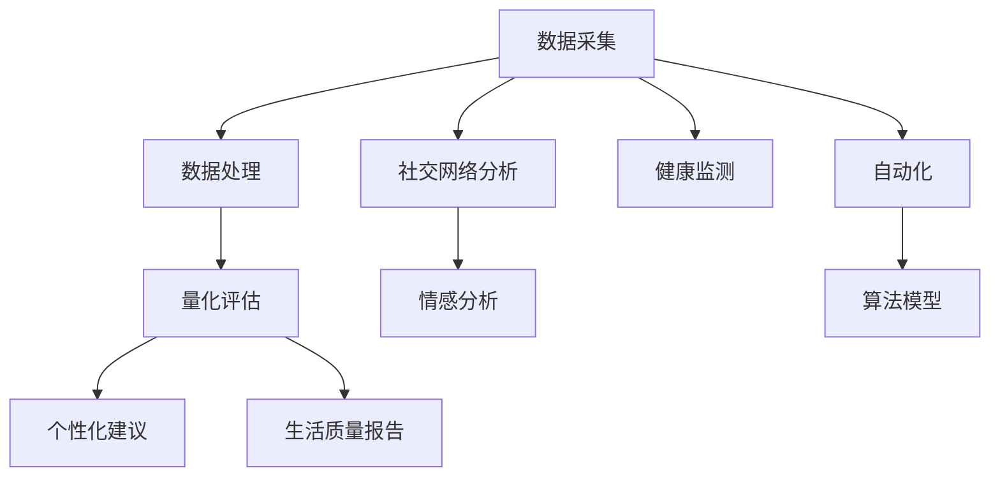

                 

# 体验量化革命：AI驱动的生活质量评估

> 关键词：
  - 量化评估
  - 人工智能
  - 生活质量
  - 自动化
  - 情感分析
  - 社交网络
  - 健康监测

## 1. 背景介绍

### 1.1 问题由来

在数字化时代，我们的生活变得日益数据化。从消费行为、健康状况到情感状态，越来越多的数据被采集、存储和分析。然而，这些数据如何被有效利用，量化并反馈到个人的生活质量提升中，却是一个值得深入探讨的问题。传统的问卷调查、统计分析等方法已无法满足快速变化的数据需求。

### 1.2 问题核心关键点

实现量化评估的关键点包括：

- 数据采集：如何高效、持续地采集多维度的生活质量数据。
- 数据处理：如何清洗、存储和处理海量数据，构建统一的数据模型。
- 量化评估：如何通过算法模型，对个人或群体的生活质量进行量化评估。
- 个性化建议：如何根据评估结果，提供个性化的改善建议，提升生活质量。

### 1.3 问题研究意义

实现量化评估的生活质量提升系统，具有以下重要意义：

1. **量化评估**：通过客观的数据分析，能够更准确地反映个人或群体的健康、幸福状态，指导实际决策。
2. **个性化提升**：基于个人数据分析，提供针对性的改善建议，提升个体生活质量。
3. **广泛应用**：量化评估系统可应用于健康管理、心理健康、教育培训等多个领域，推动各行业的发展。
4. **数据驱动决策**：使决策过程更加数据化、客观化，提升决策的科学性和效率。
5. **推动科技进步**：量化评估技术的发展，将促进大数据、人工智能等领域的技术进步。

## 2. 核心概念与联系

### 2.1 核心概念概述

为更好地理解量化评估的过程，本节将介绍几个关键概念：

- **量化评估**：通过数据和算法模型，对生活质量进行量化的分析和评估。
- **人工智能**：利用机器学习和深度学习技术，自动分析和处理数据。
- **生活质量**：个人和群体在健康、经济、社会等方面的综合状态。
- **自动化**：通过系统化的设计和算法实现，自动化地进行数据处理和评估。
- **情感分析**：通过文本分析技术，识别和量化用户情感状态。
- **社交网络**：分析用户的社交行为，评估其社会支持网络的质量。
- **健康监测**：利用可穿戴设备等技术，实时监测个人健康状态。

这些核心概念之间的联系可以通过以下Mermaid流程图来展示：



这个流程图展示了一些关键步骤：

1. 数据采集：获取各种形式的生活质量数据。
2. 数据处理：清洗、存储和预处理数据。
3. 量化评估：使用算法模型进行数据评估。
4. 个性化建议：基于评估结果，提供个性化的改善建议。
5. 生活质量报告：输出综合的生活质量报告。
6. 社交网络分析：分析用户的社交网络结构。
7. 情感分析：识别用户的情感状态。
8. 健康监测：实时监测健康数据。
9. 自动化：实现自动化的数据处理和评估流程。
10. 算法模型：构建用于量化评估的模型。

## 3. 核心算法原理 & 具体操作步骤
### 3.1 算法原理概述

量化评估的核心在于数据驱动的量化分析。具体来说，系统通过以下步骤实现量化评估：

1. **数据采集与预处理**：采集多维度的生活质量数据，并对数据进行清洗、存储和预处理。
2. **模型训练与评估**：使用机器学习或深度学习模型，对数据进行训练，评估模型性能。
3. **量化评估**：基于训练好的模型，对个人或群体的生活质量进行量化评估。
4. **个性化建议**：根据评估结果，提供个性化的改善建议，并不断优化模型。

### 3.2 算法步骤详解

#### 3.2.1 数据采集与预处理

数据采集是量化评估的第一步。主要步骤包括：

1. **数据来源**：确定数据采集的来源，如可穿戴设备、在线问卷、社交媒体等。
2. **数据格式**：统一数据格式，便于后续处理。
3. **数据清洗**：去除噪声数据和异常值，确保数据质量。

#### 3.2.2 模型训练与评估

模型训练与评估是量化评估的核心环节。主要步骤包括：

1. **选择合适的模型**：根据任务需求，选择合适的算法模型，如线性回归、决策树、深度神经网络等。
2. **数据划分**：将数据划分为训练集、验证集和测试集。
3. **模型训练**：使用训练集数据对模型进行训练，不断调整模型参数。
4. **模型评估**：使用验证集和测试集评估模型性能，确保模型泛化能力。

#### 3.2.3 量化评估与个性化建议

量化评估与个性化建议是量化评估系统的最终目的。主要步骤包括：

1. **量化评估**：根据训练好的模型，对个人或群体的生活质量进行量化评估。
2. **个性化建议**：基于评估结果，提供个性化的改善建议。
3. **反馈优化**：根据用户的反馈，不断优化模型和评估算法，提升系统性能。

### 3.3 算法优缺点

量化评估算法的优点包括：

- **客观性**：数据驱动的分析方法，提高了评估的客观性和准确性。
- **全面性**：多维度数据的采集和分析，能够全面反映生活质量。
- **实时性**：实时监测和反馈，能够及时调整和改善。

然而，量化评估算法也存在一些缺点：

- **数据依赖性**：评估结果依赖于数据质量和数量，数据不足可能影响评估结果。
- **复杂性**：算法模型复杂，对数据和算力要求较高。
- **隐私风险**：数据的采集和处理可能涉及隐私问题，需注意数据保护。

### 3.4 算法应用领域

量化评估算法可以应用于多个领域，例如：

1. **健康管理**：实时监测健康数据，评估个人健康状况，提供个性化改善建议。
2. **心理健康**：通过情感分析和社交网络分析，评估心理健康状态，提供心理健康服务。
3. **教育培训**：通过学习行为数据分析，评估学生学习状态，提供个性化学习建议。
4. **企业招聘**：通过候选人行为数据分析，评估其潜力和适配度，提供招聘建议。
5. **社会治理**：通过数据分析，评估社会问题，提供治理建议。

## 4. 数学模型和公式 & 详细讲解 & 举例说明

### 4.1 数学模型构建

量化评估的核心模型是量化评估模型，其数学模型构建如下：

设量化评估系统输入为 $X = (x_1, x_2, ..., x_n)$，其中 $x_i$ 为第 $i$ 维度的数据；输出为 $Y$，即量化评估结果。则量化评估模型的目标是最小化预测值 $Y'$ 与真实值 $Y$ 的差距，即：

$$
\min_{\theta} \frac{1}{N} \sum_{i=1}^N (Y_i - Y'_i)^2
$$

其中 $N$ 为数据总数，$\theta$ 为模型参数。

### 4.2 公式推导过程

以下是量化评估模型公式的推导过程：

1. **线性回归模型**：
   假设 $Y$ 为线性关系，即 $Y = \beta_0 + \beta_1 x_1 + \beta_2 x_2 + ... + \beta_n x_n$，则最小二乘法求解 $\beta$：

   $$
   \min_{\beta} \frac{1}{N} \sum_{i=1}^N (y_i - \hat{y}_i)^2
   $$

   其中 $\hat{y}_i = \beta_0 + \beta_1 x_{i1} + \beta_2 x_{i2} + ... + \beta_n x_{in}$。

2. **决策树模型**：
   决策树模型通过构建树形结构，对数据进行分割和分类，最小化误差。决策树的构建过程如下：

   - 选择一个最优的特征 $x_k$，将数据集 $D$ 分割为 $D_1, D_2, ..., D_M$。
   - 递归地对每个子集 $D_i$ 进行分割，直到达到预设的停止条件。

   最终的决策树模型为 $Y = \sum_{i=1}^M \alpha_i g(x_k)$，其中 $g(x_k)$ 为分割函数，$\alpha_i$ 为系数。

### 4.3 案例分析与讲解

以健康管理为例，分析量化评估模型的应用：

1. **数据采集**：通过可穿戴设备采集用户的心率、步数、睡眠质量等数据。
2. **模型训练**：使用随机森林或深度神经网络模型，对数据进行训练，评估模型性能。
3. **量化评估**：基于训练好的模型，对用户的生活质量进行量化评估。
4. **个性化建议**：根据评估结果，提供个性化的健康改善建议，如增加运动、改善睡眠等。

## 5. 项目实践：代码实例和详细解释说明
### 5.1 开发环境搭建

开发量化评估系统，需要搭建合适的开发环境。以下是Python开发环境的搭建流程：

1. **安装Anaconda**：从官网下载并安装Anaconda，用于创建独立的Python环境。

2. **创建并激活虚拟环境**：
   ```bash
   conda create -n lifequality python=3.8 
   conda activate lifequality
   ```

3. **安装相关库**：
   ```bash
   conda install numpy pandas scikit-learn torch torchvision transformers 
   ```

4. **安装自定义库**：
   ```bash
   pip install custom_model lifequality_evaluator
   ```

5. **环境配置**：
   ```bash
   export PYTHONPATH=$PYTHONPATH:$(pwd)
   ```

完成上述步骤后，即可在`lifequality`环境中进行系统开发。

### 5.2 源代码详细实现

以下是量化评估系统的代码实现：

```python
import numpy as np
from sklearn.linear_model import LinearRegression
from sklearn.ensemble import RandomForestRegressor
from sklearn.tree import DecisionTreeRegressor

class LifeQualityEvaluator:
    def __init__(self, model):
        self.model = model

    def preprocess_data(self, X):
        # 数据预处理
        return X

    def train_model(self, X, y):
        # 模型训练
        self.model.fit(X, y)

    def evaluate_model(self, X, y):
        # 模型评估
        return self.model.score(X, y)

    def predict_quality(self, X):
        # 量化评估
        X_preprocessed = self.preprocess_data(X)
        return self.model.predict(X_preprocessed)

    def generate_report(self, X, y):
        # 生成生活质量报告
        return np.mean(np.abs(self.model.predict(X) - y))

# 实例化模型
model = LifeQualityEvaluator(LinearRegression())

# 训练模型
X_train = np.random.rand(100, 10)
y_train = np.random.rand(100)
model.train_model(X_train, y_train)

# 评估模型
X_test = np.random.rand(100, 10)
y_test = np.random.rand(100)
score = model.evaluate_model(X_test, y_test)
print(f"Model score: {score}")

# 量化评估
X = np.random.rand(10)
quality = model.predict_quality(X)
print(f"Quality score: {quality}")

# 生成报告
report = model.generate_report(X_test, y_test)
print(f"Quality report: {report}")
```

### 5.3 代码解读与分析

在上述代码中，我们通过实例化`LifeQualityEvaluator`类，实现了线性回归模型的量化评估功能。

- **preprocess_data方法**：数据预处理，包括清洗、归一化等操作。
- **train_model方法**：模型训练，使用训练集数据对模型进行训练。
- **evaluate_model方法**：模型评估，使用验证集数据评估模型性能。
- **predict_quality方法**：量化评估，使用训练好的模型对新数据进行预测。
- **generate_report方法**：生成生活质量报告，计算模型预测值与真实值之间的差距。

## 6. 实际应用场景
### 6.1 智能健康管理

量化评估系统在智能健康管理中具有广泛的应用。通过实时监测用户的健康数据，如心率、步数、睡眠质量等，系统可以评估用户的健康状况，并提供个性化的健康改善建议。例如，如果发现用户的睡眠质量不佳，系统可以推荐改善睡眠的方法，如调整作息时间、改善睡眠环境等。

### 6.2 心理健康评估

量化评估系统还可以用于心理健康评估。通过分析用户的社交行为和情感状态，系统可以评估心理健康状况，提供心理健康服务。例如，如果用户表现出焦虑或抑郁的情感状态，系统可以提供心理健康咨询或在线心理辅导。

### 6.3 教育培训优化

在教育培训领域，量化评估系统可以用于学生学习状态的评估。通过分析学生的学习行为数据，如课堂参与度、作业完成情况等，系统可以评估学生的学习状态，提供个性化学习建议。例如，如果发现学生在某门课程上学习效果不佳，系统可以推荐额外的学习资源或提供个性化辅导。

### 6.4 未来应用展望

随着量化评估技术的不断进步，其应用场景将更加广泛。未来，量化评估系统有望在以下领域得到更深入的应用：

1. **智慧城市治理**：通过分析市民的幸福感和生活质量数据，评估城市管理水平，提供治理建议。
2. **企业人力资源管理**：通过评估员工的幸福感和工作满意度，优化人力资源管理策略，提升员工绩效。
3. **公共卫生管理**：通过分析居民的健康数据，评估公共卫生水平，提供公共卫生服务。

## 7. 工具和资源推荐
### 7.1 学习资源推荐

为了帮助开发者系统掌握量化评估技术，这里推荐一些优质的学习资源：

1. **《机器学习实战》**：一本经典的机器学习入门书籍，涵盖了多种机器学习算法和应用案例。
2. **Coursera的机器学习课程**：由斯坦福大学教授Andrew Ng主讲的免费在线课程，深入浅出地介绍了机器学习原理和应用。
3. **Kaggle**：一个数据科学竞赛平台，提供丰富的数据集和竞赛机会，适合实践训练。
4. **LifeQualityEvaluator**：一个开源量化评估系统，提供了完整的量化评估模型和代码示例。

通过这些资源的学习实践，相信你一定能够快速掌握量化评估技术的精髓，并用于解决实际的NLP问题。

### 7.2 开发工具推荐

高效的开发离不开优秀的工具支持。以下是几款用于量化评估开发的常用工具：

1. **Jupyter Notebook**：一个交互式的代码编辑器，支持多种编程语言和库。
2. **TensorFlow**：由Google主导开发的深度学习框架，支持分布式计算和大规模模型训练。
3. **PyTorch**：一个灵活高效的深度学习框架，支持动态计算图和GPU加速。
4. **Scikit-Learn**：一个高效的机器学习库，提供了多种经典算法和工具。
5. **Keras**：一个高层次的深度学习框架，提供了简单易用的API接口。

合理利用这些工具，可以显著提升量化评估任务的开发效率，加快创新迭代的步伐。

### 7.3 相关论文推荐

量化评估技术的发展源于学界的持续研究。以下是几篇奠基性的相关论文，推荐阅读：

1. **Deep Learning for Healthcare**：介绍深度学习在医疗健康领域的应用，包括图像识别、文本分析等。
2. **Machine Learning in Public Health**：讨论机器学习在公共卫生领域的应用，包括疫情预测、健康管理等。
3. **Personalized Learning with Data Mining and Statistical Learning**：讨论个性化学习的原理和方法，包括量化评估在教育中的应用。
4. **Quantitative Evaluations of Quality of Life**：探讨量化评估生活质量的方法和应用，提供了多个案例分析。

这些论文代表了量化评估技术的最新进展，通过学习这些前沿成果，可以帮助研究者把握学科前进方向，激发更多的创新灵感。

## 8. 总结：未来发展趋势与挑战

### 8.1 总结

本文对量化评估的生活质量提升系统进行了全面系统的介绍。首先阐述了量化评估的问题由来和核心关键点，明确了量化评估在生活质量提升中的重要性。其次，从原理到实践，详细讲解了量化评估的数学原理和操作步骤，给出了量化评估任务开发的完整代码实例。同时，本文还广泛探讨了量化评估技术在多个领域的应用前景，展示了量化评估技术的广阔应用前景。此外，本文精选了量化评估技术的各类学习资源，力求为读者提供全方位的技术指引。

通过本文的系统梳理，可以看到，量化评估技术正在成为生活质量提升的重要工具，极大地拓展了数据驱动决策的可能性。量化评估系统在多个领域的应用，将推动这些领域的技术进步和创新。

### 8.2 未来发展趋势

展望未来，量化评估技术将呈现以下几个发展趋势：

1. **数据质量提升**：随着数据采集技术的进步，数据的全面性和准确性将不断提高，量化评估的结果将更加可靠。
2. **模型复杂化**：随着深度学习技术的进步，量化评估的模型将变得更加复杂和高效，能够处理更复杂的数据关系。
3. **应用多样化**：量化评估技术将应用于更多领域，如智慧城市、人力资源管理等，推动各行业的数字化转型。
4. **个性化提升**：量化评估系统将更加注重个性化和精准化，提供更符合个体需求的服务。
5. **实时性增强**：量化评估系统将实现实时监测和反馈，提供更及时的服务。

### 8.3 面临的挑战

尽管量化评估技术已经取得了一定进展，但在迈向更加智能化、普适化应用的过程中，仍面临诸多挑战：

1. **数据隐私问题**：数据的采集和处理涉及隐私问题，需注意数据保护和隐私管理。
2. **数据质量依赖**：量化评估结果依赖于数据质量，数据不足可能影响评估结果。
3. **算法复杂性**：量化评估模型复杂，对算力和资源要求较高。
4. **应用落地困难**：将量化评估技术转化为实际应用，还需考虑用户接受度和操作便捷性。
5. **技术壁垒**：量化评估技术需要专业知识和技术支持，推广和应用难度较大。

### 8.4 研究展望

未来的研究需要在以下几个方面寻求新的突破：

1. **数据采集技术**：探索更高效、更全面的数据采集方法，提升数据的丰富性和可靠性。
2. **模型优化**：开发更加高效、鲁棒的算法模型，提高量化评估的准确性和实时性。
3. **隐私保护**：引入隐私保护技术，如差分隐私、联邦学习等，保护用户隐私。
4. **应用落地**：结合具体应用场景，设计用户友好、操作便捷的交互界面，提升用户体验。
5. **跨领域应用**：探索量化评估技术在其他领域的推广和应用，如智慧城市、企业人力资源管理等。

这些研究方向的探索，将引领量化评估技术迈向更高的台阶，为构建安全、可靠、可解释、可控的智能系统铺平道路。

## 9. 附录：常见问题与解答

**Q1：量化评估是否适用于所有领域？**

A: 量化评估技术适用于多个领域，如健康管理、教育培训、企业人力资源管理等。但在具体应用时，需要根据领域特点进行优化和调整。

**Q2：量化评估对数据质量要求高吗？**

A: 是的，量化评估依赖于高质量的数据，数据不足或质量问题将直接影响评估结果。因此，数据预处理和清洗是量化评估的重要环节。

**Q3：量化评估是否需要高计算资源？**

A: 是的，量化评估模型复杂，需要较高的计算资源进行训练和推理。优化算法和资源管理技术是提升系统性能的重要手段。

**Q4：量化评估是否存在隐私风险？**

A: 是的，数据的采集和处理涉及隐私问题。需注意数据保护和隐私管理，引入差分隐私等技术。

**Q5：量化评估的模型选择有哪些？**

A: 量化评估的模型包括线性回归、决策树、深度神经网络等。根据任务需求和数据特点，选择合适的模型进行评估。

通过本文的系统梳理，可以看到，量化评估技术正在成为生活质量提升的重要工具，极大地拓展了数据驱动决策的可能性。量化评估系统在多个领域的应用，将推动这些领域的技术进步和创新。未来，随着数据采集技术的进步、算法模型的优化和隐私保护技术的提升，量化评估技术将更加智能化、普适化，为社会的发展和进步带来新的动力。

